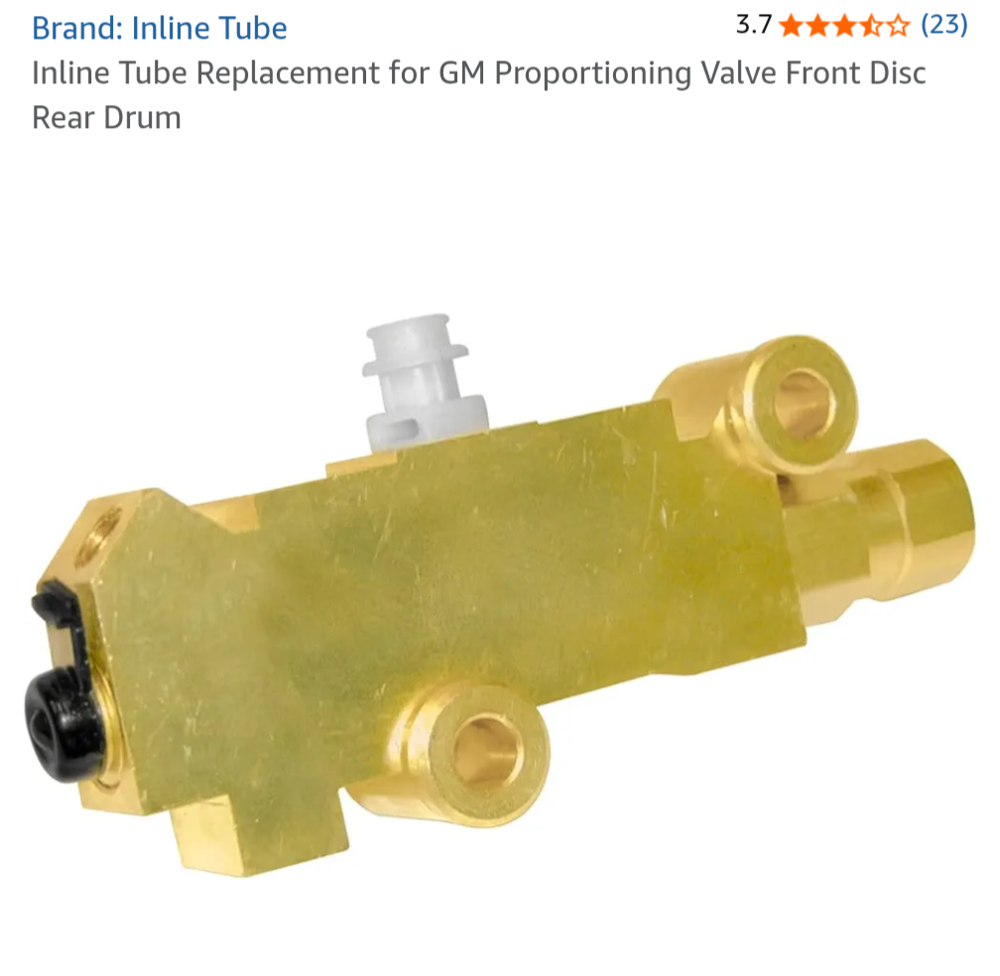

# 1964 Tempest – Brakes Drag After Disc Conversion
**Forum:** GTO Forum | **Started:** May 13, 2025 | **Replies:** 14
**Thread URL:** https://www.gtoforum.com/threads/1964-tempest-%E2%80%93-brakes-drag-after-disc-conversion.149435/post-1043427

## The Issue
Hey folks, I just finished a front disc conversion on my ’64 Tempest (Inline Tube kit). Also rebuilt rear drums, added a dual-bowl master, new booster, and PV2 prop valve.  Brakes feel solid, but after a few uses, they start to drag. If I shift to Drive and let off the brake, the car won’t move unless I give it a fair bit of throttle. Weirdly, if I turn the car off and back on, it moves w/o needing any throttle.  I measured ~1/16” gap between the booster rod and MC after adding a couple shims. C...

## Solution / Outcome
After exhausting all other options, I bit the bullet and went through the pain of swapping in a new combo/proportioning valve. I'm pleased to report that the issue appears to be fixed! I'll know for sure when I have some time to take the car out for some more extensive brake tests. But I'm no longer able to reproduce the issue like before.  Thank you all for the help!!!

## Key Advice
- **@lust4speed**: The problem curing with shutting off the engine  might indicate a defective booster,  It's still strange since the check valve should retain vacuum with the engine off.  It will take some additional f
- **@ponchonlefty**: it might be the slider bolts. did you put anything on them to keep them from sticking? do the test again jack the front and check if its the calipers sticking.
- **@Scott06**: would think this is the issue maybe some debris. I had one that would not let much fluid to one rear wheel cylinder (on a VW), messed around with it cleaned it bled it it would work intermittently. Wo
- **@Sick467**: Not that I have heard of this issue, but it sounds like your valve is acting like a check valve and keeping the pressure applied to the brakes.  I would expect at least a drop or two of brake fluid to
- **@Louise Larson**: Hello
- **@Beers**: Hi Louise, uh I mean Sylvia, uh I mean Athia, ugh, oh well, welcome!  You must have an interesting background with all those names, tell us about it and share some photos of your Tempest/LeMans/GTO!  
- **@O52**: double uh oh...

## Helpers
- **@lust4speed** — 2 post(s)
- **@ponchonlefty** — 1 post(s)
- **@Scott06** — 1 post(s)
- **@Sick467** — 1 post(s)
- **@Louise Larson** — 1 post(s)
- **@Beers** — 1 post(s)
- **@O52** — 1 post(s)

## Thread Summary

### Kevin's Original Post
Hey folks,
I just finished a front disc conversion on my ’64 Tempest (Inline Tube kit). Also rebuilt rear drums, added a dual-bowl master, new booster, and PV2 prop valve.

Brakes feel solid, but after a few uses, they start to drag. If I shift to Drive and let off the brake, the car won’t move unless I give it a fair bit of throttle. Weirdly, if I turn the car off and back on, it moves w/o needing any throttle.

I measured ~1/16” gap between the booster rod and MC after adding a couple shims. Could this still be a preload issue? Should I shim it more?

Appreciate any advice!

### Replies

**@lust4speed** (reply #1):
The problem curing with shutting off the engine  might indicate a defective booster,  It's still strange since the check valve should retain vacuum with the engine off.  It will take some additional foot pressure but a good test might be to remove and cap off the vacuum hose to the booster, and then take a drive and see if the problem goes away with the vacuum to the booster removed.

**@kevnord** (reply #2):
Good suggestions. I have an extra/new check valve I could swap in at some point to check (no pun intended) to see what happens

**@kevnord** (reply #3):
UPDATE. I had just a little time this evening and got the car out.
Kept it in the (long) driveway, going forwards and backwards and this is what I discovered. If I brake relatively hard while in Drive or Reverse, come to a stop, and then release the brake... the brakes drag, requiring a fair amount of throttle to overcome. BUUUUUT, if I shift to Park (it's an auto) and then back to Drive it'll move without throttle. It'll move forward or backward. I tried going into Neutral after the brakes starting dragging but that didn't help. I had to go to park. I did NOT turn the car off during my test.

I did add some more space/shims between the booster and master which was clearing too much as the brake pedal had too much play. The drag behavior stayed the same. So I believe I can rule out the brake rod being too long and causing the issue.

**@ponchonlefty** (reply #4):
it might be the slider bolts. did you put anything on them to keep them from sticking?
do the test again jack the front and check if its the calipers sticking.

**@kevnord** (reply #5):
Initially I didn't put anything on them (instructions didn't mention anything) but based on what I read and recommendations I added some appropriate lubricant to them. It didn't help unfortunately. I also readjusted the rear drums, but that didn't seem to help either. I think I'm getting close, just need some free time to try some more stuff.  Thanks for the help!

**@kevnord** (reply #6):
UPDATE. I'm getting closer. I am able to reproduce the drag even with the car completely cold and off. If I just roll the car in neutral and slam on the brakes it'll then stick, drag, not what to be moved.

To get rid of the drag, I can (with the car still off) 

shift to a gear
Really rock the car front to back, it'll release the drag
Engage and release the emergency brake.

My attention has turned to the emergency brake and rear drums which appear to be where it's dragging. I rebuilt and adjusted them but may redo that.

My other thought is that the ebrake is out of adjustment. When replacing the hard brake line running to the back, I briefly disconnected the e brake line close to the rear axcel. I had to yank it pretty good to disconnect it. I did notice the ebrake pedal inside sits a bit higher now. So I'm wondering if it's now engaging a bit somehow when I stop on the brakes.

Thoughts?

**@lust4speed** (reply #7):
> kevnord said:
> I measured ~1/16” gap between the booster rod and MC after adding a couple shims. Could this still be a preload issue? Should I shim it more?
        
        Click to expand...
This might still be your problem, and somehow that 1/16" inch disappeared on final assembly and the piston vent hole in the master cylinder could still be covered.

The only thing that doesn't fit is how you are able to release the drag and this seems to point to brake parts sticking and not releasing.  If you don't have limited slip you could block the front wheels, set the car in neutral and raise each back wheel separately and check for binding since it might only be on one wheel.  You should also be able to go under the car and grab the emergency brake cable to each side and yank down and observe up to an inch clearance on each cable going into the backing plate.  If it is already snug then it might simply be a matter of giving the cable more play.

**@kevnord** (reply #8):
I believe I've zeroed in on the issue, the PV2 portioning valve. Once the brakes are dragging with the engine off and in neutral, if I crack the rear output line on the pv2 I hear a click and the drag is released. No liquid is coming out.

From what I read, this indicates a bad valve. Anyone agree or have other thoughts?

**@Scott06** (reply #9):
would think this is the issue maybe some debris. I had one that would not let much fluid to one rear wheel cylinder (on a VW), messed around with it cleaned it bled it it would work intermittently. Worth replacing

**@Sick467** (reply #10):
Not that I have heard of this issue, but it sounds like your valve is acting like a check valve and keeping the pressure applied to the brakes.  I would expect at least a drop or two of brake fluid to escape, however.

**@Louise Larson** (reply #11):
Hello

**@Beers** (reply #12):
Hi Louise, uh I mean Sylvia, uh I mean Athia, ugh, oh well, welcome!  You must have an interesting background with all those names, tell us about it and share some photos of your Tempest/LeMans/GTO!

    
        
            https://x.com/p12barner
        
    
    

    

    
        
            
                
                    
                        
                        
                
            
            
                
                    
                        Athia Khatun
                    
                

                Athia Khatun. Digital creator

                
                    
                        
                            
                        
                    
                    www.facebook.com

**@O52** (reply #13):
double uh oh...

**@kevnord** (reply #14):
After exhausting all other options, I bit the bullet and went through the pain of swapping in a new combo/proportioning valve. I'm pleased to report that the issue appears to be fixed! I'll know for sure when I have some time to take the car out for some more extensive brake tests. But I'm no longer able to reproduce the issue like before.

Thank you all for the help!!!

## Images

