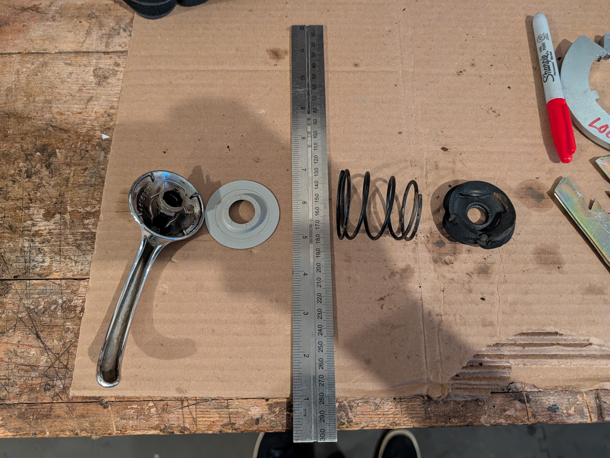
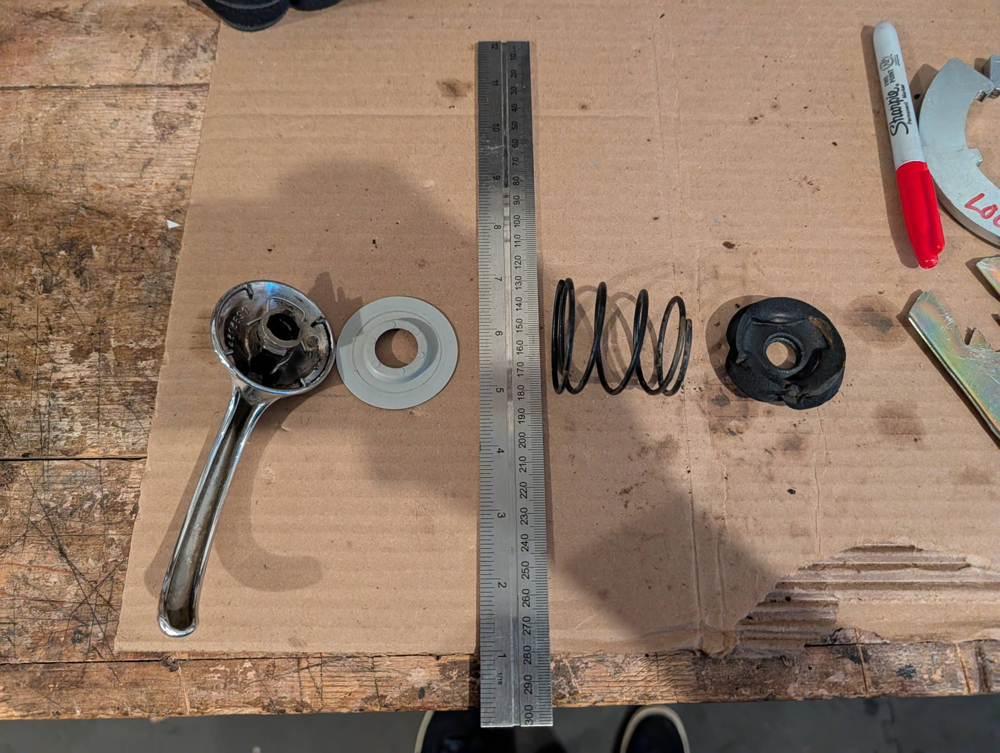
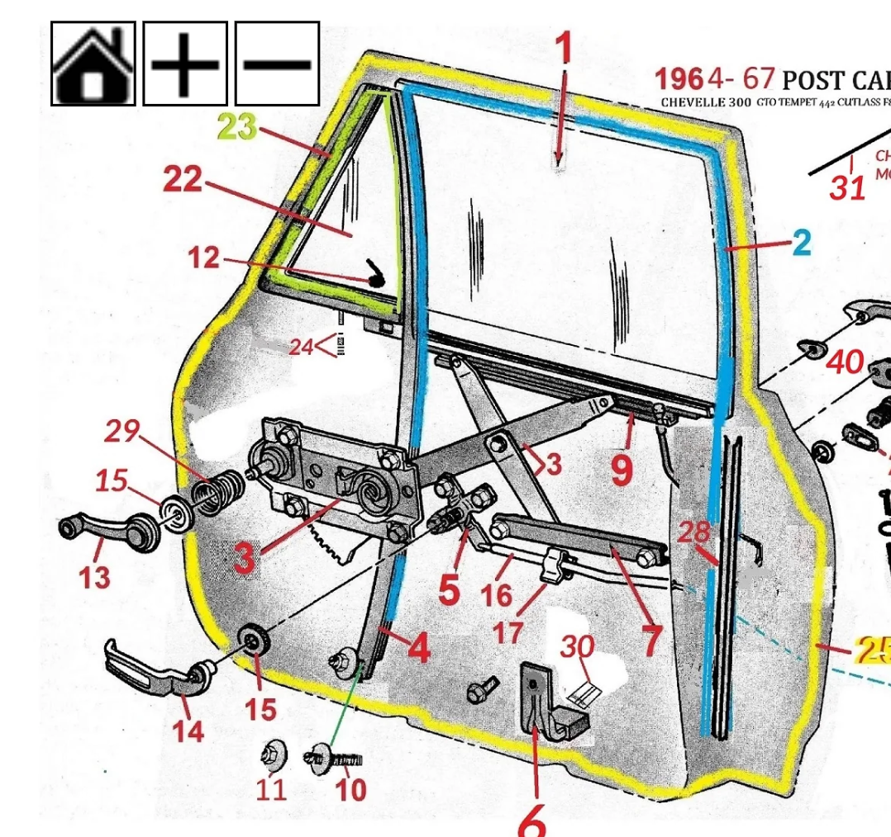

# 1964 Window Crank and Latch hardware
**Forum:** GTO Forum | **Started:** October 27, 2025 | **Replies:** 1
**Thread URL:** https://www.gtoforum.com/threads/1964-window-crank-and-latch-hardware.150753/post-1058519

## The Issue
Found some similar posts but not for 1964...  Which parts are used for the front door window crank and door latch handle? Specifically the spring and foam washer.   Mine were inconsistent between the sides. I was probably the last person to take the panel off, 35 years ago. You know, pre phones for pics and the Internet for help.                                                                                                                                This diagram shows a metal spring only on...

## Key Advice
- **@O52**: Spring is for the window crank and mounts between the door and the panel. I don't recall any foam or sound deadening material around the window / door handles until the 73 models

## Helpers
- **@O52** — 1 post(s)

## Thread Summary

### Kevin's Original Post
Found some similar posts but not for 1964...

Which parts are used for the front door window crank and door latch handle? Specifically the spring and foam washer. 

Mine were inconsistent between the sides. I was probably the last person to take the panel off, 35 years ago. You know, pre phones for pics and the Internet for help. 

    
        
            
        
        
            
                
                
            
        
    
    

This diagram shows a metal spring only on the window crank.

### Replies

**@O52** (reply #1):
Spring is for the window crank and mounts between the door and the panel. I don't recall any foam or sound deadening material around the window / door handles until the 73 models

## Images

