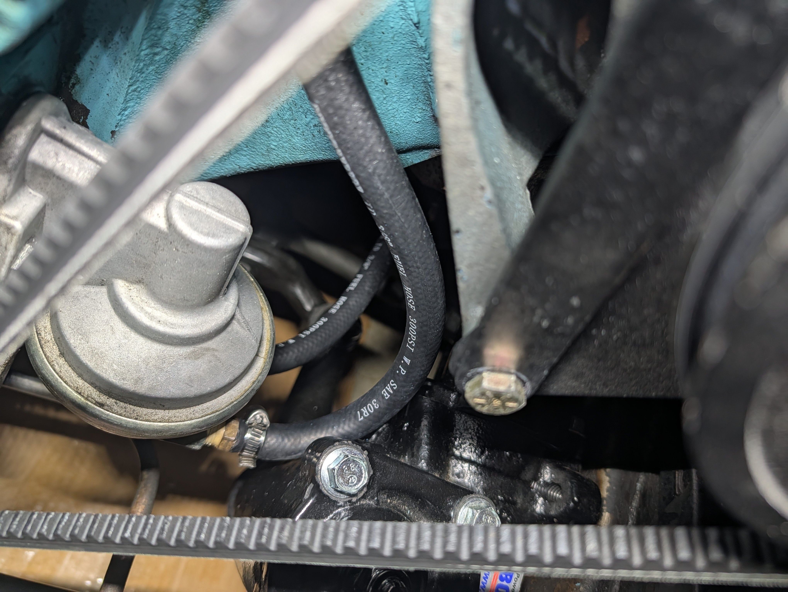
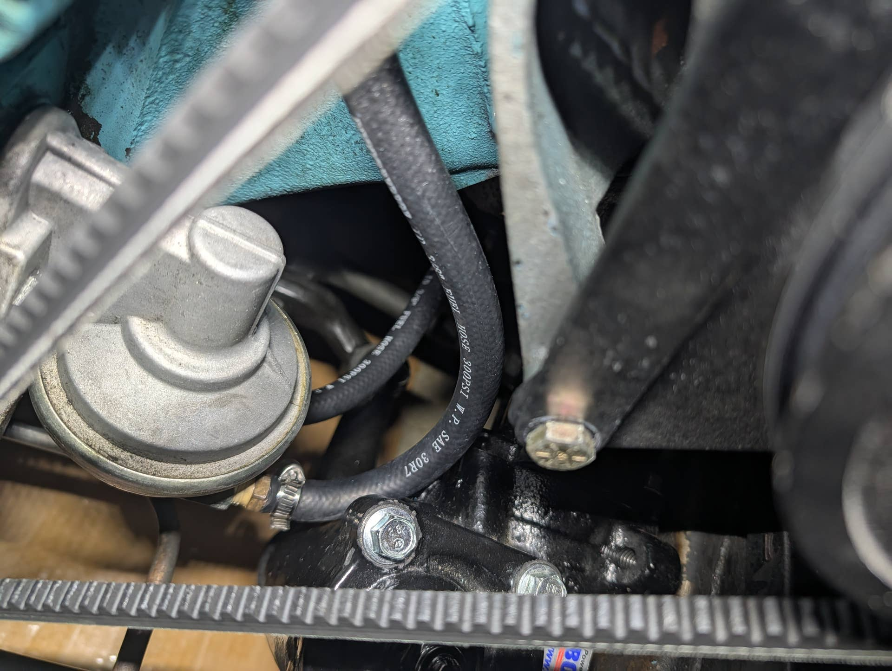
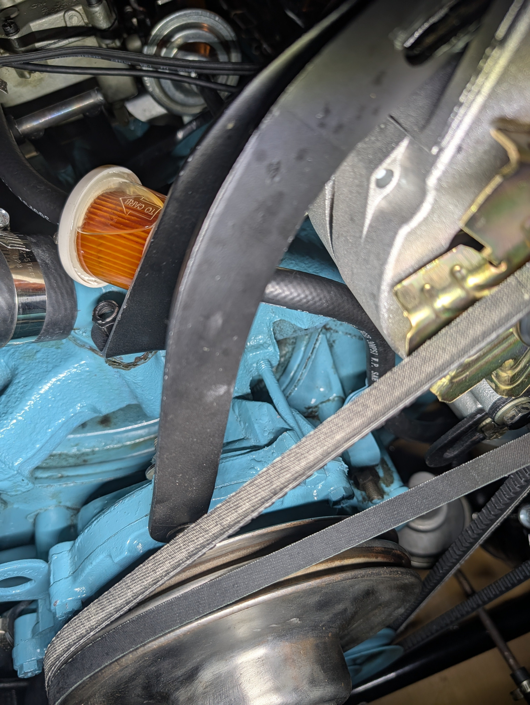
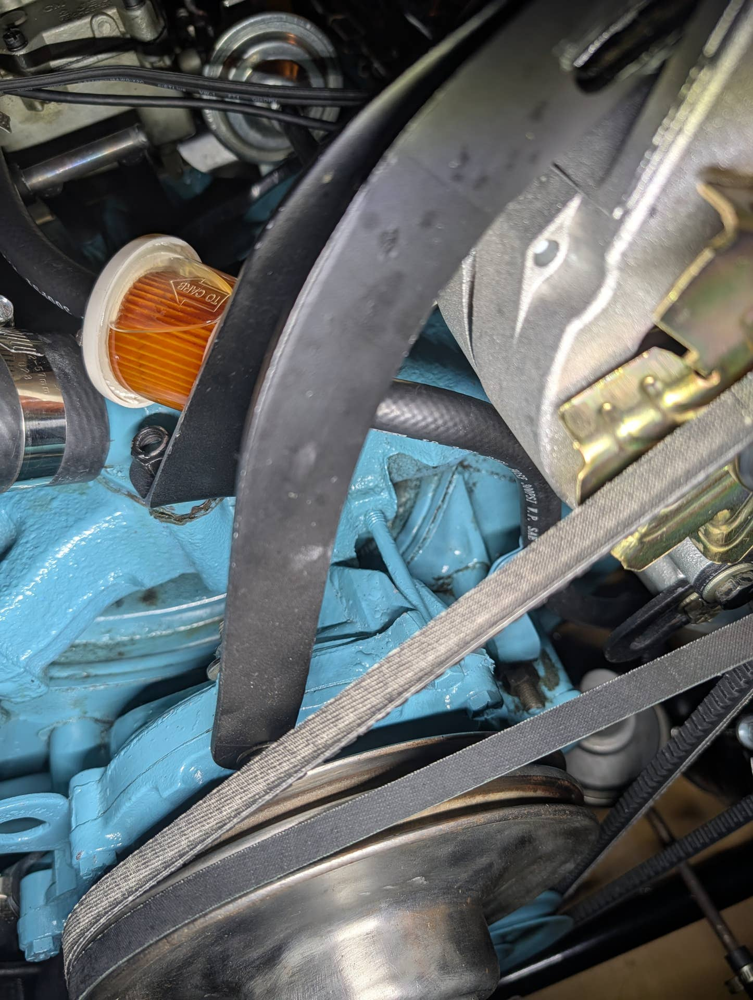
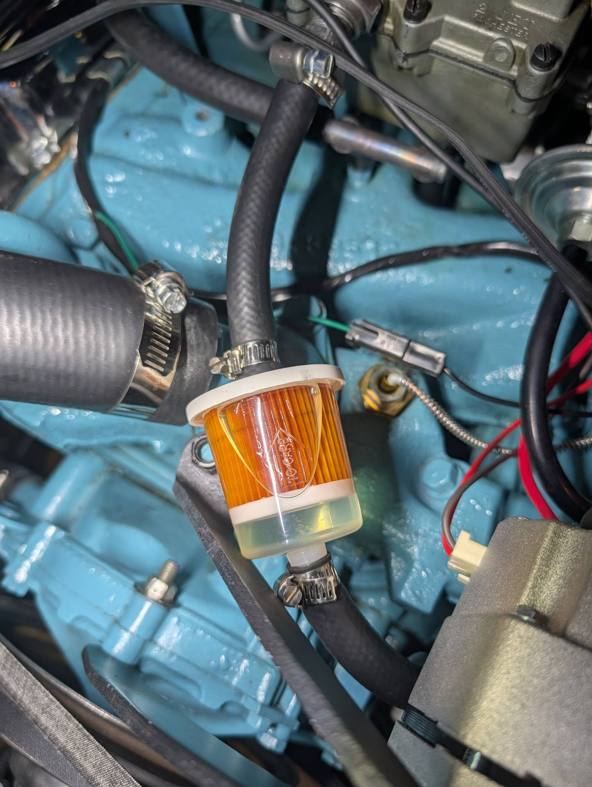
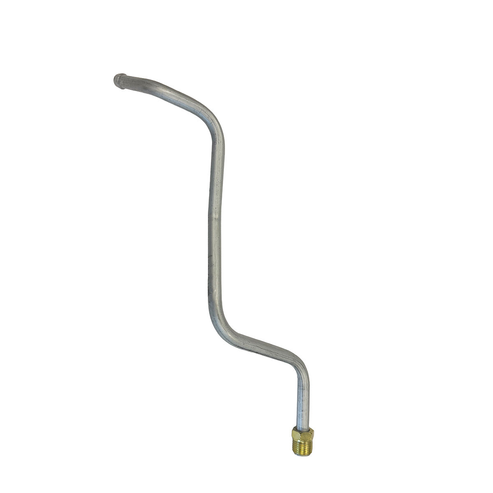
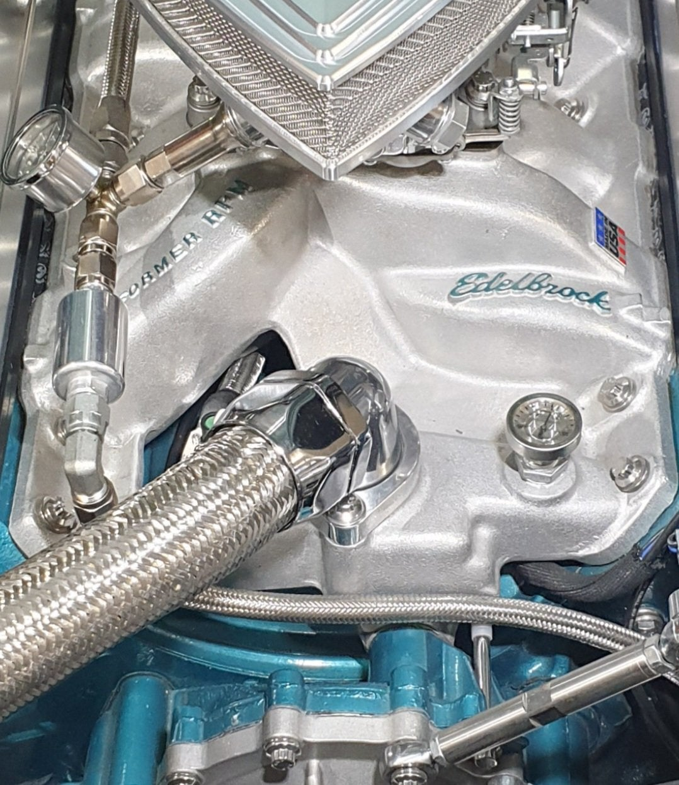
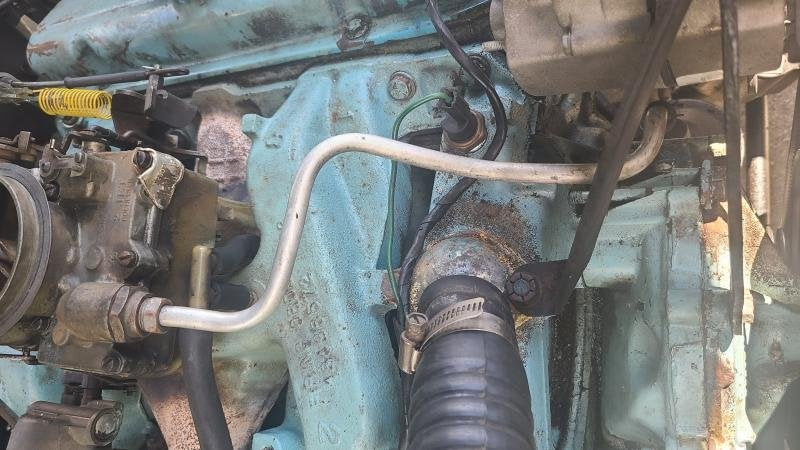
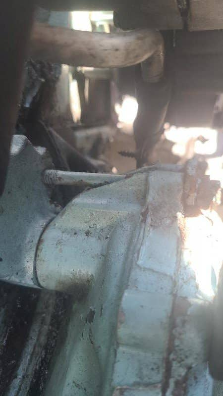

# 326 2bbl Fuel Pump to Carb line - Metal or Rubber?
**Forum:** GTO Forum | **Started:** September 24, 2025 | **Replies:** 15
**Thread URL:** https://www.gtoforum.com/threads/326-2bbl-fuel-pump-to-carb-line-metal-or-rubber.150536/post-1056122

## The Issue
Hey guys, I constantly see metal lines being used/for-sale that run from the fuel pump to the carb. Mine has a rubber hose, always has (to the best of my knowledge). I have a 326 w/Rochester 2GC 2bbl. I don't see any pre-bent lines that seem to be made for that combo. Anyone know if there is one or if it's just rubber?   One thing that makes me think there might be a metal line used is the limited space between the fuel pump and steering gearbox. A rubber hose just barely makes the turn. see pic...

## Solution / Outcome
Thankfully(?), it looks like a rubber hose is used for the first foot or so before going to metal just under the alternator.  That should make it a little easier to deal with different fuel pump styles. Not sure if that'll leave any logical place to put a fuel filter or gauge. :-/

## Key Advice
- **@O52**: All Pontiac fuel lines of this era, from pump to carb, were metal with exception of inline filter vehicles.  But they still had a metal line with rubber filter connections.  With that being said, fuel
- **@AZTempest**: Back in the 80s I was also running a 2GC 2bbl on my 326. It had metal all the way from pump to carb. Had to eventually add rubber and a filter when I added the 4 barrel.
- **@Sick467**: I prefer steel lines over rubber just because of the fuel/heat/fire relationship, but I can tell you that most of my old cars have had rubber somewhere between the pump and the carb (if not all the wa
- **@Baaad65**: What about steel braided? Adds bling 😉
- **@lust4speed**: Some miscellaneous thoughts on fuel line in no particular order:  While not a worry in this situation, NHRA limits the total length of rubber hose to 12".  This is to discourage using it for permanent
- **@OCMDGTO**: X2 with Lust and get rid of that fuel filter before you have a fire. I had one melt and luckily it did not ignite. Use metal
- **@ponchonlefty**: the fuel pump will also determine which steel line to use. some thread in from the bottom of the pump,some are threaded from the side. look to see which pump you have. its possible to have either. pla

## Helpers
- **@O52** — 1 post(s)
- **@AZTempest** — 1 post(s)
- **@Sick467** — 2 post(s)
- **@Baaad65** — 1 post(s)
- **@lust4speed** — 1 post(s)
- **@OCMDGTO** — 1 post(s)
- **@ponchonlefty** — 2 post(s)

## Thread Summary

### Kevin's Original Post
Hey guys, I constantly see metal lines being used/for-sale that run from the fuel pump to the carb. Mine has a rubber hose, always has (to the best of my knowledge). I have a 326 w/Rochester 2GC 2bbl. I don't see any pre-bent lines that seem to be made for that combo. Anyone know if there is one or if it's just rubber? 

One thing that makes me think there might be a metal line used is the limited space between the fuel pump and steering gearbox. A rubber hose just barely makes the turn. see pics

### Replies

**@O52** (reply #1):
All Pontiac fuel lines of this era, from pump to carb, were metal with exception of inline filter vehicles.  But they still had a metal line with rubber filter connections. 
With that being said, fuel pump design changed almost yearly, mostly due to the fuel line fittings.  In other words, you need to match the fuel line with the same year fuel pump to avoid clearance issues.

    

    
        
            
                
                    
                        
                            
                        
                    
                
            
            
                
                    
                        1964-65  2-BARREL FUEL LINE- ALUMINUM (RE)
                    
                

                1964-65  2-BARREL FUEL LINE- ALUMINUM (RE)

                
                    
                        
                            
                        
                    
                    www.amesperf.com

**@kevnord** (reply #2):
Makes sense. I suspect that at one point when the fuel pump was replaced it didn't match the fuel line (like you mentioned) and they just switched to rubber. 

There was also a fuel filter added right before the fuel pump which I've heard isn't ideal, so I added one after the pump instead. I have an original gas tank which could introduce some debris.

**@kevnord** (reply #3):
Maybe this is the line I need...

    

    
        
            
                
                    
                        
                            
                        
                    
                
            
            
                
                    
                        1964-65  2-BARREL FUEL LINE- ALUMINUM (RE)
                    
                

                1964-65  2-BARREL FUEL LINE- ALUMINUM (RE)

                
                    
                        
                            
                        
                    
                    www.amesperf.com
                
            
        
    

or this one...

    

    
        
            
                
                    
                        
                        
                
            
            
                
                    
                        1964-65 Pontiac GTO/Tempest/LeMans 326CID 2bbl Pump to Carb Line 1pc,
                    
                

                1964-65 Pontiac GTO/Tempest/LeMans 326CID 2bbl Pump to Carb Line 1pc, OE Steel

                
                    
                        
                            
                        
                    
                    www.inlinetube.com

**@AZTempest** (reply #4):
Back in the 80s I was also running a 2GC 2bbl on my 326. It had metal all the way from pump to carb. Had to eventually add rubber and a filter when I added the 4 barrel.

**@kevnord** (reply #5):
Thanks for confirming... appreciate it!

**@Sick467** (reply #6):
I prefer steel lines over rubber just because of the fuel/heat/fire relationship, but I can tell you that most of my old cars have had rubber somewhere between the pump and the carb (if not all the way) and I have had no issues.  In fact, I believe rubber to have one advantage...they are not as prone to taking on heat and vapor-locking.

**@kevnord** (reply #7):
Yeah, I haven't been too worried about it. It's a small stretch of hose that seems unlikely to have any issues. Buuuut... if I can swap in steel fairly easy I likely will.

**@Sick467** (reply #8):
Steel lines can be a lesson in patience, I will admit.  I enjoy working with them when they work out with lesser effort, but some can be a booger.  A repro fuel line should not give too much trouble.  Sorry I cannot suggest the best one.  Be prepared to tweak it a few times.

**@Baaad65** (reply #9):
What about steel braided? Adds bling 😉

**@kevnord** (reply #10):
I found pics that someone posted on another site that show the routing of the steel line.

**@lust4speed** (reply #11):
Some miscellaneous thoughts on fuel line in no particular order:

While not a worry in this situation, NHRA limits the total length of rubber hose to 12".  This is to discourage using it for permanent runs including fuel pump to carb.  Figure that the line off the tank is about 8" long, that gives 2" on each side of the fuel filter and nothing more.  Stainless line and many of the covered aftermarket hoses are approved and are exempt from the 12" rule.  Even a fan belt breaking can rupture standard rubber hose.

Most stainless covered rubber line has a safe service life of six years, and eight years is pushing it.  The stainless looks like new forever and will lull you into a dangerous situation.  I've had two fuel leaks and one oil line leak with stainless that looked like the day I installed it.  Now I only use PTFE (Teflon) hose covered in either stainless or nylon braid.  The PTFE will last forever as long as it is not kinked.  Make too sharp of bend and it's replacement time.

I hate steel and especially stainless steel tube, and use aluminum when I do go with hard line.

**@OCMDGTO** (reply #12):
X2 with Lust and get rid of that fuel filter before you have a fire. I had one melt and luckily it did not ignite. Use metal

**@ponchonlefty** (reply #13):
the fuel pump will also determine which steel line to use.
some thread in from the bottom of the pump,some are threaded
from the side.
look to see which pump you have. its possible to have either. plain steel
will last almost forever. aluminum is easy to form but if you can get a factory
steel line,its a quick solution.

**@kevnord** (reply #14):
Thankfully(?), it looks like a rubber hose is used for the first foot or so before going to metal just under the alternator.

That should make it a little easier to deal with different fuel pump styles. Not sure if that'll leave any logical place to put a fuel filter or gauge. :-/

**@ponchonlefty** (reply #15):
you may get a threaded fuel filter then flare the line you have then add
the rest with steel. if a filter is wanted. i would just replace the whole line.

## Images

