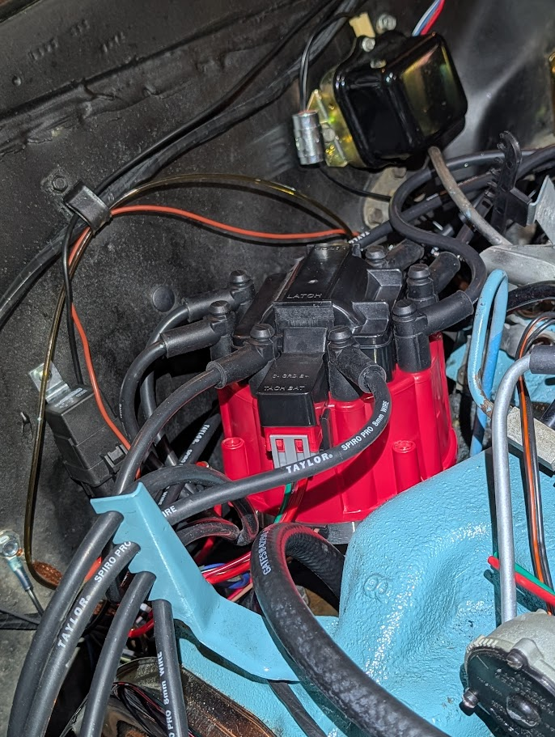
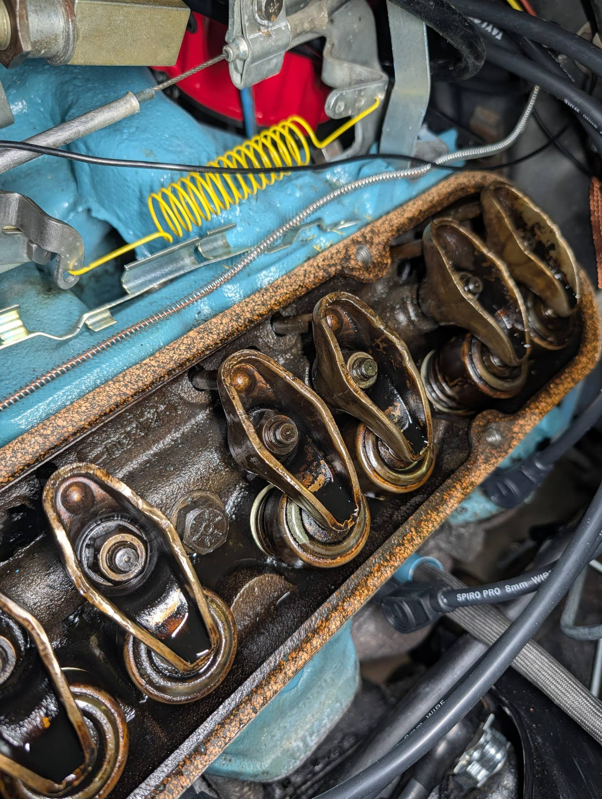
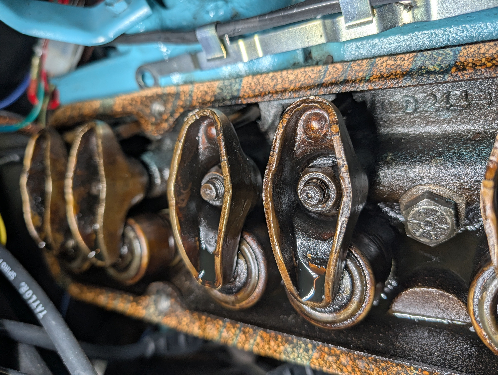
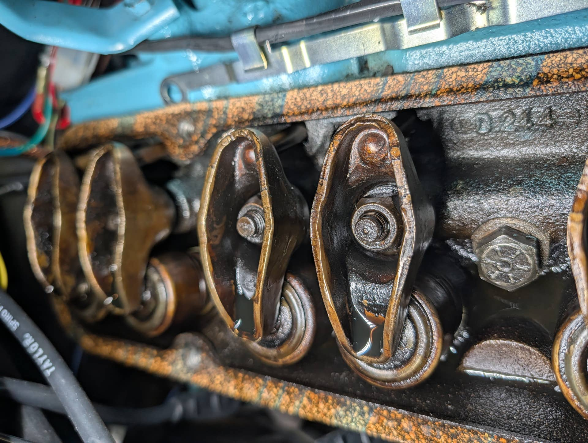
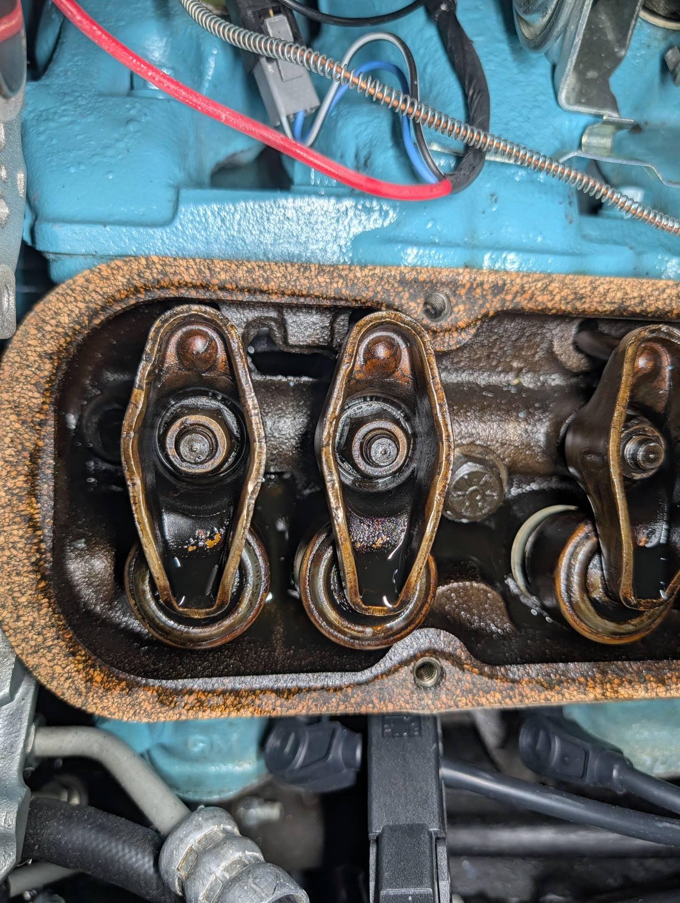
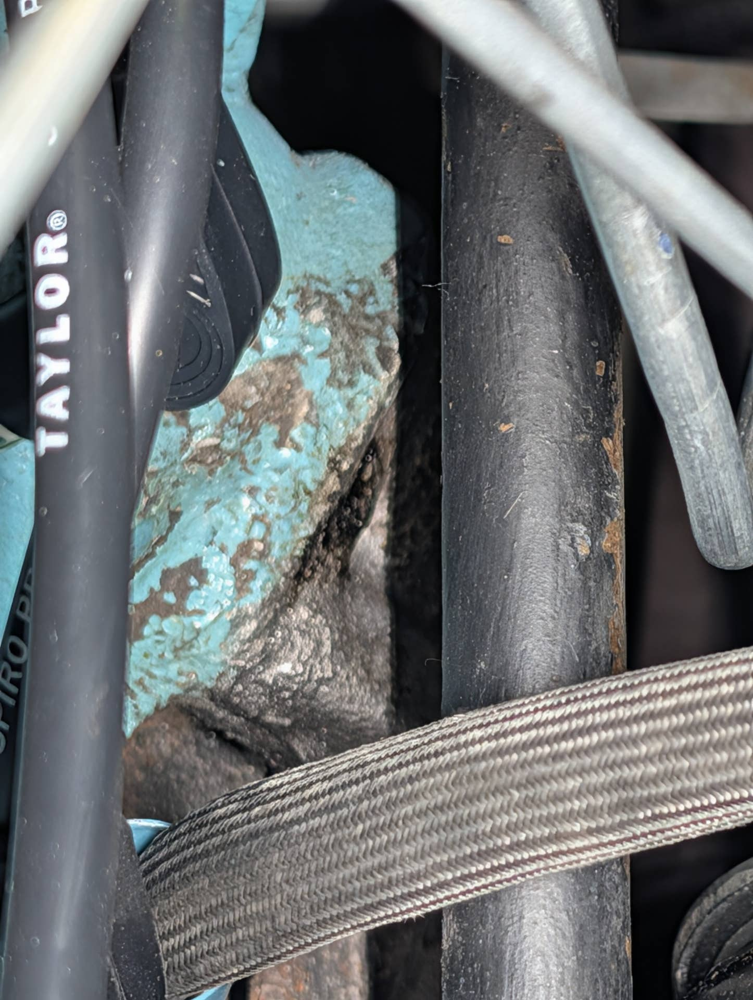

# 326 Engine Ping After HEI Conversion - Need Advice
**Forum:** GTO Forum | **Started:** September 16, 2025 | **Replies:** 29
**Thread URL:** https://www.gtoforum.com/threads/326-engine-ping-after-hei-conversion-need-advice.150470/post-1055460

## The Issue
RESOLVED   Another week, another ask for guidance. Buckle up...   My 326 has developed a ping after converting to HEI, and I made some mistakes along the way. Videos of engine with ping...                            https://photos.app.goo.gl/Ly9XJZYqWGx9JF3i8                     Background: Stock 326, 98k miles, never rebuilt. Timing chain possibly replaced at 50k, history unclear. Engine has always run well when properly tuned. Had the normal brief ping on startup (warm or cold) that would go a...

## Solution / Outcome
@ponchonlefty @AZTempest   Great news! The ticking has nearly disappeared. I swapped in some hydraulic lifter adaptive and let it warm up for 10 mins. Slowly but surely it went away. I can still hear it very faintly but I suspect that might disappear with time. Not sure if the additive helped, but it didn't hurt.  I took a stethoscope to the valve covers and exhaust manifolds while it was still ticking. It was definitely coming from the driver's side valve cover and I think it was the rearmost r...

## Key Advice
- **@Ebartone**: I’ll be honest, and I’m sure I’ll be corrected if I’m wrong, but in my experience that does not sound like a ping, or detonation. On my crummy iPad, that sounds more metallic. did you do all of the en
- **@ponchonlefty**: that sounds like an exhaust leak or lifter. maybe a rocker.
- **@AZTempest**: I’d start from the last thing you changed which is the distributor. First, make sure you plug wires are all in the correct order. Also your timing you say is set to 10. What is your vacuum advance con
- **@jrstock210**: When you adj valves, you might find a sensitive lifter. As noted above, sometimes they loosen up. Hyd I like 1/4 to 1/2 after clearance is zero.
- **@rockdoc**: What AZTempest said! Before you adjust valves, etc., look at the things you changed. I had pinging on my '65, but it only happened under load and never at idle (but I agree, your noise doesn't sound l
- **@lust4speed**: Let's go back to the new HEI.  Your old distributor might have had somewhat of a limited maximum advance and setting it at 10 allowed you to stay under the detonation threshold when under load.  This 

## Helpers
- **@Ebartone** — 1 post(s)
- **@ponchonlefty** — 9 post(s)
- **@AZTempest** — 3 post(s)
- **@jrstock210** — 1 post(s)
- **@rockdoc** — 2 post(s)
- **@lust4speed** — 1 post(s)

## Thread Summary

### Kevin's Original Post
RESOLVED 

Another week, another ask for guidance. Buckle up... 

My 326 has developed a ping after converting to HEI, and I made some mistakes along the way. Videos of engine with ping...

    
        
            https://photos.app.goo.gl/Ly9XJZYqWGx9JF3i8
        
    
    

Background: Stock 326, 98k miles, never rebuilt. Timing chain possibly replaced at 50k, history unclear. Engine has always run well when properly tuned. Had the normal brief ping on startup (warm or cold) that would go away after a few seconds.

What Happened During HEI Conversion: Made a couple of mistakes during the swap that I'm concerned about:

First, I cranked the engine backwards 3-4 times because I didn't double-check the correct rotation direction. The belts were off, but plugs were in except #1, making it tough to turn but still possible. This loosened the cam bolt, which I had to re-torque to 160.

Second, when cranking it the correct direction (with plugs out), fuel spilled from the rear driver's side spark plug hole. I disconnected the fuel pump, let it sit for a couple days, cranked it around 3-4 times to get any remaining fuel out, and changed the oil due to fuel contamination. Used a borescope to verify no remaining fuel in the cylinders.

Current Setup: HEI distributor properly installed, rotor points to #1 at TDC, engaging oil pump. New plug wires, plugs gapped to 0.045". Vacuum advance disconnected for now.

Current Symptoms:

Engine starts and idles smoother than with points, but feels lazy
New ping from what sounds like the top of the engine. Possibly in the rear near where fuel spilled. Maybe.
Timing appears retarded: only achieved 10° at 1300 RPM while warming up
Engine reaches 160° faster than normal
Steady 20" vacuum reading
Oil pressure normal
No rich exhaust smell
Questions:

Could severely retarded timing cause a ping? I understand advanced timing typically causes knock, but what about the opposite extreme?
Could the backwards cranking have caused timing chain or cam related issues?
Should I be concerned about potential damage to the cylinder that had fuel contamination?
Planned Next Steps:

Advance timing to achieve 10-14° at proper idle RPM
Remove water pump belt to eliminate potential bearing noise (pump showing some wobble after 35 years)
As always, and advice you can provide would be greatly appreciated. 

Thanks ya'll!
-k

### Replies

**@Ebartone** (reply #1):
I’ll be honest, and I’m sure I’ll be corrected if I’m wrong, but in my experience that does not sound like a ping, or detonation. On my crummy iPad, that sounds more metallic. did you do all of the end play of the distributor setting, depth, etc, you know the routine?  I like the idea of checking water pump bearings.

**@ponchonlefty** (reply #2):
that sounds like an exhaust leak or lifter. maybe a rocker.

**@ponchonlefty** (reply #3):
the second video sounds like a lifter. been sitting long time?

**@kevnord** (reply #4):
Until about 2 years ago it sat for months at a the me for 30 years. But in the last two it only sits in the fall winter. It's been out once a week all summer. Do you think anything I did could have trigger a lifter issue? 

Most of what I'm finding says lifter or exhaust leak or timing chain skipped. 

It's due for a timing chain and water pump replacement but if it was something else I could resolve easily that would be nice. Local car show in two weeks but I'll skip if it's risky to drive.

**@ponchonlefty** (reply #5):
> kevnord said:
> Until about 2 years ago it sat for months at a the me for 30 years. But in the last two it only sits in the fall winter. It's been out once a week all summer. Do you think anything I did could have trigger a lifter issue?

Most of what I'm finding says lifter or exhaust leak or timing chain skipped.

It's due for a timing chain and water pump replacement but if it was something else I could resolve easily that would be nice. Local car show in two weeks but I'll skip if it's risky to drive.
        
        Click to expand...
im thinking a lifter is sticking or leaked down. get a long screwdriver touch the valve cover
and listen. when you find the tick pull the valve cover.
push on the rocker arms to feel for movement. might even check if the rockers are tight.

is the engine clean inside? i have put transmission fluid in an old engine and driven
until it built up the lifter. but in today's world it might wipe the cam. just a 1/4 quart
added to the oil can free up and build the lifter. 

let the experts chime in before you listen to me. but i drove  high mileage worn out stuff
most my life. it did work for me.

**@kevnord** (reply #6):
@ponchonlefty It looks pretty dirty to me... see pics. I pulled the covers off to see if anything obvious stuck out, such as loose rockers or lifters. This is all new stuff to me. Wondering if I should try an additive or three. Thoughts?

**@ponchonlefty** (reply #7):
> kevnord said:
> @ponchonlefty It looks pretty dirty to me... see pics. I pulled the covers off to see if anything obvious stuck out, such as loose rockers or lifters. This is all new stuff to me. Wondering if I should try an additive or three. Thoughts?

    View attachment 198085
    

    View attachment 198087
    

    View attachment 198086
    

        
        Click to expand...
did you push on the rockers? find any soft lifters? its really not that dirty.

**@kevnord** (reply #8):
I pushed on all of them. They all seems quite solid. None of them stuck out as being any different than the rest.

**@kevnord** (reply #9):
Would soft equal collapsed?

**@ponchonlefty** (reply #10):
no,not exactly. it could be sticking from varnish in the lifter. make sure both sides
are solid. it does sound like the driver side though. if both sides feel solid,it may
not be a lifter.
spin the engine unhook the power to the distributor. look at the oiling at the rockers.
this may show a clogged push rod or lifter. you can use a detergent for cleaning the
engine but transmission fluid will do the same job.

a collapsed lifter should show when checking the rockers. 
if the push rod is clogged you can soak it in gasoline or lacquer thinner
and blow it out with air or run a wire through it.

**@kevnord** (reply #11):
I decided to check the rockers/lifters again, apply more pressure. Listen to the sound in the video!

    
        
            https://photos.app.goo.gl/HGzjhfFKHcQQha6M8

**@ponchonlefty** (reply #12):
> kevnord said:
> I decided to check the rockers/lifters again, apply more pressure. Listen to the sound in the video!

    
        
            https://photos.app.goo.gl/HGzjhfFKHcQQha6M8
        
    
    

        
        Click to expand...
the lifters are down. that's the sound your hearing.

**@kevnord** (reply #13):
> ponchonlefty said:
> the lifters are down. that's the sound your hearing.
        
        Click to expand...
Is "down" a normal thing or an issue? Sorry to ask a dumb question.

**@ponchonlefty** (reply #14):
> kevnord said:
> Is "down" a normal thing or an issue? Sorry to ask a dumb question.
        
        Click to expand...
as the engine sits pressure from the springs push the oil from the lifters.
if it were mine,i would add some atf in the oil.
let it run,see if the lifters would build back solid.

im no expert mechanic but this has worked for me in the past.
there are no dumb questions. im happy to help the best i can.
hopefully the experts will chime in to help.

my advise has worked though. i think that's all it needs imo.

**@kevnord** (reply #15):
> ponchonlefty said:
> as the engine sits pressure from the springs push the oil from the lifters.
if it were mine,i would add some atf in the oil.
let it run,see if the lifters would build back solid.

im no expert mechanic but this has worked for me in the past.
there are no dumb questions. im happy to help the best i can.
hopefully the experts will chime in to help.

my advise has worked though. i think that's all it needs imo.
        
        Click to expand...
Groovy. I assumed when you said "down" it was normal and just the position, but didn't want to assume... ya know.  

I'm going to finish checking all the plugs and plug wires. Check ignition order. Going to triple check that the distributor is seated properly... etc. just kinda go through my changes. It's rainy today so not sure I'll get it outside to start it up.

I have a mechanics stethoscope coming today and some additive for lifters I'll get in it (instead of atf).

When I next run it, my plan is to 

Try to find the source with stethoscope
Lock in timing at 10-12 when warm and idling at 750, vacuum advance disconnected
Maybe take off water pump belt to rule that out.
Maybe pull plugs while it's running to see if the sound stops

One thing I noticed in the past is a potential exhaust leak, based on soot as seen in this pic.
It's been there for months or years, so nothing new. Just came to mind.

**@ponchonlefty** (reply #16):
> kevnord said:
> Groovy. I assumed when you said "down" it was normal and just the position, but didn't want to assume... ya know. 

I'm going to finish checking all the plugs and plug wires. Check ignition order. Going to triple check that the distributor is seated properly... etc. just kinda go through my changes. It's rainy today so not sure I'll get it outside to start it up.

I have a mechanics stethoscope coming today and some additive for lifters I'll get in it (instead of atf).

When I next run it, my plan is to

Try to find the source with stethoscope
Lock in timing at 10-12 when warm and idling at 750, vacuum advance disconnected
Maybe take off water pump belt to rule that out.
Maybe pull plugs while it's running to see if the sound stops

One thing I noticed in the past is a potential exhaust leak, based on soot as seen in this pic.
It's been there for months or years, so nothing new. Just came to mind.

    View attachment 198103
    

        
        Click to expand...
you found the noise. i believe the additive will fix it. the atf is an old school remedy.
before the additives today. i think you got the rest correct by the sound of the smooth
running and quick start. 
it is possible you have a small leak at the exhaust. get the lifters built up and then
look at the exhaust if there is a slight noise. you don't need broken bolts to add to the 
list.

**@AZTempest** (reply #17):
I’d start from the last thing you changed which is the distributor. First, make sure you plug wires are all in the correct order. Also your timing you say is set to 10. What is your vacuum advance connected to? Manifold or ported? (does HEI use vacuum advance I have no experience with HEI) Is the vacuum advance working? My 326 likes 10 and manifold vacuum advance. That will advance timing at idle. My 326 set to 10 on ported is a bit lazy as you say, it likes the advance of manifold. How about the mechanical advance, does the HEI have that? Is it working? I would get your ignition all sorted out before I jump to anything else.

The ticking to me sounds just like a sticky lifter I had in one of my 326s. I did an engine flush a few years ago and between regular oil changes with a bit of Marvel Mystery Oil and driving (not short trips, get it up to operating temps) the ticking went away after a bit.

**@kevnord** (reply #18):
Hi AZTempest,
I've verified the order a few times as I've made that mistake before. ;-) I was about to make sure they were all seated correctly and check all the gaps but think I may have found the issue.. see link below.

To answer your other questions though: Vacuum advance unplugged during my tests. When plugged in, it goes to manifold just like my points did... stock location. Since I just converted from points to HEI on a 326, I will tell you that the engine fires up immediately and seems VERY smooth compared to points. HEIs use the same approach as point distributors in that they have vacuum and mechanical advances that serve the same purpose. The main difference is that the points part is replaced by electronics. (Someone can correct me if I'm wrong on that) Swapping to HEI should be quick and easy...my mistakes have just prolonged it. The biggest pain of the swap is running a new 12V line to power it which requires a relay. Finding a trigger for the relay has proven tricky, I had to find a source that provides power only when the ignition is on/running and starting. M&H makes an aftermarket wiring harness that provides this functionality so I followed their approach. 

So... what do you think about this test/sound?
https://photos.app.goo.gl/HGzjhfFKHcQQha6M8

**@jrstock210** (reply #19):
When you adj valves, you might find a sensitive lifter. As noted above, sometimes they loosen up. Hyd I like 1/4 to 1/2 after clearance is zero.

**@rockdoc** (reply #20):
What AZTempest said! Before you adjust valves, etc., look at the things you changed. I had pinging on my '65, but it only happened under load and never at idle (but I agree, your noise doesn't sound like pinging). 

I was going to suggest something about oil changes, but I didn't want to open that can of worms.

And get that timing change replaced! 

BTW, kevnord, thank you for such clear and detailed questions! I learn something from the forum every day, and you always provide such helpful information that leads to interesting answers.

**@kevnord** (reply #21):
I watched a video that compared the different sounds. Based on that, I'd say mine sounds like a lifter tapping. That said, I was about to start going through my changes... looking at the plug gapping, new/custom-cut spark plugs, and the distributor. Was wondering if it could be a spark-jump which sounded similar.

BUUUUT... I took another look at the rockers/lifters and may have found the issue. Take a look/listen... https://photos.app.goo.gl/HGzjhfFKHcQQha6M8
I'm assuming it shouldn't make that sound. 

I really appreciate your kind words about my questions/information. I worry about asking too many questions or looking like an idiot, but that's how we learn. The guys in this group have so much experience and knowledge. I hope that I can absorb that and pass it along to others.

**@AZTempest** (reply #22):
With your 326 you don't adjust the valves. You torque the rocker to 20lb ft. See 67 Pontiac service manual page 6-56.

**@kevnord** (reply #23):
Hey AZ... I haven't touched the valves, rockers, etc during my changes or troubleshooting. I have only touched the distributor, plugs, plug wires, and cracked the engine manually.

**@AZTempest** (reply #24):
My lifter adjust post was more of a response to an earlier comment. I’ve been thinking and rereading all your posts. I could be wrong but, your sound is very similar to what my 326 sounded like when my engine was all sludged up. Some things to think about. 98K on an old Pontiac is considered a lot of miles. Mine is the same, at least 100K. If it was driven short trips allowing sludge build up back in the day and now not driven much over the last few years makes me thing it’s more a sticky lifter. When I pulled my valve cover to take a look a few years ago, I could scoop sludge out with a putty knife it was that bad.

Does the sound smooth out with increased RPM? What oil are you running currently? After I did my engine flush a few years ago I have been running 20w50 VR1 as I live in hot desert and 100F is normal. In the warm Arizona “winter” of 70F sometimes I’ll run 10w40.

Could it be a bad lifter, yes, but like Ponchonlefty brought out add some mavel/transmission fluid. Get her down the road and up to operating temp see if any sound changes.

**@kevnord** (reply #25):
I use Lucas Oil Hot Rod & Classic Car SAE 10W-30 Motor Oil since it has zinc. I live near Seattle so our weather is mild. I have changed the oil twice in the last two months. The second time because it was contaminated with fuel.

I've been planning to use Liqui Moly Hydraulic Lifter Additive.  I believe that okay since my oil has zinc. I've been driving it about once a week for 30-60 mins all summer. It sat most of its life until the last couple of years.

**@rockdoc** (reply #26):
Don't worry about asking too many questions. Yours are so detailed that they lead to a lot of detailed answers. I think many of us learn a lot from posts like these!

**@kevnord** (reply #27):
@ponchonlefty @AZTempest 

Great news! The ticking has nearly disappeared. I swapped in some hydraulic lifter adaptive and let it warm up for 10 mins. Slowly but surely it went away. I can still hear it very faintly but I suspect that might disappear with time. Not sure if the additive helped, but it didn't hurt.

I took a stethoscope to the valve covers and exhaust manifolds while it was still ticking. It was definitely coming from the driver's side valve cover and I think it was the rearmost rocker/lifter which was the cylinder I suspected.

I'm so relieved that it went away. Damaging the engine by doing something dumb is a big fear of mine as it leads to a lot of time and money to fix. I don't usually mind breaking and fixing things, since I learn stuff... but the engine would be a big deal.

I really appreciate the advise and thoughtful answers to my questions. I'll let you know how it goes.

**@ponchonlefty** (reply #28):
> kevnord said:
> @ponchonlefty @AZTempest

Great news! The ticking has nearly disappeared. I swapped in some hydraulic lifter adaptive and let it warm up for 10 mins. Slowly but surely it went away. I can still hear it very faintly but I suspect that might disappear with time. Not sure if the additive helped, but it didn't hurt.

I took a stethoscope to the valve covers and exhaust manifolds while it was still ticking. It was definitely coming from the driver's side valve cover and I think it was the rearmost rocker/lifter which was the cylinder I suspected.

I'm so relieved that it went away. Damaging the engine by doing something dumb is a big fear of mine as it leads to a lot of time and money to fix. I don't usually mind breaking and fixing things, since I learn stuff... but the engine would be a big deal.

I really appreciate the advise and thoughtful answers to my questions. I'll let you know how it goes. 
        
        Click to expand...
i think it will get better in time. glad to hear man.

**@lust4speed** (reply #29):
Let's go back to the new HEI.  Your old distributor might have had somewhat of a limited maximum advance and setting it at 10 allowed you to stay under the detonation threshold when under load.  This new HEI might have more advance built in and randomly setting the initial timing at 10 might give too much advance under load.  Always important to listen to the engine and give it what it wants.  I would back off the 10 degrees to 8 or possibly 6.  Another possible problem is the new distributor might be feeding in too much vacuum advance under throttle roll-on under medium cruise operation.

## Images

