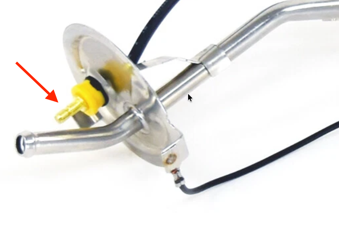

# 64 Fuel Sender Connector
**Forum:** GTO Forum | **Started:** February 3, 2026 | **Replies:** 1
**Thread URL:** https://www.gtoforum.com/threads/64-fuel-sender-connector.151298/post-1064974

## The Issue
Hey guys, anyone know where I can get a replacement fuel sender wire or at least a connector I can use on this...  I tried a 14-16 female bullet connector and it was a little loose. Should I go smaller or is there a better connector to use?

## Key Advice
- **@geeteeohguy**: The correct wire is available on ebay. It has the boot on it that fits over the yellow ferrule. About $25.

## Helpers
- **@geeteeohguy** — 1 post(s)

## Thread Summary

### Kevin's Original Post
Hey guys, anyone know where I can get a replacement fuel sender wire or at least a connector I can use on this...

I tried a 14-16 female bullet connector and it was a little loose. Should I go smaller or is there a better connector to use?

### Replies

**@geeteeohguy** (reply #1):
The correct wire is available on ebay. It has the boot on it that fits over the yellow ferrule. About $25.

## Images

