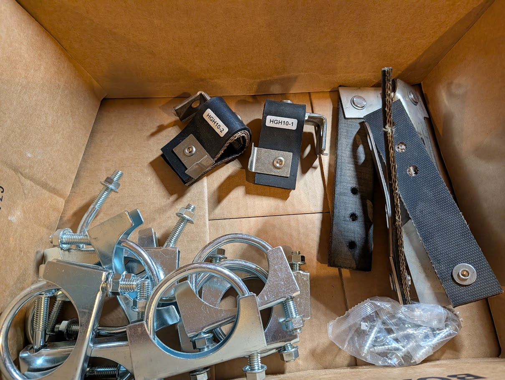
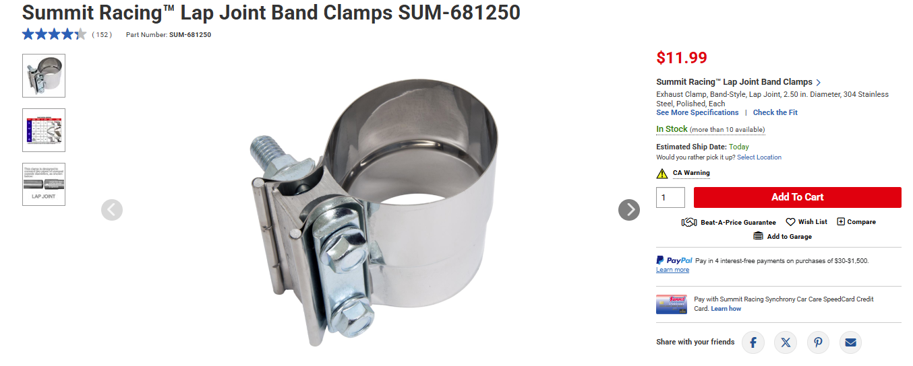
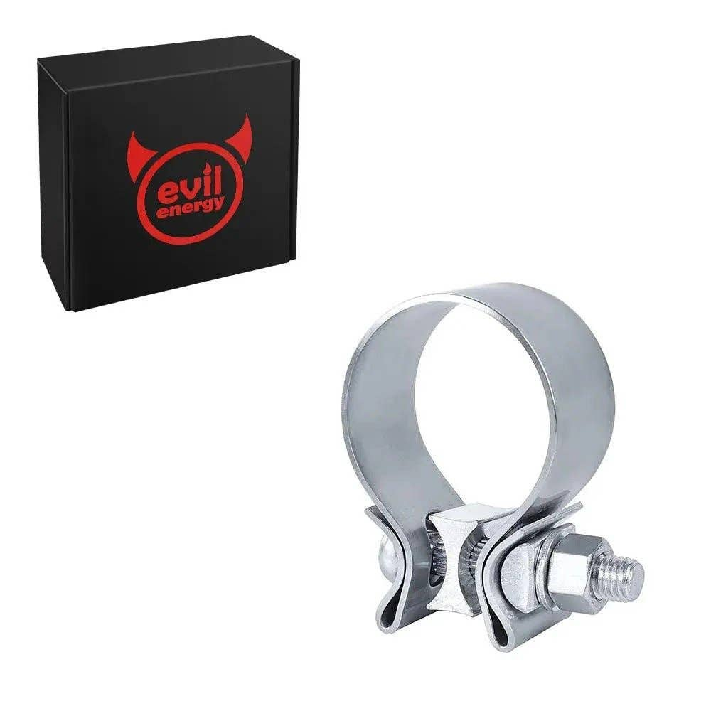
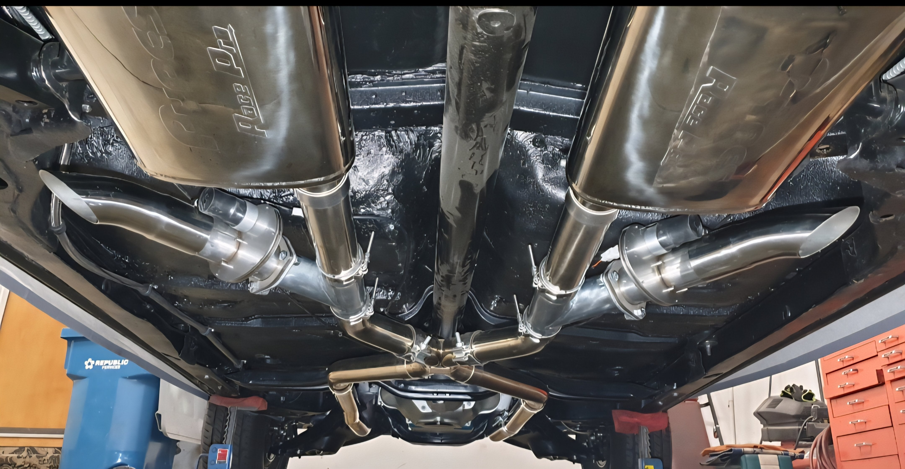
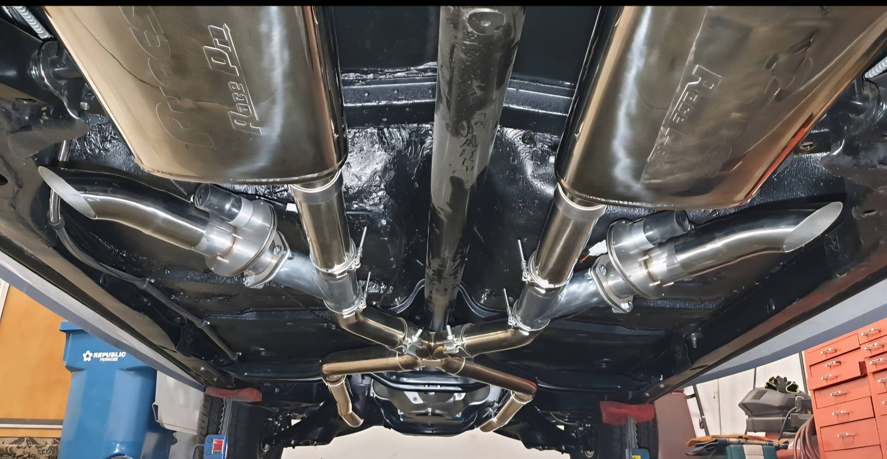
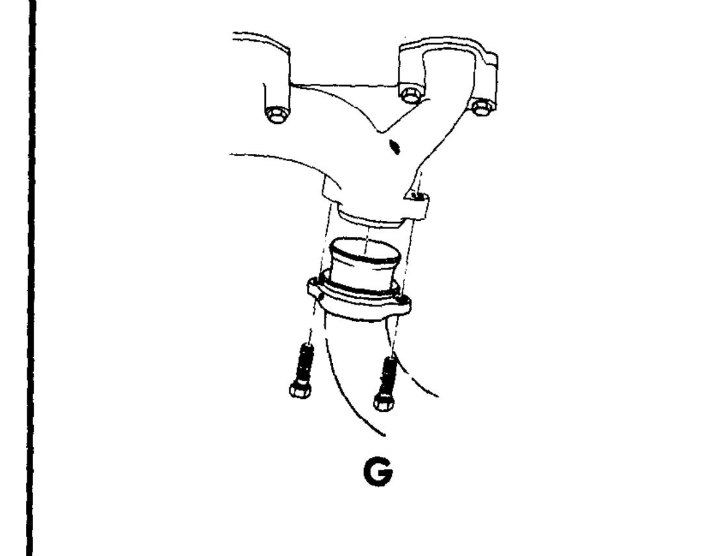
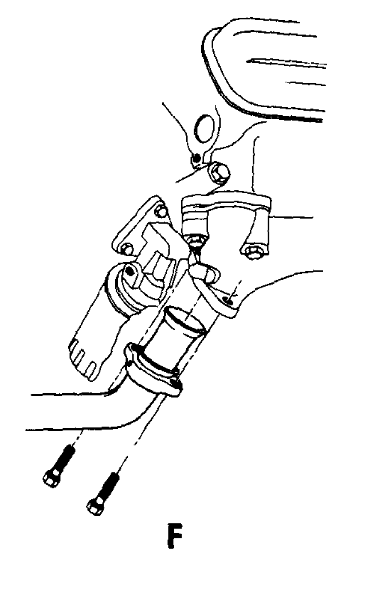
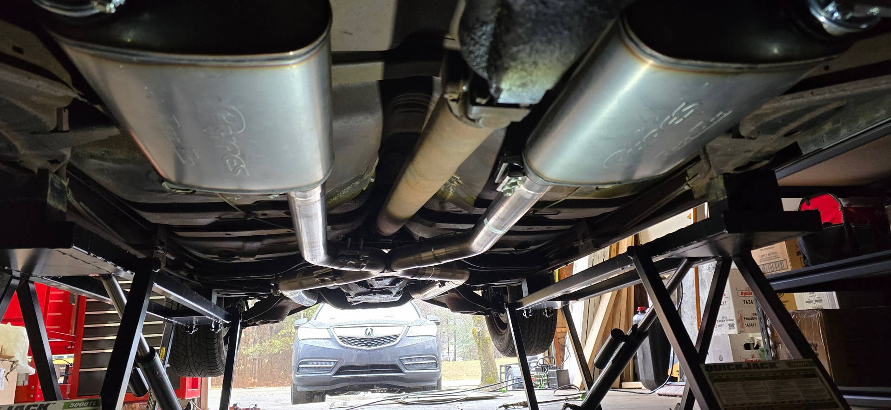
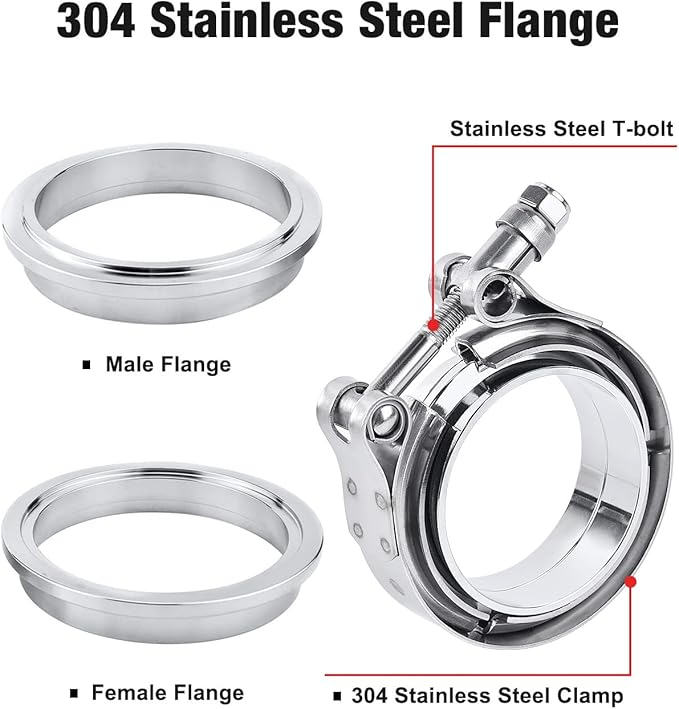

# '64 Tempest - Installing a Pypes Kit
**Forum:** GTO Forum | **Started:** October 24, 2025 | **Replies:** 18
**Thread URL:** https://www.gtoforum.com/threads/64-tempest-installing-a-pypes-kit.150704/post-1057886

## The Issue
Hey there! I have purchased the Pypes exhaust kit and downpipes for my stock '64 Tempest with a 326 and stock exhaust headers. Planning to install in a couple weeks.  What other parts should I get? I believe I need a pair of Exhaust Pipe Flange Gaskets (donuts) and perhaps replacement studs for the down pipes. Recommendations?  Also, I've heard that the u-clamps that come with kits (in pic) aren't the best at sealing and that I should get band clamps. Agree?

## Solution / Outcome
These do look a lot cleaner than the U clamps

## Key Advice
- **@ponchonlefty**: i like the band clamp design because of crushing the pipe. i think its the method i will use. the clamps you have will seal if used correctly but once the pipe  is crushed its over. i believe the band
- **@Baaad65**: > ponchonlefty said: > i like the band clamp design because of crushing the pipe. i think its the method i will use. the clamps you have will seal if used correctly but once the pipe is crushed its ov
- **@Sick467**: The pipe clamps you have will work very well, just loosely assemble the system before putting the torque to the clamp nuts.  Snug them down just enough to hold things from moving around/slipping.  The
- **@GtoFM**: I'm planning to use the SS band clamps with aluminized steel pipes. Also, I will be using anti-seize on the bolts. What are the pros and cons to a thin coat on the pipes. I would wipe it off before as
- **@1fozziebear**: Not sure those will provide enough sealing.  The Summit versions Sick referenced are what I used and if positioned over the slip-joint evenly give you a bolt on either side of the joint.
- **@PDub**: > kevnord said: > I've been looking at these...      View attachment 199200                        Click to expand...
- **@TXStarfire**: I dont think Pontiac motors use a gasket at the manifold.
- **@fishwater**: No gasket between the down pipes and manifold and I used the wider band clamps on my Pypes install. I liked the Walker lap-joint clamps better than the Summit house brand.                            h
- **@oldog97**: > kevnord said: > I've been looking at these...      View attachment 199200                        Click to expand... These are the clamps that I used on mine, (also the Pipes stainless system  > kevn

## Helpers
- **@ponchonlefty** — 1 post(s)
- **@Baaad65** — 3 post(s)
- **@Sick467** — 1 post(s)
- **@GtoFM** — 1 post(s)
- **@1fozziebear** — 1 post(s)
- **@PDub** — 2 post(s)
- **@TXStarfire** — 1 post(s)
- **@fishwater** — 2 post(s)
- **@oldog97** — 1 post(s)

## Thread Summary

### Kevin's Original Post
Hey there!
I have purchased the Pypes exhaust kit and downpipes for my stock '64 Tempest with a 326 and stock exhaust headers. Planning to install in a couple weeks.

What other parts should I get? I believe I need a pair of Exhaust Pipe Flange Gaskets (donuts) and perhaps replacement studs for the down pipes. Recommendations?

Also, I've heard that the u-clamps that come with kits (in pic) aren't the best at sealing and that I should get band clamps. Agree?

### Replies

**@ponchonlefty** (reply #1):
i like the band clamp design because of crushing the pipe.
i think its the method i will use.
the clamps you have will seal if used correctly but once the pipe 
is crushed its over. i believe the band clamps would be easy to
disassemble if you need to.

**@kevnord** (reply #2):
Makes sense. I like options (being able to remove) so I'll get some band clamps. Thanks for the information!

**@Baaad65** (reply #3):
> ponchonlefty said:
> i like the band clamp design because of crushing the pipe.
i think its the method i will use.
the clamps you have will seal if used correctly but once the pipe
is crushed its over. i believe the band clamps would be easy to
disassemble if you need to.
        
        Click to expand...
I second that view as I used the band clamps.

**@Sick467** (reply #4):
The pipe clamps you have will work very well, just loosely assemble the system before putting the torque to the clamp nuts.  Snug them down just enough to hold things from moving around/slipping.  These are the upgrade clamps, if looks are a deciding factor.  (Keep in mind the ones shown below are for 2.5" exhaust)...

    
        
            
        
        
            
                
                
            
        
    
    

 I used these and like them well enough.  They have been tightened down. loosened, adjusted and tightened back many times.  Do yourself a favor and put some anti-seize on the threads (whichever clamps you go with) so they take the repeated tightening and loosing...it happened more than I thought it would...LOL!

**@GtoFM** (reply #5):
I'm planning to use the SS band clamps with aluminized steel pipes. Also, I will be using anti-seize on the bolts. What are the pros and cons to a thin coat on the pipes. I would wipe it off before assembly, because as we all know, the lubricant won't be completely gone.

**@kevnord** (reply #6):
I've been looking at these...

**@1fozziebear** (reply #7):
Not sure those will provide enough sealing.  The Summit versions Sick referenced are what I used and if positioned over the slip-joint evenly give you a bolt on either side of the joint.

**@PDub** (reply #8):
> kevnord said:
> I've been looking at these...

    View attachment 199200
    

        
        Click to expand...

**@Baaad65** (reply #9):
Turns out I have those clamps from Pypes but the cutouts came with their own. I only have a couple places where I can see a little exhaust has leaked.

**@TXStarfire** (reply #10):
I dont think Pontiac motors use a gasket at the manifold.

**@kevnord** (reply #11):
Is there anything between the manifold and downpipes?

**@Baaad65** (reply #12):
Mine didn't using 2.5 "ram air manifolds.

**@kevnord** (reply #13):
> Baaad65 said:
> Mine didn't using 2.5 "ram air manifolds.
        
        Click to expand...

    
        
            
        
        
            
                
                
            
        
    
    

Yeah, doesn't look like there's anything between....

**@fishwater** (reply #14):
No gasket between the down pipes and manifold and I used the wider band clamps on my Pypes install. I liked the Walker lap-joint clamps better than the Summit house brand.

    
        
            https://www.summitracing.com/parts/wlk-33226

**@kevnord** (reply #15):
These do look a lot cleaner than the U clamps

**@PDub** (reply #16):
I recently installed a Pypes system on my 67 GTO.  I ended up going with these Evil Energy V band clamps to make sure there were no leaks.  This came recommended from the exhaust ship that did the install.  No leaks and it looks really good with the stainless steel Pypes system.

**@oldog97** (reply #17):
> kevnord said:
> I've been looking at these...

    View attachment 199200
    

        
        Click to expand...
These are the clamps that I used on mine, (also the Pipes stainless system

> kevnord said:
> I've been looking at these...

    View attachment 199200
    

        
        Click to expand...
These are the clamps that I used! I also used the Pypes system, the stainless set with the Race Pro mufflers. I like the pipes but the race pro mufflers SUCK! While they're not very loud outside, the interior drone is HORRIBLE at certain rpm's. I'm thinking about replacing them with the Flo-Master 40 series!

**@fishwater** (reply #18):
> oldog97 said:
> These are the clamps that I used on mine, (also the Pipes stainless system

These are the clamps that I used! I also used the Pypes system, the stainless set with the Race Pro mufflers. I like the pipes but the race pro mufflers SUCK! While they're not very loud outside, the interior drone is HORRIBLE at certain rpm's. I'm thinking about replacing them with the Flo-Master 40 series!
        
        Click to expand...
That’s weird, I’m running the Race Pro’s on my Pypes X system with zero drone, they aren’t as loud as I hoped but they definitely don’t drone, do you have the X or H pipe system?

## Images

