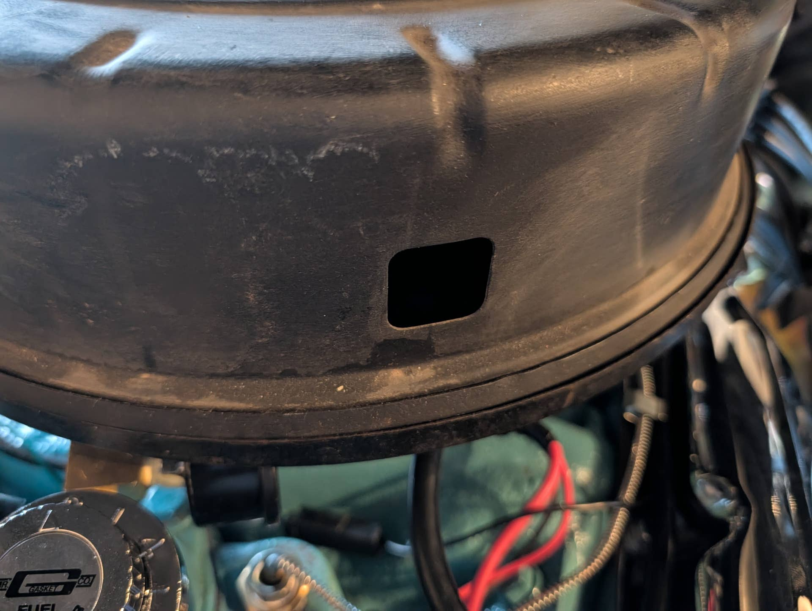
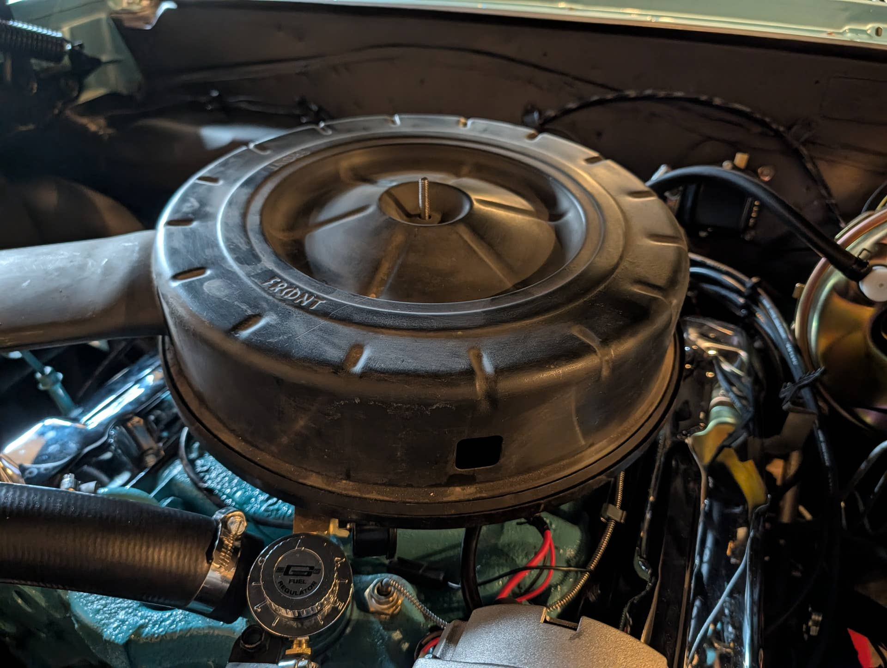
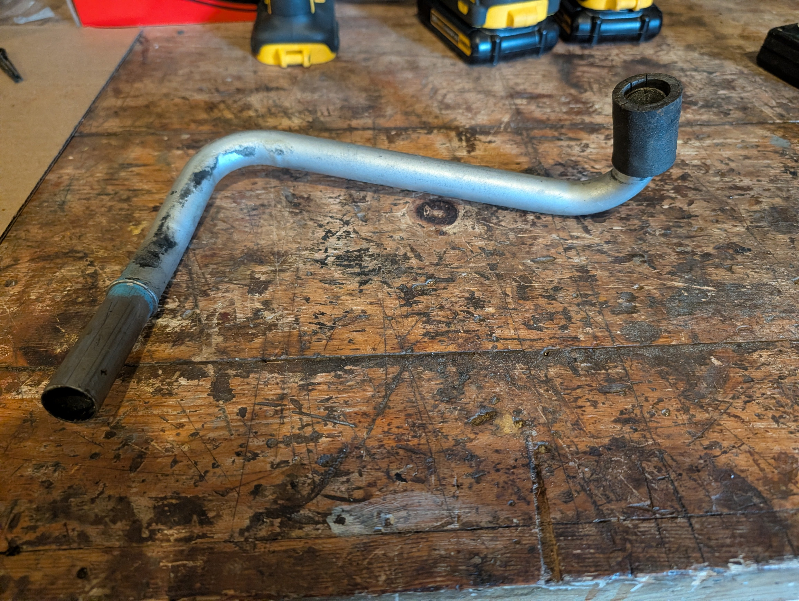

# Air Cleaner breather/vent tube
**Forum:** GTO Forum | **Started:** January 6, 2026 | **Replies:** 3
**Thread URL:** https://www.gtoforum.com/threads/air-cleaner-breather-vent-tube.151138/post-1063069

## The Issue
I'm thinking about putting the original air cleaner back on my 64 Tempest 2bbl. Replaced it with a chrome one a few decades ago and lost a couple parts I'm now looking for.  I need the square adapter/grommet that mounts to the air cleaner that the metal tube coming from the valve cover. Have any leads, I've tried the usual suspects/shops.  (I still need to clean and paint the cleaner)

## Solution / Outcome
Thanks! I was looking at that one earlier today and wondered if it might work. I seem to remember a clip like the one it takes. May order one And see if it works .. Ames N212CH

## Key Advice
- **@Geeter**: It may use a PCV air filter like this one, AC Delco #19112815. It has a hose end and believe it or not a square hole filler that fits in the air cleaner housing like what you have. It uses a clip to s
- **@indymanjoel**: You may find it locally if you have a real parts store near you. The dorman racks had them last i looked.

## Helpers
- **@Geeter** — 1 post(s)
- **@indymanjoel** — 1 post(s)

## Thread Summary

### Kevin's Original Post
I'm thinking about putting the original air cleaner back on my 64 Tempest 2bbl. Replaced it with a chrome one a few decades ago and lost a couple parts I'm now looking for.

I need the square adapter/grommet that mounts to the air cleaner that the metal tube coming from the valve cover. Have any leads, I've tried the usual suspects/shops.

(I still need to clean and paint the cleaner)

### Replies

**@Geeter** (reply #1):
It may use a PCV air filter like this one, AC Delco #19112815. It has a hose end and believe it or not a square hole filler that fits in the air cleaner housing like what you have. It uses a clip to secure it to the air cleaner housing. Ames has it as part #N212CK. Not sure if they used the PCV filter in 64 but it may be an option.

**@kevnord** (reply #2):
Thanks! I was looking at that one earlier today and wondered if it might work. I seem to remember a clip like the one it takes. May order one And see if it works .. Ames N212CH

**@indymanjoel** (reply #3):
You may find it locally if you have a real parts store near you. The dorman racks had them last i looked.

## Images

