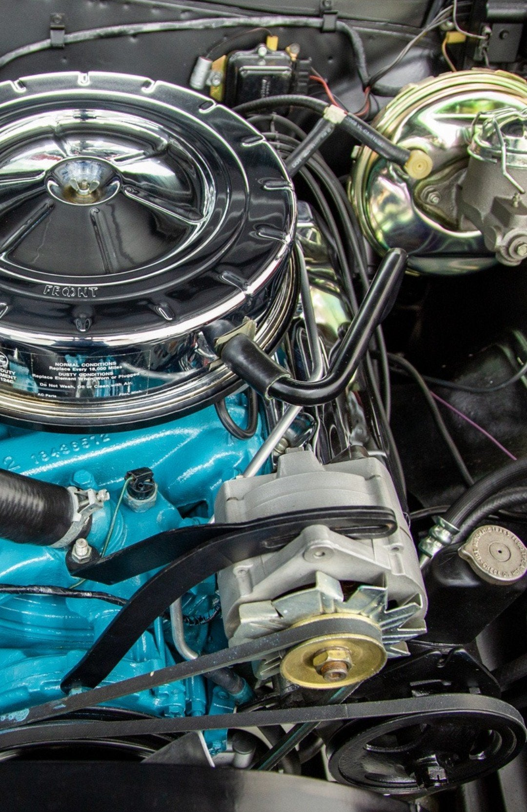
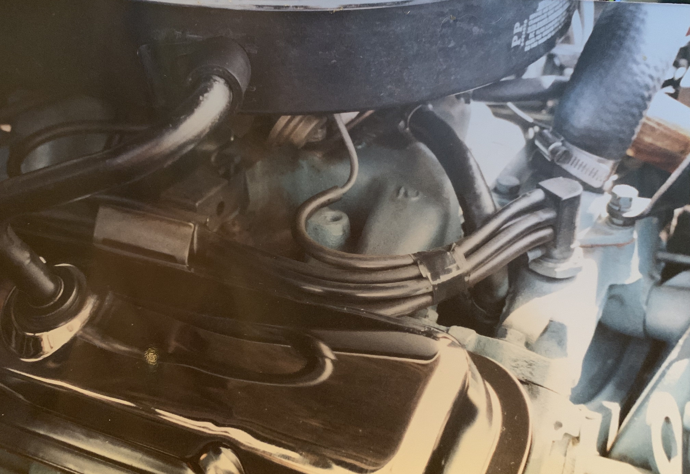
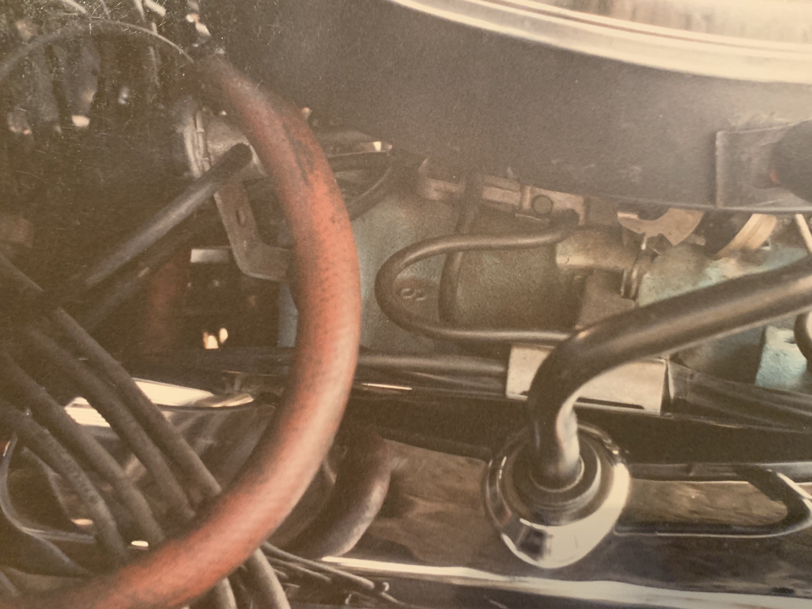

# Air cleaner vent tube
**Forum:** GTO Forum | **Started:** February 14, 2026 | **Replies:** 7
**Thread URL:** https://www.gtoforum.com/threads/air-cleaner-vent-tube.151317/post-1065295

## The Issue
Hey guys, What color is the air cleaner to valve vent tube normally? Mine was silver (painted) and I found this picture where it's black. What's "correct"?

## Solution / Outcome
I think it must have been clack originally. My valve covers were pontiac blue and the air cleaner was black. So black vent tube seems logical. I sanded it a bit and believe I see black. I'm going to roll with it.

## Key Advice
- **@Bluejudge**: My 69 and 70 are a silver plating, I believe they are original. Maybe the NOS ones were painted black?
- **@Chaos goat**: I don’t know about your 64 but my 69 vent tube was plated silver. Same as bluejudge.
- **@lust4speed**: My two California 67 GTO's had black vent tubes.
- **@O52**: Not a painted black but plated. Photos taken around 1981

## Helpers
- **@Bluejudge** — 1 post(s)
- **@Chaos goat** — 1 post(s)
- **@lust4speed** — 1 post(s)
- **@O52** — 1 post(s)

## Thread Summary

### Kevin's Original Post
Hey guys,
What color is the air cleaner to valve vent tube normally? Mine was silver (painted) and I found this picture where it's black. What's "correct"?

### Replies

**@Bluejudge** (reply #1):
My 69 and 70 are a silver plating, I believe they are original. Maybe the NOS ones were painted black?

**@Chaos goat** (reply #2):
I don’t know about your 64 but my 69 vent tube was plated silver. Same as bluejudge.

**@kevnord** (reply #3):
Thanks guys. I was pretty sure it was silver till I saw this pic.

**@lust4speed** (reply #4):
My two California 67 GTO's had black vent tubes.

**@O52** (reply #5):
Not a painted black but plated.
Photos taken around 1981

**@kevnord** (reply #6):
Was your air cleaner black as well? (Looks like you) 

I think my. 64 California Tempest's was silver. I painted it silver in the 90s but don't remember what it was before that. I don't see a black layer if I sand it. Not sure what's correct (not that I'm that concerned). More curious than anything

**@kevnord** (reply #7):
I think it must have been clack originally. My valve covers were pontiac blue and the air cleaner was black. So black vent tube seems logical. I sanded it a bit and believe I see black. I'm going to roll with it.

## Images

