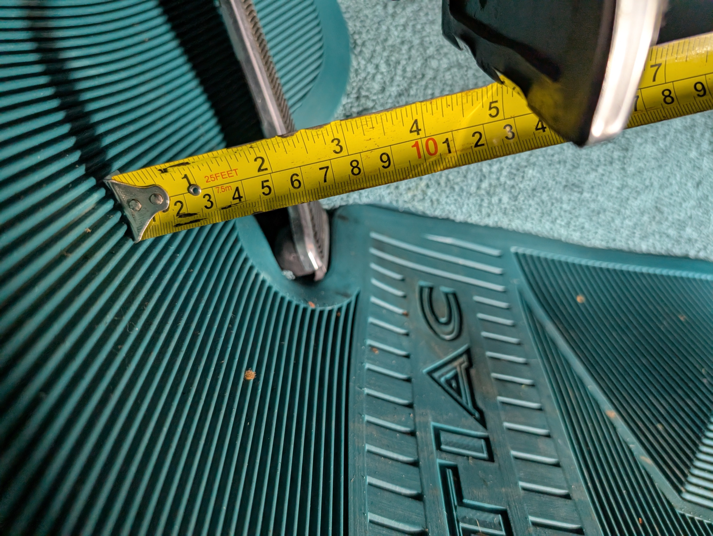
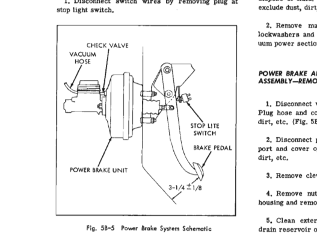
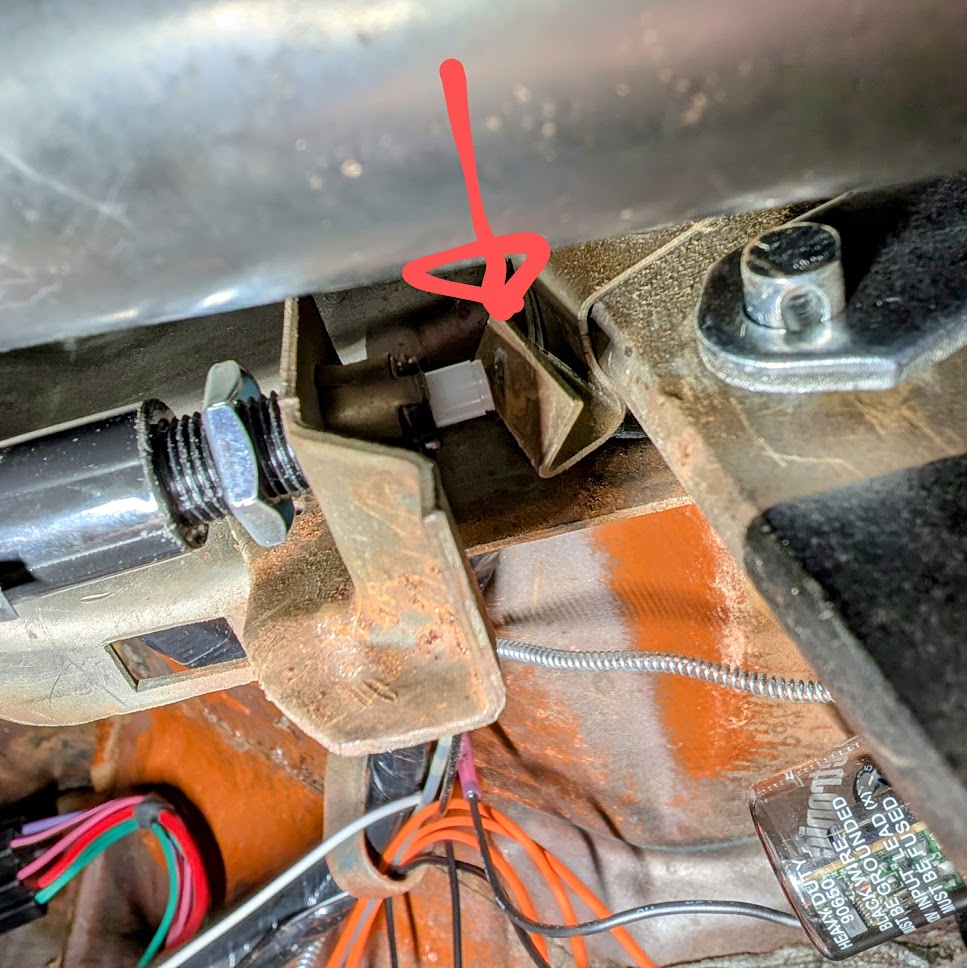
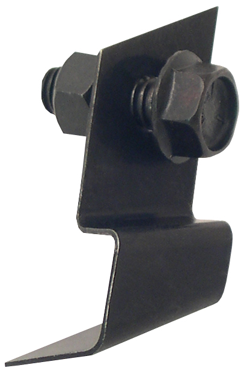
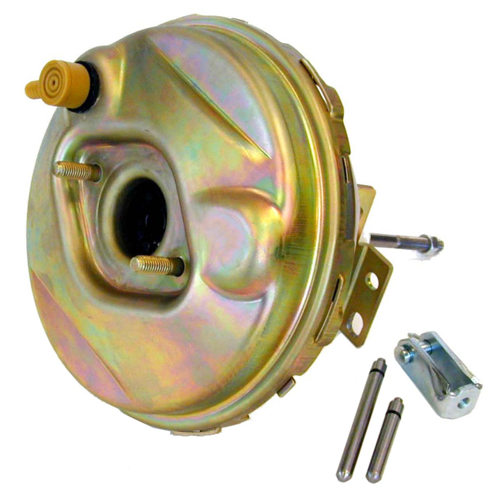

# Brake Pedal Spacing 1964 Tempest
**Forum:** GTO Forum | **Started:** February 22, 2025 | **Replies:** 6
**Thread URL:** https://www.gtoforum.com/threads/brake-pedal-spacing-1964-tempest.149004/post-1037036

## The Issue
Hey friends, Putting in a new brake booster wand I want to make sure the distance between the brake pedal and floor(mat) is correct. I initially tried to make the new push rod the same length as the old one, but had to increase the length to hit the stop light switch.  I'm pretty sure the main issue is the stop light switch contact bracket which is extremely bent. (see pic) I've bent it back to position-ish, but it's not very rigid and unlikely to stay that way.  If you have a car with power bra...

## Solution / Outcome
> armyadarkness said: > Awesome! What booster did you use?                  Click to expand... Part of a kit from inline tubes...                                                                                                                                                                                                                                    1964-66 GM A-Body Factory Style 9" Brake Booster Without Delco Stamp                                                        1964-66 GM A-Body F...

## Key Advice
- **@A64GTO**: I don’t have power brakes but now curious!  How far is your pedal to the firewall?
- **@armyadarkness**: > kevnord said: > Hey friends, Putting in a new brake booster wand I want to make sure the distance between the brake pedal and floor(mat) is correct. I initially tried to make the new push rod the sa
- **@lust4speed**: Don't forget to put back the cotter key when you're done adjusting things.

## Helpers
- **@A64GTO** — 1 post(s)
- **@armyadarkness** — 2 post(s)
- **@lust4speed** — 1 post(s)

## Thread Summary

### Kevin's Original Post
Hey friends,
Putting in a new brake booster wand I want to make sure the distance between the brake pedal and floor(mat) is correct. I initially tried to make the new push rod the same length as the old one, but had to increase the length to hit the stop light switch.

I'm pretty sure the main issue is the stop light switch contact bracket which is extremely bent. (see pic) I've bent it back to position-ish, but it's not very rigid and unlikely to stay that way.

If you have a car with power brakes, how far is your pedal to the floor? 

    
        
            
        
        
            
                
                
            
        
    
    

    
        
            
        
        
            
                
                
            
        
    
    

    
        
            
        
        
            
                
                
            
        
    
    

    
        
            
        
        
            
                
                
            
        
    
    

    

    
        
            
            
                
                    
                        64-66 STOP LIGHT SWITCH CONTACT BRKT, ALL POWER BRAKES (RE)
                    
                

                64-66 STOP LIGHT SWITCH CONTACT BRKT, ALL POWER BRAKES (RE)

                
                    
                        
                            
                        
                    
                    www.amesperf.com

### Replies

**@A64GTO** (reply #1):
I don’t have power brakes but now curious!  How far is your pedal to the firewall?

**@armyadarkness** (reply #2):
> kevnord said:
> Hey friends,
Putting in a new brake booster wand I want to make sure the distance between the brake pedal and floor(mat) is correct. I initially tried to make the new push rod the same length as the old one, but had to increase the length to hit the stop light switch.

I'm pretty sure the main issue is the stop light switch contact bracket which is extremely bent. (see pic) I've bent it back to position-ish, but it's not very rigid and unlikely to stay that way.

If you have a car with power brakes, how far is your pedal to the floor?

    View attachment 190426
    

    View attachment 190427
    

    View attachment 190429
    

    View attachment 190430
    

    

    
        
            
            
                
                    
                        64-66 STOP LIGHT SWITCH CONTACT BRKT, ALL POWER BRAKES (RE)
                    
                

                64-66 STOP LIGHT SWITCH CONTACT BRKT, ALL POWER BRAKES (RE)

                
                    
                        
                            
                        
                    
                    www.amesperf.com
                
            
        
    

        
        Click to expand...
One thing is for sure, dont ever set the pedal height to the light switch!

That light switch is fully adjustable, so you can set the pedal however you like, and then adjust the switch to work with it.

**@kevnord** (reply #3):
I realized that last night.  Had a brain fart and was thinking it couldn't be adjusted.

I put the original booster and pushrod back in and noted it's distance and matches the new one to it.

**@armyadarkness** (reply #4):
> kevnord said:
> I realized that last night.  Had a brain fart and was thinking it couldn't be adjusted.

I put the original booster and pushrod back in and noted it's distance and matches the new one to it.
        
        Click to expand...
Awesome! What booster did you use?

**@kevnord** (reply #5):
> armyadarkness said:
> Awesome! What booster did you use?
        
        Click to expand...
Part of a kit from inline tubes...

    

    
        
            
                
                    
                        
                        
                
            
            
                
                    
                        1964-66 GM A-Body Factory Style 9" Brake Booster Without Delco Stamp
                    
                

                1964-66 GM A-Body Factory Style 9" Brake Booster Without Delco Stamp

                
                    
                        
                            
                        
                    
                    www.inlinetube.com

**@lust4speed** (reply #6):
Don't forget to put back the cotter key when you're done adjusting things.

## Images

