# Engine Stumbling on Acceleration
**Forum:** GTO Forum | **Started:** February 21, 2026 | **Replies:** 69
**Thread URL:** https://www.gtoforum.com/threads/engine-stumbling-on-acceleration.148379/post-1026855

## The Issue
I have a 64 Tempest w a stock 326ci Rochester 2GC Engine has always run well but was in need of a tune up. Replaced spark plugs, wires, distributor, fuel filter, vacuum/fuel hoses, etc. Had the carb professionally rebuilt.  Engine has been running better but has had a small hesitation on acceleration. Been tweaking the accelerator pump rod trying to get rid of it.  Filled the tank up with ethanol free gas and added some lead additive (probably not needed, I know). Took it to a car show, hooray!...

## Solution / Outcome
Is there any circumstance in which you'd place a filter pre pump? I didn't put it there, not sure who did. I'm the second owner (after my grandma) and doubt she put one on. Must have been a mechanic along the way.

## Key Advice
- **@ponchonlefty**: did you replace the points?
- **@RMTZ67**: Set your points to 30 the get carb spray or something similar ad spray around the top side for vacuum leaks by listening for a change in acceleration.
- **@Otto2**: I had the exact same issue with 2 different 2GCs I rebuilt. A massive off idle stumble. I figured my rebuilding skills were not good. I guessed mine was somewhere in the idle circuit. I tried to get t
- **@lust4speed**: Not fond of filters between the tank and mechanical pump.  The pump has a difficult enough time pulling fuel all the way up from the tank without introducing a new restriction.  A sock on the pickup i
- **@Ctao9**: I had a hesitation on initial acceleration off the line (to the point it almost stalled off the line on heavy acceleration). I replaced the accelerator pump and it fixed the issue. Did the people who 
- **@O52**: X2  The cheap rebuild kits don't use ethanol resistant rubber for the pump.  The rubber deteriorates and won't seal against the pump well.
- **@geeteeohguy**: Your problem with driving down the road and needing to baby it is way past it being a pump shot issue. You likely have fuel starvation issues due to a clogged sock in the fuel tank, the rubber fuel li
- **@armyadarkness**: > kevnord said: > View attachment 186619       Rear rubber line looks to be in good shape. Think I can remove the sender unit and sock without removing some gas? It's at least 3/4 full. Thought about 
- **@BearGFR**: I've scanned through the thread and I admit I probably didn't read every detail closely, so if I missed this - my bad.  But, have you checked your ignition timing?   It's very common to mis-diagnose a
- **@Baaad65**: Like lust4speed said, the sock and a filter after the pump that's what I'm running.  My sock was split and collapsed over the pickup.
- **@Ranchogto**: Just the opposite of what you said ! The top surface of the pump arm rests against the lobe on the cam shaft. As others have already mentioned rotating the engine over to top dead center of the no 1 p

## Helpers
- **@ponchonlefty** — 18 post(s)
- **@RMTZ67** — 2 post(s)
- **@Otto2** — 3 post(s)
- **@lust4speed** — 1 post(s)
- **@Ctao9** — 1 post(s)
- **@O52** — 1 post(s)
- **@geeteeohguy** — 6 post(s)
- **@armyadarkness** — 5 post(s)
- **@BearGFR** — 1 post(s)
- **@Baaad65** — 10 post(s)
- **@Ranchogto** — 1 post(s)

## Thread Summary

### Kevin's Original Post
I have a 64 Tempest w a stock 326ci Rochester 2GC
Engine has always run well but was in need of a tune up.
Replaced spark plugs, wires, distributor, fuel filter, vacuum/fuel hoses, etc.
Had the carb professionally rebuilt.

Engine has been running better but has had a small hesitation on acceleration. Been tweaking the accelerator pump rod trying to get rid of it.

Filled the tank up with ethanol free gas and added some lead additive (probably not needed, I know).
Took it to a car show, hooray!

On the way home from the car show, it started acting weird upon acceleration. Was bogging down and just had a lack of power. I had to baby it to get it home, about 5 miles.

I started it up a couple days later. It happily warmed up. Then, I saw the alternator sparking and some smoke came out. It was HOOOOTTTT! I replaced it and was hoping that was what had caused the sluggish driving somehow.

Unfortunately, it did not solve the issue. I replaced the plugs and wires and installed a fuel gauge to see if my fuel pump was going. It gets a consistent 5-6psi at idle which I believe is good.

I tried taking off my venting gas cap, but that didn't help. I may replace the fuel filter again, thinking maybe filling up the tank may have loosened some sediment. Car has been mostly sitting for years, just started driving it weekly this year. 

It idles happily and is very smooth. When I push on the accelerator, it bogs down. If I let up a little it will actually accelerate for a little bit. It's unhappy and will occasionally let out a muffled backfire (not loud). 

To me it sounds like it's not getting enough gas, but I'm not sure. I'll likely try adjusting the accelerator pump rod again.

Any thoughts, ideas? things to try to get more info?

### Replies

**@ponchonlefty** (reply #1):
did you replace the points?

**@kevnord** (reply #2):
I have not and to be honest I'm not sure they've ever been replaced. The car has sat for most of its life.

I actually bought new points but was holding off, trying to not introduce too many new things (for now). Bought a multimeter to check the dwell, it was low but I don't remember the number.

Does it sound points related to you?

**@ponchonlefty** (reply #3):
usually if the points are bad the engine shakes and runs rough. try cleaning the points by sliding a dollar bill between the contacts then check the dwell again. cut the fuel filter open to see if it is getting trash or rust in the filter. it is possible the coil is getting hot and causing the bog also. check all connections going to the coil. look for mice chew marks on the wires.

**@kevnord** (reply #4):
I replaced the coil a few months back and the engine wiring harness, both look to be in great shape... no mice thankfully, though they're around. I'll probably replace the fuel filter next/this weekend.

I also replaced the Ignition Condenser a while ago. I kinda regret that as I've heard that the original ones are bullet proof and the new ones not so much. May put the old one back in.

**@ponchonlefty** (reply #5):
> kevnord said:
> I replaced the coil a few months back and the engine wiring harness, both look to be in great shape... no mice thankfully, though they're around. I'll probably replace the fuel filter next/this weekend.
        
        Click to expand...
reset the points see if you can get 30. cut open the old fuel filter when you change to new. them 2barrels are usually pretty good when sitting. i think maybe your getting trash or maybe bad fuel.

**@kevnord** (reply #6):
> ponchonlefty said:
> reset the points see if you can get 30. cut open the old fuel filter when you change to new. them 2barrels are usually pretty good when sitting. i think maybe your getting trash or maybe bad fuel.
        
        Click to expand...
Will do and will let you know what I find. I really wonder about the Lead Substitute (by Gunk) that I added to the full tank a drive or two before the issues started. I haven't used it in the past but have been trying to take good care of the car and thought it was a good thing. :-/

Really appreciate the help!!!

**@kevnord** (reply #7):
I'm no filter expert, but that looks pretty clean to me. Kinda ripped apart when I tried to get it out.

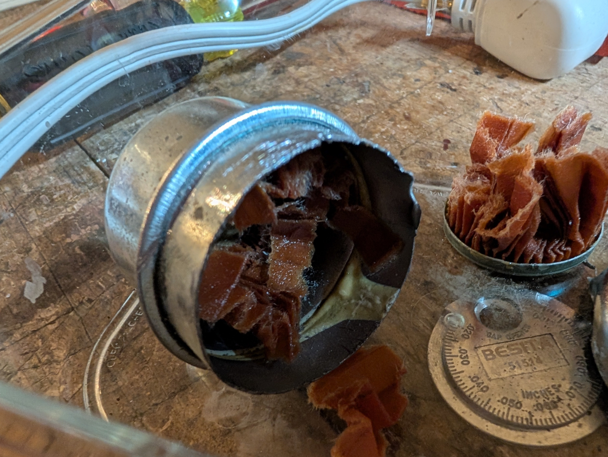

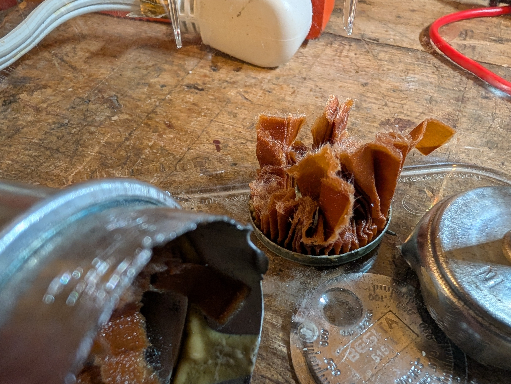

**@ponchonlefty** (reply #8):
agreed. there should be debris in there. well now theres the pump. you can check it with a vacuum gauge. then it that checks out move on to the next thing. did you get the points set? i mean its either a fuel starvation or ignition. looks like your carb should be clean. try removing the small filter at the carb,see if the bog goes away. but try to get the points set first.

**@kevnord** (reply #9):
> ponchonlefty said:
> agreed. there should be debris in there. well now theres the pump. you can check it with a vacuum gauge. then it that checks out move on to the next thing. did you get the points set? i mean its either a fuel starvation or ignition. looks like your carb should be clean. try removing the small filter at the carb,see if the bog goes away. but try to get the points set first.
        
        Click to expand...
Didn't get the points set yet ... Rainy day here and I didn't want to run it in the garage. Hope to get it out tomorrow.

I think it's the fuel pump but I'll adjust the points first since it's easy and needed anyway.

Wish I would have replaced the pump when I had the steering gear box out a month ago since I'd have more space. That's how it goes.

**@ponchonlefty** (reply #10):
> kevnord said:
> Didn't get the points set yet ... Rainy day here and I didn't want to run it in the garage. Hope to get it out tomorrow.

I think it's the fuel pump but I'll adjust the points first since it's easy and needed anyway.

Wish I would have replaced the pump when I had the steering gear box out a month ago since I'd have more space. That's how it goes. 
        
        Click to expand...
i think you could be right.

**@kevnord** (reply #11):
I did just that, slid a dollar between and tried to clean it. There seemed to be zero space between the points, is that normal? I expected a little gap.
The car behaved like before, idle may have been a little more wobbly (technical term) than before.
I measured the dwell and it was 21-22°... am I correct that it should be around 30°?

The fuel pressure gauge was around 4-5 and when I opened the throttle manually (while parked) it looked like it dropped to 3psi. I believe it should hold steady, is that correct?
Not sure if/when the fuel pump was last replaced. I have a new one ready to install.

I might have a couple issues here to address.

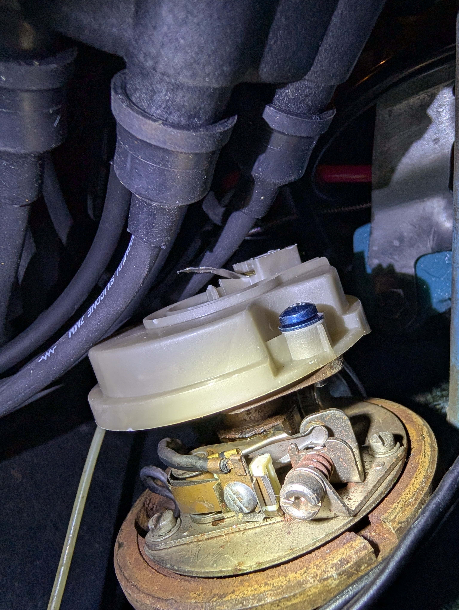

**@ponchonlefty** (reply #12):
30 yes.

**@RMTZ67** (reply #13):
Set your points to 30 the get carb spray or something similar ad spray around the top side for vacuum leaks by listening for a change in acceleration.

**@kevnord** (reply #14):
I'll give that a try. I replaced all the vacuum fittings and hoses, definitely had a vacuum leak a few months back but fixed it. Worth another check

**@Otto2** (reply #15):
I had the exact same issue with 2 different 2GCs I rebuilt. A massive off idle stumble. I figured my rebuilding skills were not good. I guessed mine was somewhere in the idle circuit. I tried to get the transition slots just right but nogo. I put a fake 2GC from Amazon on and the problem disappeared. I will get one of my Rochesters rebuilt at some point but can't find anyone local.

**@kevnord** (reply #16):
I sent mine to National Carburetors for the rebuild. I just didn't have the time/focus to do it myself. I feel like they did a nice job, but ya never know. 
The rebuild was about the same price as buying a rebuilt one from them.

did you have to adjust the accelerator pump rod at all? I've set it at the factory spec and tried a little shorter (more gas) and a little longer. I just wonder how touchy it is.

**@Otto2** (reply #17):
I followed specs on the pump rod and it was fine. Didn't mess with it. I may revisit one of them but no time right now. I did see National but was hoping for someone more local. I may try them with one of mine too. Neither of them are stamped and don't have tags so guess they're both pre 68?

Mine would be OK if you feathered the throttle and got into it. Just off idle it would stumble. Yours sounds a bit more sustained so likely fuel related like Poncho said.

**@ponchonlefty** (reply #18):
those 2 barrel carbs are pretty simple inside. you could build it i think.

**@Otto2** (reply #19):
> ponchonlefty said:
> those 2 barrel carbs are pretty simple inside. you could build it i think.
        
        Click to expand...
I'm thinking my previous attempt wasn't thorough enough. I may try a soak this time. I just sprayed everything out and thought I was good. They really aren't that complicated.

**@ponchonlefty** (reply #20):
> Otto2 said:
> I'm thinking my previous attempt wasn't thorough enough. I may try a soak this time. I just sprayed everything out and thought I was good. They really aren't that complicated.
        
        Click to expand...
get some wire and go thru the holes. spray it out see if it cleaned it. cliff ruggles sells parts on ebay. get one of those pump kits and it should last a while. check the float for holes or make sure it doesn't sink. not much to go wrong in there.

**@ponchonlefty** (reply #21):
i think the carb is fine. its sounds like a restriction in the line. if it is the carb it just needs cleaned out. pretty quick to do. do you have a filter at the carb inlet? that might be clogged. i would remove it and use an in line filter.

**@kevnord** (reply #22):
There is a filter at the inlet that I checked a couple days ago. The other filter is between the tank and the pump. I replaced that one 6 months ago but will replace it again just to see what the old one looks like.

I feel like it's the fuel pump or filter, so I'll likely replace those to see/rule them out. My dwell is off but it probably has been for a while . I'll adjust it first nonetheless

**@ponchonlefty** (reply #23):
let us know what you find. im sure it will help others.

**@kevnord** (reply #24):
Adjusted the dwell to 30 from 22. Replaced fuel filter last night. Car idles nicely at 850rpm with vacuum at 19. Fuel pressure sitting at 3 to 3-1/2 even when I increase the idle.

Of note, while idling I unscrewed the vented gas cap, leaving it on, and it died 3 seconds later. Started back up when I reseated cap.

Took for a drive and the only difference I could tell was that instead of bogging down it nearly died, big hesitation until I let off the accelerator. I tried to see if it would get past the hesitation if I held it up it didn't seem like it would.

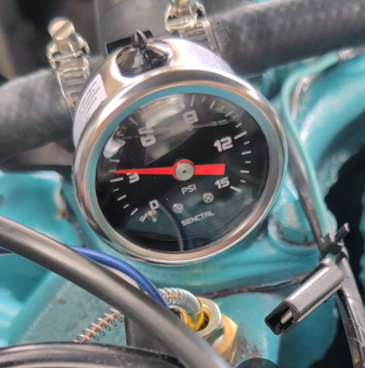

**@ponchonlefty** (reply #25):
it looks like the pump. i had a vent line clogged and the pump kept working but sucked the bottom of the tank. i notice it when i needed gas. i heard the tank pop back out.

**@kevnord** (reply #26):
> ponchonlefty said:
> it looks like the pump. i had a vent line clogged and the pump kept working but sucked the bottom of the tank. i notice it when i needed gas. i heard the tank pop back out.
        
        Click to expand...
Roger that. I'll be changing the pump this week. 
What would you say is the preferred place to put a filter? Right now, it's between the tank and pump. Not sure when/who put it there. There is not a filter between the pump and carb, well, just the one where the hose screws into the carb.

**@ponchonlefty** (reply #27):
> kevnord said:
> Roger that. I'll be changing the pump this week.
What would you say is the preferred place to put a filter? Right now, it's between the tank and pump. Not sure when/who put it there. There is not a filter between the pump and carb, well, just the one where the hose screws into the carb.
        
        Click to expand...
my preference is have a in line filter before the pump and no filter in the carb. but if your tank is clean mine are not usually. running a filter before the carb is good. that little one will work fine,the factory thought so. it will look better. but the down fall of those carb filters is wearing or stripping the threads in the carb. it happens all the time. i don't like the plastic filters or the fancy glass filters. i get metal cased filters. try to mount it away from the engine don't let it touch.

**@lust4speed** (reply #28):
Not fond of filters between the tank and mechanical pump.  The pump has a difficult enough time pulling fuel all the way up from the tank without introducing a new restriction.  A sock on the pickup inside the tank should be about it for a mechanical pump.  Also the accelerator pump is only to cover quick movement of the throttle and if the car continues to run bad at a steady throttle position, then look elsewhere.

**@kevnord** (reply #29):
I've heard that before and makes sense. Not sure how/when a filter was added between the tank and pump or if that was stock.

**@Ctao9** (reply #30):
I had a hesitation on initial acceleration off the line (to the point it almost stalled off the line on heavy acceleration). I replaced the accelerator pump and it fixed the issue. Did the people who rebuilt the carb replace the accelerator pump along with the rebuild, or maybe put in the wrong size accelerator pump?

**@ponchonlefty** (reply #31):
some pumps don't like ethanol.the newer pumps is needed.

**@ponchonlefty** (reply #32):
Quadrajet Accelerator Pump Seal Lifetime Warranty | eBay
 
 

 Quadrajet accelerator pump seal with garter spring. This is a custom USA made part from a special purpose fluorocarbon-based synthetic rubber.

 
 
 
 
 www.ebay.com

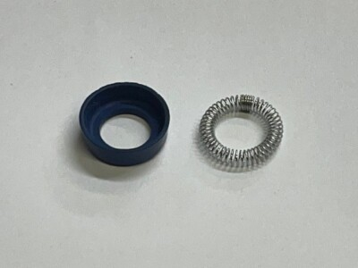

**@kevnord** (reply #33):
I believe so but I'll double check.
I am using ethanol free gas.

**@O52** (reply #34):
X2 
The cheap rebuild kits don't use ethanol resistant rubber for the pump.  The rubber deteriorates and won't seal against the pump well.

**@geeteeohguy** (reply #35):
Your problem with driving down the road and needing to baby it is way past it being a pump shot issue. You likely have fuel starvation issues due to a clogged sock in the fuel tank, the rubber fuel line at the tank to the steel line being porous, or junk from the tank in the new carb clogging up the jets. First step is to disconnect the fuel line at the carb and do a cranking fuel volume test. Pressure is one thing, but you need volume also. It could also be a low float level in the carb. A low float adjustment will cause all of your issues. A weak pump shot will only cause a stumble right out of a stop light. After the car is rolling, it will run just fine on the other carb circuits.

**@kevnord** (reply #36):
I'll check the rubber fuel line at the tank tonight or tomorrow. I've been focused on the front and have replaced everything up there except the pump at this point. 

I've never touched the tank. Looks straightforward but not looking forward to draining the tank which I just filled up before this mess. Maybe filling it up cause the issue.

I'm going to replace the pump since I've already working on that. Might be a few days before I have time and weather to test that.

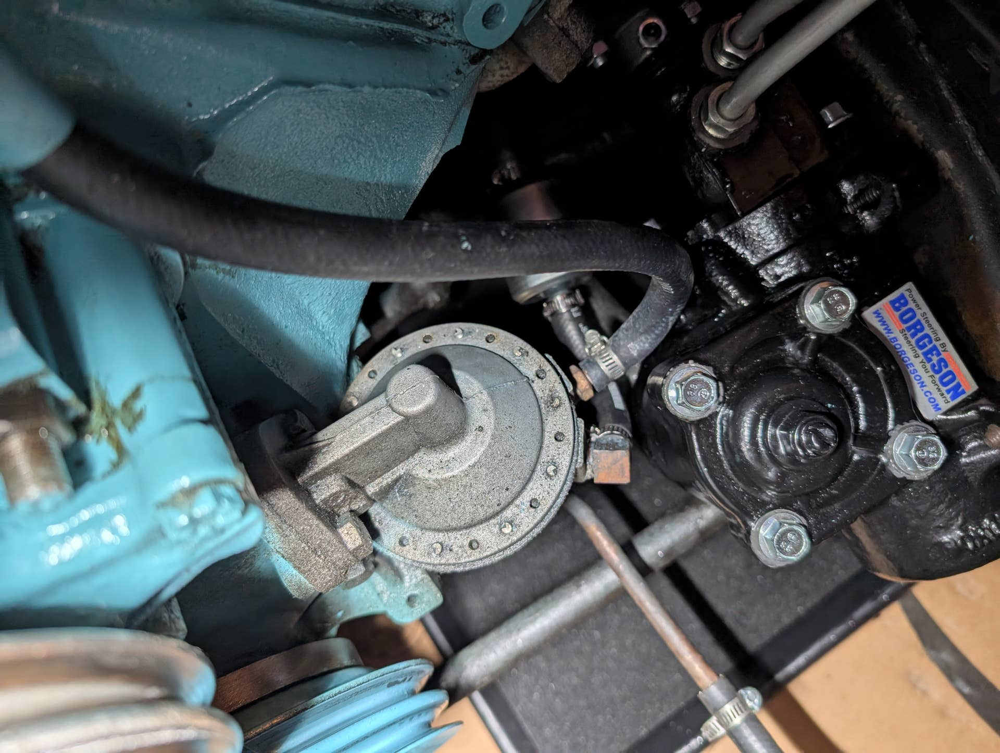

**@geeteeohguy** (reply #37):
> kevnord said:
> I'll check the rubber fuel line at the tank tonight or tomorrow. I've been focused on the front and have replaced everything up there except the pump at this point.

I've never touched the tank. Looks straightforward but not looking forward to draining the tank which I just filled up before this mess. Maybe filling it up cause the issue.

I'm going to replace the pump since I've already working on that. Might be a few days before I have time and weather to test that.

    View attachment 186612
    

        
        Click to expand...
No need to drain tank to check the line. Or to pull sender. It’s on the top of the tank. I’ve had the rear rubber line crack to where it didn’t leak gas, but caused the pump to draw air, causing starvation. Also have had wadded up and restricted sock pickups in the tank.

**@kevnord** (reply #38):
> geeteeohguy said:
> No need to drain tank to check the line. Or to pull sender. It’s on the top of the tank. I’ve had the rear rubber line crack to where it didn’t leak gas, but caused the pump to draw air, causing starvation. Also have had wadded up and restricted sock pickups in the tank.
        
        Click to expand...

    
        
            
        
        
            
                
                
            
        
    
    

Rear rubber line looks to be in good shape. Think I can remove the sender unit and sock without removing some gas? It's at least 3/4 full. Thought about jacking the front up a bit to tip the car /tank back.

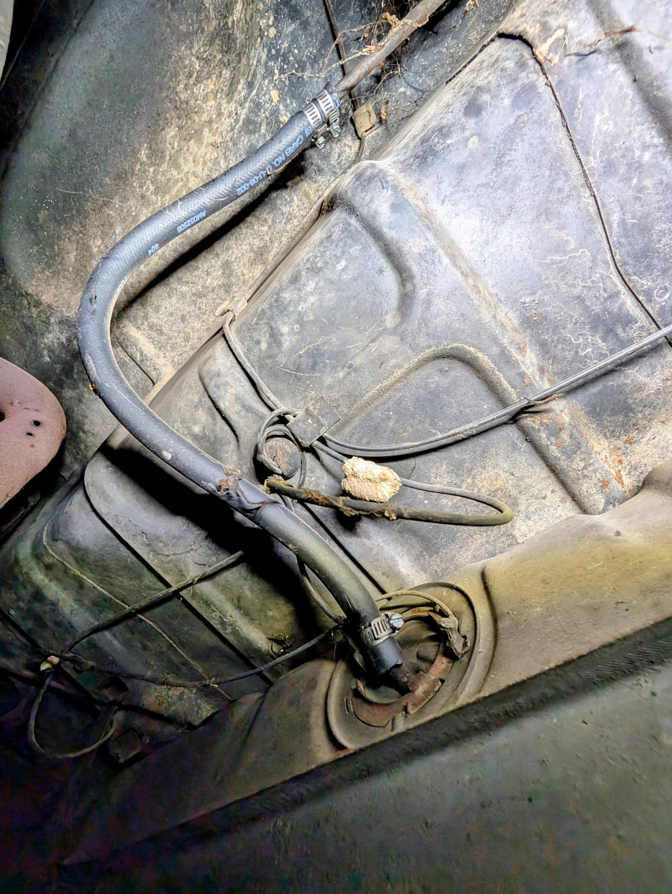
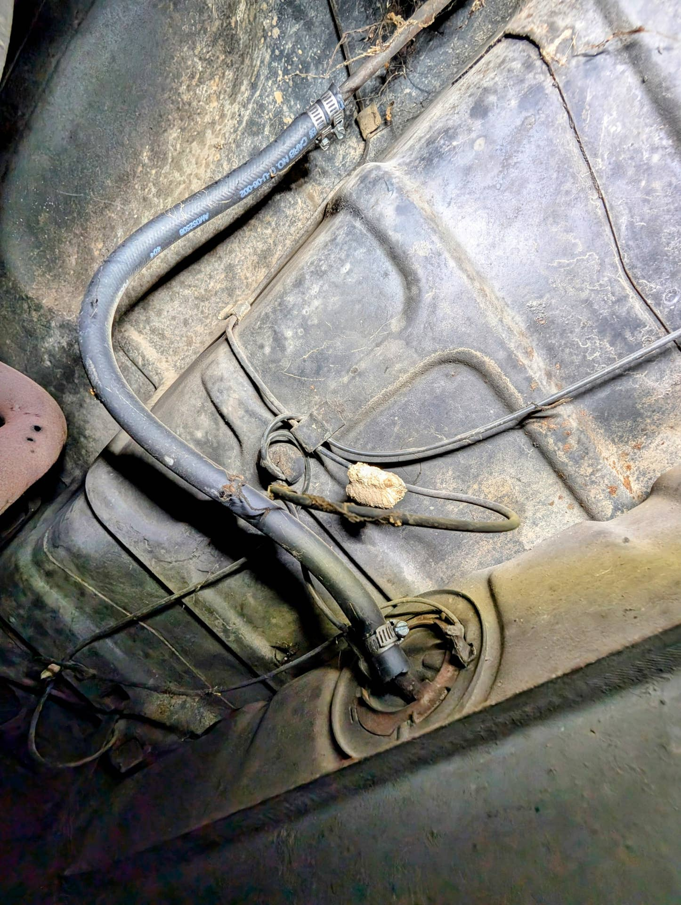

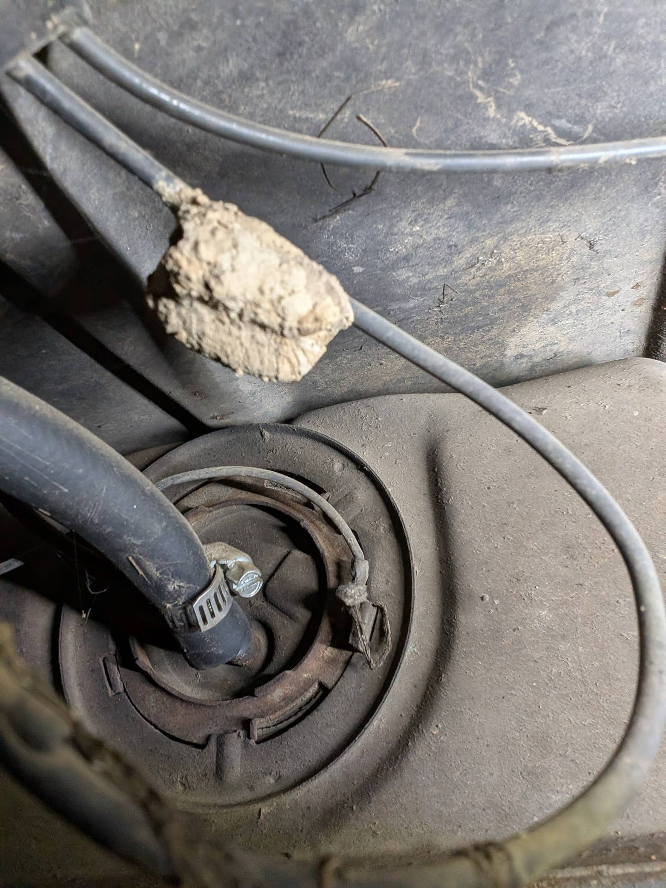
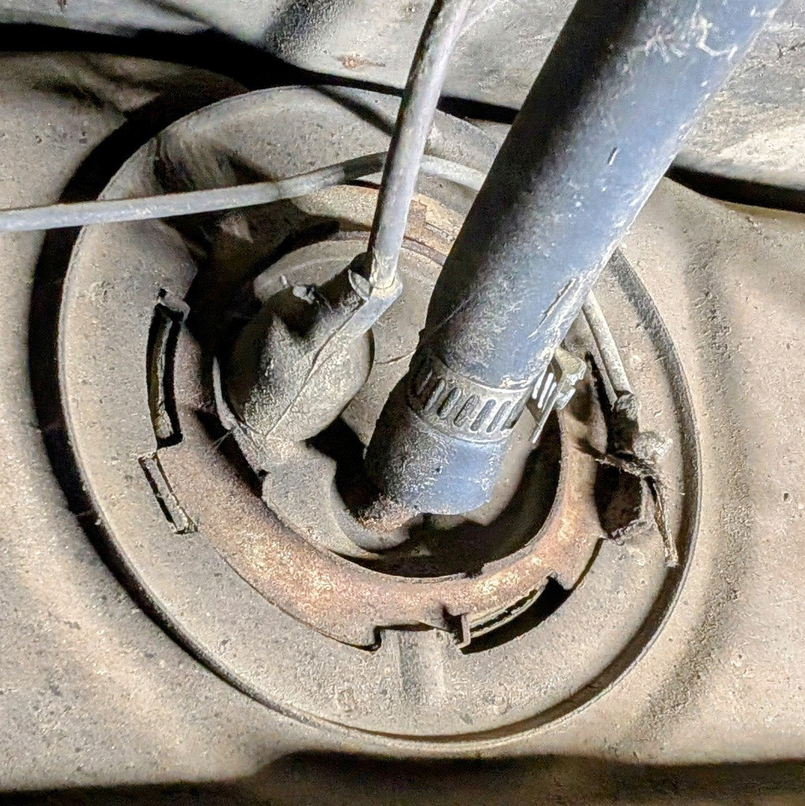

**@armyadarkness** (reply #39):
> kevnord said:
> View attachment 186619
    

Rear rubber line looks to be in good shape. Think I can remove the sender unit and sock without removing some gas? It's at least 3/4 full. Thought about jacking the front up a bit to tip the car /tank back. 

    View attachment 186618
    

    View attachment 186617
    

        
        Click to expand...
BTW, in case no one else mentioned it, you have a mud dauber nest on your fuel line. DOnt know your climate, but there are wasps in there... unless it's now cold where you live.

**@kevnord** (reply #40):
> armyadarkness said:
> BTW, in case no one else mentioned it, you have a mud dauber nest on your fuel line. DOnt know your climate, but there are wasps in there... unless it's now cold where you live.
        
        Click to expand...
hehe, yeah. There are some mud dauber nests around. The car sat in central california for decades. I brought it up to WA state a year ago. Found a golf-ball sized nest behind the radio, that was surprising. Haven't run into any residence yet, thankfully.

**@BearGFR** (reply #41):
I've scanned through the thread and I admit I probably didn't read every detail closely, so if I missed this - my bad.  But, have you checked your ignition timing?   It's very common to mis-diagnose an ignition timing problem as a fuel problem.

**@Baaad65** (reply #42):
Like lust4speed said, the sock and a filter after the pump that's what I'm running.  My sock was split and collapsed over the pickup.

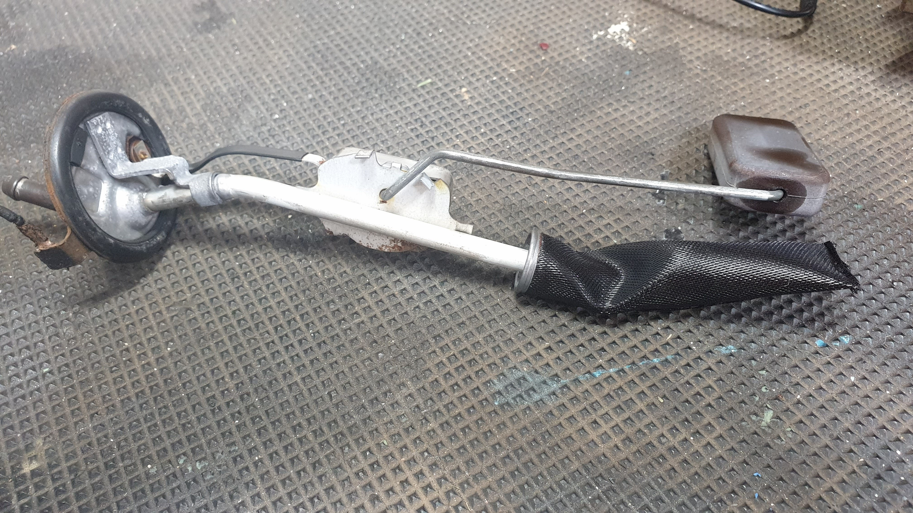
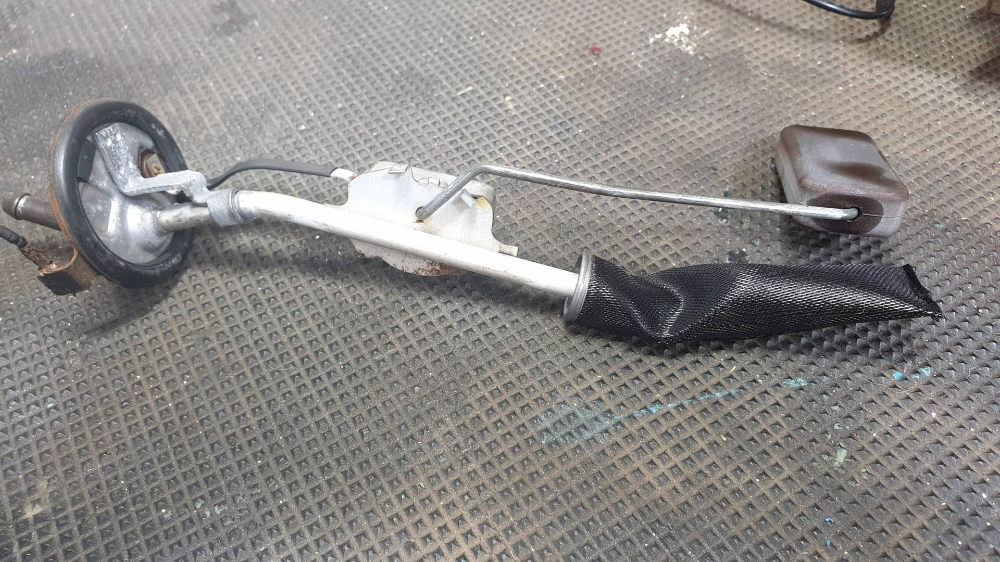
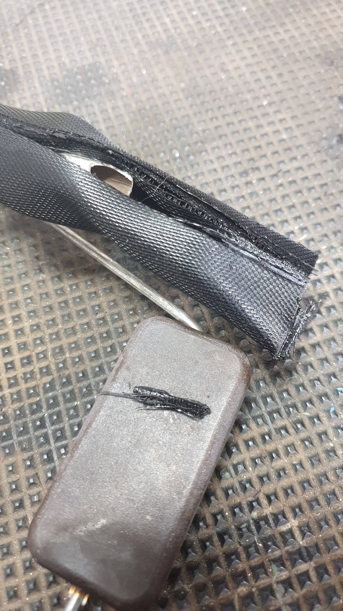
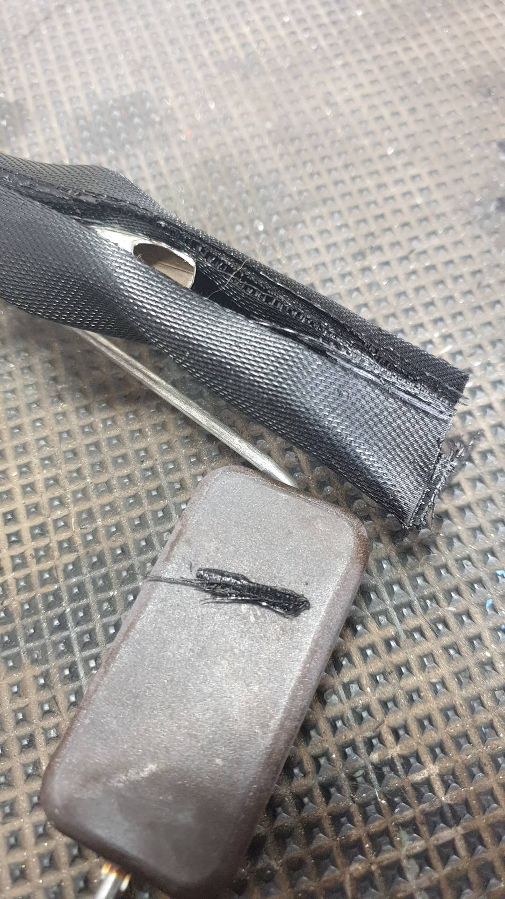

**@Baaad65** (reply #43):
The new one has a plastic "sock".

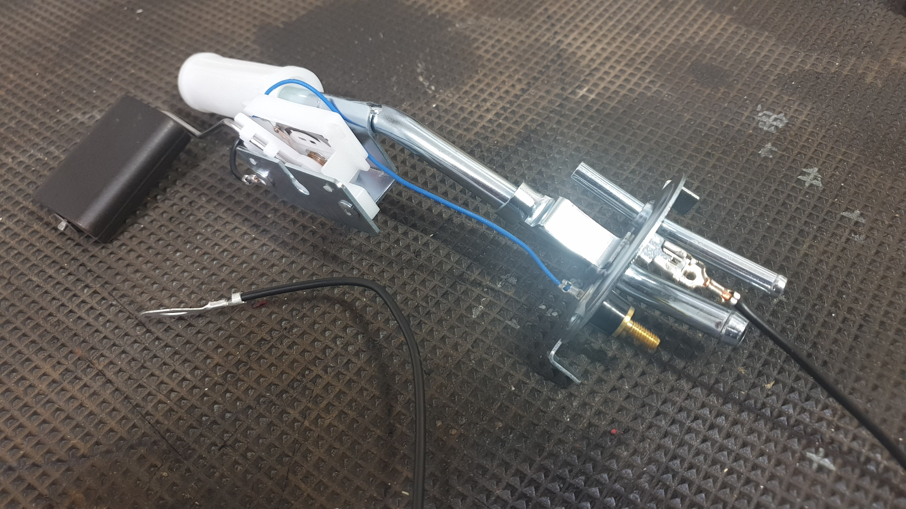

**@Baaad65** (reply #44):
Idk about removing that when it's 3/4 full, I drained mine down pretty far, then used a brass drift as to not make sparks when tapping the lock ring loose or you can buy the tool that's for removing the ring. And whenever working with fuel have a fire extinguisher close by. Maybe some PB Blaster on the ring for a day would help. What is that around the wire a mud packer nest?

**@kevnord** (reply #45):
Haha, yeah. The car sat (covered) in my folks backyard for 30 years. No rodents but a few Mud daubers nests around. Found a small one behind the radio inside which was surprising. No current residents.

**@ponchonlefty** (reply #46):
you can unhook the hose from the pump put it in a jug then take the fuel cap off.
get an air hose and rag,cover the fuel inlet with the rag, blow into the tank to pressurize it. that should get fuel moving into the jug. syphon it out until it wont run out anymore.

**@kevnord** (reply #47):
Any trick to putting in the new pump? I have the old one out, do I just make sure the lever hooks over the top? I saw some info on other car pumps that talked about having to push something up to the top while inserting the lever.

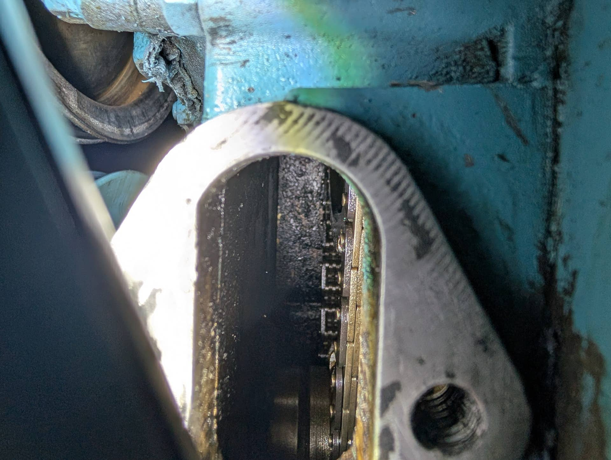

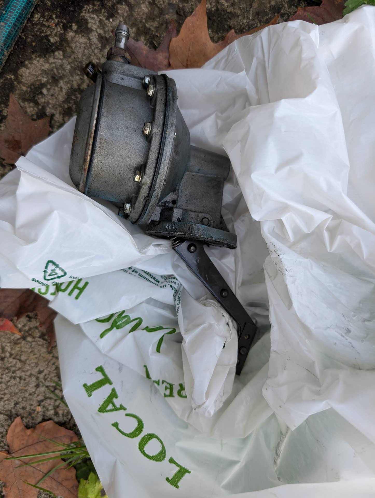

**@Baaad65** (reply #48):
Like ponch said and I believe lust4speed said it's with # 1 cylinder at TDC, then the pump still will be on a slight angle but you should be able to get the bolts started then draw it in or push on the pump so it's flat against the timing cover.

**@Ranchogto** (reply #49):
Just the opposite of what you said ! The top surface of the pump arm rests against the lobe on the cam shaft. As others have already mentioned rotating the engine over to top dead center of the no 1 piston make it easier to install. You will most likely tilt the pump arm downward at 20-30 degrees to then compress the pump arm before fastening into place. It does not go straight in . Others have broken/bent the pump arm by not following the recommendations.

cheers

**@ponchonlefty** (reply #50):
there is a cam that operates the lever of the pump. turn the engine by hand to get it pointed to the top. it makes installing the pump easier. i can feel where its pointing thru tho hole of the timing cover. you might use a mirror to see it.

**@geeteeohguy** (reply #51):
Lever does NOT 'hook over the top'. It presses against the eccentric from the bottom. For the sender ring, Douse it with WD 40 and blow off the dirt before you use a brass punch to walk off the ring.

**@Baaad65** (reply #52):
Good catch, I missed that in the post.

**@Baaad65** (reply #53):

**@armyadarkness** (reply #54):
I havent read every post. Isnt it backfiring? If so, why would it be a fuel issue?

Lack of fuel and vacuum leaks dont cause backfires.

**@ponchonlefty** (reply #55):
you can get a lean backfire yes? im asking not disagreeing.

**@geeteeohguy** (reply #56):
Yes. All you need is a weak accelerator pump. I've had old big block Mopars that loved to do it when cold, especially, if the pump shot was even a little weak. And countless customer cars. And this was when gas was still gas, not the swill we are trying to run today.

**@armyadarkness** (reply #57):
> ponchonlefty said:
> im asking not disagreeing
        
        Click to expand...
Apparently, you can! My GTO backfired like crazy, before the Remflex gaskets, but only on deceleration. Even when the old gaskets were completely missing, I had no backfire at idle or start.

And of course, Harleys are notorious for doing it on deceleration. Back in the old days, we would wind em up high, decelerate, turn of the ignition, and then when you turned it back on, it would darn near blow the muffler off. Sounded like a bazooka... and it was guaranteed to make the unsuspecting sucker next to you, shit his pants.

**@ponchonlefty** (reply #58):
> armyadarkness said:
> Apparently, you can! My GTO backfired like crazy, before the Remflex gaskets, but only on deceleration. Even when the old gaskets were completely missing, I had no backfire at idle or start.

And of course, Harleys are notorious for doing it on deceleration. Back in the old days, we would wind em up high, decelerate, turn of the ignition, and then when you turned it back on, it would darn near blow the muffler off. Sounded like a bazooka... and it was guaranteed to make the unsuspecting sucker next to you, shit his pants.
        
        Click to expand...
my uncle would do that when he saw a pedestrian on a bridge. different times.

**@armyadarkness** (reply #59):
> ponchonlefty said:
> my uncle would do that when he saw a pedestrian on a bridge. different times.
        
        Click to expand...
I did it when a cop had a car pulled over on the side of the road, and the guy went for his gun!

**@geeteeohguy** (reply #60):
Respectfully, that is incorrect.   I've seen lean pops through the carb start engine fires many times.

**@kevnord** (reply #61):
Got thew new pump in. Was pretty straightforward. Thanks for the tips! Will get everything back together tomorrow or the next and be able to try it out.

    
        
            
        
        
            
                
                
            
        
    
    

    
        
            
        
        
            
                
                
            
        
    
    

More detail: The backfires are not often and are relatively quiet. They were only happening when I kept on the accelerator when it was struggling.

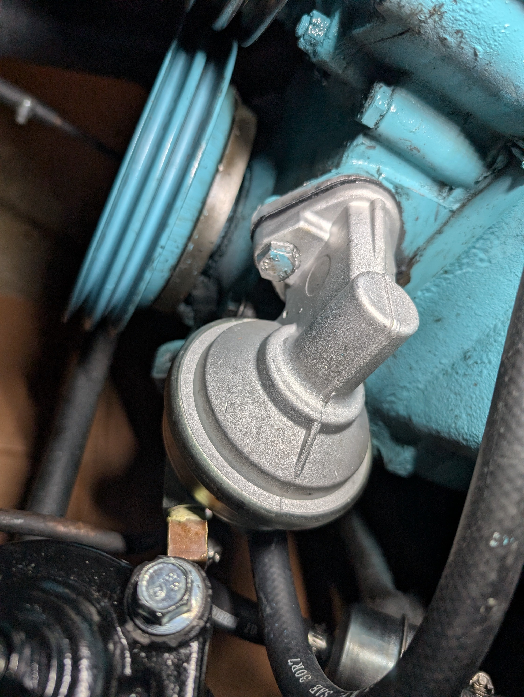

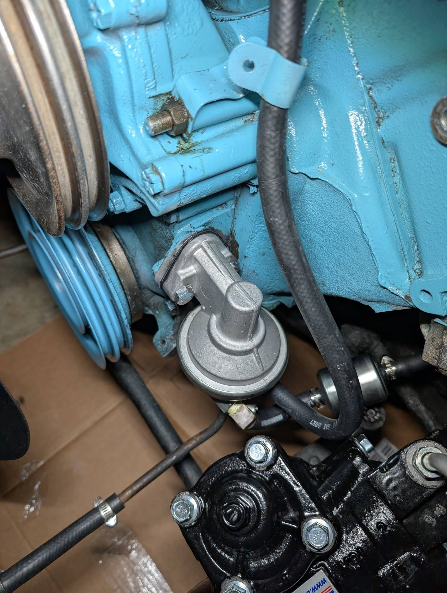

**@armyadarkness** (reply #62):
Good to know... Ive had lean pops my entire life, but only on deceleration. Never heard one at start or idle.

**@Baaad65** (reply #63):
IMO and like suggested I would move that filter onto the pressure side of the pump, or maybe eliminate it if you have one in the carb.

**@kevnord** (reply #64):
Is there any circumstance in which you'd place a filter pre pump?
I didn't put it there, not sure who did. I'm the second owner (after my grandma) and doubt she put one on. Must have been a mechanic along the way.

**@RMTZ67** (reply #65):
> kevnord said:
> Must have been a mechanic along the way.
        
        Click to expand...
Or not one.   If you feel the need remove your sender from the tank and see if your filter sock is any good. I believe you can do it w/o dropping the tank.
And maybe ohm it for accuracy while its down.

**@Baaad65** (reply #66):
I don't think so, like lust said it's hard enough for the pump to suck fuel 12-15' but now it's got to suck it through a filter also, the sock if in good shape is pretty fine maybe 50 microns? The pump is better at pushing fuel, I'm running a new 3/8" pickup with a plastic intake and a good flowing 50 micron filter right before the carb and I removed the filters in the Holley. You can use your filter but after the pump would be better but then you also have one in the carb so check that one and idk if you need two before the carb, sounds redundant to me.

**@Baaad65** (reply #67):
You never know, those grandma's knew a thing or two 😉

**@Baaad65** (reply #68):
....but that's not how the factory did it right? The filter was always up at the carb I thought, must have been a reason, like most people say those engineers were pretty smart.

**@geeteeohguy** (reply #69):
Correct. That is not how the factory did it. The factory was working with brand new, spotless tanks and lines and was assembling a car meant to be scrapped in 8 years. We are dealing with those cars 50+ years later with old tanks and lines and are trying to keep the junk out of the fuel pump. Again, a filter here won't hurt a thing. Keep it clear of the steering linkage and use a metal one, preferably. 
My '67 is the factory HD cooling and has the return filter. It is mounted off the T stat housing.

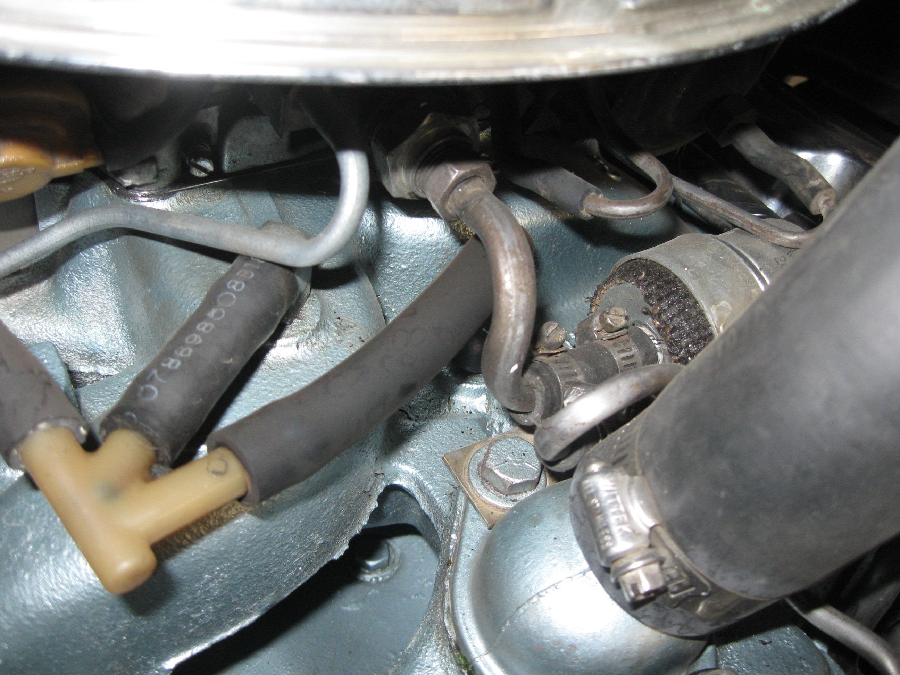
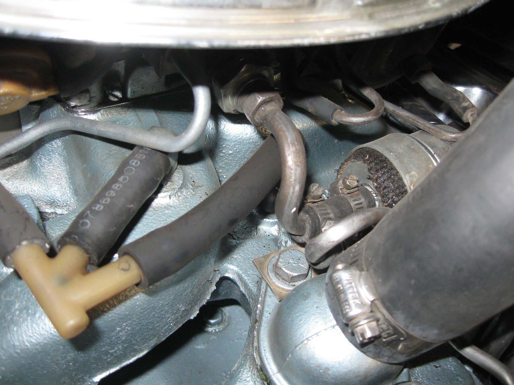

## Images

