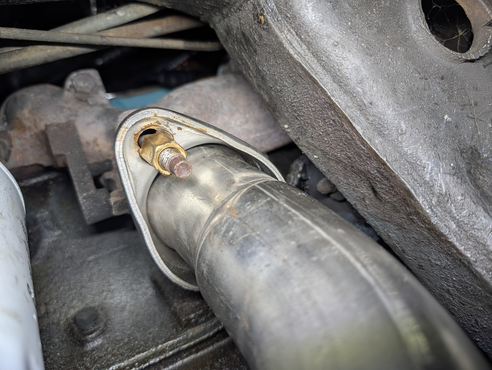
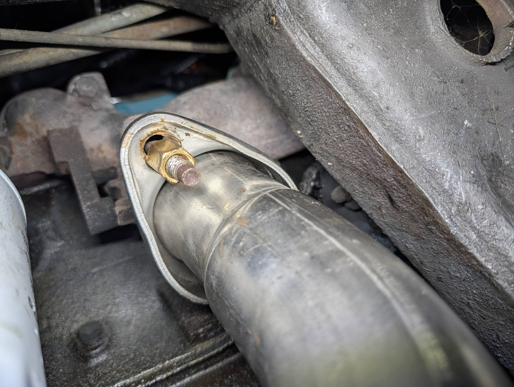

# Exhaust downpipe tall brass nut and washer?
**Forum:** GTO Forum | **Started:** January 11, 2026 | **Replies:** 7
**Thread URL:** https://www.gtoforum.com/threads/exhaust-downpipe-tall-brass-nut-and-washer.151173/post-1063520

## The Issue
Howdy. I switched to a tall brass nut on my exhaust manifold to downpipe studs (like all the cool kids say to do). The new flange hole is an oval and the nut doesn't have a lot of meat to grab onto. I'm wondering if I should use a thick grade 8 washer under the nut. Thoughts?

## Solution / Outcome
That's what I was thinking too. High heat and vibration does some fun things to bolts And nuts so I'm just being thoughtful

## Key Advice
- **@Baaad65**: I don't see why not, I had a flat and lock washers on mine.
- **@ponchonlefty**: i would it helps distribute the load and torque reading.
- **@GTOken68**: I also use the long brass nuts.  A flat and a lock should do the trick.  But Ive had the brass nuts be very hard to get back off sometimes.  I think they will still get corrosion.  So I would use some
- **@geeteeohguy**: I would use a flat washer and a split lock washer under the nut. In fact, I do on my cars.
- **@Milkyblue67**: I used MMC78 and the original correct hardware from Gardner exhaust. MMC78 is all I’ve used for years with high temp applications.

## Helpers
- **@Baaad65** — 1 post(s)
- **@ponchonlefty** — 2 post(s)
- **@GTOken68** — 1 post(s)
- **@geeteeohguy** — 1 post(s)
- **@Milkyblue67** — 1 post(s)

## Thread Summary

### Kevin's Original Post
Howdy.
I switched to a tall brass nut on my exhaust manifold to downpipe studs (like all the cool kids say to do). The new flange hole is an oval and the nut doesn't have a lot of meat to grab onto. I'm wondering if I should use a thick grade 8 washer under the nut. Thoughts?

### Replies

**@Baaad65** (reply #1):
I don't see why not, I had a flat and lock washers on mine.

**@ponchonlefty** (reply #2):
i would it helps distribute the load and torque reading.

**@kevnord** (reply #3):
That's what I was thinking too. High heat and vibration does some fun things to bolts And nuts so I'm just being thoughtful

**@ponchonlefty** (reply #4):
details. washers are cheap. not as cheap as they used to be but
candy bars cost more than a nickel too.

**@GTOken68** (reply #5):
I also use the long brass nuts.  A flat and a lock should do the trick.  But Ive had the brass nuts be very hard to get back off sometimes.  I think they will still get corrosion.  So I would use some anti-seize.  Additionally, I would re-check the tightness after a few heat cycles.

**@geeteeohguy** (reply #6):
I would use a flat washer and a split lock washer under the nut. In fact, I do on my cars.

**@Milkyblue67** (reply #7):
I used MMC78 and the original correct hardware from Gardner exhaust. MMC78 is all I’ve used for years with high temp applications.

## Images

