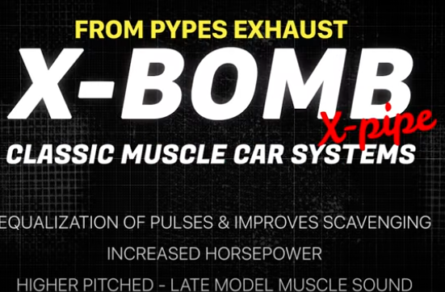
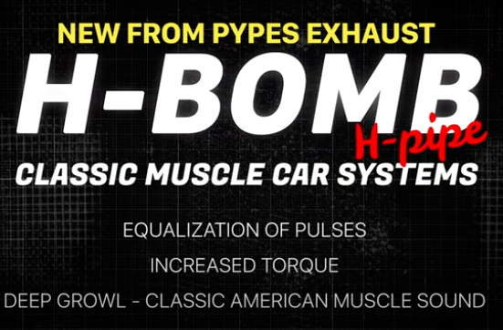
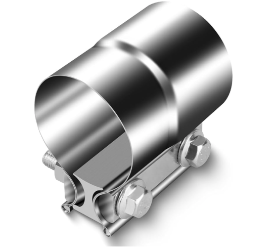
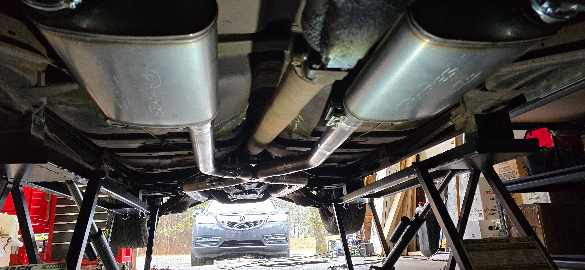

# Exhaust kit for a 326ci 2bbl engine - '64 Tempest
**Forum:** GTO Forum | **Started:** July 17, 2025 | **Replies:** 19
**Thread URL:** https://www.gtoforum.com/threads/exhaust-kit-for-a-326ci-2bbl-engine-64-tempest.149962/post-1049980

## The Issue
I have a very stock/original 326ci 2bbl setup and am not planning to upgrade anytime soon. It's not a 389, it's not a 400... it's a 326.   I need to replace the 35yo 2" dual exhaust setup I have and am looking for options. I had been looking at Pypes but believe I need a 2" or 2-1/4" max pipe, which they do not produce.  Been looking at Gardner and Waldron's kits. Waldron's seems like the best option so for. Car is a weekly cruiser and I want to hear it growl.  Questions:  any experiences with a...

## Solution / Outcome
Thanks for the tips! I'm not concerned about OEM other than making sure it fits nicely.

## Key Advice
- **@armyadarkness**: A 2.5 Pypes kit would be perfect for your car!!   Especially with these old cars that do a lot of sitting, the stainless kits are great, and the Pypes comes with the X-Pipe. It's also one of the cheap
- **@Scott06**: > kevnord said: > Thanks! I'm fine with the 326. It runs well and is fun to drive. I don't want to mess with that... toooooo much.   I've been eyeing the PYPES 2.5" H-Pipe kit with Street Pro mufflers
- **@lust4speed**: > kevnord said: > Here's what I heard from a rep at Pypes that I've been chatting with. He claims to know Pontiacs.  "What I know about our Pontiacs, is if you oversize the exhaust, you will loose pow
- **@Sick467**: From what little I have read, the Gardner and Waldron's kits are known for their Stock correctness and sound.  If OEM is important...go with one of these kits.  Otherwise, the Pype's kit you are consi
- **@fishwater**: I went with the 2.5” Pypes X pipe kit on my ‘72, it was an easy install in the garage on my back. I went with the X pipe only because I felt that it was probably easier to install which it was, I also

## Helpers
- **@armyadarkness** — 5 post(s)
- **@Scott06** — 3 post(s)
- **@lust4speed** — 1 post(s)
- **@Sick467** — 1 post(s)
- **@fishwater** — 1 post(s)

## Thread Summary

### Kevin's Original Post
I have a very stock/original 326ci 2bbl setup and am not planning to upgrade anytime soon. It's not a 389, it's not a 400... it's a 326. 

I need to replace the 35yo 2" dual exhaust setup I have and am looking for options. I had been looking at Pypes but believe I need a 2" or 2-1/4" max pipe, which they do not produce.

Been looking at Gardner and Waldron's kits. Waldron's seems like the best option so for. Car is a weekly cruiser and I want to hear it growl.

Questions:

any experiences with a similar setup and a 2.5" pipe?
2 or 2-1/4 recommendation? h-pipe?
any brands I should look at?

thanks!

### Replies

**@armyadarkness** (reply #1):
A 2.5 Pypes kit would be perfect for your car!! 

Especially with these old cars that do a lot of sitting, the stainless kits are great, and the Pypes comes with the X-Pipe. It's also one of the cheaper kits.

Everyone here loves the 326, and it's a capable engine. No need to skimp on the exhaust... you can pick whatever mufflers you like

**@kevnord** (reply #2):
> armyadarkness said:
> A 2.5 Pypes kit would be perfect for your car!!

Especially with these old cars that do a lot of sitting, the stainless kits are great, and the Pypes comes with the X-Pipe. It's also one of the cheaper kits.

Everyone here loves the 326, and it's a capable engine. No need to skimp on the exhaust... you can pick whatever mufflers you like
        
        Click to expand...
Thanks! I'm fine with the 326. It runs well and is fun to drive. I don't want to mess with that... toooooo much.  

I've been eyeing the PYPES 2.5" H-Pipe kit with Street Pro mufflers. Just want to make sure any potential loss of torque off the line/low RPM is not very noticeable. Options are SO limited if I want to get a 2 or 2.25" kit. Limited and $$$.

**@Scott06** (reply #3):
> kevnord said:
> Thanks! I'm fine with the 326. It runs well and is fun to drive. I don't want to mess with that... toooooo much. 

I've been eyeing the PYPES 2.5" H-Pipe kit with Street Pro mufflers. Just want to make sure any potential loss of torque off the line/low RPM is not very noticeable. Options are SO limited if I want to get a 2 or 2.25" kit. Limited and $$$.
        
        Click to expand...
I would bet you will make more power with this system and not loose anything. I just bought the same system and mufflers , although it is not on my car yet. I am on the fence about the mufflers as I have Dynomax Turbos on now that I love. Hesitant to take them off but at least I know the Street Pro Mufflers will fit. 

Not to complicate it more, but if you do plan down the road on upgrading the intake, carb , and cam you may want to get RA manifolds as the head pipes are different vs std logs.

**@armyadarkness** (reply #4):
> kevnord said:
> Thanks! I'm fine with the 326. It runs well and is fun to drive. I don't want to mess with that... toooooo much. 

I've been eyeing the PYPES 2.5" H-Pipe kit with Street Pro mufflers. Just want to make sure any potential loss of torque off the line/low RPM is not very noticeable. Options are SO limited if I want to get a 2 or 2.25" kit. Limited and $$$.
        
        Click to expand...
Personally, I wouldnt overthink it. Pypes isnt an all-knowing entity. Even though I insisted that a 3" kit was what I wanted, they told me that I'd lose all of my bottom end if I used one. After two weeks, I finally gave in and bought the 2.5" system. It was like putting a cork on my car.

So I opened up the side outlets, and it was like UNCORKING performance!

By design, Pontiac engines are torque engines, so you dont need as much back pressure as you would with most other configurations. This is why Ram Air cams, heads, and manifolds all complimented high rpm use. A Pontiac V8 doesnt need any help with low end torque.

**@kevnord** (reply #5):
> armyadarkness said:
> Personally, I wouldnt overthink it. Pypes isnt an all-knowing entity. Even though I insisted that a 3" kit was what I wanted, they told me that I'd lose all of my bottom end if I used one. After two weeks, I finally gave in and bought the 2.5" system. It was like putting a cork on my car.

So I opened up the side outlets, and it was like UNCORKING performance!

By design, Pontiac engines are torque engines, so you dont need as much back pressure as you would with most other configurations. This is why Ram Air cams, heads, and manifolds all complimented high rpm use. A Pontiac V8 doesnt need any help with low end torque.
        
        Click to expand...
Alrighty, I think I'm convinced to go with the 2.5" pypes.  It'll be one of my Fall/Winter projects... waiting for a good sale. If there's one thing I've learned working on an old car it's patience.  

Thanks guys.

**@kevnord** (reply #6):
Here's what I heard from a rep at Pypes that I've been chatting with. He claims to know Pontiacs. 

"What I know about our Pontiacs, is if you oversize the exhaust, you will loose power.  If you "slow down" the exhaust thru the piping, you will certainly help the engine produce power.  Now a 326 2bbl only produces 250 hp, so having a 2.5" will be OK for you as long as you have a chambered muffler, like the Street Pro or Turbo Pro.  We have people put 2.5" system on 1980's GM G-body cars and they perform well.  Those cars have 185 hp...  Some guys have 77-79 T/A's with 403 Olds having 185 hp with our systems and love it!"

**@lust4speed** (reply #7):
> kevnord said:
> Here's what I heard from a rep at Pypes that I've been chatting with. He claims to know Pontiacs. 
"What I know about our Pontiacs, is if you oversize the exhaust, you will loose power.  If you "slow down" the exhaust thru the piping, you will certainly help the engine produce power.
        
        Click to expand...
That rep must have been flipping burgers last week.  There is a reason that drag racers run open exhaust.  Think there was an Engine Masters episode on this very subject and they blew the tale out of the water.  Basically back pressure looses horsepower.  In formula form it is BP=BS.

A little different, but I built a low 8.6:1 compression regular gas 400 with a baby hydraulic roller cam, stock cast iron intake, Edelbrock 800 CFM AFB carb, Dougs Headers, and three inch exhaust.  Engine never saw anything but 87 octane California gas and it made 366 flywheel horsepower on two different dyno's.  There was a four horsepower increase when the cutouts were open -- so less backpressure from almost none to none still netted a slight increase in power.  An expert like above would claim that the intake and exhaust were all wrong and it would be a dog.

**@armyadarkness** (reply #8):
Those egg-heads at Pypes are the ones who insisted I go with the 2.5 instead of the 3"

**@kevnord** (reply #9):
> armyadarkness said:
> Those egg-heads at Pypes are the ones who insisted I go with the 2.5 instead of the 3"
        
        Click to expand...
What's your preference... H-Pipe, x-pipe, none?
I've been leaning towards h-pipe since my understanding is that it provides a little benefit and has the classic musclecar sound

**@Scott06** (reply #10):
> kevnord said:
> What's your preference... H-Pipe, x-pipe, none?
I've been leaning towards h-pipe since my understanding is that it provides a little benefit and has the classic musclecar sound
        
        Click to expand...
that was my understanding as well sound quality is different. I also ordered an H pipe, of course its still in the box in my garage

**@kevnord** (reply #11):
> Scott06 said:
> that was my understanding as well sound quality is different. I also ordered an H pipe, of course its still in the box in my garage
        
        Click to expand...
It must be pretty darn quite sitting in that box. 

It's the summer/show-season, not the time for big projects.

**@armyadarkness** (reply #12):
> kevnord said:
> What's your preference... H-Pipe, x-pipe, none?
I've been leaning towards h-pipe since my understanding is that it provides a little benefit and has the classic musclecar sound
        
        Click to expand...
I probably would prefer an H-Pipe just cause Im old-skool, but they're oddballs these days... And "they" say they're not as good at what they do as X-pipes are.

As far as what the differences are between an X and an H... Again... I wouldnt put much stock in the internet hype. Ive ran them both and compared them on the GTO, and without a slide-rule and an MIT degree, you're not gonna notice any difference.

**@Scott06** (reply #13):
> kevnord said:
> It must be pretty darn quite sitting in that box. 

It's the summer/show-season, not the time for big projects.
        
        Click to expand...
yeah I got the engine, exhaust, and cold case radiator (engine builder is a distributor for them) in end of May. So much chit professionally and personally going on the new engine wont go in until September or October...  Maybe later...While it was a great advantage keeping my old engine in the car and running for the year it took to get the engine built,  once I pull the engine I still need to clean and repaint the engine compartment, detail all the accessories off the engine- So I figured I'll leave it running this summer and do it after I put it too bed in the fall.

**@kevnord** (reply #14):
> armyadarkness said:
> I probably would prefer an H-Pipe just cause Im old-skool, but they're oddballs these days... And "they" say they're not as good at what they do as X-pipes are.

As far as what the differences are between an X and an H... Again... I wouldnt put much stock in the internet hype. Ive ran them both and compared them on the GTO, and without a slide-rule and an MIT degree, you're not gonna notice any difference.
        
        Click to expand...
Yeah, X-pipes seem to be the popular choice these days, but I think I'll get the H-Pipe

**@armyadarkness** (reply #15):
> kevnord said:
> Yeah, X-pipes seem to be the popular choice these days, but I think I'll get the H-Pipe

    View attachment 195627
    

    View attachment 195626
    

        
        Click to expand...
I guess they finally decided to capitalize on the hype!

**@kevnord** (reply #16):
Hah, I literally watched that episode of Engine Masters a couple hours ago. It was funny to hear them joke about the back pressure theory.

**@Sick467** (reply #17):
From what little I have read, the Gardner and Waldron's kits are known for their Stock correctness and sound.  If OEM is important...go with one of these kits.

Otherwise, the Pype's kit you are considering is one of the best.  I, personally, would skip the H or X pipe.  I like the "stereo" sound you get from pure dual exhaust and the benefit of a cross pipe is going to be impossible to tell by the seat of your pants with the stockish 326 you have.  It will mellow the side-to-side "stereo" sound.  That, and it will likely get in the way of doing any future transmission work.  

The cheapest for what you get is to take it to an exhaust shop that bends the pipes right there and fit's it to your car.  Your average shop won't be installing stainless, and you have to make sure they don't just get up-in-there and weld to your car unnecessarily, leave the old brackets in place, or use cheap materials.

Your best bet is the Pypes system.  I have the 2-1/2 system...Do know that the pipe clamps they supply are to be thrown away.  They are exactly 2-1/2" full open diameter (made for 2-1/2" pipe), maybe a bit more, but the flared pipes that they are to be used on are "flared" well past the largest adjustment of the clamps.

Figure an ample count of these...

    
        
            
        
        
            
                
                
            
        
    
    

Summit # SUM-681250 (for the 2-1/2" pipeclamps.

**@kevnord** (reply #18):
Thanks for the tips! I'm not concerned about OEM other than making sure it fits nicely.

**@fishwater** (reply #19):
I went with the 2.5” Pypes X pipe kit on my ‘72, it was an easy install in the garage on my back. I went with the X pipe only because I felt that it was probably easier to install which it was, I also used band clamps for every connection. The Pypes kits are pretty complete as far as clamps and hangers but using band clamps makes it easier to remove or adjust something later.

## Images

