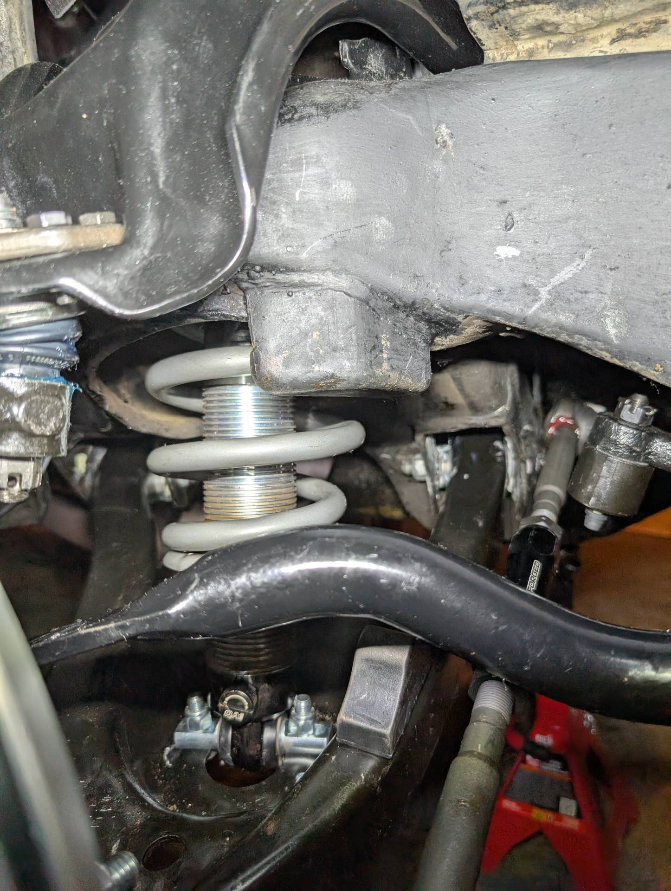
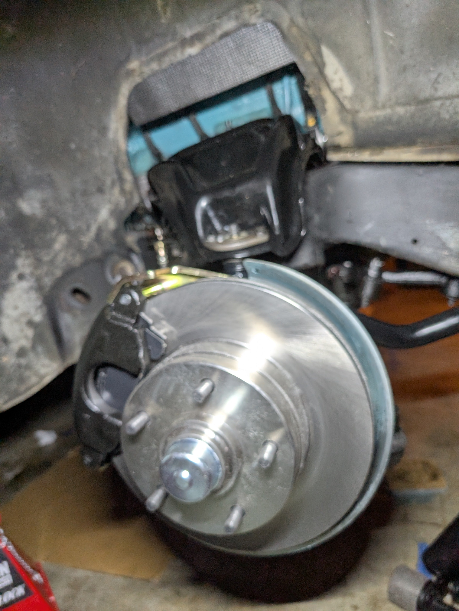
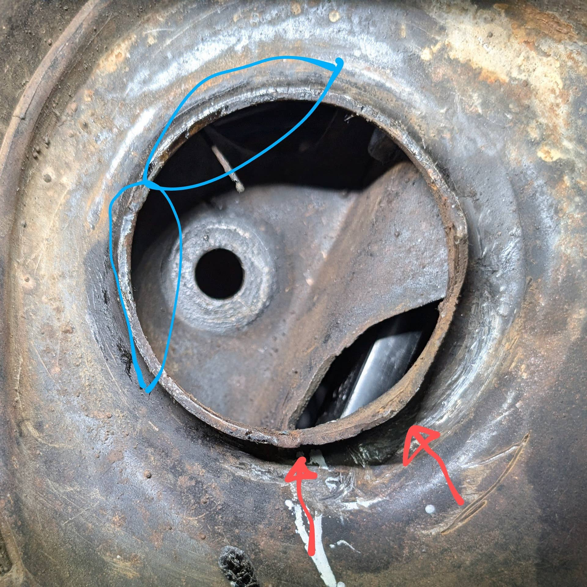

# Front Suspension Ride Height Issue – Passenger Side Sits 1” Higher
**Forum:** GTO Forum | **Started:** April 3, 2025 | **Replies:** 9
**Thread URL:** https://www.gtoforum.com/threads/front-suspension-ride-height-issue-%E2%80%93-passenger-side-sits-1%E2%80%9D-higher.149272/post-1040946

## The Issue
Hey guys,  I’m having an issue with my 1964 Pontiac Tempest Custom after a front suspension overhaul. The passenger side front sits about 1” higher than the driver side, and camber on that side is around +3°. Here's what I've done and tried so far  What I’ve Replaced:  Springs and shocks replaced with QA1 coilovers Upper control arms: OPGI CH26896LH/RH (OEM-style) Lower control arms: NPD C-6168-111B/112B (OEM-style) I had originally ordered OPGI Lowers but they were on backorder for months. New...

## Solution / Outcome
Thanks so much! I'm still trying to figure out the best approach to getting the 3° positive camber down without using a boatload of shims, but I'll figure it out.

## Key Advice
- **@ponchonlefty**: if all else fails split the adjustment,raise a little on one side and lower the other. weight distribution could be the factor. or like you say it could be binding somewhere.
- **@Lok**: Drive it a week or so and recheck , may settle, and you may hear whats hanging up while driving if it is indeed hanging up.  Lok
- **@Sick467**: I have scrutinized my 67's ride height and have found that when everything is perfect...they may not sit perfect.   My rear is like that.  My rear diff has adjustable spring perches and that allowed m
- **@1fozziebear**: Be careful expecting a "pro" alignment on older cars.  It's often set the toe and off you go.  Nobody wants to mess with shims etc these days, at least at a big name place.

## Helpers
- **@ponchonlefty** — 1 post(s)
- **@Lok** — 1 post(s)
- **@Sick467** — 2 post(s)
- **@1fozziebear** — 1 post(s)

## Thread Summary

### Kevin's Original Post
Hey guys,

I’m having an issue with my 1964 Pontiac Tempest Custom after a front suspension overhaul. The passenger side front sits about 1” higher than the driver side, and camber on that side is around +3°. Here's what I've done and tried so far

What I’ve Replaced:

Springs and shocks replaced with QA1 coilovers
Upper control arms: OPGI CH26896LH/RH (OEM-style)
Lower control arms: NPD C-6168-111B/112B (OEM-style) I had originally ordered OPGI Lowers but they were on backorder for months.
New bushings, ball joints, and front sway bar
Rear springs and shocks also replaced

What I’ve Checked/Tried:

1. Loosened upper and lower control arm bolts on the passenger side with the suspension loaded, bounced the car, and re-torqued – no change in height.

2. Sway bar: Passenger side link was disconnected and bounced — no effect. Ride height was already uneven before the sway bar was installed.

3. Spring seating: The coil spring appears to be seated correctly, but I noticed the upper spring pocket has a lip/tab, and the second coil may be hanging up on it, possibly preventing full seating.

4. Coilover collars appear to be set evenly.

5. No obvious damage or misinstallation of the control arms, but uppers and lowers are from different brands (both OEM-style).

6. Rear ride height is even.

---

Looking for any input on what else to check — whether this sounds like a spring seating issue, control arm geometry mismatch, or something else. Appreciate any tips from others who've run into similar front end ride height problems.

### Replies

**@ponchonlefty** (reply #1):
if all else fails split the adjustment,raise a little on one side and lower the other.
weight distribution could be the factor. or like you say it could be binding somewhere.

**@Lok** (reply #2):
Drive it a week or so and recheck , may settle, and you may hear whats hanging up while driving if it is indeed hanging up. 
Lok

**@Sick467** (reply #3):
I have scrutinized my 67's ride height and have found that when everything is perfect...they may not sit perfect.   My rear is like that.  My rear diff has adjustable spring perches and that allowed me to adjust out the near 1" mismatch in sided to side height.  Between frame specs, weight distribution, body mount squish, body tolerances, & suspension bushing give...most cars will end up a bit wonky with respect to ride height.  It does not take much in-tolerance stack up to cause what you are seeing not to mention some tolerances may no longer be in spec.   Adjust it out if you can, otherwise don't measure it anymore (or look at it...LOL).  An inch out is hard to notice unless it's pointed out.

Verify spring seats for sure and some road time may settle it a bit, as mentioned.

**@kevnord** (reply #4):
I am able to adjust the front coilover and make it even-ish on all four corners. I was content with going with that until I tried to do a DIY alignment (to get me to a pro alignment place) and noticed the camber way off and it would take a bunch of shims to fix. 

I wish I would have done more measurements before replacing so much to see what it was before my changes. Quite possible alignment was way off befoe

**@1fozziebear** (reply #5):
Be careful expecting a "pro" alignment on older cars.  It's often set the toe and off you go.  Nobody wants to mess with shims etc these days, at least at a big name place.

**@kevnord** (reply #6):
Exhausted all ideas so I finally popped the upper ball joint and disconnected the passenger side control arms and coilover. It's not the first time I've tried to reseat the coilover but I'm going to be more methodical this time.

Here's a pic. The area pointed to in red has always looked like it was catching on the second loop of the spring. I was able to bend it in and file it down a bit. The areas circled in blue show wear so I suspect the spring was riding up on it. I had to constantly move the spring back into position as I reconnected the control arms. Tomorrow, I'll find out if all this work paid of.... To be continued

**@kevnord** (reply #7):
SUCCESS!!! Carefully put the passenger side back together, making sure the coilover stayed seated in the top properly, and when all was said and done the height is roughly even let and right!

Besides making sure it stayed in place I did bend the tabs inward so that it wouldn't catch on the coil in a couple spots.

So happy it's even now. Gotta get the sway bar back on and do an alignment and I'll be done with my winter work. Thanks everyone!

**@Sick467** (reply #8):
Glad you got it figured out.  It's amazing how a few snowflakes of steel slivers can do to the install!  Congrats on being meticulous about your car!

**@kevnord** (reply #9):
Thanks so much! I'm still trying to figure out the best approach to getting the 3° positive camber down without using a boatload of shims, but I'll figure it out.

## Images

