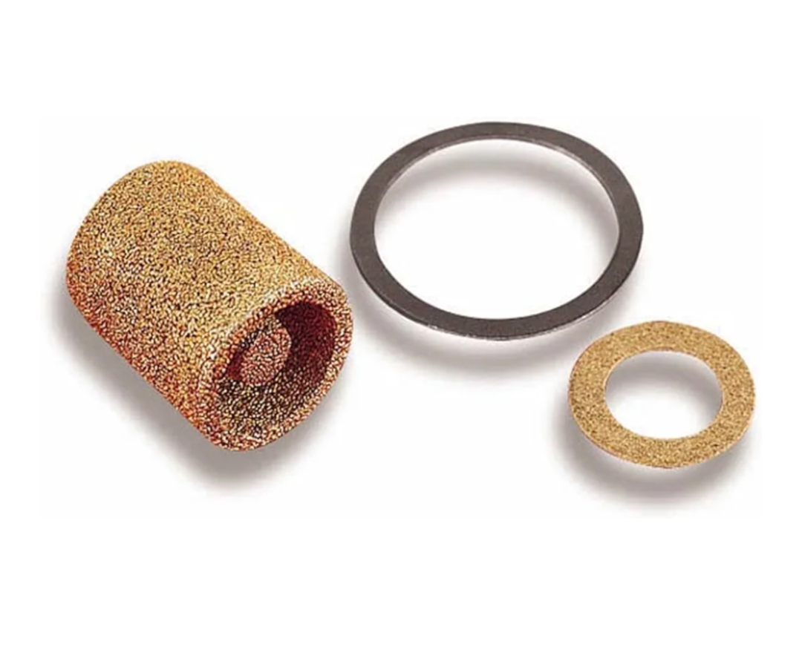
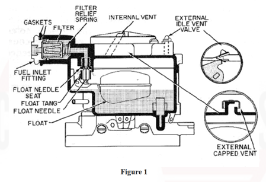
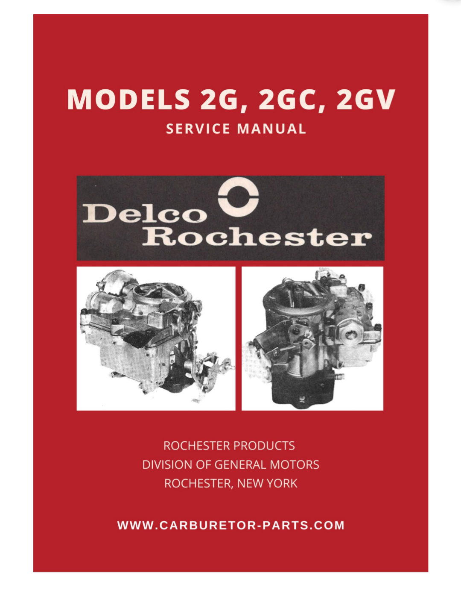

# Fuel filter direction
**Forum:** GTO Forum | **Started:** September 13, 2025 | **Replies:** 4
**Thread URL:** https://www.gtoforum.com/threads/fuel-filter-direction.150458/post-1055388

## The Issue
I'm finding conflicting info so I thought I'd ask here. This is for a Rochester 2GC. Which direction should this filter point when installed? Should the end show be towards the carb and or fuel line?

## Solution / Outcome
Oh! That IS helpful. I can clearly see the direction in the pic. Thank you so much! I found the service manual you mentioned last night though I completely missed the diagram you posted. Thanks for the help!

## Key Advice
- **@TXStarfire**: I would say toward fuel line.  More surface area for dirt to accumulate before the filter becomes plugged.
- **@rockdoc**: This doesn't address your question, but you might find this figure useful.                                                                                                                              

## Helpers
- **@TXStarfire** — 1 post(s)
- **@rockdoc** — 1 post(s)

## Thread Summary

### Kevin's Original Post
I'm finding conflicting info so I thought I'd ask here. This is for a Rochester 2GC. Which direction should this filter point when installed? Should the end show be towards the carb and or fuel line?

### Replies

**@TXStarfire** (reply #1):
I would say toward fuel line.  More surface area for dirt to accumulate before the filter becomes plugged.

**@kevnord** (reply #2):
Good point. I think it almost has to be that way with the spring on the carb side. It fits better against the flatter side.

**@rockdoc** (reply #3):
This doesn't address your question, but you might find this figure useful.

    
        
            
        
        
            
                
                
            
        
    
    

And here's a quote from the Rochester 2GC service manual: "Install fuel strainer, inlet fitting, and gaskets. Tighten securely. If an integral fuel filter is used. Install pressure relief spring, filter element with the large open end toward inlet nut, filter gasket inside inlet nut: then install inlet nut and gasket. Tighten securely."

I have the full service manual, but it's 92 pages. I can send it to you privately, but I think it's too large to attach here.

**@kevnord** (reply #4):
Oh! That IS helpful. I can clearly see the direction in the pic. Thank you so much!
I found the service manual you mentioned last night though I completely missed the diagram you posted. Thanks for the help!

## Images

