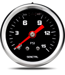
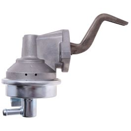
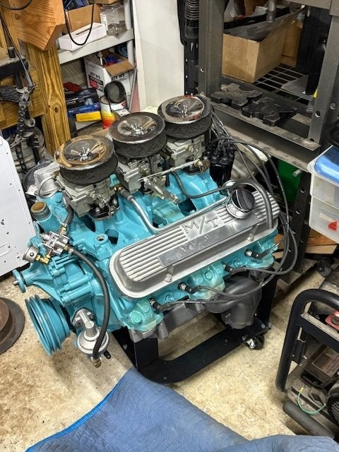
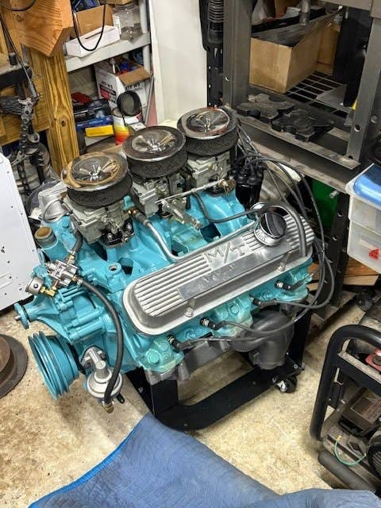
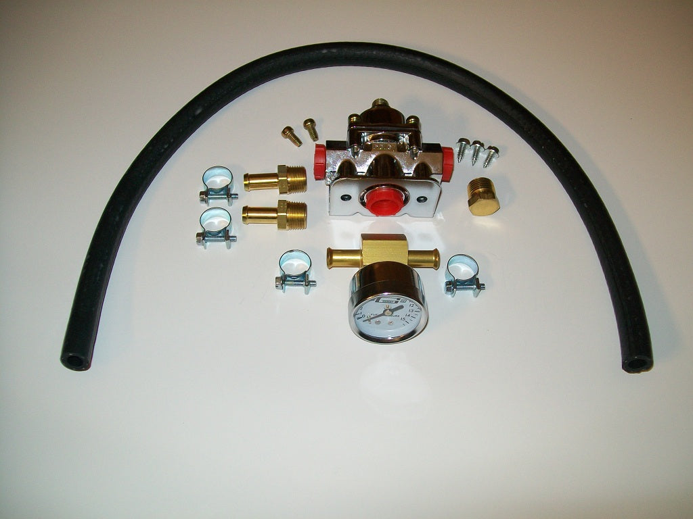

# Fuel Pressure Gauge / Pump
**Forum:** GTO Forum | **Started:** October 21, 2025 | **Replies:** 35
**Thread URL:** https://www.gtoforum.com/threads/fuel-pressure-gauge-pump.150333/post-1053810

## The Issue
I installed a new fuel pump a few weeks back and took the opportunity to put in a gauge. I went with a Carter Mechanical Fuel Pump. Fast forward to now. The car is running well, but I see the psi hovering around 12. My understanding is that it should be well below that (5ish?).  Should I a) not worry about it. b) get a regulator c) get a better pump?  At 12, what issues could it be causing?

## Solution / Outcome
Finally got it all sorted out. Ended up putting a Mr. Gasket regulator on it and setting it to 5psi. I initially bought the Holley one, but it was difficult to secure.  As with most things, I made things worse before making it better.   After adding the pressure regulator I adjusted the float to spec and shortly thereafter acceleration was non-existent. Any level of acceleration caused it to fall flat on it's face. I undid most of my changes but was confident the float level changes weren't the...

## Key Advice
- **@armyadarkness**: What carb?   The fuel supply to the carb is shutoff by the float, when it reaches it's full level.  If the PSI is too high, it will force fuel past the seat and continue to fill the carb bowl, above a
- **@GrandTO**: As I recall, 5 psi on a 2GC is Rochesters standard.  Do you have a dry or glycerin filled gage? The glycerin filled tend to be more accurate and do not bounce. However, they do become inaccurate when 
- **@Sick467**: It's going to bounce whether it is filled or not.  The mechanical pumps cycle with every engine revolution which causes the bounce.  Fluid filled units bounce considerably less, however, at the tradeo
- **@GtoFM**: Another factor is the range of the gauge. Accuracy is best at mid range. 0-15 psig would be good with 0-10 psig ideal as 2GC likes 4-6#, IIRC. What is the range of your gauge?
- **@lust4speed**: My opinion is the small gauges are all made by the same Chinese company and different vendors just have their personal faceplates put on. The more well known companies get to charge more for the same 
- **@OCMDGTO**: Kev, get a regulator!! I like the bypass type(return line) and lose the liquid filled guage. I temporarily used a cheap Holley guage I could see while driving.
- **@rockdoc**: Kevnord, what are the specs on your Carter fuel pump? I had considered the Carter, but this makes me question that. I too have a "mighty stock Rochester 2GC", on a GTO no less! I imagine that Mick is 
- **@Scott06**: Get a regulator. This is unfortunately what happens these days... I had the same issue with the new pump from Ames I just got.   I am running a tripower so 2 jet as well. becareful what gauge you get 
- **@Jim K**: Wow, that gauge in your video acts like a regular gauge (not oil filled). I used my oil filled gauge to set the pressure on the regulator and then removed it (bourdon tube failure on a pressure gauge 
- **@NYGTO2018**: I've been following this very knowledgeable carb guy on YouTube as I'm always looking for the best possible tune. He just so happens to be covering your topic a lot and has great info on regulators. C
- **@ponchonlefty**: > kevnord said: > Finally got it all sorted out. Ended up putting a Mr. Gasket regulator on it and setting it to 5psi. I initially bought the Holley one, but it was difficult to secure.  As with most 

## Helpers
- **@armyadarkness** — 3 post(s)
- **@GrandTO** — 1 post(s)
- **@Sick467** — 1 post(s)
- **@GtoFM** — 1 post(s)
- **@lust4speed** — 2 post(s)
- **@OCMDGTO** — 2 post(s)
- **@rockdoc** — 1 post(s)
- **@Scott06** — 7 post(s)
- **@Jim K** — 2 post(s)
- **@NYGTO2018** — 1 post(s)
- **@ponchonlefty** — 1 post(s)

## Thread Summary

### Kevin's Original Post
I installed a new fuel pump a few weeks back and took the opportunity to put in a gauge. I went with a Carter Mechanical Fuel Pump. Fast forward to now. The car is running well, but I see the psi hovering around 12. My understanding is that it should be well below that (5ish?).

Should I a) not worry about it. b) get a regulator c) get a better pump?

At 12, what issues could it be causing?

### Replies

**@armyadarkness** (reply #1):
What carb? 

The fuel supply to the carb is shutoff by the float, when it reaches it's full level.

If the PSI is too high, it will force fuel past the seat and continue to fill the carb bowl, above and beyond "FULL". If this happens, the fuel will either come out a vent or run into the intake, causing either a fire hazard or rich fuel condition.

**@kevnord** (reply #2):
> armyadarkness said:
> What carb?

The fuel supply to the carb is shutoff by the float, when it reaches it's full level.

If the PSI is too high, it will force fuel past the seat and continue to fill the carb bowl, above and beyond "FULL". If this happens, the fuel will either come out a vent or run into the intake, causing either a fire hazard or rich fuel condition.
        
        Click to expand...
A mighty stock Rochester 2GC (2bbl)

**@armyadarkness** (reply #3):
Having a stock Rochy two on your car is something to be proud of! Ive had many, but dont know about its requirements.

**@armyadarkness** (reply #4):
Some carbs are more susceptible to problems than others. Edelbrock, for instance, mandates no more than 6 psi.

Also, you dont mention your brand of gauge, but this is all assuming that it's accurate.

**@kevnord** (reply #5):
The brand... errr... SENCTRL. :-/ 
Maybe all those good reviews were fake?!

I tried burping the gauge ... Didn't help. I did replace it at one point with the same gauge since I thought the first was faulty. 

Look at this madness... Video of the bounce. This was at idle after warming up. 

    
        
            https://photos.app.goo.gl/2PWEF5fq9z6ZPzK48

**@GrandTO** (reply #6):
As I recall, 5 psi on a 2GC is Rochesters standard. 
Do you have a dry or glycerin filled gage?
The glycerin filled tend to be more accurate and do not bounce. However, they do become inaccurate when the fluid heats up.
But they typically read lower not higher due to internal pressure. 
It's difficult to put a lot of faith in anything but a certified guage. 
Per Army's comments, you would probably know something is wrong if it truly was at 12 psi.

**@kevnord** (reply #7):
> GrandTO said:
> As I recall, 5 psi on a 2GC is Rochesters standard.
Do you have a dry or glycerin filled gage?
The glycerin filled tend to be more accurate and do not bounce. However, they do become inaccurate when the fluid heats up.
But they typically read lower not higher due to internal pressure.
It's difficult to put a lot of faith in anything but a certified guage.
Per Army's comments, you would probably know something is wrong if it truly was at 12 psi.
        
        Click to expand...
It's glycerin filled. It seems to bounce quite a bit. 
Thanks for the thoughts... and Army as well

**@Sick467** (reply #8):
It's going to bounce whether it is filled or not.  The mechanical pumps cycle with every engine revolution which causes the bounce.  Fluid filled units bounce considerably less, however, at the tradeoff of accuracy when heated up (according to the ones in the know).

12psi seems high for a stock Rochester, but I do know the 2B's at all.  10 actually seems to be the limit for a QJ 4B that is built to take it.  Once again, according to those you speak QJ carbs.

The proof is in the pudding.  If your car is running like a top...it's good to go.  Your gage may be reading high and/or your carb may be happy with whatever psi it's getting.  Your common fuel gages are good for one thing and that is telling you that something has changed.  However, that change could be a gage going bad...there's no silver bullet here.  Proof is in the pudding.

A/F gages are known to be a good tool to check how happy the system is, but can be a bit expensive for the "know" factor when the engine is telling you it's happy on its own.

All that said, definitely learn how to check your carb for overflowing out of the vent...that's bad even if the engine runs fine.

**@GtoFM** (reply #9):
Another factor is the range of the gauge. Accuracy is best at mid range. 0-15 psig would be good with 0-10 psig ideal as 2GC likes 4-6#, IIRC. What is the range of your gauge?

**@kevnord** (reply #10):
This is the gauge I have. I replaced it with the same unit thinking the first one was bad. Likely a piece of crap. Recommendations for a better one?

**@lust4speed** (reply #11):
My opinion is the small gauges are all made by the same Chinese company and different vendors just have their personal faceplates put on. The more well known companies get to charge more for the same basic gauge.  Only thing I depend on the small gauge for is showing a change.  If it always reads say 7 PSI and one day it is reading 2 PSI then I know I have a problem.

12 PSI reading sounds too far off to be solely a gauge problem, but a 2-barrel float assembly usually starts to bleed off after about 6 PSI.  To much pressure is more discernable at idle and a glance down the throat of the carb might show fuel dribbling off the venturi's.

**@OCMDGTO** (reply #12):
Kev, get a regulator!! I like the bypass type(return line) and lose the liquid filled guage. I temporarily used a cheap Holley guage I could see while driving.

**@rockdoc** (reply #13):
Kevnord, what are the specs on your Carter fuel pump? I had considered the Carter, but this makes me question that. I too have a "mighty stock Rochester 2GC", on a GTO no less! I imagine that Mick is right (he usually is), 12 psi is too far off to be solely a gauge problem.

**@kevnord** (reply #14):
Mighty 2GCs unite!!! 
The Carter is 5.5 to 7 according to their site. Here's the one I bought...

    

    
        
            
                
                    
                        
                        
                
            
            
                
                    
                        Mechanical Fuel Pump
                    
                

                

                
                    
                        
                            
                        
                    
                    carterengineered.com

**@Scott06** (reply #15):
Get a regulator. This is unfortunately what happens these days... I had the same issue with the new pump from Ames I just got. 

I am running a tripower so 2 jet as well. becareful what gauge you get . I got a cheap liquid filled one from Summit as it heats up the indicated pressure drops... so it through me for a loop as pressure dropped. Learned to set it when I first start up then ignore it... prob need a diff gauge but it works

**@kevnord** (reply #16):
Where did you mount your regulator? What did you buy? Did it help?

**@Scott06** (reply #17):
I got a holley 0-4 psi regulator and summit cheap o gauge . I mounted it in the fuel hose between the pump and the manifold just zip tied it to the alternator bracket.
yes it did help. this is on a tripower and intermittently  I was having fuel bowls over flow

**@kevnord** (reply #18):
> Scott06 said:
> I got a holley 0-4 psi regulator and summit cheap o gauge . I mounted it in the fuel hose between the pump and the manifold just zip tied it to the alternator bracket.
yes it did help. this is on a tripower and intermittently  I was having fuel bowls over flow
        
        Click to expand...
Hey, can you snap and post a pic of how you have it mounted? I'm interested in adding one but there's limited space to put it so I'm looking for ideas.

**@Scott06** (reply #19):
> kevnord said:
> Hey, can you snap and post a pic of how you have it mounted? I'm interested in adding one but there's limited space to put it so I'm looking for ideas. 
        
        Click to expand...
This may not help you much as you have a different set up. I  moved the tripower over to my soon (ish) to be installed engine. The regulator is laying on top of timing housing. When I had it on the engine that is still in my car I just zip tied it to the alternator bracket that goes from timing cover/water neck to alternator. If you have PS this puts the alternator up higher and kid of hides the regulator.

I did have to shorten the metal fuel line a bit to make room for it. The holley regulator I used can be piped in a 90 degree in/out or straight through

**@kevnord** (reply #20):
> Scott06 said:
> This may not help you much as you have a different set up. I  moved the tripower over to my soon (ish) to be installed engine. The regulator is laying on top of timing housing. When I had it on the engine that is still in my car I just zip tied it to the alternator bracket that goes from timing cover/water neck to alternator. If you have PS this puts the alternator up higher and kid of hides the regulator.

I did have to shorten the metal fuel line a bit to make room for it. The holley regulator I used can be piped in a 90 degree in/out or straight through 

    View attachment 198553
    

        
        Click to expand...
Thanks for the pic! Very helpful.
Do you know what fuel pump you're running?

**@kevnord** (reply #21):
> Scott06 said:
> This may not help you much as you have a different set up. I  moved the tripower over to my soon (ish) to be installed engine. The regulator is laying on top of timing housing. When I had it on the engine that is still in my car I just zip tied it to the alternator bracket that goes from timing cover/water neck to alternator. If you have PS this puts the alternator up higher and kid of hides the regulator.

I did have to shorten the metal fuel line a bit to make room for it. The holley regulator I used can be piped in a 90 degree in/out or straight through 

    View attachment 198553
    

        
        Click to expand...
Found this page that shows some creative mounting of a regulator...

    

    
        
            
                
                    
                        
                        
                
            
            
                
                    
                        Holley Fuel Regulator Complete Installation Kit - Photos shown of customer installation.
                    
                

                I have tried to keep the cost down on this kit. I seem to get never ending price increases from my suppliers every time new stock comes in. I get many calls from customers indicating that they are having persistent problems with fuel leakage. Sometimes they see fuel coming from the ends of the...

                
                    
                        
                    
                    pontiactripower.com

**@Scott06** (reply #22):
> kevnord said:
> Found this page that shows some creative mounting of a regulator...

    

    
        
            
                
                    
                        
                        
                
            
            
                
                    
                        Holley Fuel Regulator Complete Installation Kit - Photos shown of customer installation.
                    
                

                I have tried to keep the cost down on this kit. I seem to get never ending price increases from my suppliers every time new stock comes in. I get many calls from customers indicating that they are having persistent problems with fuel leakage. Sometimes they see fuel coming from the ends of the...

                
                    
                        
                    
                    pontiactripower.com
                
            
        
    

        
        Click to expand...
That’s basically what I copied.

**@Jim K** (reply #23):
Wow, that gauge in your video acts like a regular gauge (not oil filled). I used my oil filled gauge to set the pressure on the regulator and then removed it (bourdon tube failure on a pressure gauge is a real thing. We changed out system pressure gauges on a pipeline system every year even using a surge dampener). My oil filled gauge didn't bounce around at all. You can still use a regular gauge, but rev up the motor and the bouncing will diminish and what you see there is much closer to the actual pressure your pump is putting out. Don't try to set the pressure on a regulator at idle with that much bounce on the gauge. Chances are you'll end up setting your pressure on the low end.

**@NYGTO2018** (reply #24):
I've been following this very knowledgeable carb guy on YouTube as I'm always looking for the best possible tune. He just so happens to be covering your topic a lot and has great info on regulators. Check it out if you can, there's many videos on this issue.

**@kevnord** (reply #25):
Oh cool, I'll definitely check it out. I think I've watched other videos on that channel. Thanks for the link

**@kevnord** (reply #26):
Update on this. 
I thought I had figured out an issue that could be causing my hot start flooding and weird/bouncy psi issue. I realized that the fuel hose I put on was 3/8 and not 5/16th. From what I've read, that can cause issues since the stock line is 5/16 and carb doesn't need/want the extra volume.

I swapped out the hose with 5/16 and put a new gauge, different brand to see what would happen. Well, the gauge was steady... at 12 PSI! This Carter is spec'd at 7 max. Is there any reason it could be so high (other than poor quality control these days)?

I guess my next step is a dead-head fuel regulator and/or new fuel pump. 

I'm surprised I haven't had more issues with a psi that high, even if it's off by a couple it's still high

**@Scott06** (reply #27):
> kevnord said:
> Update on this.
I thought I had figured out an issue that could be causing my hot start flooding and weird/bouncy psi issue. I realized that the fuel hose I put on was 3/8 and not 5/16th. From what I've read, that can cause issues since the stock line is 5/16 and carb doesn't need/want the extra volume.

I swapped out the hose with 5/16 and put a new gauge, different brand to see what would happen. Well, the gauge was steady... at 12 PSI! This Carter is spec'd at 7 max. Is there any reason it could be so high (other than poor quality control these days)?

I guess my next step is a dead-head fuel regulator and/or new fuel pump.

I'm surprised I haven't had more issues with a psi that high, even if it's off by a couple it's still high
        
        Click to expand...
Typical of what folks are seeing with these new mechanical fuel pumps. That is pretty much the same as what my engine builder saw when he installed a new stock replacement pump. I think 11 psi. So we used a pressure regulator.

**@kevnord** (reply #28):
I'm tempted to put my old pump back on. It had been installed in 2012 and I replaced it last year when I was trying to figure out a different issue that ultimately turned out to be a bad power valve.  I have video of the old pump running the gauge to 3-7psi which seems ideal. i believe that pump was an Airtex.

**@Scott06** (reply #29):
> kevnord said:
> I'm tempted to put my old pump back on. It had been installed in 2012 and I replaced it last year when I was trying to figure out a different issue that ultimately turned out to be a bad power valve.  I have video of the old pump running the gauge to 3-7psi which seems ideal. i believe that pump was an Airtex.
        
        Click to expand...
Airtex and carter I believe are now the same company.

is your float bowl overflowing with the 12 psi pump. if not Id leave it alone

**@Jim K** (reply #30):
If you decide to go wit ha dead head regulator, RObbMC is one of the best on the market.. A little pricey but VERY well made.

**@OCMDGTO** (reply #31):
I ran deadheaded for a short time and used a $30 Holley regulator that worked fantastic. If you lived nearby.......it's collecting dust.

**@kevnord** (reply #32):
Finally got it all sorted out. Ended up putting a Mr. Gasket regulator on it and setting it to 5psi. I initially bought the Holley one, but it was difficult to secure.

As with most things, I made things worse before making it better.  
After adding the pressure regulator I adjusted the float to spec and shortly thereafter acceleration was non-existent. Any level of acceleration caused it to fall flat on it's face. I undid most of my changes but was confident the float level changes weren't the issue.

I ended up taking the carb off, cleaned the passages, and noticed the accelerator pump check ball was missing. Now, I don't know for certain it was missing from the start or if it fell out during my cleaning but I think it was missing. It also seemed like the power piston was sticking a bit so I worked on that. Seemed better, but not perfect.

Long story short. Got everything back together and she's running well, actually accelerates now, and I fixed my hot start issue (it was acting flooded and hard to start). Starts immediately now. That makes me happy.

**@ponchonlefty** (reply #33):
> kevnord said:
> Finally got it all sorted out. Ended up putting a Mr. Gasket regulator on it and setting it to 5psi. I initially bought the Holley one, but it was difficult to secure.

As with most things, I made things worse before making it better. 
After adding the pressure regulator I adjusted the float to spec and shortly thereafter acceleration was non-existent. Any level of acceleration caused it to fall flat on it's face. I undid most of my changes but was confident the float level changes weren't the issue.

I ended up taking the carb off, cleaned the passages, and noticed the accelerator pump check ball was missing. Now, I don't know for certain it was missing from the start or if it fell out during my cleaning but I think it was missing. It also seemed like the power piston was sticking a bit so I worked on that. Seemed better, but not perfect.

Long story short. Got everything back together and she's running well, actually accelerates now, and I fixed my hot start issue (it was acting flooded and hard to start). Starts immediately now. That makes me happy.
        
        Click to expand...
great news.

**@Scott06** (reply #34):
> kevnord said:
> Finally got it all sorted out. Ended up putting a Mr. Gasket regulator on it and setting it to 5psi. I initially bought the Holley one, but it was difficult to secure.

As with most things, I made things worse before making it better. 
After adding the pressure regulator I adjusted the float to spec and shortly thereafter acceleration was non-existent. Any level of acceleration caused it to fall flat on it's face. I undid most of my changes but was confident the float level changes weren't the issue.

I ended up taking the carb off, cleaned the passages, and noticed the accelerator pump check ball was missing. Now, I don't know for certain it was missing from the start or if it fell out during my cleaning but I think it was missing. It also seemed like the power piston was sticking a bit so I worked on that. Seemed better, but not perfect.

Long story short. Got everything back together and she's running well, actually accelerates now, and I fixed my hot start issue (it was acting flooded and hard to start). Starts immediately now. That makes me happy.
        
        Click to expand...
Good you got it sorted out. It’s always the simple stuff , just gotta work through it .

**@lust4speed** (reply #35):
A little late, but I hide the Holley regulator about 4" up from the mechanical pump and with the power steering and alternator in place the regulator basically disappears.  No need to tie it down and just let it float in position since it can't go anywhere.

## Images

