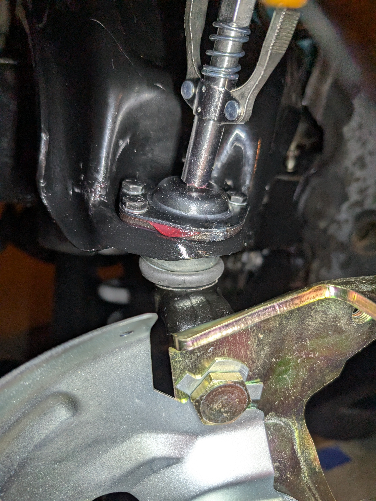
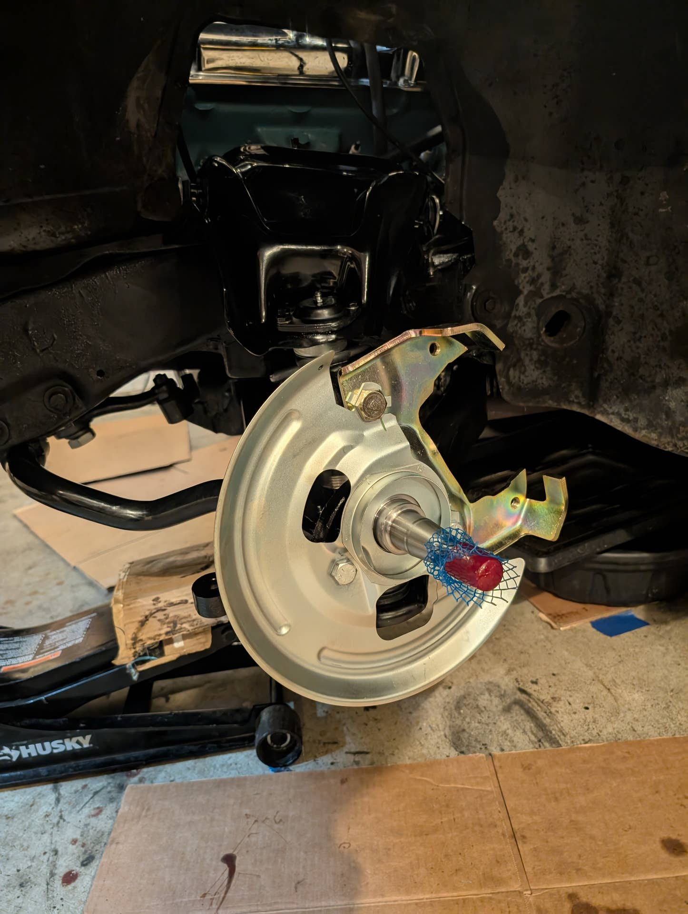
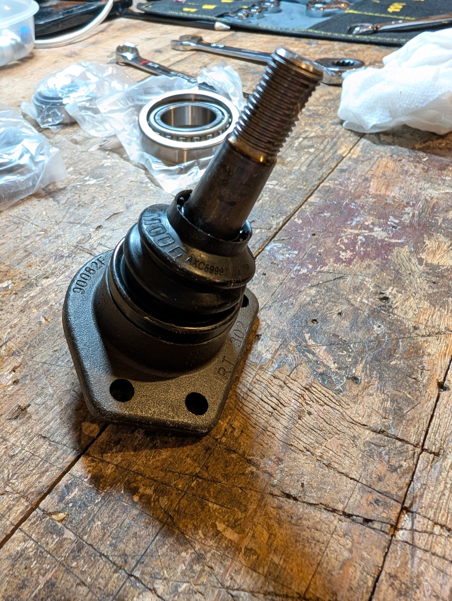
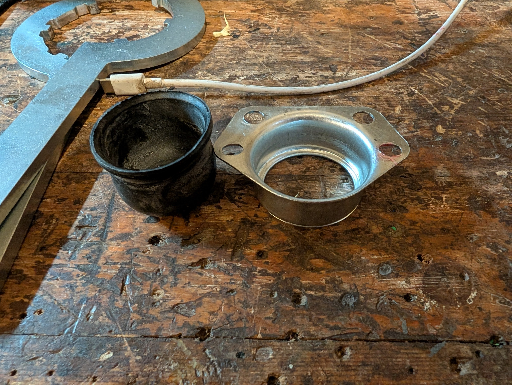
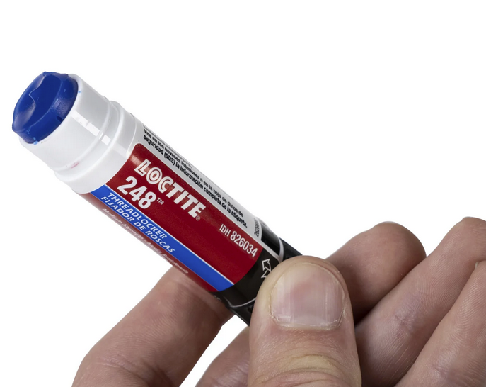
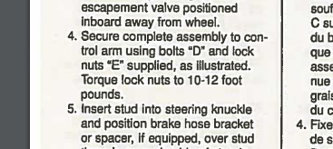

# Greasing Front Upper Ball Joints
**Forum:** GTO Forum | **Started:** January 2, 2025 | **Replies:** 28
**Thread URL:** https://www.gtoforum.com/threads/greasing-front-upper-ball-joints.148656/post-1031305

## The Issue
I'm in the process of replacing my 60yo upper and lower control arms and ball joints with a new set from OPGI. I went with the factory style, not tubular.  Trying to decide if there is an issue with the ball joints that came with the upper arm (likely not the best) or if I'm doing, have done something wrong.  Got the arms in and spindle attached and am now trying to grease the upper ball joints and the grease is coming out the top (see pic). I tightened the mounting bolts down but that didn't se...

## Solution / Outcome
nevermind, the service manual for my 64 states the same thing, so I'll go with it.

## Key Advice
- **@ponchonlefty**: the passage may be blocked. remove and check it. try working the joint while greasing.
- **@O52**: Odds are they're Chinese ball joints.  REPLACE!
- **@RMTZ67**: They are probably prefilled.
- **@NotaJudge**: Looks like there's grease in the rubber boot as it appears like it's expanded usually the boot blows out if they are over-greased, I suspect the grease backed up through the seam. Although unusual I d
- **@armyadarkness**: IMO, it looks already filled. But Ive had two zirks in the past few years, that werent drilled all the way through!  One was a Top-Tier NAPA part
- **@lust4speed**: Asking for a friend - anyone ever seen a rubber boot that didn't bleed off excessive grease?
- **@geeteeohguy**: > armyadarkness said: > If you mean the nuts attaching the joint to the arm, then use whatever you like... Lockwashers and blue loctite is how I roll...  Obviously the main nut should be a castle nut.
- **@BearGFR**: Just more reasons to stop trusting OPGI.
- **@Scott06**: > kevnord said: > nevermind, the service manual for my 64 states the same thing, so I'll go with it.                   Click to expand... yeah they are pretty small bolts soi as Army mentioned use loc
- **@Ernie in NJ**: Hey guys. After reading the responses, I had to add my 2 cents. I purchased all the front suspension parts (upper/lower ball joints, upper/lower control arm bushings, stabilizer links, stabilizer bar 

## Helpers
- **@ponchonlefty** — 1 post(s)
- **@O52** — 1 post(s)
- **@RMTZ67** — 3 post(s)
- **@NotaJudge** — 1 post(s)
- **@armyadarkness** — 8 post(s)
- **@lust4speed** — 2 post(s)
- **@geeteeohguy** — 1 post(s)
- **@BearGFR** — 1 post(s)
- **@Scott06** — 1 post(s)
- **@Ernie in NJ** — 1 post(s)

## Thread Summary

### Kevin's Original Post
I'm in the process of replacing my 60yo upper and lower control arms and ball joints with a new set from OPGI. I went with the factory style, not tubular.

Trying to decide if there is an issue with the ball joints that came with the upper arm (likely not the best) or if I'm doing, have done something wrong.

Got the arms in and spindle attached and am now trying to grease the upper ball joints and the grease is coming out the top (see pic). I tightened the mounting bolts down but that didn't seem to help. It doesn't seem like grease is making it down into the dust cap.

Should I have greased them BEFORE attaching the knuckle/spindle?I torqued them to spec.

Am I doing something wrong or is there something wrong? 

I have a new set of Moogs coming in case I need to replace em.

### Replies

**@ponchonlefty** (reply #1):
the passage may be blocked. remove and check it. try working the joint while greasing.

**@O52** (reply #2):
Odds are they're Chinese ball joints.  REPLACE!

**@RMTZ67** (reply #3):
They are probably prefilled.

**@NotaJudge** (reply #4):
Looks like there's grease in the rubber boot as it appears like it's expanded usually the boot blows out if they are over-greased, I suspect the grease backed up through the seam. Although unusual I doubt it's a problem.

**@kevnord** (reply #5):
I'll investigate further to see if I can determine if there's grease in the rubber boot.
Both sides are backing up through the seam...which leads me to think maybe the joints are fine and I've just overfilled them and they're backing up.

**@armyadarkness** (reply #6):
IMO, it looks already filled. But Ive had two zirks in the past few years, that werent drilled all the way through!

One was a Top-Tier NAPA part

**@kevnord** (reply #7):
> armyadarkness said:
> IMO, it looks already filled.
        
        Click to expand...
I took a closer look and it feels empty in the boot when compared to the bottom ball joint boots. Both uppers feel like there is just air in them. 

The lower control arms and ball joints are from NPD unlike the uppers which are from OPGI. Gave up on OPGI backorder of lowers. 

I have some USA made Moog replacements that I plan to swap on. Seems straightforward And easy compared to the bottom ball joints.

**@RMTZ67** (reply #8):
> kevnord said:
> I took a closer look and it feels empty in the boot when compared to the bottom ball joint boots. Both uppers feel like there is just air in them.

The lower control arms and ball joints are from NPD unlike the uppers which are from OPGI. Gave up on OPGI backorder of lowers.

I have some USA made Moog replacements that I plan to swap on. Seems straightforward And easy compared to the bottom ball joints.
        
        Click to expand...
Maybe swap fittings from the lowers and see if things change.

**@armyadarkness** (reply #9):
> kevnord said:
> I took a closer look and it feels empty in the boot when compared to the bottom ball joint boots. Both uppers feel like there is just air in them.

The lower control arms and ball joints are from NPD unlike the uppers which are from OPGI. Gave up on OPGI backorder of lowers.

I have some USA made Moog replacements that I plan to swap on. Seems straightforward And easy compared to the bottom ball joints.
        
        Click to expand...
My idler arm from NAPA wasnt drilled all the way through, so it wouldnt grease. If the joints arent great, then it's not even worth investigating. Just swap them!

**@kevnord** (reply #10):
> armyadarkness said:
> My idler arm from NAPA wasnt drilled all the way through, so it wouldnt grease. If the joints arent great, then it's not even worth investigating. Just swap them!
        
        Click to expand...
Got the old upper ball joints out. No grease in the boots!

I bought a pair of Moog K5108 ball joints to put in. They look much nicer but unlike the old ones they don't have a lock washer or nylon locking nut. Think I should use those off the old ball joint?

Also, they didn't come with a dust shield and bracket like the old one. Should I reuse those or maybe what's there is enough or better? See pics...

    
        
            
        
        
            
                
                
            
        
    
    

Dust boot from original

**@lust4speed** (reply #11):
Asking for a friend - anyone ever seen a rubber boot that didn't bleed off excessive grease?

**@RMTZ67** (reply #12):
Nope, but were are giving the Chi_____ the benefit of the doubt. 😕

**@armyadarkness** (reply #13):
If you mean the nuts attaching the joint to the arm, then use whatever you like... Lockwashers and blue loctite is how I roll...

Obviously the main nut should be a castle nut.

As for the sheild... meh, it's personal preference. I doubt Id use it.

**@kevnord** (reply #14):
Makes sense. Thanks for the help.

**@armyadarkness** (reply #15):
Im a HUGE Loctite fan. I use it on EVERYTHING on the old stuff! If you do, make sure you use blue/ removable strength

**@kevnord** (reply #16):
> armyadarkness said:
> Im a HUGE Loctite fan. I use it on EVERYTHING on the old stuff! If you do, make sure you use blue/ removable strength
        
        Click to expand...
Roger that. I have some blue stuff so I'm all set! I like using it as well.

**@geeteeohguy** (reply #17):
> armyadarkness said:
> If you mean the nuts attaching the joint to the arm, then use whatever you like... Lockwashers and blue loctite is how I roll...

Obviously the main nut should be a castle nut.

As for the sheild... meh, it's personal preference. I doubt Id use it.
        
        Click to expand...
Respectfully, the shield is needed to support the boot on this design. Without it the boot will fail.

**@armyadarkness** (reply #18):
I thought the shield came with another bj and he was asking about using it on the new one

**@BearGFR** (reply #19):
Just more reasons to stop trusting OPGI.

**@kevnord** (reply #20):
Yeah. You get what you pay for. I'm happy with the control arms, just wish they would have put better ball joints in them (or no ball joints).

**@armyadarkness** (reply #21):
Dont know if you seen these Chapstick style loctites, but they're the Bees Knees!

**@kevnord** (reply #22):
Ooooooh! I need that! I'm slumming it with the liquid stuff. :-(
Thanks for the heads up, I'm going to order some right now.

Hey, does 10-12 foot pounds sound correct for mounting the new ball joint on the upper control arm? Seems low, but that's what the docs Moog provides says.

**@kevnord** (reply #23):
nevermind, the service manual for my 64 states the same thing, so I'll go with it.

**@armyadarkness** (reply #24):
> kevnord said:
> Ooooooh! I need that! I'm slumming it with the liquid stuff
        
        Click to expand...
Yep. It's surprisingly annoying trying to get the liquid where you want it, when you want it. The gel sticks are game changers!

**@lust4speed** (reply #25):
> kevnord said:
> Hey, does 10-12 foot pounds sound correct for mounting the new ball joint on the upper control arm? Seems low, but that's what the docs Moog provides says.
        
        Click to expand...
Maybe.  I had to go to the charts and dry torque on a 5/16" Grade-8 bolt is up to 25 foot pounds but lubricated is only 12 foot pounds.  So does the Loctite count as lubricant?  Another caveat is most 1/2" torque wrenches are not that accurate under 40 foot pounds and most of the specs for smaller torque readings are given in inch pounds using a 3/8" torque wrench calibrated with inch pounds.  So the 12 foot pounds translates to 144 inch pounds.

**@Scott06** (reply #26):
> kevnord said:
> nevermind, the service manual for my 64 states the same thing, so I'll go with it. 
        
        Click to expand...
yeah they are pretty small bolts soi as Army mentioned use loctite and get them good and snug with a calibrated elbow. Dont over think it

**@armyadarkness** (reply #27):
Sorry. Im not a bolt-torquer... I use the old built-in torque wrench. 

Its one of the reasons I like Loctite so much... it adds torque (in a manner of speaking) to the bolt, when it cures

**@Ernie in NJ** (reply #28):
Hey guys. After reading the responses, I had to add my 2 cents. I purchased all the front suspension parts (upper/lower ball joints, upper/lower control arm bushings, stabilizer links, stabilizer bar bushings, and KYB Gas Adjust shocks) from Rock Auto. Roughly half the cost, were in stock and delivered promptly. The front and rear springs I purchased from Ames because they were the same spring rate as the stock springs and there was actually a person to chat with regarding the spring rate. They've been on the car for over a year with no issues I know it didn't address Kevnord's question directly, but hope this helps when looking for alternatives to OPGI, NPD, or any other vendor. Have a great day fellow GOAT owners.

## Images

