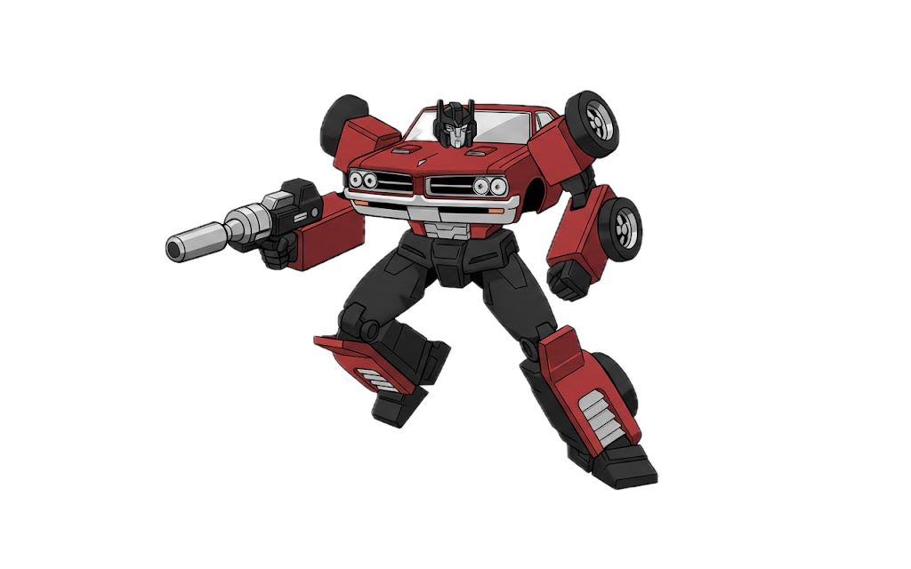
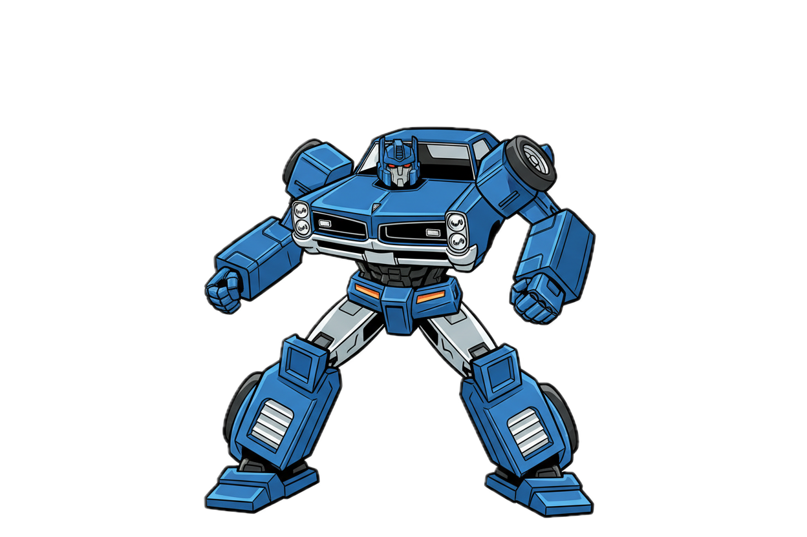
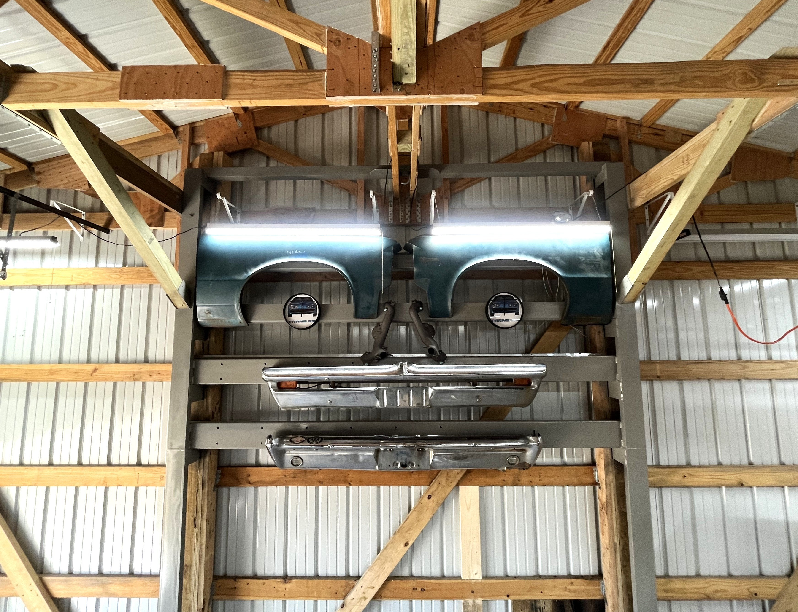
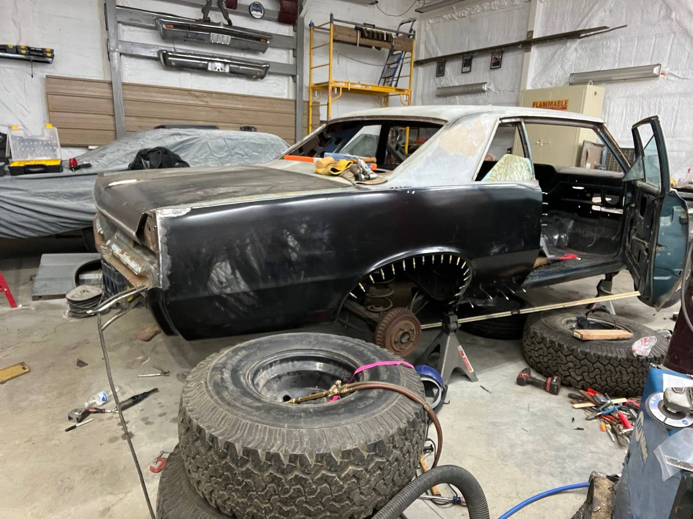
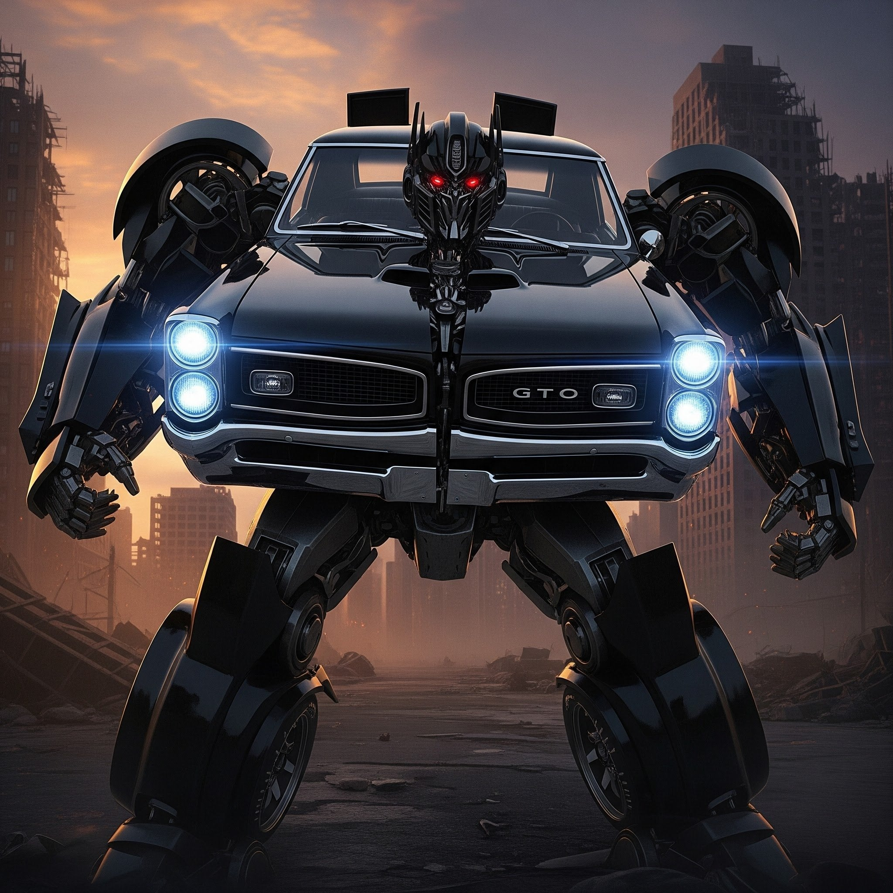

# GTO- Bots ... Transform!
**Forum:** GTO Forum | **Started:** November 3, 2025 | **Replies:** 12
**Thread URL:** https://www.gtoforum.com/threads/gto-bots-transform.150769/post-1058777

## The Issue
As a child of the '80s and an owner of a 64, I thought I'd see what a 64 Pontiac Tempest/Lemans/GTO would look like as a Transformer. Looks cool! :-D                                                                                                                               Created a '67 version as well...                                                                                                                               AI helped create em.

## Solution / Outcome
> mtrunz said: > Here's a 66       View attachment 199637           View attachment 199534       Created a '67 version as well...      View attachment 199536       AI helped create em.                   Click to expand... [/QUOTE] Badass!

## Key Advice
- **@Jared**: You know someone's going to ask so I'll be the a-hole.  Does the 64 have 6 wheels?  All joking aside, they look a lot like the Optimus Prime from the 80s animated series.
- **@Baaad65**: Yes, a one year option only
- **@ponchonlefty**: cool concepts. but what name would they have? muscle mech ?
- **@toddb**: Cool, but you should have done the best year 65...baaad made me say it
- **@md2420**: Those are the racing slicks kept in the trunk for track day.
- **@Gulfstream of Aqua**: Transformer is in the upper part of the photo; keeping watch while I rebuild it. Ignore the big tires; they are just there to support the quarter as it is taken off/on 50 times to fit it up.
- **@armyadarkness**: Im going to print those and hang em in my shop. Very cool. These will be the first transformers who get shitty mileage and Im sure the ones with the 4-speeds will be the first to die.  Of course, the 
- **@mtrunz**: Here's a 66                                                                                                                                    View attachment 199534       Created a '67 version as wel

## Helpers
- **@Jared** — 2 post(s)
- **@Baaad65** — 1 post(s)
- **@ponchonlefty** — 1 post(s)
- **@toddb** — 1 post(s)
- **@md2420** — 1 post(s)
- **@Gulfstream of Aqua** — 2 post(s)
- **@armyadarkness** — 1 post(s)
- **@mtrunz** — 1 post(s)

## Thread Summary

### Kevin's Original Post
As a child of the '80s and an owner of a 64, I thought I'd see what a 64 Pontiac Tempest/Lemans/GTO would look like as a Transformer. Looks cool! :-D

    
        
            
        
        
            
                
                
            
        
    
    

Created a '67 version as well...

    
        
            
        
        
            
                
                
            
        
    
    

AI helped create em.

### Replies

**@Jared** (reply #1):
You know someone's going to ask so I'll be the a-hole.  Does the 64 have 6 wheels?  All joking aside, they look a lot like the Optimus Prime from the 80s animated series.

**@Baaad65** (reply #2):
Yes, a one year option only

**@kevnord** (reply #3):
That's the spare(?)

**@Jared** (reply #4):
Well played sir.  Well played.

**@ponchonlefty** (reply #5):
cool concepts. but what name would they have?
muscle mech ?

**@toddb** (reply #6):
Cool, but you should have done the best year 65...baaad made me say it

**@md2420** (reply #7):
Those are the racing slicks kept in the trunk for track day.

**@Gulfstream of Aqua** (reply #8):

**@Gulfstream of Aqua** (reply #9):
Transformer is in the upper part of the photo; keeping watch while I rebuild it. Ignore the big tires; they are just there to support the quarter as it is taken off/on 50 times to fit it up.

**@armyadarkness** (reply #10):
Im going to print those and hang em in my shop. Very cool. These will be the first transformers who get shitty mileage and Im sure the ones with the 4-speeds will be the first to die.

Of course, the Decepticons would all be based on a WIFE since that's the natural enemy of having a fun car.

**@mtrunz** (reply #11):
Here's a 66 

    
        
            
        
        
            
                
                
            
        
    
    

    View attachment 199534
    

Created a '67 version as well...

    View attachment 199536
    

AI helped create em. 
[/QUOTE]

**@kevnord** (reply #12):
> mtrunz said:
> Here's a 66 

    View attachment 199637
    

    View attachment 199534
    

Created a '67 version as well...

    View attachment 199536
    

AI helped create em. 
        
        Click to expand...
[/QUOTE]
Badass!

## Images

