# How much clearance?
**Forum:** GTO Forum | **Started:** January 26, 2026 | **Replies:** 37
**Thread URL:** https://www.gtoforum.com/threads/how-much-clearance.151237/post-1064247

## The Issue
Hey guys, how much clearance do you recommend having on the lowest point of my exhaust? 4"+ above the ground? Mine is 3.5-4" above the ground and I think I need more to not worry about scraping.  (Pic shows car up on jack stands)

## Solution / Outcome
Pypes H-pipe

## Key Advice
- **@ponchonlefty**: > kevnord said: > Hey guys, how much clearance do you recommend having on the lowest point of my exhaust? 4"? Mine is 3.5-4" and I think I need more to not worry about scraping.  (Pic shows car up on 
- **@Verdoro 68**: I'm at 3.75" of clearance with a 2.5" Pypes setup and my car is lowered a little over an inch in the front. I've never really been happy with how low the system hangs, but it hasn't presented any prob
- **@Jim K**: I tucked mine up as far as I could get it. While the rear of my GTO is a bit above factory installed height, the front is lowered. Even at that, I've not had any scraping problems. One thing you might
- **@armyadarkness**: Yes you definitely have to. Anytime you're installing clamps on hoses or exhaust pipes, you always want to:  Make sure the fastener wont interfere with anything. Make sure the fastener will be able to
- **@fishwater**: > kevnord said: > Question for ya. One of the reasons I had the faster with the bolt on the bottom was because it is my understanding that it's better to torque on the nut vs the bolt. I had the nut o
- **@Baaad65**: > kevnord said: > Question for ya. One of the reasons I had the faster with the bolt on the bottom was because it is my understanding that it's better to torque on the nut vs the bolt. I had the nut o
- **@Geeter**: That’s one reason I went to a muffler shop, so they could custom bend the first part of the exhaust system. I know I lost some of the 2 1/2” pipe because of no mandrel bend, but it fits very nice  If 
- **@Dennyd**: T
- **@O52**: The frames were built upside down at the factory.  Made it easier to install the exhaust and tighten the clamp nuts from the top.  Frames were then flipped before the body was installed
- **@JustinRaney**: what x pipe is that?

## Helpers
- **@ponchonlefty** — 2 post(s)
- **@Verdoro 68** — 2 post(s)
- **@Jim K** — 3 post(s)
- **@armyadarkness** — 8 post(s)
- **@fishwater** — 2 post(s)
- **@Baaad65** — 3 post(s)
- **@Geeter** — 3 post(s)
- **@Dennyd** — 2 post(s)
- **@O52** — 1 post(s)
- **@JustinRaney** — 1 post(s)

## Thread Summary

### Kevin's Original Post
Hey guys, how much clearance do you recommend having on the lowest point of my exhaust? 4"+ above the ground? Mine is 3.5-4" above the ground and I think I need more to not worry about scraping.

(Pic shows car up on jack stands)

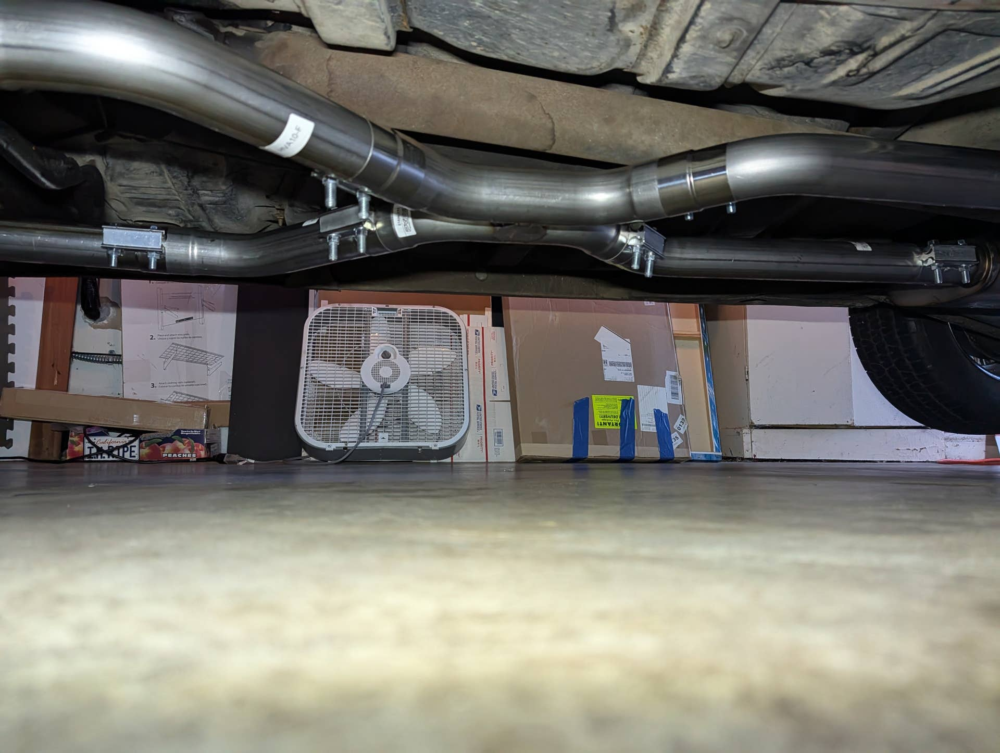

### Replies

**@ponchonlefty** (reply #1):
> kevnord said:
> Hey guys, how much clearance do you recommend having on the lowest point of my exhaust? 4"? Mine is 3.5-4" and I think I need more to not worry about scraping.

(Pic shows car up on jack stands)

    View attachment 202136
    

        
        Click to expand...
i would tuck the exhaust closer to the floor. my firebird was low to the ground.
with 2 1/2 pipe. about 2 inches from the floor pan was my distance.

**@Verdoro 68** (reply #2):
I'm at 3.75" of clearance with a 2.5" Pypes setup and my car is lowered a little over an inch in the front. I've never really been happy with how low the system hangs, but it hasn't presented any problems in terms of bottoming out.

**@Jim K** (reply #3):
I tucked mine up as far as I could get it. While the rear of my GTO is a bit above factory installed height, the front is lowered. Even at that, I've not had any scraping problems. One thing you might consider is turning your joint clamps 90 degrees and have the exposed threads point horizontally. that way if you do scrap, you won't run the risk of destroying one or more of your clamp bolts.

**@kevnord** (reply #4):
Good tip, I was thinking of doing just that. When I installed them I didn't expect the threads to be that long and go past the bottom of the pipe. I'll be doing another round of loosening and retightening them so I can do it

**@armyadarkness** (reply #5):
Yes you definitely have to. Anytime you're installing clamps on hoses or exhaust pipes, you always want to:

Make sure the fastener wont interfere with anything.
Make sure the fastener will be able to be disassembled and/ or adjusted after everything else is installed. For instance, you wouldn't want to install your water-neck-to-radiator hose clamp so that when you installed the alternator, you wouldn't be able to loosen it.
Lastly, if you can hide the fastener portion of the clamp, why not do it. If your engine compartment or exhaust are beautifully detailed, why soil their beauty with excess hose clamp curls or generic fasteners. Those crossed T's and dotted i's go a long way.

**@kevnord** (reply #6):
> armyadarkness said:
> Yes you definitely have to. Anytime you're installing clamps on hoses or exhaust pipes, you always want to:

Make sure the fastener wont interfere with anything.
Make sure the fastener will be able to be disassembled and/ or adjusted after everything else is installed. For instance, you wouldn't want to install your water-neck-to-radiator hose clamp so that when you installed the alternator, you wouldn't be able to loosen it.
Lastly, if you can hide the fastener portion of the clamp, why not do it. If your engine compartment or exhaust are beautifully detailed, why soil their beauty with excess hose clamp curls or generic fasteners. Those crossed T's and dotted i's go a long way.

        
        Click to expand...
Question for ya. One of the reasons I had the faster with the bolt on the bottom was because it is my understanding that it's better to torque on the nut vs the bolt. I had the nut on the bottom because it was easier to access with the torque wrench. That said, I didn't expect the bolt to be as long as it was and extend down past the bottom of the pipe.

Do you agree that the nut should be torqued instead of the bolt? Maybe it doesn't really matter?

this is the original setup... which I'm redoing

**@fishwater** (reply #7):
> kevnord said:
> Question for ya. One of the reasons I had the faster with the bolt on the bottom was because it is my understanding that it's better to torque on the nut vs the bolt. I had the nut on the bottom because it was easier to access with the torque wrench. That said, I didn't expect the bolt to be as long as it was and extend down past the bottom of the pipe.

Do you agree that the nut should be torqued instead of the bolt? Maybe it doesn't really matter?

this is the original setup... which I'm redoing
        
        Click to expand...
You don’t need to use a torque wrench, you’re just applying enough force to hold the pipes in place. Using a wrench and socket is perfectly fine in this application so position the clamp with the bolts out of the way for clearance and or visuals and just tighten them down.

**@Baaad65** (reply #8):
> kevnord said:
> Question for ya. One of the reasons I had the faster with the bolt on the bottom was because it is my understanding that it's better to torque on the nut vs the bolt. I had the nut on the bottom because it was easier to access with the torque wrench. That said, I didn't expect the bolt to be as long as it was and extend down past the bottom of the pipe.

Do you agree that the nut should be torqued instead of the bolt? Maybe it doesn't really matter?

this is the original setup... which I'm redoing

    View attachment 202216
    

        
        Click to expand...
Torque wrench?  We don’t need no stinking torque wrench 🤣

**@armyadarkness** (reply #9):
> kevnord said:
> Question for ya. One of the reasons I had the faster with the bolt on the bottom was because it is my understanding that it's better to torque on the nut vs the bolt. I had the nut on the bottom because it was easier to access with the torque wrench. That said, I didn't expect the bolt to be as long as it was and extend down past the bottom of the pipe.

Do you agree that the nut should be torqued instead of the bolt? Maybe it doesn't really matter?

this is the original setup... which I'm redoing

    View attachment 202216
    

        
        Click to expand...
I'm a forensic scientist, but I don't no the answer. I could be convinced that it did matter and vice versa. But I'll tell you what I told my good friend Pontiac Jim many years ago... "It's funny that you think I ever used a torque wrench".

**@kevnord** (reply #10):
> armyadarkness said:
> I'm a forensic scientist, but I don't no the answer. I could be convinced that it did matter and vice versa. But I'll tell you what I told my good friend Pontiac Jim many years ago... "It's funny that you think I ever used a torque wrench".
        
        Click to expand...
hah! I'm gun shy after snapping that exhaust manifold bolt... plus I have to justify the new Torque Wrench I bought.

**@Jim K** (reply #11):
> kevnord said:
> Question for ya. One of the reasons I had the faster with the bolt on the bottom was because it is my understanding that it's better to torque on the nut vs the bolt. I had the nut on the bottom because it was easier to access with the torque wrench. That said, I didn't expect the bolt to be as long as it was and extend down past the bottom of the pipe.

Do you agree that the nut should be torqued instead of the bolt? Maybe it doesn't really matter?

this is the original setup... which I'm redoing

    View attachment 202216
    

        
        Click to expand...
I'm not sure how much applying torque to the head or the nut matters as we torque head bolts down and main/rod nuts down. i think what would matter more is to make sure the threads are lubricated (and bolt to for that matter) before you apply torque so you can be sure you have an accurate torque reading. I would think there wouldn't be but 1 or 2 pounds of torque difference from one side to the other.

**@armyadarkness** (reply #12):
> kevnord said:
> I'm gun shy after snapping that exhaust manifold bolt
        
        Click to expand...
For the record, a 7.2lb newborn could break and exhaust manifold bolt with a binky. 

Next easiest to break are auto transmission pans, then valve covers...

**@armyadarkness** (reply #13):
> kevnord said:
> I have to justify the new Torque Wrench I bought
        
        Click to expand...
Trust me, I get it. 

I could convince your wife that you needed to have your own space shuttle, because your televisions resolution was insufficient for watching moon missions.

**@armyadarkness** (reply #14):
> Jim K said:
> I'm not sure how much applying torque to the head or the nut matters as we torque head bolts down and main/rod nuts down. i think what would matter more is to make sure the threads are lubricated (and bolt to for that matter) before you apply torque so you can be sure you have an accurate torque reading. I would think there wouldn't be but 1 or 2 pounds of torque difference from one side to the other.
        
        Click to expand...
My hats off to guys who torque... but I use electric impacts for 98% of my jobs. My entire cam swap, TKX conversion, engine paint restoration, posi/ gear swap, suspension arms, brakes, etc... were all done with a 1/4 drive dewalt impact.

the ONLY time I dont use it is if I cant get access.

**@armyadarkness** (reply #15):
> Jim K said:
> turning your joint clamps 90 degrees
        
        Click to expand...
It's a must!

**@Baaad65** (reply #16):
I wish mine was a little tighter to the floor also but with headers going on I don't think that's going to happen. I put the clamps facing up also...and I took the stickers off 🤣

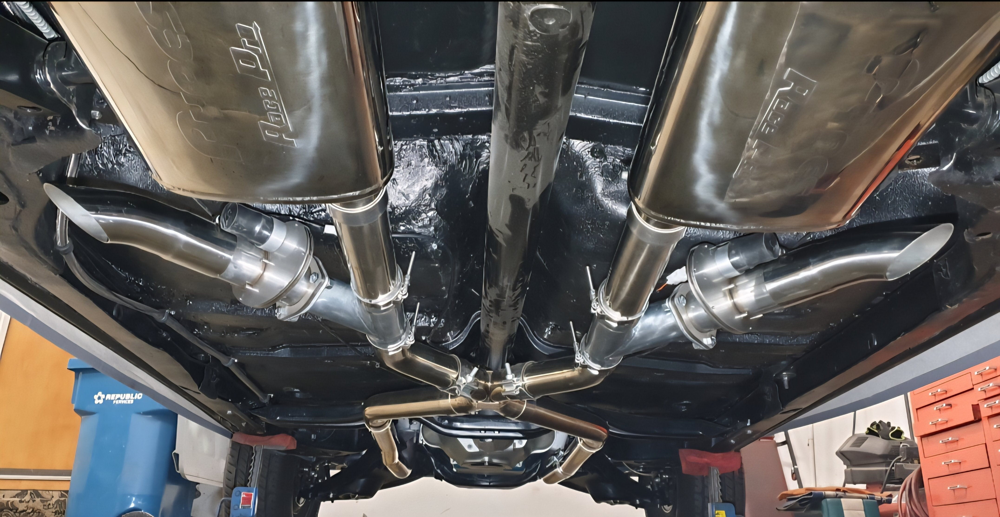

**@Geeter** (reply #17):
That’s one reason I went to a muffler shop, so they could custom bend the first part of the exhaust system. I know I lost some of the 2 1/2” pipe because of no mandrel bend, but it fits very nice  If you look at some of my pics the first bend in the pipe right of the header collector is up. The tailpipes are mandrel and pre-bent but the front part is bent to fit my car and tucks up nicely.

**@kevnord** (reply #18):
Harder to hide the upgrade from the Mrs if I go to a muffer shop and put a big ol charge on the credit card. ;-)

I enjoy DIYing things (and saving $) so I went with a kit I could install. That said, had I known the amount of time I'd spend on a broken exhaust header stud, I probably would have taken it in and called it a day.

**@armyadarkness** (reply #19):
For the record, IME, exhaust systems have a LOT more give than you think.

MANY times, I've located the offending section, loosened everything, strategically placed 2x4's, then jacked up the system with a floor jack and retightened it all. You can easily get an exhaust to move an inch or more, with ease. 

If you understand leverages and can determine where the force needs to go, it's simple. 

FIRST!!! If your headers are pointing downward, make sure that your transmission mount is sound and correct. A lot of changes and Tijuana-engineering can occur over the course of 55 years, and even if you personally replaced your trans mount with a new one, are you sure it meets OEM spec? Are you sure your crossmember wasnt moved or swapped? Sure your motor mounts are right? Frame hasnt sagged?

You might  be able to easily shim-up the trans mount .25", and those few degrees could have a substantial impact on the header-collector or down-pipe angle, which would significantly raise your exhaust. And unless you go so drastic that you cause driveline vibration, then there's no downside.

And if that's not the case, a header collector or down pipe should be able to be tweaked at least an inch without causing a kink. On my car, I saw a section of exhaust sagging too low for my taste, so I wedged 2x4 blocks between the exhaust and the floor, to push the exhaust down even further, and then I used a floor jack to bend up the low section. Then Remove the blocks and VIOLA! This usually works even if the system is welded or clamped already.

**@kevnord** (reply #20):
Good stuff! Yeah, I plan to loosen everything and then use a floor jack to jack up the offending section(s) appropriately. I had used jack stands to support the pipes when installing but that didn't get it as tight as I need.

I have the original exhaust headers with new downpipes. The new downpipes are probably a bit taller than needed but weren't the lowest point, so I think they'll be just fine. My front end is lowered as well (coilovers) so I can raise that if needed. I had been thinking about doing that anyway since it settled since the install a year ago.

Just hoping this is the last loosen/tighten. crossing fingers

**@fishwater** (reply #21):
The only “issue” that I found when using the Pypes kit with their head pipes was the head pipes could have been a little tighter to the body, mine had a slight pitch downward where they meet the pipes for the X pipe so I used a jack to push the center of the X pipe up when I tightened everything so the system would hug the body a little better. I don’t have any ground clearance issues but you can see the exhaust from the side view under the car, a custom built system would be less visible since it would be tighter to the body.

And yes, clamps sideways to maximize clearance and hide them a little better.

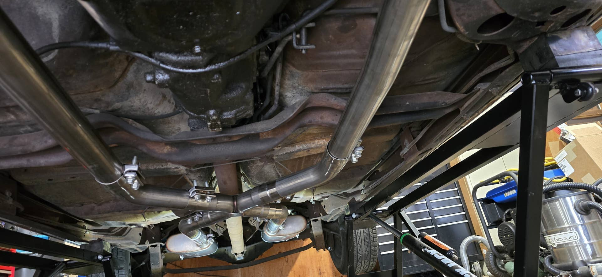

**@Verdoro 68** (reply #22):
> fishwater said:
> The only “issue” that I found when using the Pypes kit with their head pipes was the head pipes could have been a little tighter to the body, mine had a slight pitch downward where they meet the pipes for the X pipe so I used a jack to push the center of the X pipe up when I tightened everything so the system would hug the body a little better. I don’t have any ground clearance issues but you can see the exhaust from the side view under the car, a custom built system would be less visible since it would be tighter to the body.

And yes, clamps sideways to maximize clearance and hide them a little better.
        
        Click to expand...
The head pipes were the culprit in my system as well. I did the same and used the x-pipe as the adjustment point, but could only get so much out of it. Based on other pics in this thread, it looks like we're all in the neighborhood of each other in terms of fitment. All that said, the system is well over 10 years old and holding up well. I should turn that clamp on the x-pipe around so the bolts and clamp are on the inside.

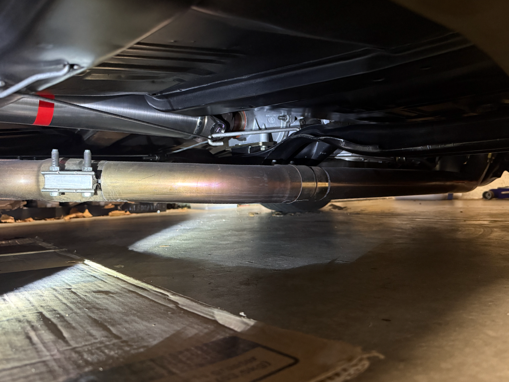

**@armyadarkness** (reply #23):
Glad it's working for you, but yes even that could get corrected.

**@Jim K** (reply #24):
If you kit came with the muffler mounts that have the reinforced rubber that uses screws to anchor to the frame, you can drill some new holes in the rubber part further in on the rubber, the lift your muffler to attach the clamp. That will help raise your entire system.

**@Baaad65** (reply #25):
I think my Pypes kit had four holes in that rubber mount for adjustment.

**@kevnord** (reply #26):
The hangers both have two reinforced rubber straps with 3 holes each. I have it on the bottom hole (muffler at it's lowest). I went up a hole but then clearance on the over the axel/spring area got tight. Maybe that'll change when I start raising the rest of the pipe

**@kevnord** (reply #27):
It looks like I can really level it out, now I just gotta figure how close I can get to things.

How does this sound...?
1/2" from drive shaft when pipes held up by jack. Assuming it'll drop a little when the jack is removed post clamps being tightened.
3/4-1" from floor pan and frame in all locations.
Lots of room around rear axel and spring/shock.

I think when all is said and done, I'll get another 1" height everywhere and will be in good shape. I just didn't support/jack it up enough when I tightened the first time. Lesson learned. 

(the bracket in the pic is not tight and rotated to the bottom. It will be up when all is said and done.)

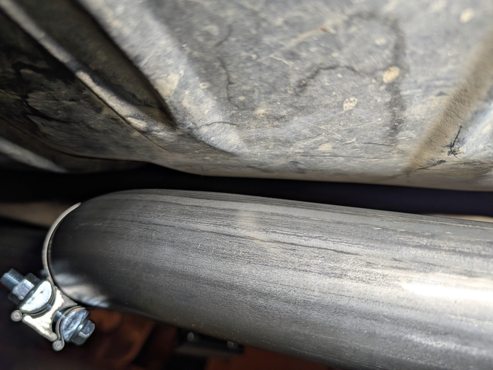

**@ponchonlefty** (reply #28):
> kevnord said:
> It looks like I can really level it out, now I just gotta figure how close I can get to things.

How does this sound...?
1/2" from drive shaft when pipes held up by jack. Assuming it'll drop a little when the jack is removed post clamps being tightened.
3/4-1" from floor pan and frame in all locations.
Lots of room around rear axel and spring/shock.

I think when all is said and done, I'll get another 1" height everywhere and will be in good shape. I just didn't support/jack it up enough when I tightened the first time. Lesson learned.

(the bracket in the pic is not tight and rotated to the bottom. It will be up when all is said and done.)

    View attachment 202173
    

        
        Click to expand...
i like it.

**@Geeter** (reply #29):
Since I opened my big mouth about the subject and didn’t give many details I thought I’d add some pics and measurements to clarify.

This is what I mean about first bend being up, had to gain at least an inch of clearance for the whole stsyem.

    
        
            
        
        
            
                
                
            
        
    
    

These pics will show clearance at the header collector. My car doesn’t sit too high so these measurements are not exaggerated by my car sitting very high. Measurement at the wheel arch moldings is at 26 1/2“ for all four wheels currently. The collector is the lowest point of the whole system.

    
        
            
        
        
            
                
                
            
        
    
    

    
        
            
        
        
            
                
                
            
        
    
    

These pics show the rest of the system. I had to set the tape measure under the car with it sticking up. The two tapes together show the actual reading. So I have 6 inches at the header and about 8 1/2 for the rest of the exhaust system.

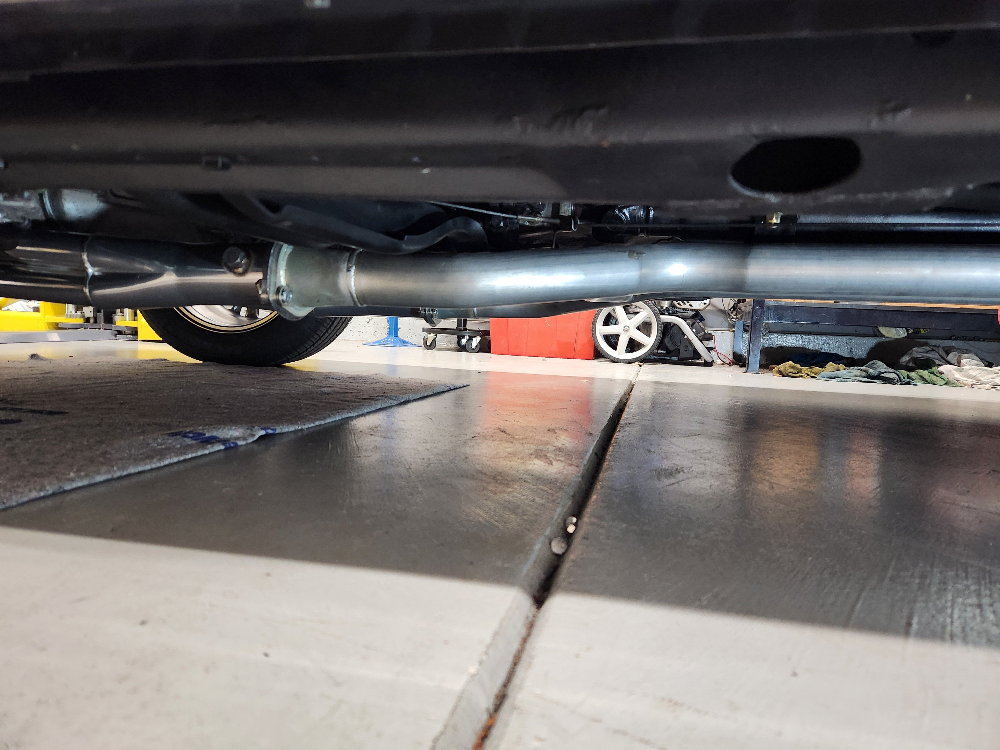
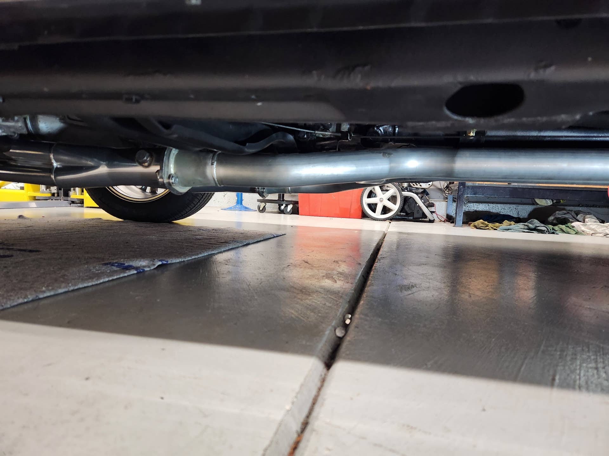

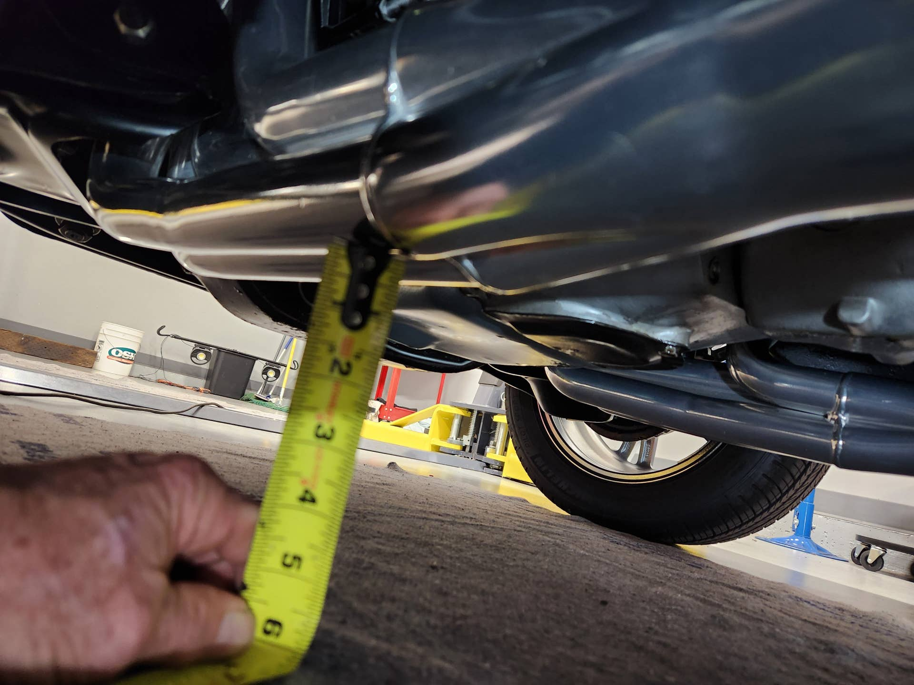

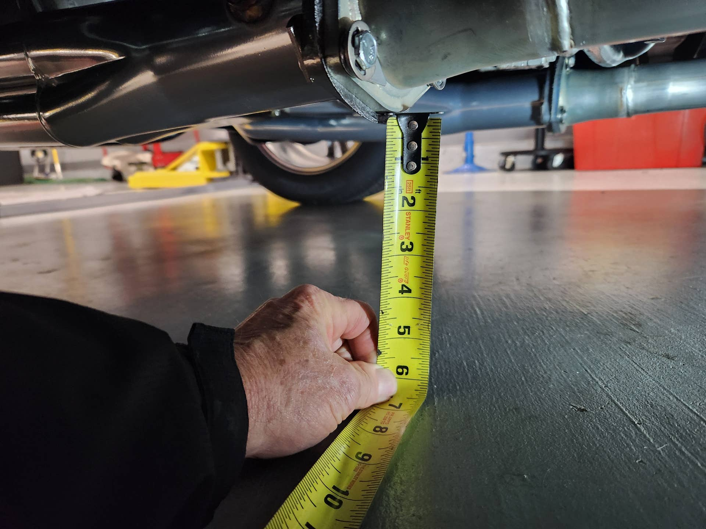
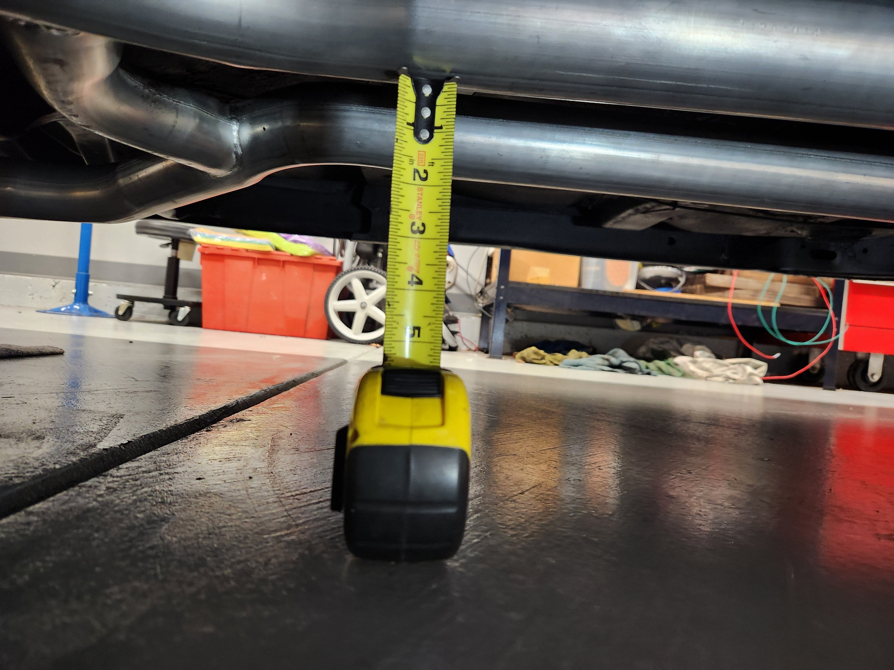

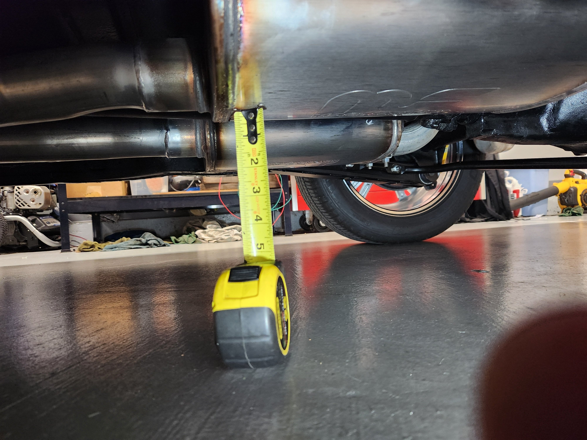
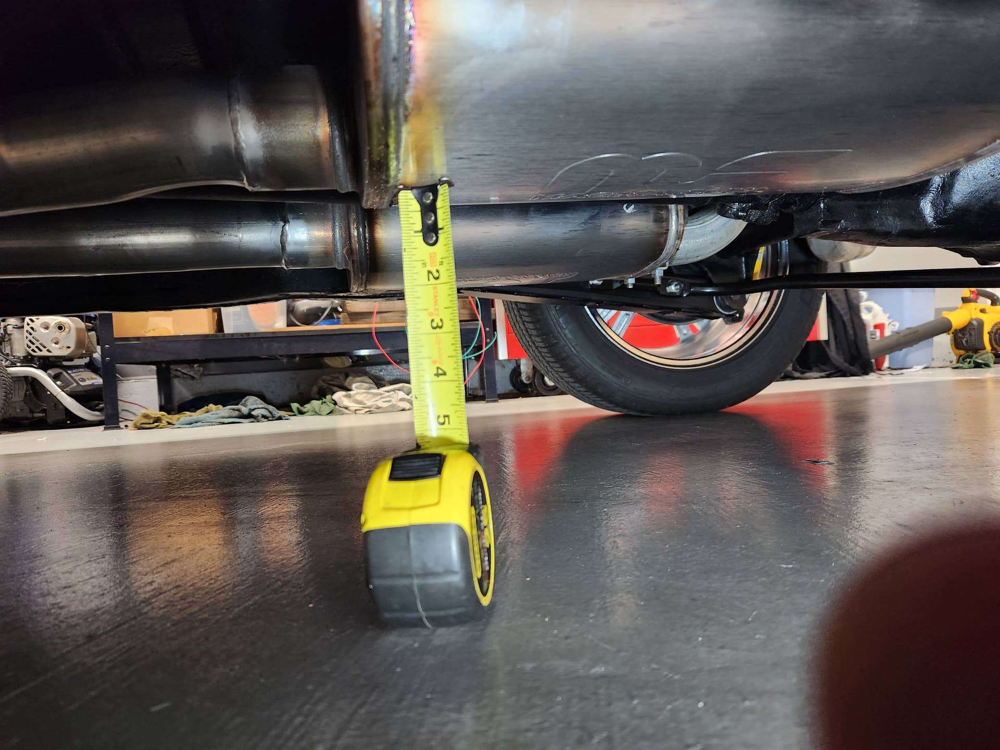

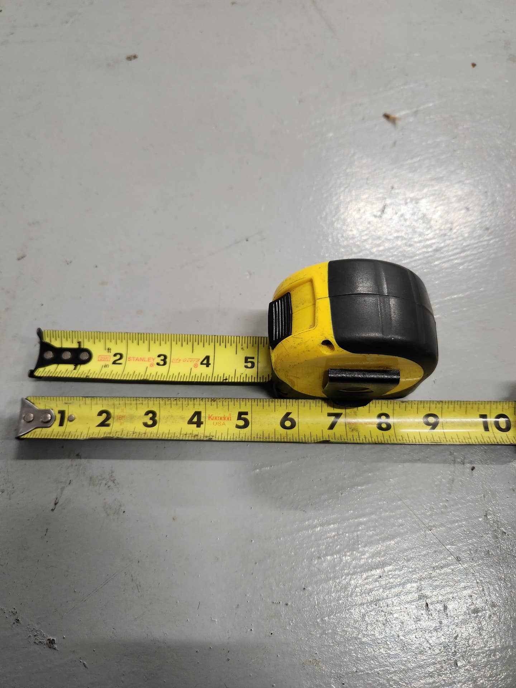

**@kevnord** (reply #30):
Thanks for the pics! Great to see yours for comparison.
One "strike" I have against me is that my measurement at the wheel arch moldings is at 24-1/2" (2inches below yours). Not sure if a 64 and 67 are apples to apples, but my front-end is lower than spec for sure. Depending on how much space I'm at after jacking the pipes up and retightening, I might raise the front coilovers a bit. I'd be fine going up an inch

**@Dennyd** (reply #31):
T

**@Geeter** (reply #32):
I got nothing against Pypes (I did buy their tips) or any other exhaust kit but another advantage to going to the muffler shop is, no clamps no leaks. Having the connections welded cleans up the clamp bolt issue completely and makes for a cleaner overall look if you ask me.

**@O52** (reply #33):
The frames were built upside down at the factory.  Made it easier to install the exhaust and tighten the clamp nuts from the top.  Frames were then flipped before the body was installed

**@kevnord** (reply #34):
Success! I was able to get the pipes up and 5+" from the ground to the lowest spot. :-D
Thanks for all your help. I still need to tighten some stuff and get my tail pipe and tips in the right spot, but I'm getting there.

Here's a video, don't mind the dangling tailpipe and tip... I had a brief window to get the car out for a roar (in 29F weather)
I think it sounds awesome... don't mind a little rattle (need to tighten a couple things) and don't rain on my parade. ;-)

**@JustinRaney** (reply #35):
what x pipe is that?

**@kevnord** (reply #36):
Pypes H-pipe

**@Dennyd** (reply #37):
A couple of options to get your front end up a little are:

(1) - using station wagon springs - they are supposed to be heavier duty, maybe a 1/2 or full coil taller, or use the "horseshoe spacer" adjustment.  
(2)This is a coil extender that fits into the lower control arm and is fixed in place.  When I first purchased my 65' the springs were pretty weak, purchased new springs and while the ride was better the height didn't change much.

Someone recommended these coil donuts or horseshoes, bought them, installed them and they've been in my car for 30+ years.  my 65' sits nice, rides and handles just fine.

## Images

