# How to get out final exhaust flange stud
**Forum:** GTO Forum | **Started:** December 25, 2025 | **Replies:** 33
**Thread URL:** https://www.gtoforum.com/threads/how-to-get-out-final-exhaust-flange-stud.150849/post-1059804

## The Issue
I've successfully prepped 3 out of the 4 exhaust flange studs. One new stud installed and two thread chased and good to go  And then there was one. I cannot get this stud out. I used my induction bolt heater to heat up the surrounding manifold until it was red hot and squirted penetration oil in it. I did this no less than 6 times over the last few days. I was hoping that would loosen it up.  Today, I attempted to extract it using a Gearwrench stud extractor. It couldn't seem to get a good enoug...

## Solution / Outcome
Update... been chipping away at various projects and finally have resolution on the stuck stud. Despite throwing heat and penetrating oil at it multiple times, the stud would not budge and just gotta chewed up. Finally decided to drill it out. Was hoping to get luck and maybe save the threads but was not successful. That said, it's out and I'm going with a strong bolt through it. Not "perfect" but I'm satisfied....

## Key Advice
- **@Verdoro 68**: Sounds pretty stuck. I'd pull the manifold from the engine to get a better angle on it. Are the threads still good on it? If so you could try welding a nut on it.
- **@Sick467**: Bench work may be required.  I have hammer-tapped studs (with some gusto) on stuck bolts/studs on the bench/vise with success, but I would not try hitting them that hard while bolted to the engine.  T
- **@Lok**: Since it's still on the car work will be hard to get a good angle. Here is an option, put a stack of standard flat washers and then nut it up tight with a nut then stack nuts on it till the threads ar
- **@O52**: Had something similar with a thermostat bolt. Drilled the bolt and tried an easy-out. No movement.   Propane torch couldn't heat the manifold enough.   I tried a MAP torch and got the bolt to move sli
- **@geeteeohguy**: I would have left it alone. There was enough length to grab a nut, IMO. That said, at this stage you can soak it for a couple of weeks in Kroil, and try, or go right to the torch. You will likely be d
- **@Mleads310**: You can try to soak it in something like rust off or rust eez, I can’t remember the name, but it’s an acid that I used to soak and intake manifold and all the rust was off 24 hrs later
- **@ponchonlefty**: you say the penetrating oil will go thru? an old trick was wax melted into the threads. it might work in this case. i think army suggesting the torch may be the winner. or just cut it flush and drill 
- **@Spode Oden**: Here’s a trick I learned from an old guy who restored old tractors. It makes sense and it works with patience. You need to heat the bolt only. The bolt tries to expand inside the cold casting. As it c
- **@armyadarkness**: > Spode Oden said: > Here’s a trick I learned from an old guy who restored old tractors. It makes sense and it works with patience. You need to heat the bolt only. The bolt tries to expand inside the 
- **@joeyc6365**: wow, a thing of beauty

## Helpers
- **@Verdoro 68** — 1 post(s)
- **@Sick467** — 2 post(s)
- **@Lok** — 3 post(s)
- **@O52** — 3 post(s)
- **@geeteeohguy** — 4 post(s)
- **@Mleads310** — 2 post(s)
- **@ponchonlefty** — 1 post(s)
- **@Spode Oden** — 1 post(s)
- **@armyadarkness** — 6 post(s)
- **@joeyc6365** — 1 post(s)

## Thread Summary

### Kevin's Original Post
I've successfully prepped 3 out of the 4 exhaust flange studs. One new stud installed and two thread chased and good to go

And then there was one. I cannot get this stud out. I used my induction bolt heater to heat up the surrounding manifold until it was red hot and squirted penetration oil in it. I did this no less than 6 times over the last few days. I was hoping that would loosen it up.

Today, I attempted to extract it using a Gearwrench stud extractor. It couldn't seem to get a good enough grip and would spin eventually. Stud didn't budge.

Here are my ideas for going forward...
1. Heat it up for much longer and try again.
2. Try using an impact driver knowing that I could break the stud.
3. Try a different removal tool?
4. Cut it off and drill it out. Then either retap or (I don't like this but..) thread a bolt through and call it a day. I have access to both sides of the hole.

Thoughts?

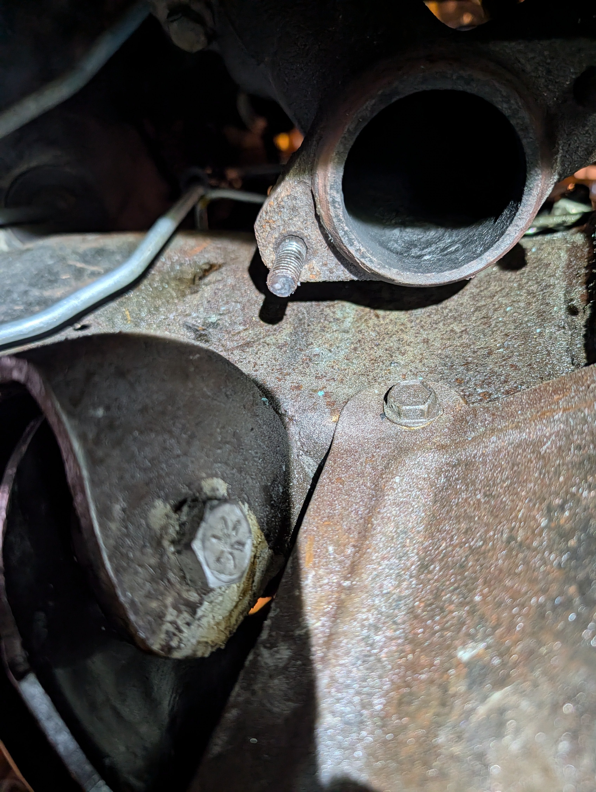

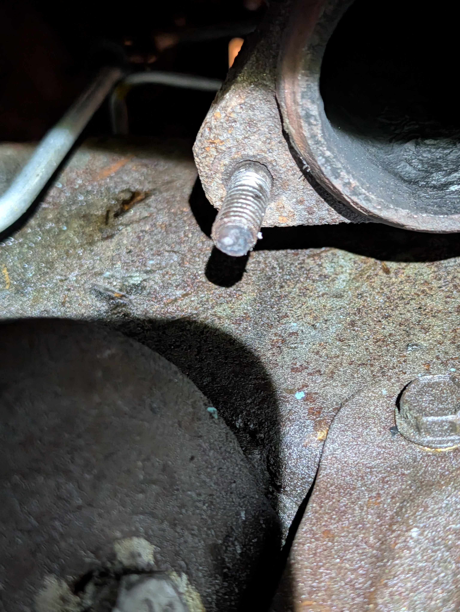
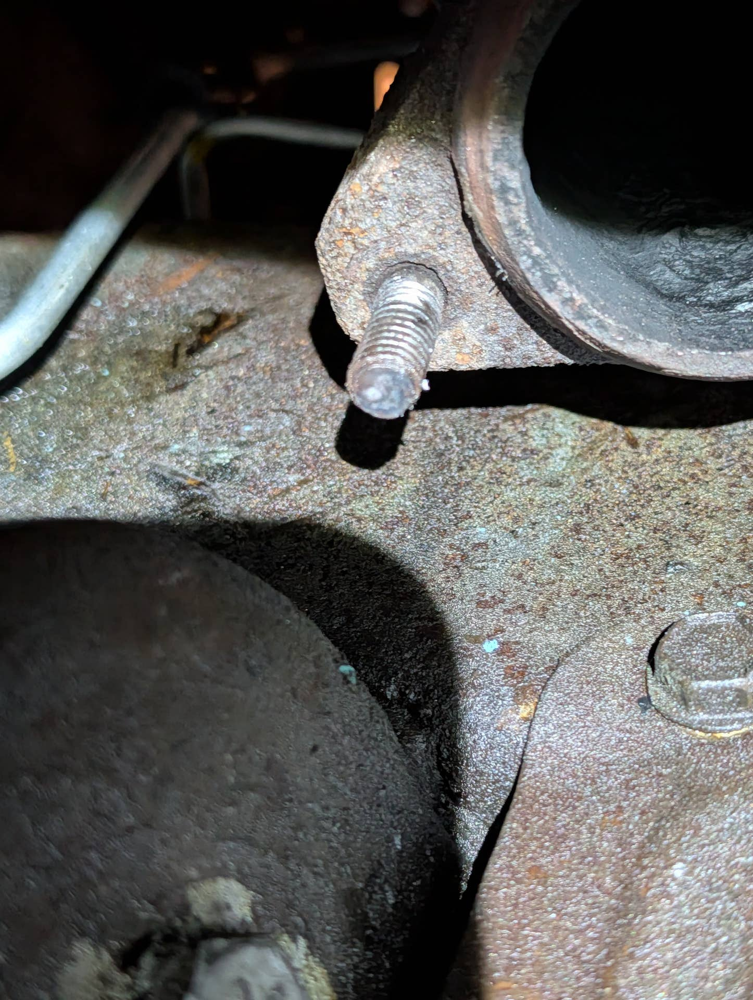
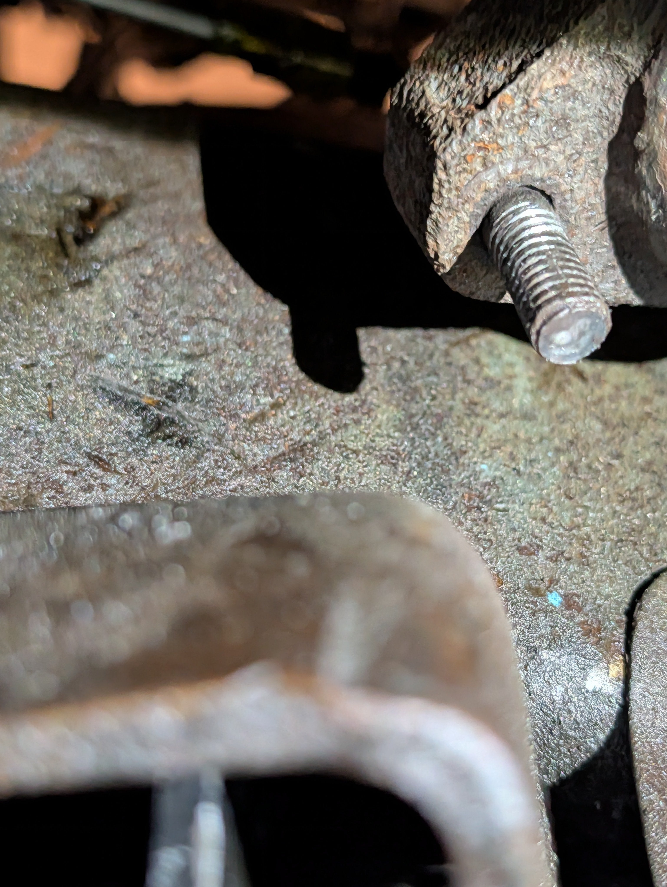

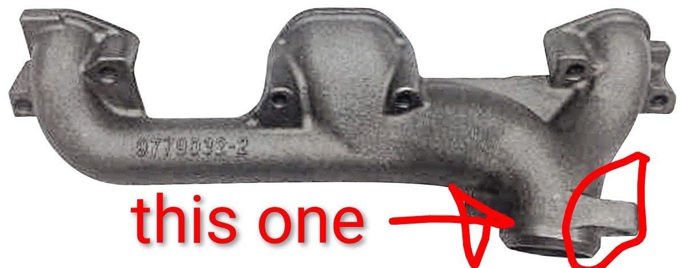
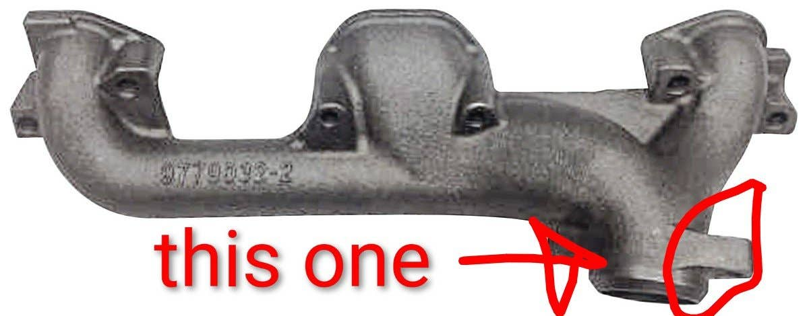

### Replies

**@Verdoro 68** (reply #1):
Sounds pretty stuck. I'd pull the manifold from the engine to get a better angle on it. Are the threads still good on it? If so you could try welding a nut on it.

**@kevnord** (reply #2):
My worry about that is that I'd have to tackle 6 original and rusty bolts to get it out. :-/

The threads aren't good enough to get a nut on unfortunately. I wonder if I could use a die on it

**@Sick467** (reply #3):
Bench work may be required.  I have hammer-tapped studs (with some gusto) on stuck bolts/studs on the bench/vise with success, but I would not try hitting them that hard while bolted to the engine.  The impact of a hammer directly in line with the stud/bolt can jar the rust loose and free them up.  I will use a long brass nut (barrel nut) or two nuts doubled up on the end of the stud to take the hammer blow. 

Fast heat at the manifold may work for you.  You need to heat the manifold area around the stud fast so that the heat does not absorb into the stud and cause it to swell with the manifold. This causes the manifold steel to swell before the stud has a chance to swell along with it.   If the heat application is slow, they both expand at the same rate and stay bound.   It is equally as important to apply the loosening torque to the stud before the stud swells from the heat.  An induction heater may not be fast enough to swell the manifold before the stud grows as well.  A map torch or small acetylene torch has the best chance of working on the manifold and you don't want the steel to glow orange or too much heat has soaked into the stud already.

**@kevnord** (reply #4):
That makes sense. I have a basic butane torch but would be willing to buy something if it has a good chance of helping. I've watched videos where (big) torches are used and I can see how quickly the manifold goes red around the bolt. The induction heater isn't really turning my manifold red but it can make the bolt red within 15-20 secs.

**@Sick467** (reply #5):
I've had marginal luck with the standard propane torch on lesser problems, but I cannot say that it helped much...they are too slow at heating the outer portion and end up heat soaking the bolt too.  Once again, red hot is not really the goal, just hot enough to expand the hole material and not the bolt.

**@kevnord** (reply #6):
I was thinking and researching the induction heater a bit and realized Im not utilizing it optimally. The item you want to heat needs to be in the center of the loops and almost touching the loops (but not touching). 

Normally, you hold the loops around a nut you want to heat, but I need to heat a larger area.
The loops I've been using aren't that large and won't go around the manifold bump-out so I've just been pressing it against it. No wonder I haven't seen the manifold turn red or really smoke that much. I have other loops, one of which is a large u shape that I should be able to get around it. I'll give that a shot tomorrow and see what happens.

**@Lok** (reply #7):
Since it's still on the car work will be hard to get a good angle. Here is an option, put a stack of standard flat washers and then nut it up tight with a nut then stack nuts on it till the threads are completely covered, heat it up to standard red hot, not so hot it mealts the steel. Then with it hot shock the nut covered stud with a few moderate hammer hits strait on. Now since you have it hot and shocked tighten the second nut back on the stud(gently), now try and loosen the stud, gently. I have used this method with varying degrees of success.  
Lok

**@O52** (reply #8):
Had something similar with a thermostat bolt. Drilled the bolt and tried an easy-out. No movement.   Propane torch couldn't heat the manifold enough.  
I tried a MAP torch and got the bolt to move slightly until the manifold cooled off rather quickly.   The wife saw what I was trying to do and suggested that she apply the  heat consistently around the thermostat area while I turned the easy-out.   
Success!

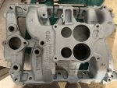

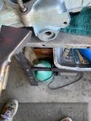

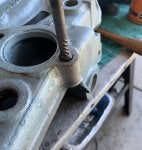

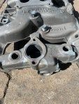

**@kevnord** (reply #9):
Good tip! I'll definitely keep that in mind. Appreciate it

**@kevnord** (reply #10):
What's really weird is that it I spray penetrating oil on the top of the thread it quickly runs down through the hole/threads and out the bottom. Seems like it should budge. Im not putting a ton of force into trying to turn it... Fearing I'll break the thread

**@geeteeohguy** (reply #11):
I would have left it alone. There was enough length to grab a nut, IMO. That said, at this stage you can soak it for a couple of weeks in Kroil, and try, or go right to the torch. You will likely be doing off the car repairs. And may have to source a new manifold, if labor becomes prohibitive. (6 hours to fix vs just buying a replacement manifold). You can try mild acid like vinegar over time, too. It will remove the rust. I usually soak parts in it, but have been known  to wrap them in saran wrap to keep the vinegar from evaporating.

**@kevnord** (reply #12):
Unfortunately, when I tried to attach the downpipe to it, there wasn't quite enough length to grab the nut. It was just short despite my best effort. :-( I tried that pretty early on. Maybe I'll try soaking it in something that's cast iron safe but may help things loosen up. Time to do some research.

**@kevnord** (reply #13):
Look at this abomination for sale on Amazon! Oof

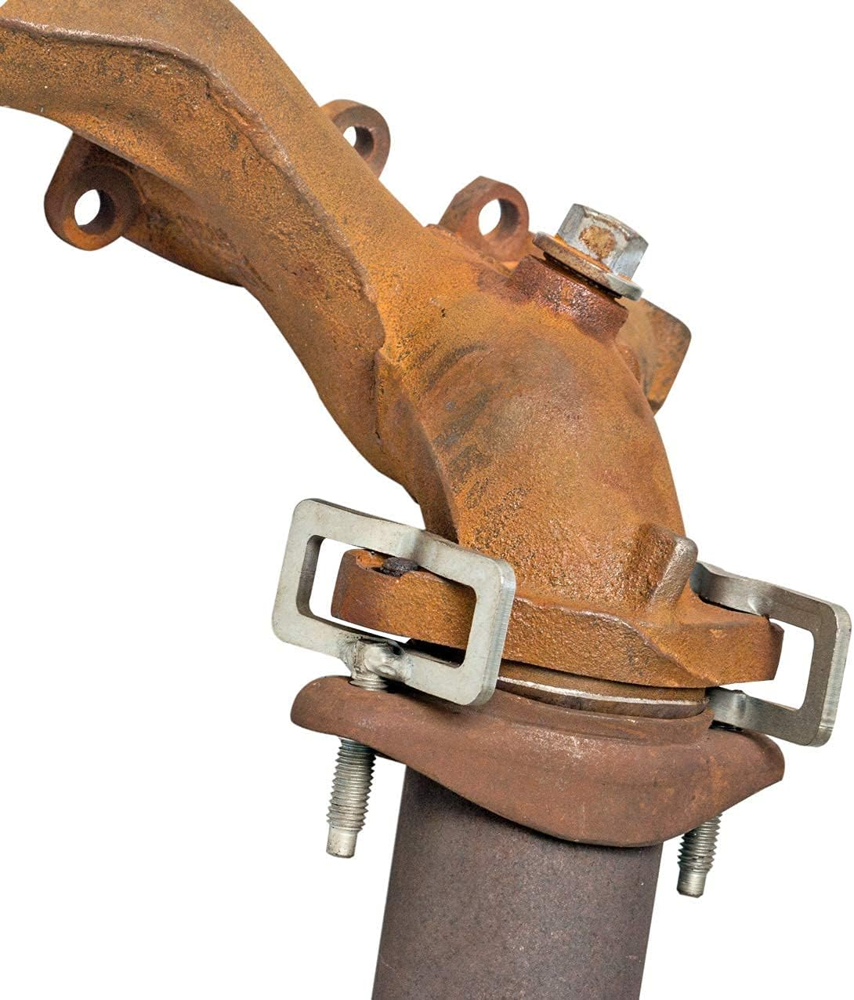

**@O52** (reply #14):
How about this fine example on eBay?  Only $50 BIN

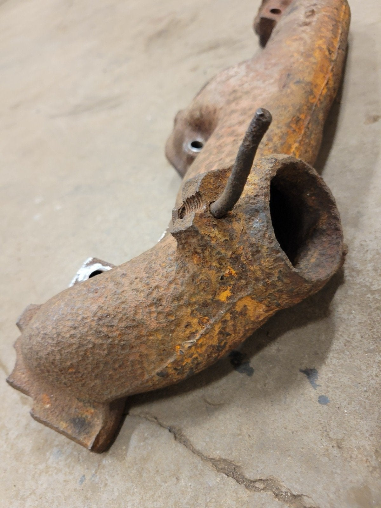
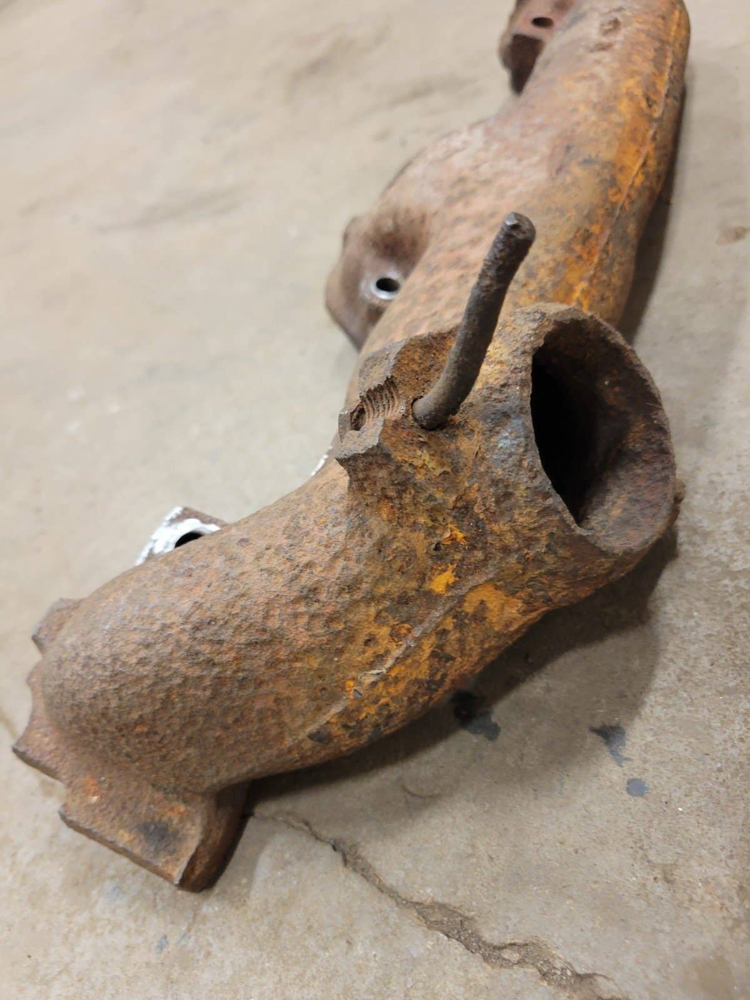

**@kevnord** (reply #15):
Sometimes you gotta do what you gotta do.

**@geeteeohguy** (reply #16):
> O52 said:
> How about this fine example on eBay?  Only $50 BIN

This belongs with that $20,000 core engine and TH400 for sale in that old F-100 truck!! 

    View attachment 200199
    

        
        Click to expand...

**@Mleads310** (reply #17):
You can try to soak it in something like rust off or rust eez, I can’t remember the name, but it’s an acid that I used to soak and intake manifold and all the rust was off 24 hrs later

**@geeteeohguy** (reply #18):
Diluted muriatic acid will work in a few minutes but be sure to neutralize with baking soda right after. I hear you on the stud being too short. Always seems to be the case.

**@Mleads310** (reply #19):
This is what I used it took the rust off the manifold without removing the paint it worked pretty well.

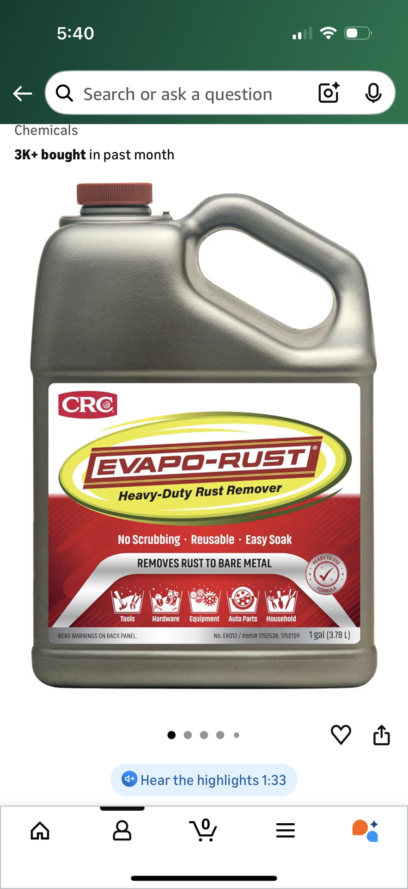

**@ponchonlefty** (reply #20):
you say the penetrating oil will go thru? an old trick was wax melted into the
threads. it might work in this case. i think army suggesting the torch may be
the winner. or just cut it flush and drill it out and retap it. 3/8-16 i think.
tap drill size 5/16 for 75 percent threads. 

is it still on the engine? if so leave it. those bolts in the head might snap
off too. then its a whole lot more work involved.

**@Spode Oden** (reply #21):
Here’s a trick I learned from an old guy who restored old tractors. It makes sense and it works with patience. You need to heat the bolt only. The bolt tries to expand inside the cold casting. As it cools, it shrinks, loosening the fit and busting the rust. Do this for several cycles, letting the assembly completely cool. Each time the bolt shrinks more. Eventually it will turn out. If the bolt is broken off, place a larger nut and try to weld the inside of the nut to the stud. The welder heats the bolt only. The nut will twist off and you try it again and again. When the stud has shrunk enough, it will twist out. it takes time to let the assembly cool every time. 
I’ve done it on my own machinery that looked hopeless and it works!!

**@armyadarkness** (reply #22):
> Spode Oden said:
> Here’s a trick I learned from an old guy who restored old tractors. It makes sense and it works with patience. You need to heat the bolt only. The bolt tries to expand inside the cold casting. As it cools, it shrinks, loosening the fit and busting the rust. Do this for several cycles, letting the assembly completely cool. Each time the bolt shrinks more. Eventually it will turn out. If the bolt is broken off, place a larger nut and try to weld the inside of the nut to the stud. The welder heats the bolt only. The nut will twist off and you try it again and again. When the stud has shrunk enough, it will twist out. it takes time to let the assembly cool every time.
I’ve done it on my own machinery that looked hopeless and it works!!
        
        Click to expand...
IME, there are many tips and tricks that work very well... but it's not the root-situation that makes it difficult... it's the initial haste that takes it from a "bummer" to a nuclear catastrophe.

**@armyadarkness** (reply #23):
Man ed, these are some loud sneakers!

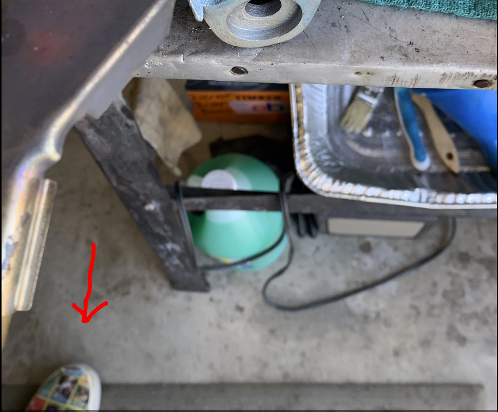

**@O52** (reply #24):
> armyadarkness said:
> Man ed, these are some loud sneakers!

    View attachment 200195
    

        
        Click to expand...
Hey, I represent that! 
Those are NAT GEO (National Geographic) Vans.  They show numerous Nat Geo magazine covers.  I completely wore them out to the point that I had more sock showing then tread. 

I like Vans sneakers, and buy a new pair or two every couple years.
My current Vans are from 'In-N-Out'.  I have three pairs.  An old white pair for working around the house or garage.  A newer white pair for when I leave the house, and a black pair for Church.

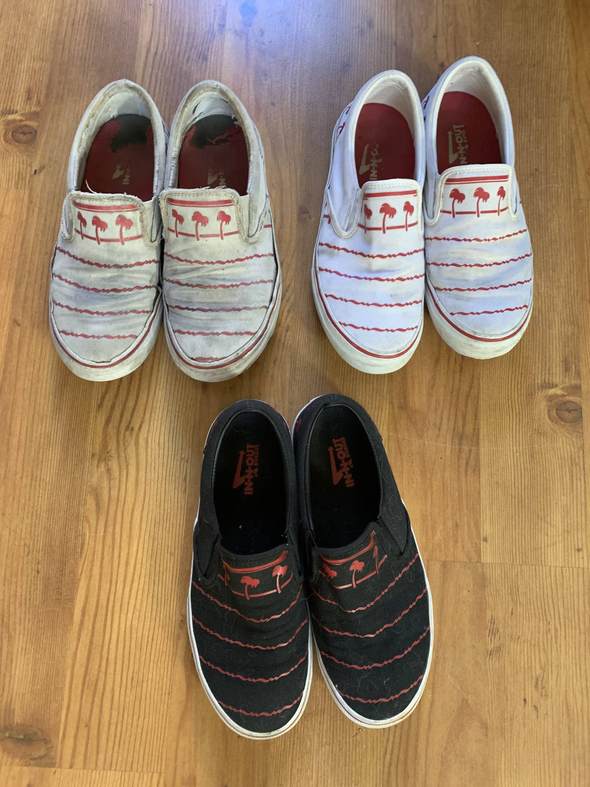
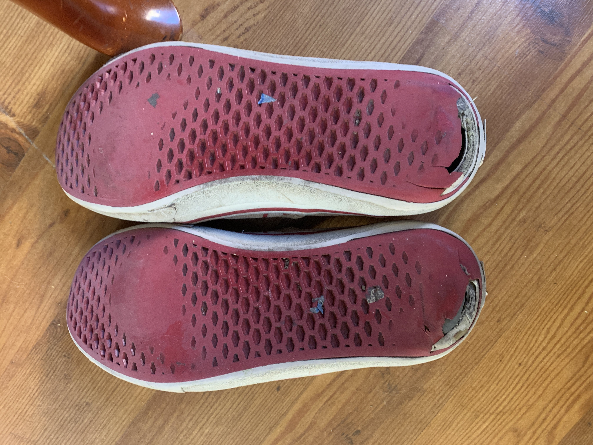

**@armyadarkness** (reply #25):
> O52 said:
> I like Vans sneakers, and buy a new pair or two every couple years.
        
        Click to expand...
I had no idea you were a fan... Im a collector!

Ive worn boots all day, every day, since the early 80's, even with shorts... so getting the right sneaker was tough to do. But one day I discovered that Vans makes a zombie apocalypse sneaker boot, so I bought a pair. Man, they're the comfyest thing ever, 100% bullet proof (you can scrub them with dish soap and water and a stiff bristle brush and they'll look brand new and still be dry inside), soles NEVER wear out (been wearing the current pair to work daily for the last two years, running around like a nut, working on the car, doing construction from 6am to 12am, traction is insane (I walk on my metal roof with them), and they're insulated so they're warm as Hell in the winter, but breathe in the summer... 

And they're a lot cheaper than basketball sneakers or work boots (depending on your style $90-$150)... and they have a customizer so tha tyou can design your own!

And all of that is from the regular version... if you're real hard-core, they have a Gortex model!

MTE-2 SK8 HI

Buy em now, thank me later! Here's my newest pair!

**@armyadarkness** (reply #26):
> O52 said:
> Those are NAT GEO (National Geographic) Vans.
        
        Click to expand...
Dammit! Okay guys you were right, they're not the Partridge Family after all.

**@Lok** (reply #27):
Franks has a couple of sets that look satisfactory,  exhaust manifolds, not shoes. 
Lok

**@armyadarkness** (reply #28):
Speaking of shoes, if any of you have a Tom McAn 67 GTO, this building still exists in Asbury Park NJ and it's a super cool location, which is actually in the Rock n Roll Hall of Fame. Does anyone here have a Great One car? I never saw one.

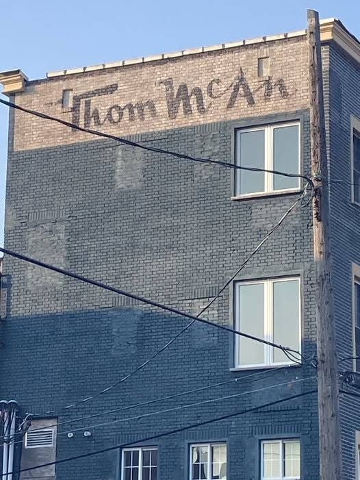

**@Lok** (reply #29):
More importantly does anyone have the Tom McAn GTO shoes?  I know they made them, just never saw a pair..
.Lok

**@armyadarkness** (reply #30):
I dont have Tom McAn's shoes but I do have Prince Albert in the can and I know who's buried in Grants Tomb.

**@kevnord** (reply #31):
Update... been chipping away at various projects and finally have resolution on the stuck stud. Despite throwing heat and penetrating oil at it multiple times, the stud would not budge and just gotta chewed up. Finally decided to drill it out. Was hoping to get luck and maybe save the threads but was not successful. That said, it's out and I'm going with a strong bolt through it. Not "perfect" but I'm satisfied. 

    
        
            
        
        
            
                
                
            
        
    
    

And the exhaust has been cut and hung. Just need to align and tighten!

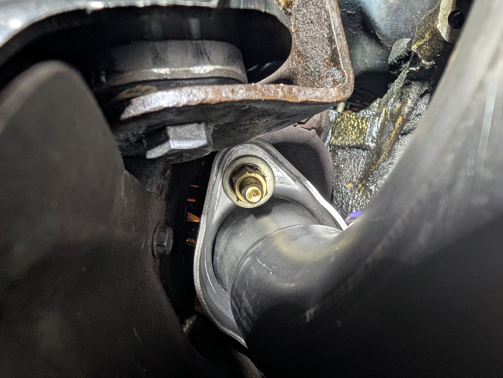
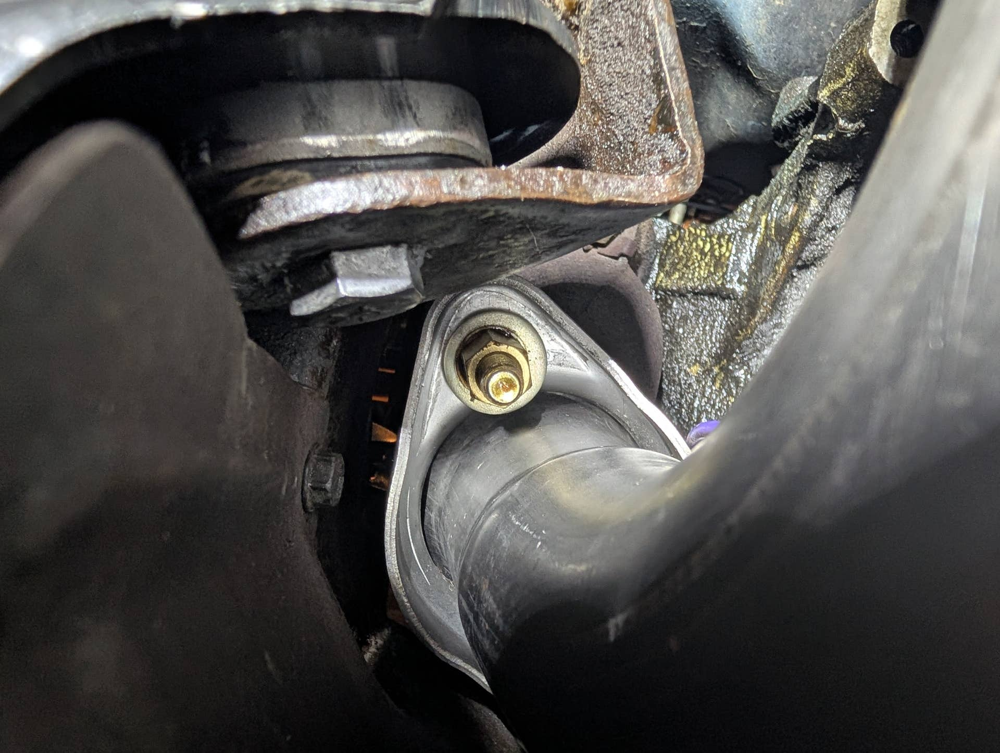

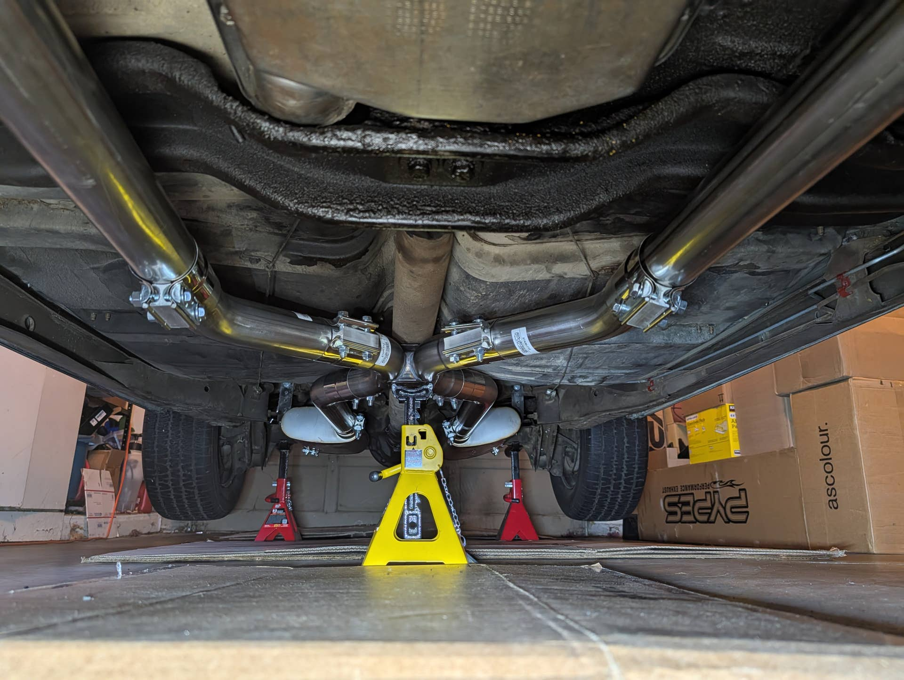

**@joeyc6365** (reply #32):
wow, a thing of beauty

**@geeteeohguy** (reply #33):
The bolt will last forever. 👍

## Images

