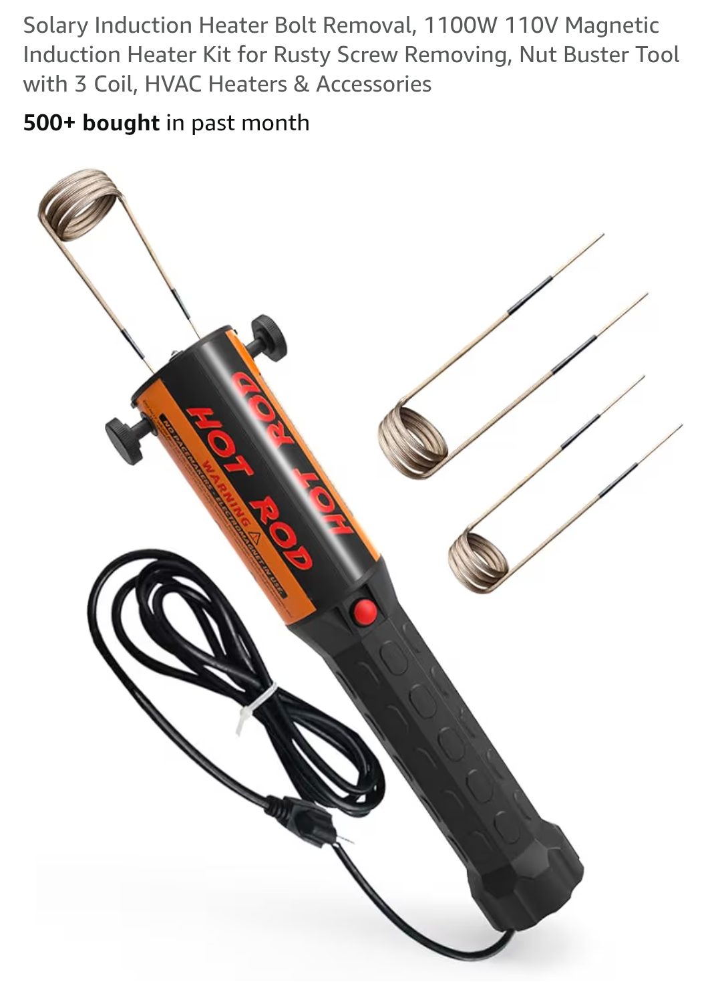

# Induction Heater bolt removal
**Forum:** GTO Forum | **Started:** November 20, 2025 | **Replies:** 12
**Thread URL:** https://www.gtoforum.com/threads/induction-heater-bolt-removal.150785/post-1058976

## The Issue
This is one of my favorite tools.  Although it's not cheap, this tool comes in handy when dealing with rusty nuts and bolts. I use mine a couple times a year and am always impressed. Used it today on some stubborn down pipes.   Nice to not have to use a flame... Bolts and nuts are literally red hot within 20-30 secs.  A handful of companies make them

## Solution / Outcome
> lewan said: > Newbie wrencher here.  I am struggling to remove body mount bolts on a '68 GTO and I like the idea of any tool that would make this job easier.  6 out clean now, but the #3 mount bolt (or captured nut) busted in place. I still have all of the passenger side to attempt.  Can I use this tool for a body bolt that is surrounded by the rubber mount for the remaining mounts?  Is there a realistic chance of burning up the rubber...and my garage at the same time?  Does anyone a brand of...

## Key Advice
- **@Mleads310**: I purchase something similar called the bolt buster.  Pricey but the few times I needed it it’s paid itself back already!
- **@Jimmy1229**: Can the preformed elements be bent to form a right angle?  I'm needing to remove the bolts from a 65 gto rear bumper that's under the gas tank, will the heat of the element cause me to go up in smoke?
- **@lewan**: Newbie wrencher here.  I am struggling to remove body mount bolts on a '68 GTO and I like the idea of any tool that would make this job easier.  6 out clean now, but the #3 mount bolt (or captured nut
- **@geeteeohguy**: Rusty nuts and bolts....what are those?

## Helpers
- **@Mleads310** — 4 post(s)
- **@Jimmy1229** — 1 post(s)
- **@lewan** — 4 post(s)
- **@geeteeohguy** — 1 post(s)

## Thread Summary

### Kevin's Original Post
This is one of my favorite tools.

Although it's not cheap, this tool comes in handy when dealing with rusty nuts and bolts. I use mine a couple times a year and am always impressed. Used it today on some stubborn down pipes. 

Nice to not have to use a flame... Bolts and nuts are literally red hot within 20-30 secs.

A handful of companies make them

### Replies

**@Mleads310** (reply #1):
I purchase something similar called the bolt buster.  Pricey but the few times I needed it it’s paid itself back already!

**@Jimmy1229** (reply #2):
Can the preformed elements be bent to form a right angle?
 I'm needing to remove the bolts from a 65 gto rear bumper that's under the gas tank, will the heat of the element cause me to go up in smoke? And ruin my day.

**@kevnord** (reply #3):
> Jimmy1229 said:
> Can the preformed elements be bent to form a right angle?
I'm needing to remove the bolts from a 65 gto rear bumper that's under the gas tank, will the heat of the element cause me to go up in smoke? And ruin my day.
        
        Click to expand...
Yep, you can bend the elements as needed to help you get to the spot you're trying to hit.

Things (any surface oil) will smoke and sizzle but the element itself doesn't get hot. You gotta read the instructions cause it's important that you heat the nut or whatever surrounds the bolt, not the bolt itself.

Obviously Be super careful since you're near gas.

**@Mleads310** (reply #4):
I would absolutely not use this tool near a gas tank.  It gets cherry red and anything within an inch or so of it will be the same.

**@Mleads310** (reply #5):
I have use it once to bend rebar tho and it worked great

**@lewan** (reply #6):
Newbie wrencher here.  I am struggling to remove body mount bolts on a '68 GTO and I like the idea of any tool that would make this job easier.  6 out clean now, but the #3 mount bolt (or captured nut) busted in place. I still have all of the passenger side to attempt.  Can I use this tool for a body bolt that is surrounded by the rubber mount for the remaining mounts?  Is there a realistic chance of burning up the rubber...and my garage at the same time? 

Does anyone a brand of Induction Heater that they do Not like...or are they all pretty much the same?

Any suggestions...other than cutting an access hole in the rocker panel (yeah, its a convertible and I am concerned about long term strength / stability) to access that captured nut at position 3? 

  Thanks

**@kevnord** (reply #7):
> lewan said:
> Newbie wrencher here.  I am struggling to remove body mount bolts on a '68 GTO and I like the idea of any tool that would make this job easier.  6 out clean now, but the #3 mount bolt (or captured nut) busted in place. I still have all of the passenger side to attempt.  Can I use this tool for a body bolt that is surrounded by the rubber mount for the remaining mounts?  Is there a realistic chance of burning up the rubber...and my garage at the same time?

Does anyone a brand of Induction Heater that they do Not like...or are they all pretty much the same?

Any suggestions...other than cutting an access hole in the rocker panel (yeah, its a convertible and I am concerned about long term strength / stability) to access that captured nut at position 3?

  Thanks
        
        Click to expand...
It'll definitely melt the rubber and smoke/stink. I bought mine specifically to remove old control arm bolts that were surrounded by rubber. It melted them. There isn't a flame or spark, just heat. So safer than a torched but it's still good to be cautious around flammables.

I purchased the cheapest one on Amazon and it works just fine. The brand is Solary or something like that.

Heat around the bolt you're trying to remove, not directly on the bolt itself. Watch lots of YouTube how tos.

**@lewan** (reply #8):
Thanks for the quick response and the expert advice - Much appreciated - Lewan

**@geeteeohguy** (reply #9):
Rusty nuts and bolts....what are those?

**@Mleads310** (reply #10):
It will definitely melt the rubber, but what I would suggest doing is soak them with Krol and buy yourself a 12 inch Swedish wrench. I know it sounds stupid. The Swedish wrench actually locks down as you go to loosen the bolt.

**@lewan** (reply #11):
Thanks for the advice...Much appreciated

**@lewan** (reply #12):
Follow up to induction heater melting rubber body mounts.  Yep, it sure can....and when that melted rubber drips on to your hand you will commence to hyphenate four letter words into a cursing string of expletives that would make a paratrooper blush.  So chalk this up to "Every Day is a School Day" and make sure you have a good pair of leather insulated gloves.  Just a newbie learning by impact, pinch, burn, bruise and concussion....but enjoying every minute of learning how to wrench.

## Images

