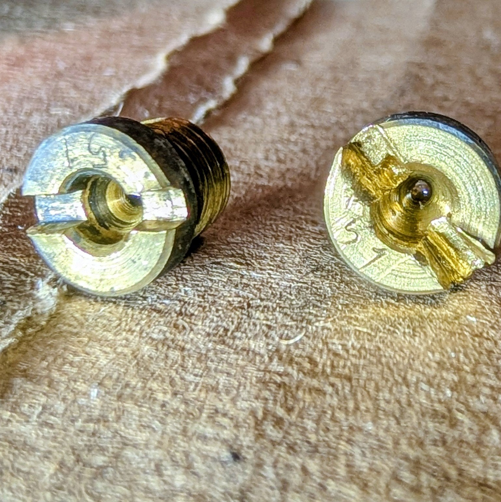
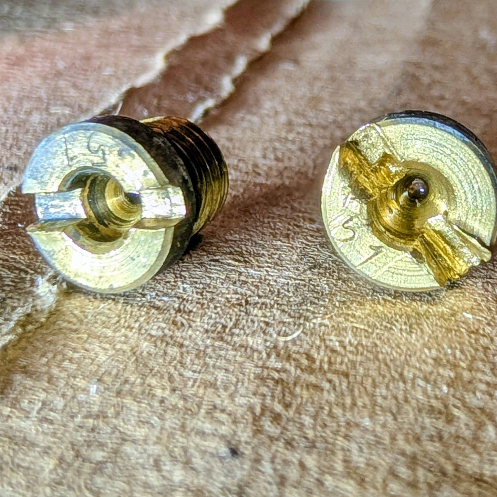
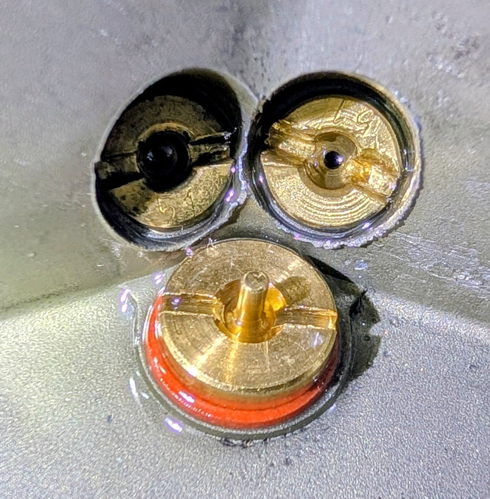
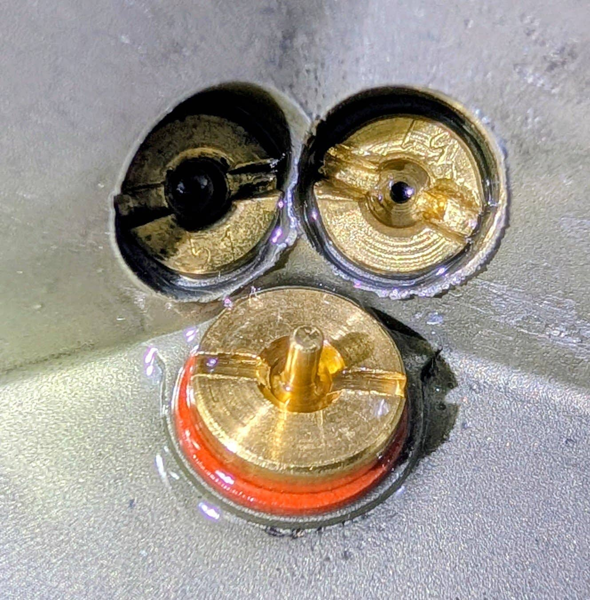
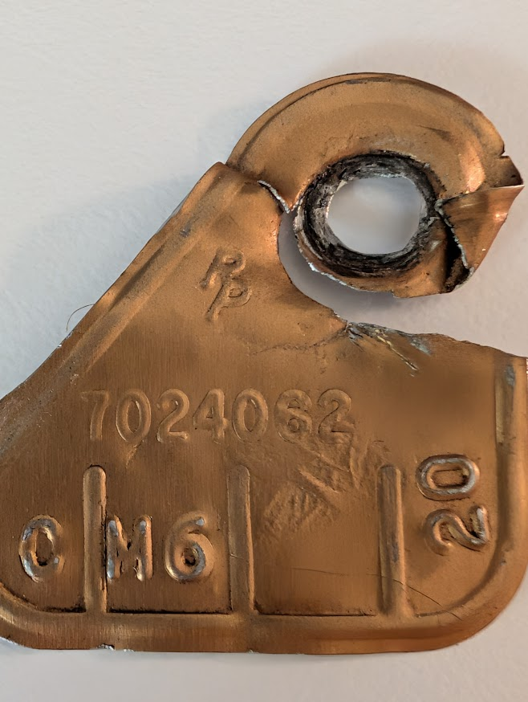
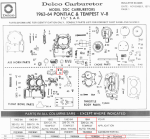
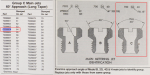

# Jet size for Rochester 2GC 2bbl
**Forum:** GTO Forum | **Started:** March 31, 2026 | **Replies:** 50
**Thread URL:** https://www.gtoforum.com/threads/jet-size-for-rochester-2gc-2bbl.151598/post-1068970

## The Issue
Hey guys, What jet size do you think I should be running in my Rochester 2GC 2bbl? 326ci in a 64 Tempest.  Mike's Carbs and other sources indicate .064 +- .002.  However, just opened up my carb and found the jets say 51. :-/  Thoughts?  (I beat up the jets pulling them out) I'll be replacing them.

## Solution / Outcome
> stoveboltgeek said: > There's a difference between running smoothly and producing the power it was meant to produce. I had some "interesting times" getting my '57 Chevy to run the way it should. It ran smoothly, but having driven a number of similarly equipped '57s, I knew it wasn't delivering the power it should. Without that previous driving experience, I would have thought everything was normal.  I'm guessing your 326 will surprise you in a good way once you get the 64s installed....

## Key Advice
- **@ponchonlefty**: why did you remove them? is this the correct carb? unless you put headers or a cam change the stock jet should be fine.
- **@lust4speed**: If you were driving the car around and the car was fine then that's the jet size it needs.  Number one rule in tuning is give the engine what it wants and ignore information that contradicts what work
- **@Scott06**: agreed if the plugs look good the jets are right.  Also have a special flat head in my toolbox that is ground down to be a bit fatter.
- **@rockdoc**: None of my docs for the Rochester 2bbl carbs lists jet size, but general info I have says the original main jet size is generally in the low‑.06x range (about .060–.064 inch), unless a rebuilder has c
- **@stoveboltgeek**: I've got original Rochester catalogs that cover all the carbs they built through 1978 or 1979. However, we're moving, so the catalogs are at the new house while I'm at the old one at the moment.   If 
- **@Greek64GTO**: I've used Mike's and find him to be knowledgeable.  It just might be he is thinking tri-power, but only one of them! If that is the case he is aiming at the top of the range. I would take a .057" jet,
- **@gto4ben**: Stock jet for 7024062 is 7008664.
- **@67GoatGuy**: While I agree about using the factory specs to set it up, the accelerator pump timing is a key issue. Look down the bore and see if you get fuel from the accelerator pump discharge nozzle as soon as y
- **@gidkid**: Well, a 326 is a very neat engine. That being said, my 350 had a 2GC with 58 jets. I have 62 jets in the 2GC center carb in the tripower setup for my 400 RAIII.  I would say 51 jets for a 326 is not u
- **@maw2078826_6037**: It depends upon several factors, compression, cam, and elevations is a big factor. When I lived on the east coast in the low country I ran .062's in the center, and .068's in the end carbs in my 1966 
- **@TinTiger**: > kevnord said: > Hey guys, What jet size do you think I should be running in my Rochester 2GC 2bbl? 326ci in a 64 Tempest.  Mike's Carbs and other sources indicate .064 +- .002.  However, just opened
- **@kurzhar**: Hey Kev, my 64 Lemans 326 came stock with 64 size jets. I had to change out to 60's due to elevation 8200 ft.

## Helpers
- **@ponchonlefty** — 7 post(s)
- **@lust4speed** — 1 post(s)
- **@Scott06** — 5 post(s)
- **@rockdoc** — 3 post(s)
- **@stoveboltgeek** — 7 post(s)
- **@Greek64GTO** — 1 post(s)
- **@gto4ben** — 1 post(s)
- **@67GoatGuy** — 3 post(s)
- **@gidkid** — 4 post(s)
- **@maw2078826_6037** — 1 post(s)
- **@TinTiger** — 1 post(s)
- **@kurzhar** — 1 post(s)

## Thread Summary

### Kevin's Original Post
Hey guys,
What jet size do you think I should be running in my Rochester 2GC 2bbl? 326ci in a 64 Tempest.

Mike's Carbs and other sources indicate .064 +- .002.

However, just opened up my carb and found the jets say 51. :-/

Thoughts?

(I beat up the jets pulling them out) I'll be replacing them.

### Replies

**@ponchonlefty** (reply #1):
why did you remove them? is this the correct carb?
unless you put headers or a cam change the stock jet should
be fine.

**@kevnord** (reply #2):
It's the right, original carb. 
7024062 model.

I had the carb professionally rebuilt two years ago when I didn't have time nor confidence to do it myself). They replaced the jets, but I don't know what they took out. It looks like .051 is approiate for a '65 2GC.

I've been battling throttle response a bit since then. :-/

**@ponchonlefty** (reply #3):
> kevnord said:
> It's the right, original carb.
7024062 model.

I had the carb professionally rebuilt two years ago when I didn't have time nor confidence to do it myself). They replaced the jets, but I don't know what they took out. It looks like .051 is approiate for a '65 2GC.

I've been battling throttle response a bit since then. :-/
        
        Click to expand...
how does the plugs look? many things can effect throttle response.
its possible the spray pump is cracked. is it the tip in?
clogged passages of dried fuel? vacuum leak? or the wrong jets.
 
i cant find a jet size in my book just settings. maybe read the plugs
and look for possible vacuum leaks. being a 326 i would think the jets
would be smaller than a 350-455 engine. .051 i bet is stock.

**@lust4speed** (reply #4):
If you were driving the car around and the car was fine then that's the jet size it needs.  Number one rule in tuning is give the engine what it wants and ignore information that contradicts what works.

I made up a dedicated screwdriver for removing/installing jets by grinding the tip to fatten it up where it fits the slot tight, and then reduced the blade width to the same size as the jet OD.  Now even stubborn jets come out without damage.

**@kevnord** (reply #5):
Completely agree. That's a lesson I've learned (a few times!) 

The car/engine idles nicely and runs well except for acceleration which hesitates upon acceleration unless I back out the idle screws more that I should. I realize that's not a proper solution and I've tried many other things to get rid of the lag, have it feel more "right" and haven't been able to quite get it. I've never messed or thought about the jets until I had it open and wanted to confirm they're right.

**@Scott06** (reply #6):
agreed if the plugs look good the jets are right.

Also have a special flat head in my toolbox that is ground down to be a bit fatter.

**@rockdoc** (reply #7):
None of my docs for the Rochester 2bbl carbs lists jet size, but general info I have says the original main jet size is generally in the low‑.06x range (about .060–.064 inch), unless a rebuilder has changed them. Has this car/carb ever lived at higher elevations? I re-jetted my Buick's 2 bbl Rochester to smaller jets back in the day when I lived in northern NM at 7,000 ft.
But I agree, check the plugs. They will give you a clue as to whether your current jets are too small. How do they look?

**@stoveboltgeek** (reply #8):
I've got original Rochester catalogs that cover all the carbs they built through 1978 or 1979. However, we're moving, so the catalogs are at the new house while I'm at the old one at the moment. 

If your engine is stock, I can look up the original jets, and that's what I would run. That is, unless you live at a higher elevation (typically above 5000 feet), in which case you need to lean it down as rockdoc mentioned.

**@kevnord** (reply #9):
Engine is stock and has spent it's life in central california (not higher elevation).

**@Greek64GTO** (reply #10):
I've used Mike's and find him to be knowledgeable.  It just might be he is thinking tri-power, but only one of them!
If that is the case he is aiming at the top of the range.
I would take a .057" jet, throw it in and try it.  It is surely a step up from the .051" you pulled out.

Stock Carburetor Models & Jetting

TransmissionCarburetor ModelStock Main Jet SizeManual (Synchromesh)Rochester 7023071.057" to .063"Automatic (Hydra-Matic)Rochester 7023062.057" to .063"

**@kevnord** (reply #11):
I just pinged Mike as I too find him very knowledgeable and get most of my parts from him.
His site is the ONLY place I've found a jet size listed for my carbs specific number. That's were I'm getting the .064 which is why I was surprised when I opened it up and saw .051.

One of the reasons I am not convinced .051 is correct is because after having the carb professionally rebuilt two years ago, I had issues getting the car to start (which was not due to the carb, but I had the firing order incorrect, because I'm dumb). But, I sent the carb back to the rebuilder at the time (saying it seemed flooded) and they said the adjusted the float and replaced the jets. That's what is suspicious to me.

It'll be interesting to see what Mike says...

**@Scott06** (reply #12):
what do the spark plugs look like and you mentioned that you have trouble accelerating- is the pump rod linkage free of slop? You may have to bend the rod so that it starts pump ing as soon as throttle moves. 

Not sure if those sizes are in the tempest shop manual I'll look tonight. I would think if you are supposed to have a .064" and you are running a .051 you would be way learn and it would run like chit. 

Also on the ignition, if you have a good hot spark the slightest wiff of gas and it will fire up. Keep a spark gap tester - know what the spark looks like when its running well. I had a failing coil on an outboard motor. If you pulled a plug you would see a spark, but would not jump chit on the gap tester... Ohmed the coils and they were bad, new coils and it ran like a raped ape...

**@kevnord** (reply #13):
> Scott06 said:
> what do the spark plugs look like and you mentioned that you have trouble accelerating- is the pump rod linkage free of slop? You may have to bend the rod so that it starts pump ing as soon as throttle moves. 

Not sure if those sizes are in the tempest shop manual I'll look tonight. I would think if you are supposed to have a .064" and you are running a .051 you would be way learn and it would run like chit. 

Also on the ignition, if you have a good hot spark the slightest wiff of gas and it will fire up. Keep a spark gap tester - know what the spark looks like when its running well. I had a failing coil on an outboard motor. If you pulled a plug you would see a spark, but would not jump chit on the gap tester... Ohmed the coils and they were bad, new coils and it ran like a raped ape...
        
        Click to expand...
Spark plugs look good. Pump rod linkage free of slop. I've messed around with the rod a lot at this point, making it longer and shorter. Hard to get it just right.

I have shop manual (and a Rochester 2GC manual) but neither have the number in them. :[(

The engine definitely doesn't run like chit. It's only the acceleration ath doesn't feel quite right unless I really turn out the idle screws. I understand that the idle circuit is it's own thing and isn't directly involved in acceleration, but it seems to be compensating a bit when I do take it out to 2.5 turns. But then it gets really gassy smelling.

I've upgraded to HEI at this point (after replacing coil, points, wires). That did not help or make things worse. Engine seems to run smoother at idle if anything.

**@Scott06** (reply #14):
> kevnord said:
> Spark plugs look good. Pump rod linkage free of slop. I've messed around with the rod a lot at this point, making it longer and shorter. Hard to get it just right.

I have shop manual (and a Rochester 2GC manual) but neither have the number in them. :[(

The engine definitely doesn't run like chit. It's only the acceleration ath doesn't feel quite right unless I really turn out the idle screws. I understand that the idle circuit is it's own thing and isn't directly involved in acceleration, but it seems to be compensating a bit when I do take it out to 2.5 turns. But then it gets really gassy smelling.

I've upgraded to HEI at this point (after replacing coil, points, wires). That did not help or make things worse. Engine seems to run smoother at idle if anything.
        
        Click to expand...
on a 2G the idle and transition circuit are active until just under 2000 rpm, or at least that is when I can see gas start coming off the main booster on mine. once you get just past idle the transition slots start feeding the fuel so I can see the idle mix screws having much to do with it.

is the spark advance hanging up? I just got a new engine from Spotts Performance and he set the dist up with no vacuum advance. I questioned this as I had always found idle better with the vac can of full manifold vacuum. It was mentioned that the throttle response would be better with no vac advance ( 16 or so initial and 36 total or so) . Based on the little i have driven it I would say throttle response is excellent and I'm still dialing in the tripower... So kind of brings up the importance of ignition advance in throttle response. Since you have tried a number of things might be worth bumping the initial timing and seeing if that moves the situation at all. Also would watch with a timing light how the advance moves when you stab the gas.  If your 64 is like my 65 326 2 bbl that I had years ago I believe compression is 8.6 or so.

if the plugs are good I would think your jetting is fine. you certainly could drill out the existing ones two thou and see if it changes anything

**@kevnord** (reply #15):
Heard back from Mike. He doesn't have the OE spec for the carb even though he has it listed as .064. He said to look at the plugs. :-/
So I'm not sure if I should proceed with the .064, stay with .051 or something else

**@ponchonlefty** (reply #16):
what color are the plugs? how far has it been driven? can you take a pic?
seeing the plugs might help with opinions.

**@gto4ben** (reply #17):
Stock jet for 7024062 is 7008664.

**@kevnord** (reply #18):
This is FANTASTIC @gto4ben ! Very helpful. Thank you.
Where did you find this doc?

**@stoveboltgeek** (reply #19):
While too-small jets are obviously an issue, double check your accelerator pump action. The correct jets may solve the stumble, but my first thought was your rich idle mixture is compensating for a marginal accelerator pump. 

@gtoben has the sheet I was going to use to look this up. The entry angle of the jets is another important factor that's often overlooked.

**@kevnord** (reply #20):
> stoveboltgeek said:
> While too-small jets are obviously an issue, double check your accelerator pump action. The correct jets may solve the stumble, but my first thought was your rich idle mixture is compensating for a marginal accelerator pump.

@gtoben has the sheet I was going to use to look this up. The entry angle of the jets is another important factor that's often overlooked.
        
        Click to expand...
I've replaced the accelerator pump and have adjusted the linkage to increase/decrease the pump, a few times trying to figure it out.  At this point, I've checked most things it could be off the list. Jet size is one of the last remaining things. The stumble isn't terrible, but it bothers me so I keep trying (and learning).

**@rockdoc** (reply #21):
I know you replaced the accelerator pump, but have you checked that you get a good squirt (or two) of gas when you look down the carburetor? If you do, that would seem to rule it out as a contributor to your problem.

**@kevnord** (reply #22):
Yeah, I do get a good, strong couple of squirts.

**@rockdoc** (reply #23):
I suppose that you removed your carburetor when you had it rebuilt (obviously...), so I wonder if you have a leak now, i.e., it's not tightened down properly, or you don't have the correct gasket to the intake manifold. Just one more thing to check.

**@stoveboltgeek** (reply #24):
As far as adjusting the accelerator pump, set it according to the shop manual spec, and then don't mess with it anymore. The key is - if every piece of every component meets factory specs, it should run exactly like the factory intended.

On the suggestion of going a bit richer due to modern gas - I'd say that depends on whether you use E10 or ethanol-free. I always use the latter in any carbureted engine - even my lawn mower. Ethanol does require a richer A/F mixture to have stochiometric combustion, but don't go wild on bigger jets on account of it. Start with the stock jets. If it seems to still be running lean, 1 step rich should be plenty.

**@kevnord** (reply #25):
Yep, that's the plan.  I'm trying to use factory specs as much as possible. I'm lucky that I have a local place with ethanol free gas, so that's what I get. I use it in my lawnmower as well. 

I'm really surprised the engine doesn't run terrible with the .051 jets, but I've heard the 326 is pretty forgiving

**@stoveboltgeek** (reply #26):
I have no experience with the 326, but I have a fair amount of experience with the Chevy 283. As a pre-pollution engine, it's quite forgiving. If a 283 isn't running the way it ought to, something is very much wrong.

**@kevnord** (reply #27):
> stoveboltgeek said:
> I have no experience with the 326, but I have a fair amount of experience with the Chevy 283. As a pre-pollution engine, it's quite forgiving. If a 283 isn't running the way it ought to, something is very much wrong.
        
        Click to expand...
I have the new .064 jets in but waiting of another part before i can mount it back in.
One other interesting thing, I put in a AFR gauge a couple months back to get more info on how things were running. I only took it out once, but it was always running quite lean but seemed fine-ish. I installed a new exhaust system over the winter and there is still an exhaust leak (or two) to address when I have time. I figured lean AFR value was likely air getting in at the exhaust flange to manifold connection which comes before the AFR sensor. Still need to check that.

**@67GoatGuy** (reply #28):
While I agree about using the factory specs to set it up, the accelerator pump timing is a key issue. Look down the bore and see if you get fuel from the accelerator pump discharge nozzle as soon as you crack the throttle, if it’s delayed even a little your going to have a stumble.

**@ponchonlefty** (reply #29):
drilling the squirters?

**@stoveboltgeek** (reply #30):
No. The accelerator pump "shooter" holes are sized for the needs of the particular engine.

Accelerator pumps are an interesting topic unto themselves. They have a return spring to take up any slack in the linkage. If you do have slack, you have the wrong return spring.

They also have a duration spring. If you're idling and abruptly floor the accelerator, the accelerator pump cannot immediately bottom out (gasoline isn't compressible, so something will break). Instead, the duration spring compresses. Then, the spring will steadily expand, forcing gas out of the shooter holes in a measured manner.

And, that's why you don't enlarge the shooter holes - you'll go richer than designed. You'll also empty the accelerator well more quickly than designed, so you'll probably then go lean. So, you could conceivably have a combination rich-lean stumble.

An interesting exception to the above discussion of the springs is the Carter BBD 2 barrel (found mostly on Mopars). Its duration spring is positioned such that it also takes up the slack in the linkage, so it only requires 1 spring.

**@gidkid** (reply #31):
Well, a 326 is a very neat engine. That being said, my 350 had a 2GC with 58 jets. I have 62 jets in the 2GC center carb in the tripower setup for my 400 RAIII. 
I would say 51 jets for a 326 is not unreasonable. You could go richer, maybe 52-54 for your sweet 326. 
Hope this helps.

**@stoveboltgeek** (reply #32):
> gidkid said:
> Well, a 326 is a very neat engine. That being said, my 350 had a 2GC with 58 jets. I have 62 jets in the 2GC center carb in the tripower setup for my 400 RAIII.
I would say 51 jets for a 326 is not unreasonable. You could go richer, maybe 52-54 for your sweet 326.
Hope this helps.
        
        Click to expand...
You didn't mention what year 350 you had. But, since the Pontiac 350 was introduced in 1968, some HC and CO emissions requirements were already in place. As such, mixtures were deliberately leaned just a bit. (It got worse as we went into the 1970s, but that's another story.)

Also, the 2GC came in two different physical sizes. I would have to look up the size of the 326, but IIRC the 350 used the larger 2GC.

**@gidkid** (reply #33):
> stoveboltgeek said:
> gidkid said: 
                
                
        
    
    
        
            Well, a 326 is a very neat engine. That being said, my 350 had a 2GC with 58 jets. I have 62 jets in the 2GC center carb in the tripower setup for my 400 RAIII.
I would say 51 jets for a 326 is not unreasonable. You could go richer, maybe 52-54 for your sweet 326.
Hope this helps.
        
        Click to expand...
    
You didn't mention what year 350 you had. But, since the Pontiac 350 was introduced in 1968, some HC and CO emissions requirements were already in place. As such, mixtures were deliberately leaned just a bit. (It got worse as we went into the 1970s, but that's another story.)

Also, the 2GC came in two different physical sizes. I would have to look up the size of the 326, but IIRC the 350 used the larger 2GC.
        
        Click to expand...
Sorry! My 350 was in a 1970 Firebird. I replaced the 350 2 bbl 2GC with a 1970 RAIII 400 with 66 GTO tripower. Automatic trans. The only mod I had to make to have a smooth idle with the tripower was to slightly enlarge the idle jet bores and idle pick up tubes.

**@maw2078826_6037** (reply #34):
It depends upon several factors, compression, cam, and elevations is a big factor. When I lived on the east coast in the low country I ran .062's in the center, and .068's in the end carbs in my 1966 Tri-power attached to a Pontiac 455 with an .068 High lift cam...it was a screamer.  However, when I mved to the mountains (4,600+ Elevation) I was in for a shock !...I had to drop the center 2GC to .058's for it to idle properly...I left the .068's in the end carbs as that that point you're just dumping fuel...which a 455 needs. A lot of it, just as with the Quadrajet, is trial & error.

**@TinTiger** (reply #35):
> kevnord said:
> Hey guys,
What jet size do you think I should be running in my Rochester 2GC 2bbl? 326ci in a 64 Tempest.

Mike's Carbs and other sources indicate .064 +- .002.

However, just opened up my carb and found the jets say 51. :-/

Thoughts?

(I beat up the jets pulling them out) I'll be replacing them.

    View attachment 204480
    

    View attachment 204481
    

        
        Click to expand...

**@67GoatGuy** (reply #36):
> ponchonlefty said:
> drilling the squirters?
        
        Click to expand...
You could but just moving the accelerator pump rod to the hole nearest the pump shaft will change the timing, for fine tuning you bend the pump linkage arm. In the 80’s we would hook up the sniffer and run it on the chassis dyno to get the mixture right, doing a tri-power takes a little effort but it’s certainly worth it. With the cool tools we have today it’s much easier.

> ponchonlefty said:
> drilling the squirters?
        
        Click to expand...

**@67GoatGuy** (reply #37):
Here’s a really good new tool to do it

    

    
        
            
                
                    
                        
                        
                
            
            
                
                    
                        The Carb Cheater
                    
                

                Helping people tune their carburetors

                
                    
                        
                    
                    thecarbcheater.com

**@ponchonlefty** (reply #38):
controlled air leak. kinda cool.

**@Scott06** (reply #39):
AFR meter is super helpful for things like this. I used mine on both my boat and GTO. on the boat (600 cfm marine Edlebrock) I found slop in the accelerator pump circuit that created a lean spot when taking off full throttle. I was adding more jet and had two wrongs trying to make a right... went way lean when you stabbed the gas and this took forever , then it swung back around to over rich. 

Never would have seen this detail reading plugs

**@gidkid** (reply #40):
Interesting comment about the accelerator pump lever holes. Don’t forget the fuel bowl vent on the top of the 66 tripower center carb. If it is open too much/too early it will affect your idle/idle transition.

**@kurzhar** (reply #41):
Hey Kev, my 64 Lemans 326 came stock with 64 size jets. I had to change out to 60's due to elevation 8200 ft.

**@kevnord** (reply #42):
That is very helpful! Thanks for letting me know. I wonder how my car will behave after going from 51 to 64... and I wonder how long it's been that way?! My guess is that the wrong jets were put in two years ago when I had it rebuilt professionally OR it was done many, many years ago, perhaps by yours-truly in ~1991. I remember rebuilding the carb back then but not sure about the jets.

Thank you so much!

**@ponchonlefty** (reply #43):
i wonder if the jets were drilled bigger?
i have seen that. you might check by getting a bit
for a gauge. maybe they could not get a 60?

**@kevnord** (reply #44):
> ponchonlefty said:
> i wonder if the jets were drilled bigger?
i have seen that. you might check by getting a bit
for a gauge. maybe they could not get a 60?
        
        Click to expand...
Not according to the eyeball test. They're noticably smaller than the new ones.

**@ponchonlefty** (reply #45):
> kevnord said:
> Not according to the eyeball test. They're noticably smaller than the new ones.
        
        Click to expand...
just a thought. i was tinkering with a q jet the other day and
a 48k rod measured 45. this can really drive you crazy if
not checking things like that. i guess it was wear idk.

**@Scott06** (reply #46):
If you were that under jetted , I can’t think your plugs would be anything but lean unless you checked them after idling. 

to get an accurate plug read of the main jets you need to be driving it a rpm on the main jets shut it off immediately , then pull a plug or two.

**@gidkid** (reply #47):
If you can, check the AFR to make sure your 326 is not running too rich🤙

**@kevnord** (reply #48):
I will. It was running really lean (but fine-ish) before I discovered the small jets

**@stoveboltgeek** (reply #49):
There's a difference between running smoothly and producing the power it was meant to produce. I had some "interesting times" getting my '57 Chevy to run the way it should. It ran smoothly, but having driven a number of similarly equipped '57s, I knew it wasn't delivering the power it should. Without that previous driving experience, I would have thought everything was normal.

I'm guessing your 326 will surprise you in a good way once you get the 64s installed.

**@kevnord** (reply #50):
> stoveboltgeek said:
> There's a difference between running smoothly and producing the power it was meant to produce. I had some "interesting times" getting my '57 Chevy to run the way it should. It ran smoothly, but having driven a number of similarly equipped '57s, I knew it wasn't delivering the power it should. Without that previous driving experience, I would have thought everything was normal.

I'm guessing your 326 will surprise you in a good way once you get the 64s installed.
        
        Click to expand...
Definitely. I don't have any frame of reference but have felt that something wasn't quite right. It'll be interesting... I'll report back when I test it out. Likely this weekend

## Images

