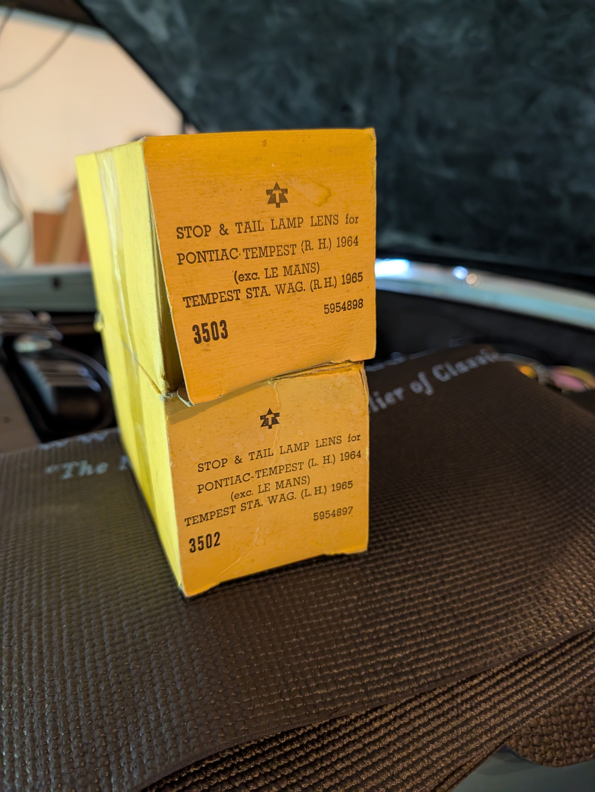
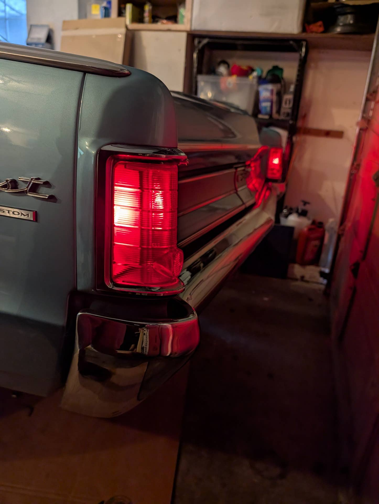
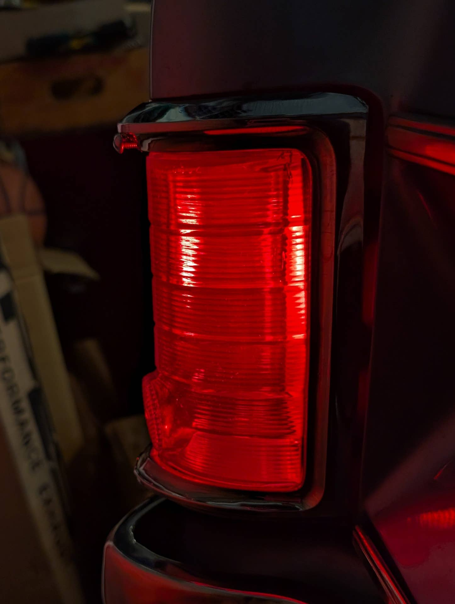
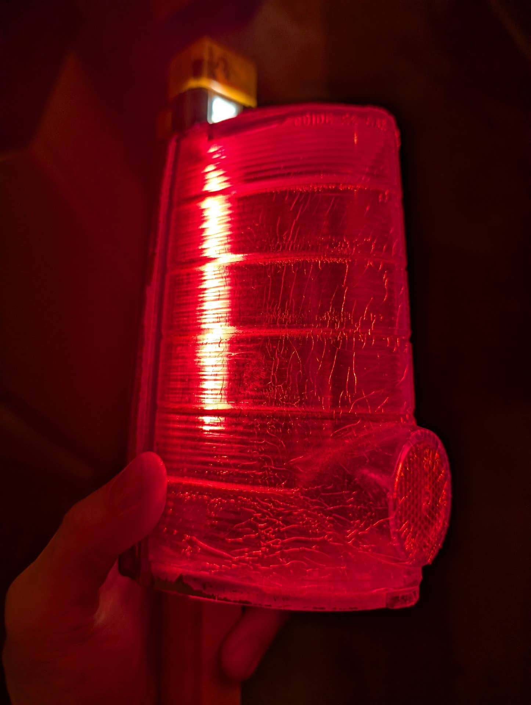
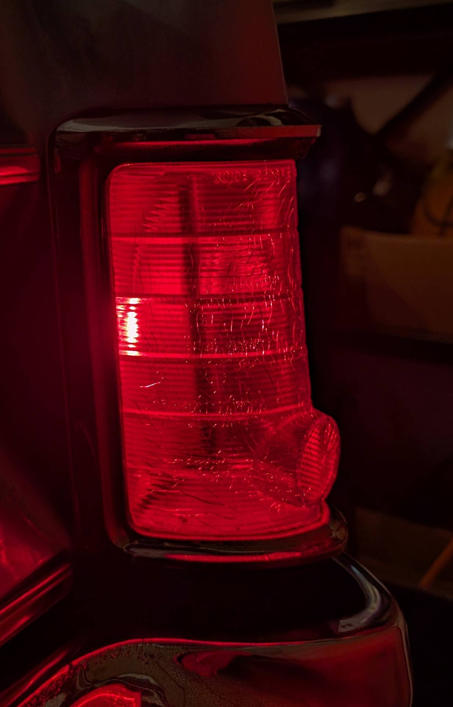

# New tail light lenses. So fresh, so clean!
**Forum:** GTO Forum | **Started:** December 8, 2025 | **Replies:** 4
**Thread URL:** https://www.gtoforum.com/threads/new-tail-light-lenses-so-fresh-so-clean.150923/post-1060554

## The Issue
Being a 64 Tempest owner, I've always been a bit envious of the GTO trim options.    That said, I love the tail lights on the Tempest. Just swapped out the original, cracked lenses for a NOS pair. Looks great!  New .....

## Solution / Outcome
Thanks! Lots of them on ebay but saw the pair I bought came with the boxes (kinda cool) and was only $35 for both shipped. Crazy deal! The seller has a ton of them and other cars/models.

## Key Advice
- **@Sick467**: Make'm POP!  Beautiful!
- **@integrity6987**: SCORE!!! Those look great - huge improvement.
- **@Greek64GTO**: "Being a 64 Tempest owner, I've always been a bit envious of the GTO trim options."  If you put a pencil to the rear tail lights for a 1964 GTO, you would cringe.  You did real good and you got to lov

## Helpers
- **@Sick467** — 1 post(s)
- **@integrity6987** — 1 post(s)
- **@Greek64GTO** — 1 post(s)

## Thread Summary

### Kevin's Original Post
Being a 64 Tempest owner, I've always been a bit envious of the GTO trim options.  

That said, I love the tail lights on the Tempest. Just swapped out the original, cracked lenses for a NOS pair. Looks great!

New ..

    
        
            
        
        
            
                
                
            
        
    
    

    
        
            
        
        
            
                
                
            
        
    
    

    
        
            
        
        
            
                
                
            
        
    
    

Original....

### Replies

**@Sick467** (reply #1):
Make'm POP!  Beautiful!

**@integrity6987** (reply #2):
SCORE!!! Those look great - huge improvement.

**@kevnord** (reply #3):
Thanks! Lots of them on ebay but saw the pair I bought came with the boxes (kinda cool) and was only $35 for both shipped. Crazy deal! The seller has a ton of them and other cars/models.

**@Greek64GTO** (reply #4):
"Being a 64 Tempest owner, I've always been a bit envious of the GTO trim options."

If you put a pencil to the rear tail lights for a 1964 GTO, you would cringe.  You did real good and you got to love the unique look!  Nice job!

## Images

