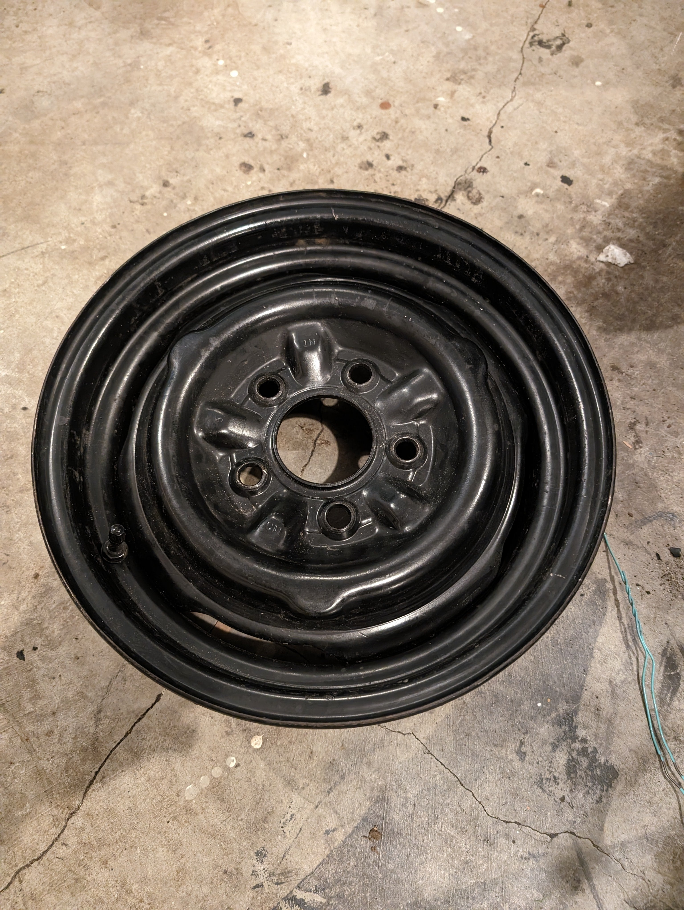

# Original Tire/Spare size for 1964 Pontiac Tempest Custom 326
**Forum:** GTO Forum | **Started:** March 23, 2024 | **Replies:** 2
**Thread URL:** https://www.gtoforum.com/threads/original-tire-spare-size-for-1964-pontiac-tempest-custom-326.146966/post-1005423

## The Issue
Hey there. I'm trying to determine what the original tire size is for my 64 so that I can get a tire for my spare. Planning to use my original 14x5 wheel (seen below). I'm finding conflicting info online so I'm not sure what to believe. Anyone know?

## Key Advice
- **@geeteeohguy**: 7.35 X14 is standard for a '66 Tempest with the steel 5" wheels. Not sure 100% on a '64. Could be a 7.00 X 14. (about a G-78-14)
- **@Otto2**: That's the spare for my 67 too. Still have the original.

## Helpers
- **@geeteeohguy** — 1 post(s)
- **@Otto2** — 1 post(s)

## Thread Summary

### Kevin's Original Post
Hey there. I'm trying to determine what the original tire size is for my 64 so that I can get a tire for my spare. Planning to use my original 14x5 wheel (seen below). I'm finding conflicting info online so I'm not sure what to believe. Anyone know?

### Replies

**@geeteeohguy** (reply #1):
7.35 X14 is standard for a '66 Tempest with the steel 5" wheels. Not sure 100% on a '64. Could be a 7.00 X 14. (about a G-78-14)

**@Otto2** (reply #2):
That's the spare for my 67 too. Still have the original.

## Images

