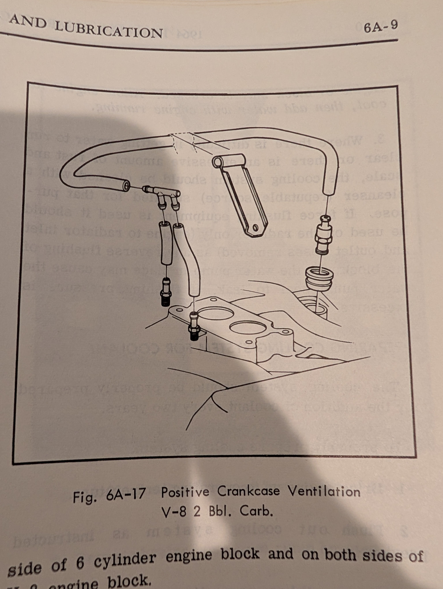
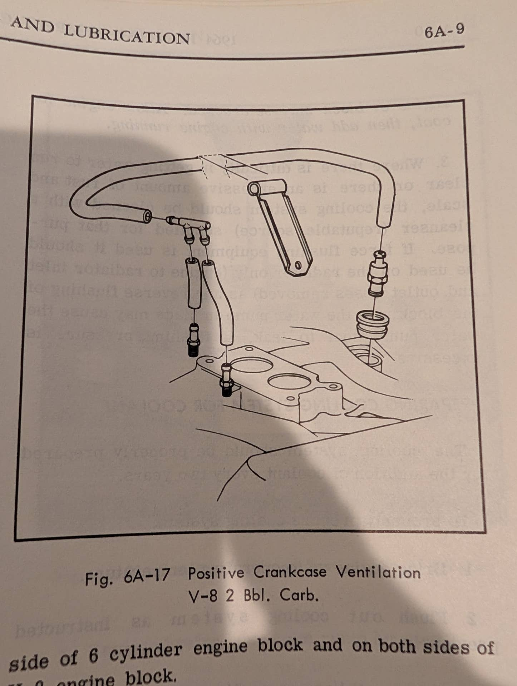
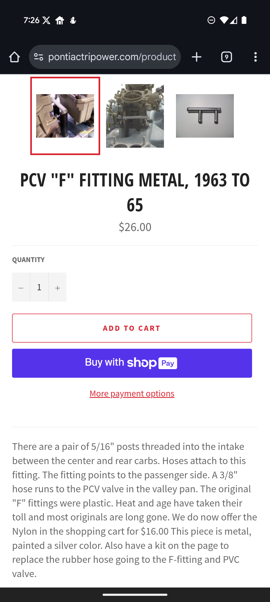

# PCV hose size
**Forum:** GTO Forum | **Started:** August 25, 2025 | **Replies:** 5
**Thread URL:** https://www.gtoforum.com/threads/pcv-hose-size.150291/post-1053368

## The Issue
Greetings, I'm looking to replace my PCV hose on my 64 Tempest with a 326 2Bbl. Can't tell if I should go with a 3/8 or 5/16 hose. Any idea? Best place to get one?

## Solution / Outcome
I plan on picking some up at O'Reilly's or Napa. I saw it for sale on inline tubes as well.  I agree with you that good fuel hose is unlikely to be a problem, especially with my cruiser driving.

## Key Advice
- **@lust4speed**: It's 3/8 hose and some say that you need a specific hose made for PCV use.  Personally I've always used standard fuel hose with no problems.
- **@armyadarkness**: Ive never seen the hose-type matter either... but I suppose that all depends on where you're sourcing it.  Vacuum hose is designed to resist collapsing, fuel hose is designed to resist bursting. I hav

## Helpers
- **@lust4speed** — 1 post(s)
- **@armyadarkness** — 1 post(s)

## Thread Summary

### Kevin's Original Post
Greetings,
I'm looking to replace my PCV hose on my 64 Tempest with a 326 2Bbl. Can't tell if I should go with a 3/8 or 5/16 hose. Any idea? Best place to get one?

### Replies

**@lust4speed** (reply #1):
It's 3/8 hose and some say that you need a specific hose made for PCV use.  Personally I've always used standard fuel hose with no problems.

**@kevnord** (reply #2):
Everything I've found online says it's 3/8 but I have some good quality 3/8 fuel line and it's too big for the two intake manifold studs/connectors. 5/16 fits snuggly without being too difficult to slide on. I'm 99% confident it the original setup. Single family car.

The f-connect I bought also seems to want 3/8 from the PCV valve and then two short 5/16 to intake. It's for a tri power setup but I haven't found one specifically for a 2bbl.

I'm sure I'm overthinking this.

**@kevnord** (reply #3):
Found this...

**@armyadarkness** (reply #4):
Ive never seen the hose-type matter either... but I suppose that all depends on where you're sourcing it.

Vacuum hose is designed to resist collapsing, fuel hose is designed to resist bursting. I have long runs of fuel hose that I use for vacuum, but it's from NAPA. Maybe if I got it from the Chinese auction, it would fail?

**@kevnord** (reply #5):
I plan on picking some up at O'Reilly's or Napa. I saw it for sale on inline tubes as well.

I agree with you that good fuel hose is unlikely to be a problem, especially with my cruiser driving.

## Images

