# Pontiac T-Shirts
**Forum:** GTO Forum | **Started:** August 24, 2025 | **Replies:** 51
**Thread URL:** https://www.gtoforum.com/threads/pontiac-t-shirts.150203/post-1052556

## The Issue
I had trouble finding cool Tempest shirts, so I started designing my own. Now I've got a collection covering various Pontiac models.  Figured I'd share with the community since you all have been so helpful.  Forum discount: 20% off with code GTO20 Shop: https://myrestomod.com  Happy to do custom (model/trim/color) designs if anyone's interested  -Kevin  Here's just a few examples...

## Solution / Outcome
Awesome! Glad you like it. :-D  You know where to send club show people of they want one too. ;-) MyRestoMod.com

## Key Advice
- **@ponchonlefty**: cool designs.
- **@TXStarfire**: I like big trunks, great shirt!
- **@Sick467**: Awesome artwork Kevin!  Very nice T's and website.    The following is not a dig on you or your efforts...  I am addicted to T's with the front single pocket (I need them for the phone, pens, scratch 
- **@Jared**: Cool shirts Kevin.  Wish you had designs of the 2nd gen lower tiered cars.
- **@rockdoc**: Wow, Kevin, what a great selection of shirts and hats. It's great that you have shirts for kids also! I think my grandson needs one...
- **@Baaad65**: Do you have a tube top with a '67 on it, was thinking of getting Amy one for Christmas 😉
- **@oshpilot**: Here’s one a friend did for me. Shirt quality could be better, but I love the message!

## Helpers
- **@ponchonlefty** — 2 post(s)
- **@TXStarfire** — 1 post(s)
- **@Sick467** — 4 post(s)
- **@Jared** — 10 post(s)
- **@rockdoc** — 2 post(s)
- **@Baaad65** — 9 post(s)
- **@oshpilot** — 1 post(s)

## Thread Summary

### Kevin's Original Post
I had trouble finding cool Tempest shirts, so I started designing my own. Now I've got a collection covering various Pontiac models.

Figured I'd share with the community since you all have been so helpful.

Forum discount: 20% off with code GTO20
Shop: https://myrestomod.com

Happy to do custom (model/trim/color) designs if anyone's interested

-Kevin

Here's just a few examples...

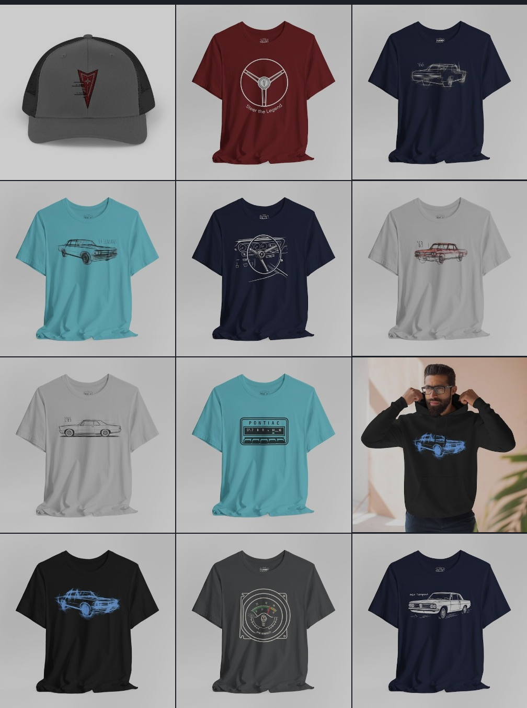

### Replies

**@ponchonlefty** (reply #1):
cool designs.

**@kevnord** (reply #2):
Thank you! :-D

**@TXStarfire** (reply #3):
I like big trunks, great shirt!

**@kevnord** (reply #4):
Haha.. yeah I thought that one was funny... and Death Can Club.

**@Sick467** (reply #5):
Awesome artwork Kevin!  Very nice T's and website.  

The following is not a dig on you or your efforts...

I am addicted to T's with the front single pocket (I need them for the phone, pens, scratch pad, ect).  I am also a T-snob and really like the Carhart-like quality T's.  I expect your T's are good quality, however.  If you put out a T with back art and pocket art... I'd be interested.  This may only serve the smaller percentage of T-snobs, but I don't get cool T's due to "no pocket".

What would something like this cost as a custom?

Black shirt with this on the back...

    
        
            
        
        
            
                
                
            
        
    
    

and something like this or just a simple detail on the pocket...

    
        
            
        
        
            
                
                
            
        
    
    

Love the Big Trunks and the light blue '66 shot from behind! This sketch work is really cool!

    
        
            
        
        
            
                
                
            
        
    
    

Are you the artist?

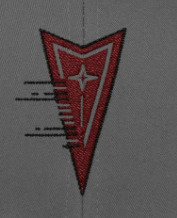

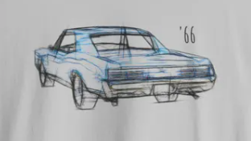

**@kevnord** (reply #6):
Hey Noel,
Thanks for your kind words. I wouldn't call myself and artist but I've been know to do some graphic design from time to time.  

I think I can put together a design like you outlined and see how much it would cost.

I've been using Bella Canvas 3001 shirts since they seem to be high quality, comfortable, and popular. They cost me a bit more but I want folks to be happy .

I don't have any Carhart options with my current supplier but I can look around. These are the two pocket t-shirts I have access to. Know Anything about them?

-k

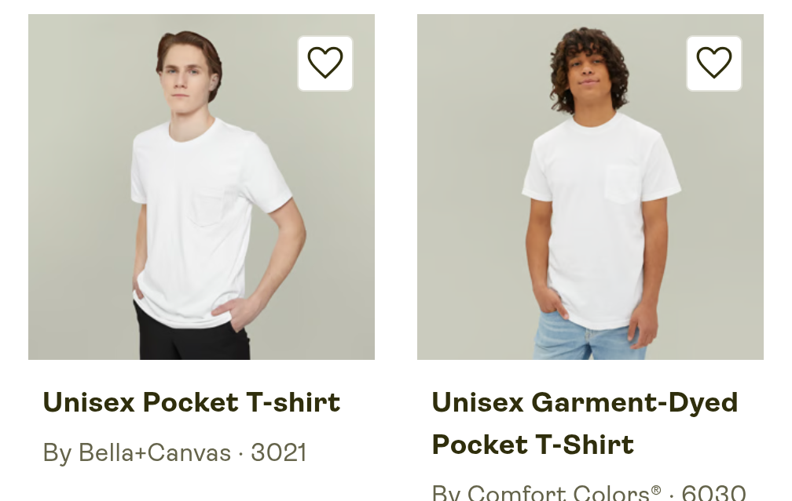

**@Sick467** (reply #7):
> kevnord said:
> Hey Noel,
Thanks for your kind words. I wouldn't call myself and artist but I've been know to do some graphic design from time to time. 

I think I can put together a design like you outlined and see how much it would cost.

I've been using Bella Canvas 3001 shirts since they seem to be high quality, comfortable, and popular. They cost me a bit more but I want folks to be happy .

I don't have any Carhart options with my current supplier but I can look around. These are the two pocket t-shirts I have access to. Know Anything about them?

-k

    View attachment 196823
    

        
        Click to expand...
Kevin, I can't get hung up on Carhartt T's since they have their logo on the pocket which does not lend itself to a Pontiac pocket graphic, but their quality is the best I know...nice thick cotton, long lasting, & fit me...you know?  I do not recognize the posted brands but would be happy to try them out for cool T's.

**@kevnord** (reply #8):
> Sick467 said:
> Kevin, I can't get hung up on Carhartt T's since they have their logo on the pocket which does not lend itself to a Pontiac pocket graphic, but their quality is the best I know...nice thick cotton, long lasting, & fit me...you know?  I do not recognize the posted brands but would be happy to try them out for cool T's.
        
        Click to expand...
Those two shirts are nice but not heavy. I found another manufacturer that has heavy shirts with pockets. Put this together, let me know what you think. Material and printing on two sides makes it more expensive but I tried to keep it as low as possible....

    

    
        
            
                
                    
                        
                        
                
            
            
                
                    
                        Vintage Car Sketch Unisex Pocket Tee, 1967 Pontiac GTO Shirt, Muscle Car Lover Gift, Car Enthusiast Apparel, Classic Car Graphic Tee, Car - Etsy
                    
                

                This Gender-Neutral Adult T-shirts item is sold by MyRestoMod. Ships from Hialeah, FL. Listed on Aug 16, 2025

                
                    
                        
                            
                        
                    
                    www.etsy.com

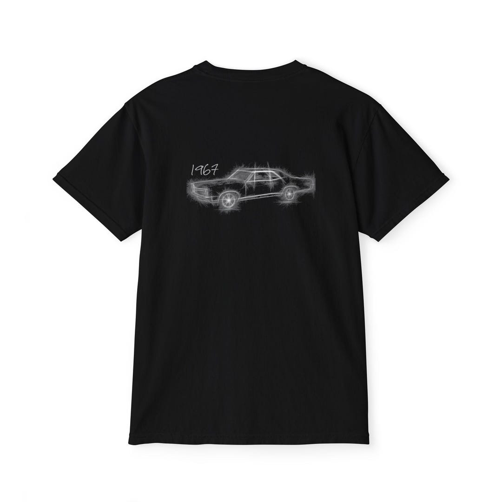

**@Jared** (reply #9):
Cool shirts Kevin.  Wish you had designs of the 2nd gen lower tiered cars.

**@kevnord** (reply #10):
Do you have a specific make/model/tier etc you're interested in? Happy to make one

**@Jared** (reply #11):
My current car is a 70 LeMans Sport.  I suspect the interest in that particular car, outside of me, would be slim.  Always loved the underdog cars which is why I like what you're doing here.

**@kevnord** (reply #12):
> Jared said:
> My current car is a 70 LeMans Sport to.  I suspect the interest in that particular car, outside of me, would be slim.  Always loved the underdog cars which is why I like what you're doing here.
        
        Click to expand...
I completely get it. I literally went to a car show today and had to park in the "Pontiac - Other" section, not with the GTOs near the front. On the bright side, I had less competition and got 1st Place in my category.  

Give me a day, I'll make ya a couple shirts to take a look at. No pressure on buying one, I want to build my collection slowly so it's helpful to hear from people looking for a specific model.

**@ponchonlefty** (reply #13):
> kevnord said:
> I completely get it. I literally went to a car show today and had to park in the "Pontiac - Other" section, not with the GTOs near the front. On the bright side, I had less competition and got 1st Place in my category. 

Give me a day, I'll make ya a couple shirts to take a look at. No pressure on buying one, I want to build my collection slowly so it's helpful to hear from people looking for a specific model. 
        
        Click to expand...
just a suggestion,how about a cammer 6? you may attract pontiac guys by having the 
rare designs. maybe even ratty muscle car,project in repair? expand your customer base.

something like"rust is just another word for nothing left to lose"

**@kevnord** (reply #14):
> kevnord said:
> I completely get it. I literally went to a car show today and had to park in the "Pontiac - Other" section, not with the GTOs near the front. On the bright side, I had less competition and got 1st Place in my category.  

Give me a day, I'll make ya a couple shirts to take a look at. No pressure on buying one, I want to build my collection slowly so it's helpful to hear from people looking for a specific model. 
        
        Click to expand...
Alright @Jared , here's your '70 Lemans Sport T-shirt love... a light and dark option

    

    
        
            
                
                    
                        
                        
                
            
            
                
                    
                        1970 Lemans Sketch Tee, Vintage Car T-shirt, Retro Car Lover Gift, Classic Car Enthusiast Shirt, Muscle Car Apparel - Etsy
                    
                

                This Gender-Neutral Adult T-shirts item is sold by MyRestoMod. Ships from Hialeah, FL. Listed on Aug 17, 2025

                
                    
                        
                            
                        
                    
                    www.etsy.com
                
            
        
    

    

    
        
            
                
                    
                        
                        
                
            
            
                
                    
                        1970 Lemans Sport Retro Tee, Classic Car Enthusiast Gift, Muscle Car Lover Shirt, Race Car Fan Top, Car Show Apparel - Etsy
                    
                

                This Gender-Neutral Adult T-shirts item is sold by MyRestoMod. Ships from Hialeah, FL. Listed on Aug 17, 2025

                
                    
                        
                            
                        
                    
                    www.etsy.com
                
            
        
    

I'm not as familiar with the '70 design so let me know if something is glaringly inaccurate.

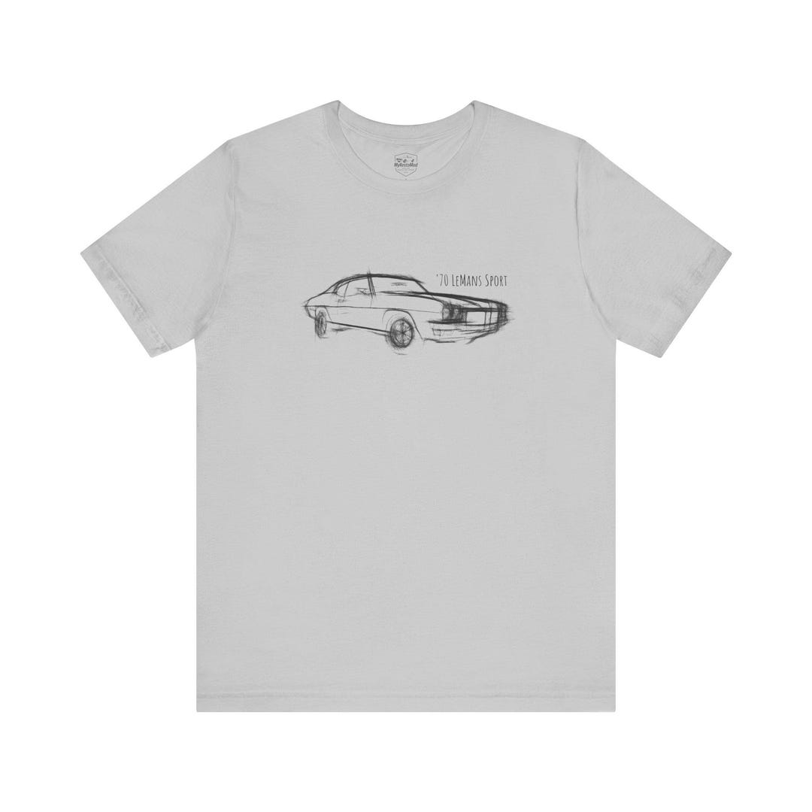

**@Jared** (reply #15):
> kevnord said:
> Alright @Jared , here's your '70 Lemans Sport T-shirt love... a light and dark option

    

    
        
            
                
                    
                        
                        
                
            
            
                
                    
                        1970 Lemans Sketch Tee, Vintage Car T-shirt, Retro Car Lover Gift, Classic Car Enthusiast Shirt, Muscle Car Apparel - Etsy
                    
                

                This Gender-Neutral Adult T-shirts item is sold by MyRestoMod. Ships from Hialeah, FL. Listed on Aug 17, 2025

                
                    
                        
                            
                        
                    
                    www.etsy.com
                
            
        
    

    

    
        
            
                
                    
                        
                        
                
            
            
                
                    
                        1970 Lemans Sport Retro Tee, Classic Car Enthusiast Gift, Muscle Car Lover Shirt, Race Car Fan Top, Car Show Apparel - Etsy
                    
                

                This Gender-Neutral Adult T-shirts item is sold by MyRestoMod. Ships from Hialeah, FL. Listed on Aug 17, 2025

                
                    
                        
                            
                        
                    
                    www.etsy.com
                
            
        
    

I'm not as familiar with the '70 design so let me know if something is glaringly inaccurate.
        
        Click to expand...
It's good.  I like the sketchy design.  Order submitted.

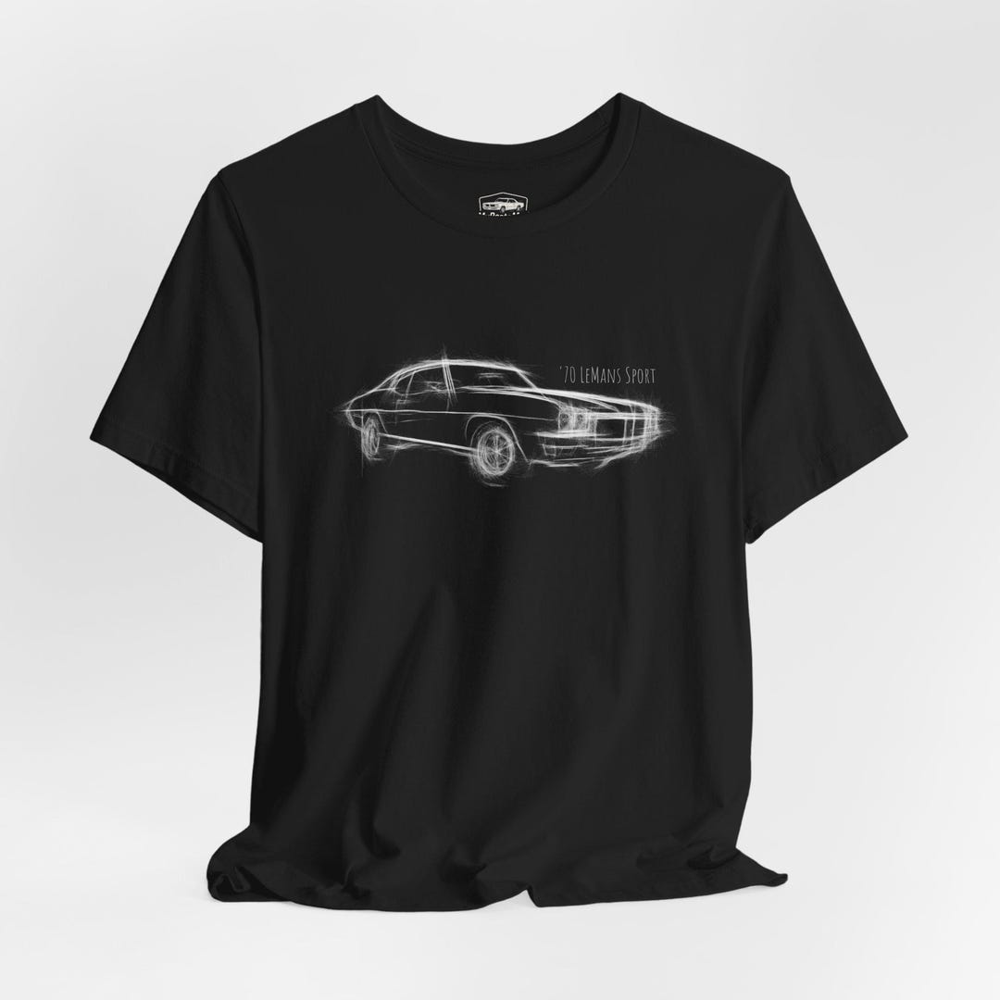

**@kevnord** (reply #16):
> Jared said:
> It's good.  I like the sketchy design.  Order submitted.
        
        Click to expand...
Awesome! Thank you so much!. I really appreciate it.

**@rockdoc** (reply #17):
Wow, Kevin, what a great selection of shirts and hats. It's great that you have shirts for kids also! I think my grandson needs one...

**@kevnord** (reply #18):
Thanks! I just added a couple kid shirts since I was heading to a car show yesterday and am always trying to get kids excited about muscle cars.  I'm adding new stuff all the time and will try to get some more kids stuff.

**@Baaad65** (reply #19):
Do you have a tube top with a '67 on it, was thinking of getting Amy one for Christmas 😉

**@kevnord** (reply #20):
No tube tops but I can make you a tank top or bikini. No joke.

...But I know you're joking.

**@Baaad65** (reply #21):
> kevnord said:
> No tube tops but I can make you a tank top or bikini. No joke.

...But I know you're joking. 
        
        Click to expand...
I'm thinking he might be too hairy for a bikini, how about a one piece but Brazilian cut 🤣

**@Jared** (reply #22):
> Baaad65 said:
> I'm thinking he might be too hairy for a bikini, how about a one piece but Brazilian cut 🤣
        
        Click to expand...
Amy only wears a bikini if it's bright yellow and a thong.  Get it straight brother!

**@Baaad65** (reply #23):
Those are some nice shirts you have, best of luck 👍 I have this one and it's one of my favorites but is pretty cheap quality.

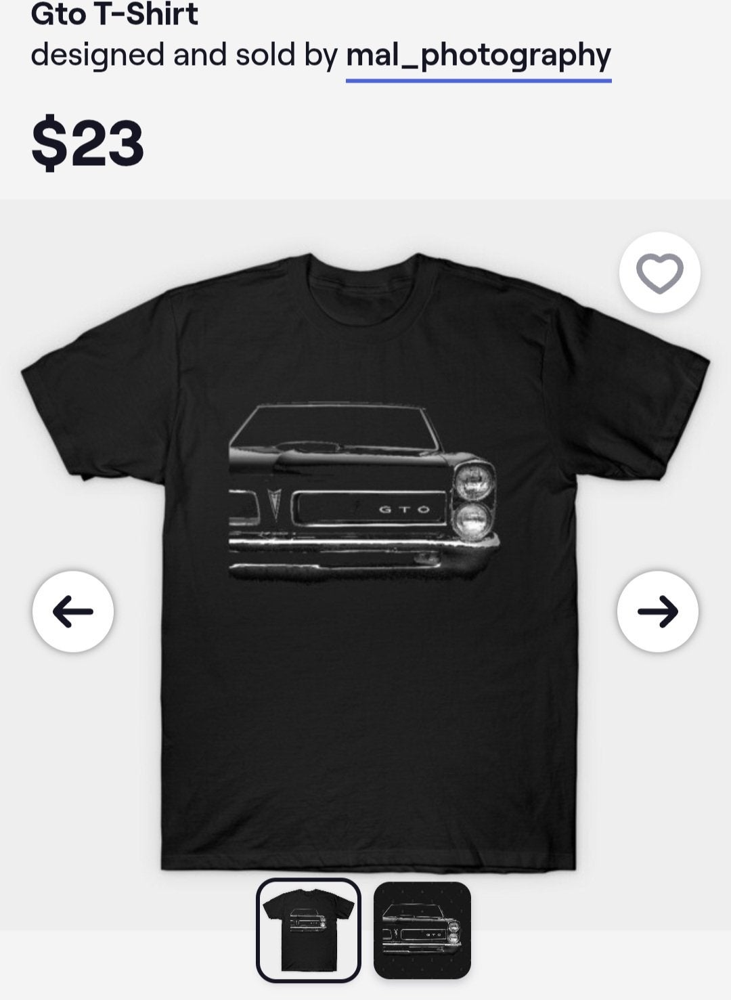
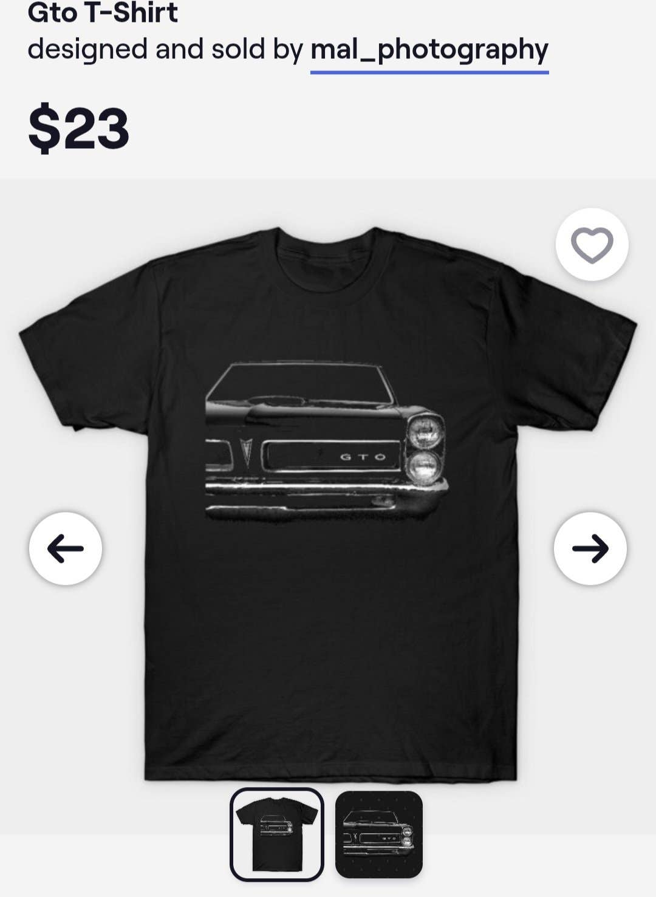

**@kevnord** (reply #24):
Similar... 

    

    
        
            
                
                    
                        
                        
                
            
            
                
                    
                        1965 Pontiac GTO T-shirt, Vintage Car Line Art, Retro Muscle Car Tee for Car Enthusiasts - Etsy
                    
                

                This Gender-Neutral Adult T-shirts item is sold by MyRestoMod. Ships from Hialeah, FL. Listed on Aug 18, 2025

                
                    
                        
                            
                        
                    
                    www.etsy.com

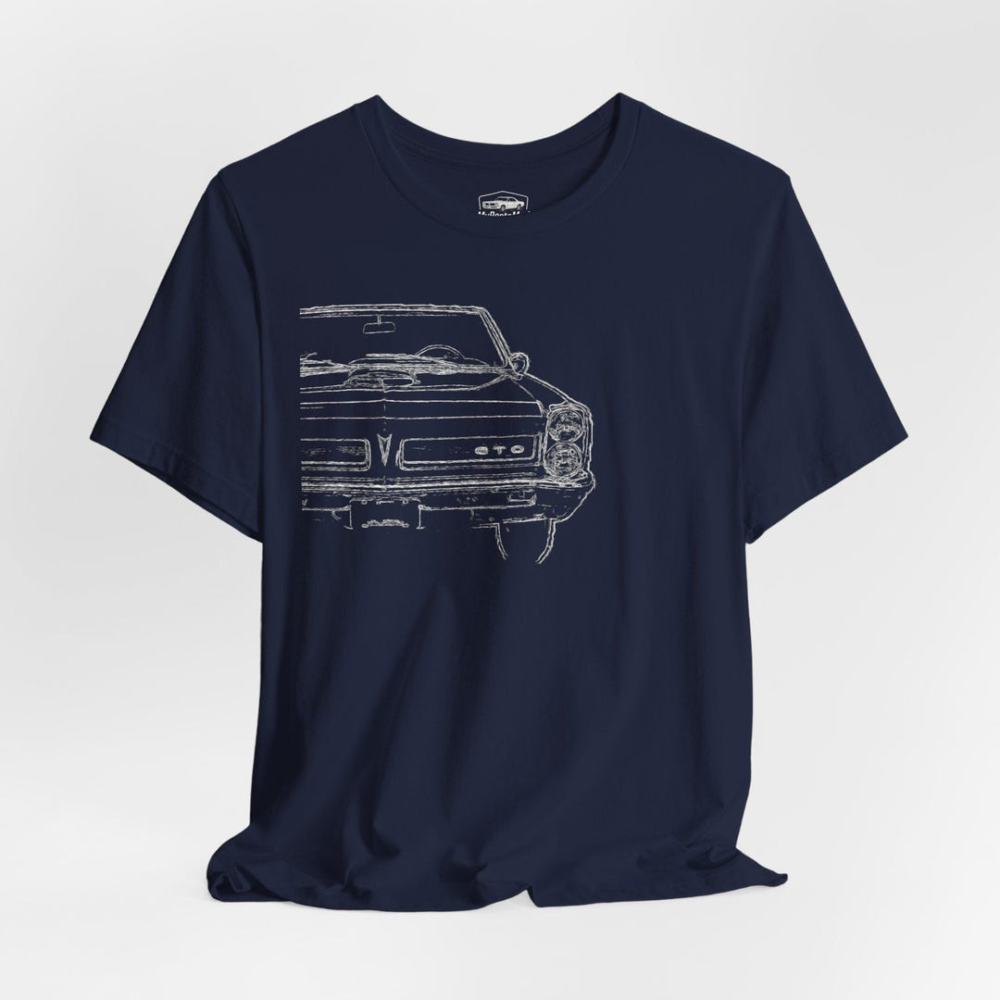

**@Sick467** (reply #25):
Heads up Kevin, I clicked on the cool blue 67 (thinking about for the wifey) and the photo shows a 67, but the year on the shirt is "66"...

    
        
            
        
        
            
                
                
            
        
    
    

Those should be on clearance...LOL

I'm not being critical...just thought you would like to know.

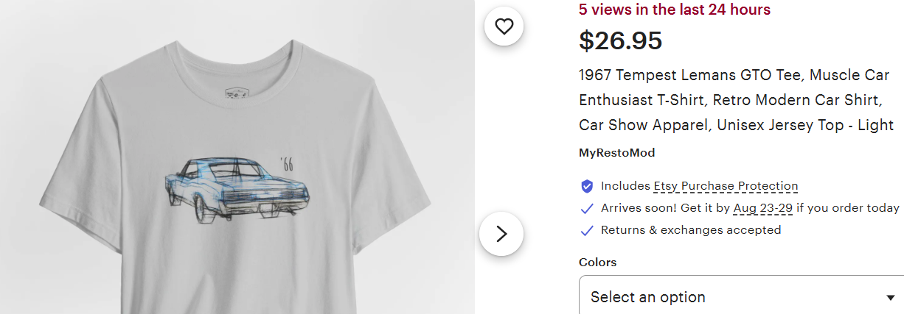

**@kevnord** (reply #26):
Hah. Thanks for letting me know! Easy fix.

**@kevnord** (reply #27):
Should be fixed now. Thanks for the heads up!

    

    
        
            
                
                    
                        
                        
                
            
            
                
                    
                        1967 Tempest Lemans GTO Tee, Muscle Car Enthusiast T-shirt, Retro Modern Car Shirt, Car Show Apparel, Unisex Jersey Top - Light - Etsy
                    
                

                This Gender-Neutral Adult T-shirts item is sold by MyRestoMod. Ships from Hialeah, FL. Listed on Jul 28, 2025

                
                    
                        
                            
                        
                    
                    www.etsy.com

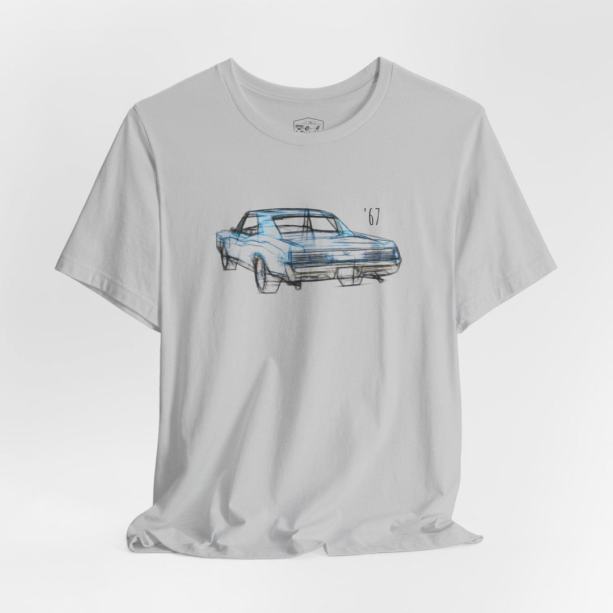

**@Sick467** (reply #28):
Cool, I have 3 picked out!

**@oshpilot** (reply #29):
Here’s one a friend did for me. Shirt quality could be better, but I love the message!

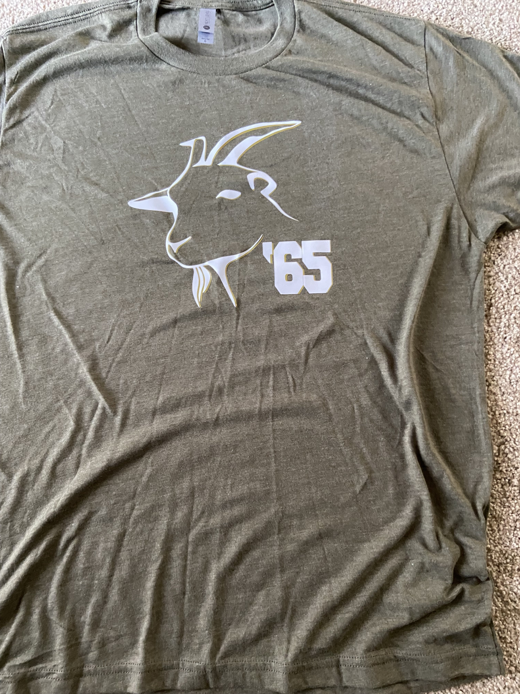

**@kevnord** (reply #30):
very cool

**@Baaad65** (reply #31):
I'd like to see my bad goat with a '65 like that, he's a little more intimidating 😉

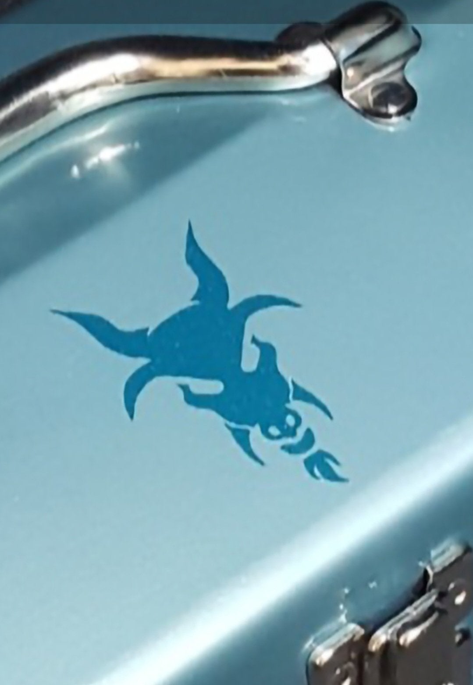

**@kevnord** (reply #32):
Best I can do w/o a better picture. ;-)

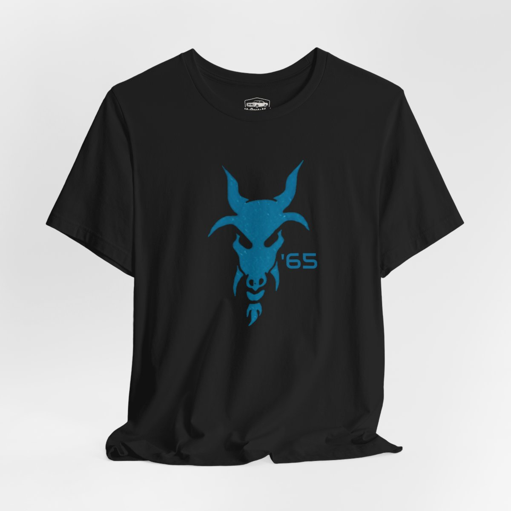

**@rockdoc** (reply #33):
Wow, that was fast! Beautiful.

Baaad will take a dozen!

**@Baaad65** (reply #34):
WOW ! I love it Now what about one with my breathers

**@Baaad65** (reply #35):
I can probably get the file from my sign shop that he used, or I have some extra decals I could photograph.

**@Jared** (reply #36):
Even your toolbox lid is nicer than my car!

**@kevnord** (reply #37):
Does it match a stock GTO exterior paint color? It looks familiar.
That would be very impressive if so.

**@Baaad65** (reply #38):
It's Reef Turquois which I bought thinking that was my paint color but it wasn't, somebody custom mixed it I guess and the bodyman had a heck of a time matching it when he did some spot repairs.

**@Baaad65** (reply #39):
I think you should make a shirt with this on it for geeteeohguy, and it could say "Points....there is no substitute" 🤣

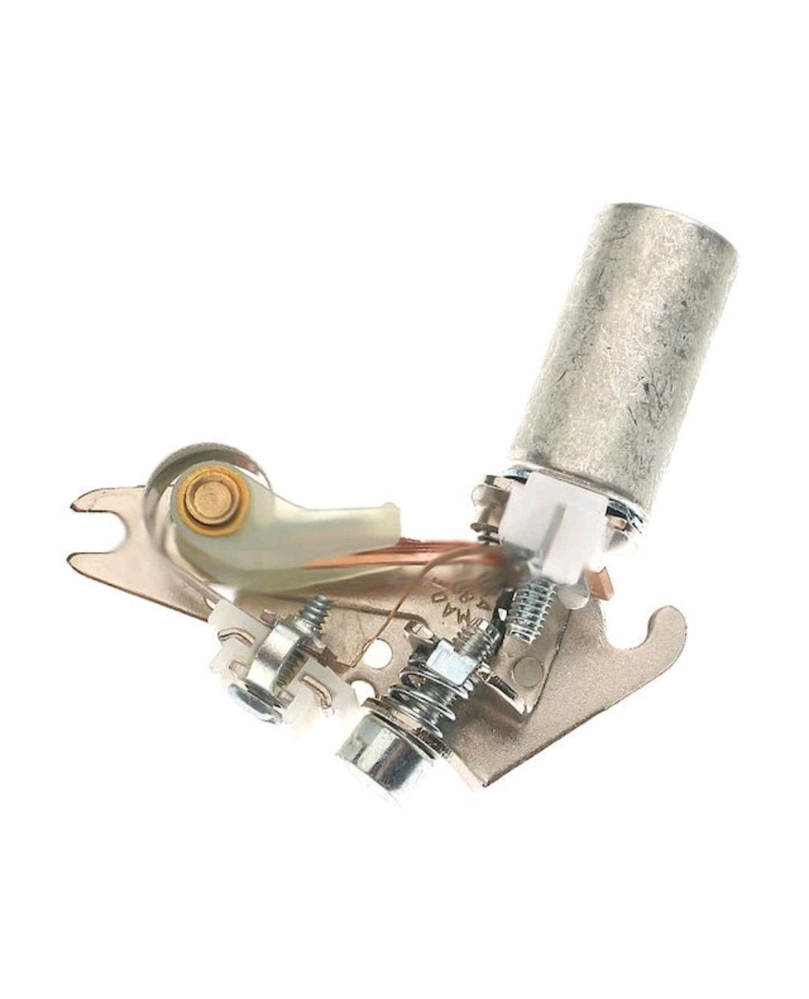

**@kevnord** (reply #40):
haha...

**@kevnord** (reply #41):

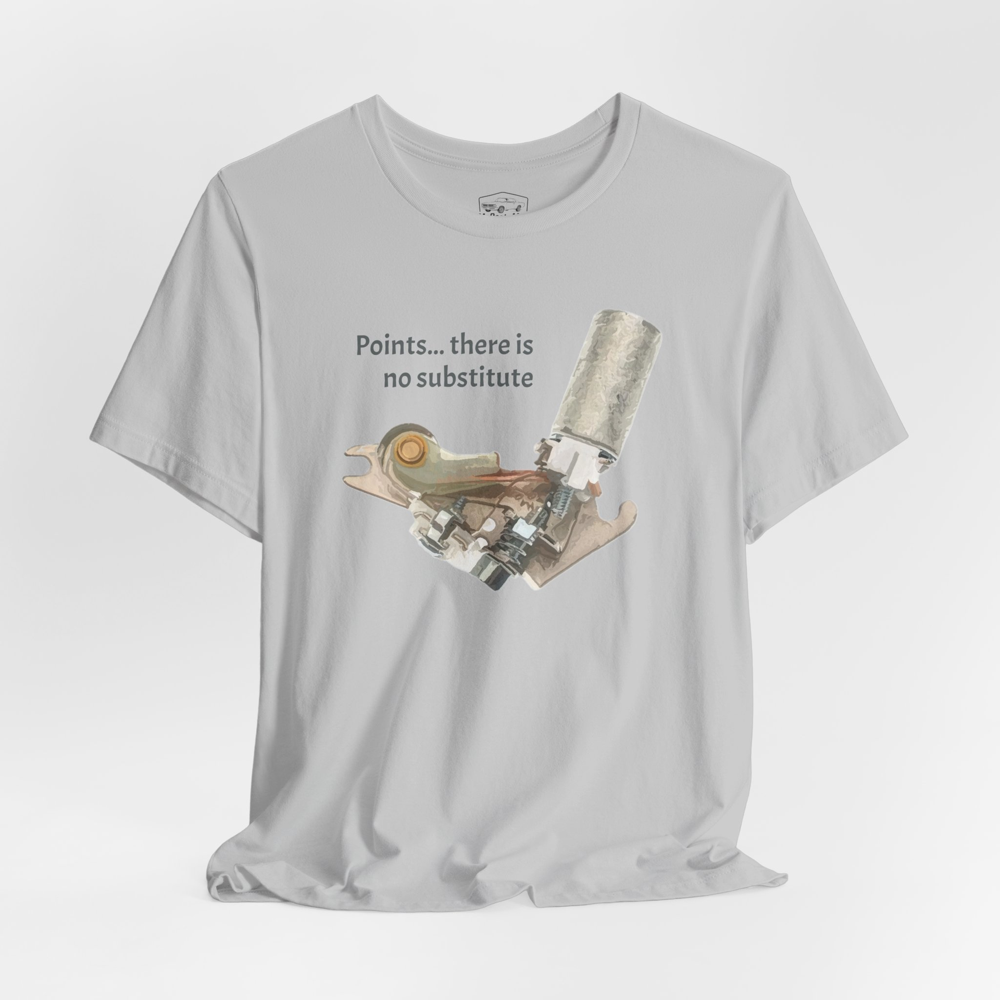

**@Baaad65** (reply #42):
Ha ha love it....now I wonder if Jeff would find humor in that

**@Jared** (reply #43):
I think he's like one with the Buick 400-4 air cleaner sticker more.

**@kevnord** (reply #44):
Funny, I was thinking of creating some hat or shirts with those "stickers" on them. Just hadn't gotten around to it.

**@Jared** (reply #45):
That was my attempt at humor.  I needle Jeff about those for comedic reasons.  Some folks really hate those stickers because Pontiac never actually used stickers on the air cleaners for most of their cars.  That has not stopped folks from using them.  I was at a Pontiac club show a couple weeks back and at least a dozen cars were wearing the incorrect sticker.  Personally, I'm indifferent to them.   My car had one on the air cleaner when I got it.  I left it as it was until I swapped the engine.

**@kevnord** (reply #46):
> Jared said:
> That was my attempt at humor.  I needle Jeff about those for comedic reasons.  Some folks really hate those stickers because Pontiac never actually used stickers on the air cleaners for most of their cars.  That has not stopped folks from using them.  I was at a Pontiac club show a couple weeks back and at least a dozen cars were wearing the incorrect sticker.  Personally, I'm indifferent to them.   My car had one on the air cleaner when I got it.  I left it as it was until I swapped the engine.
        
        Click to expand...
I know you were joking.  

I put one on my car cause I like how they look. I also think it's kinda funny/ironic cause mine is a 326/2bbl which is nothing to brag about. 

Unless you're going for concours, why not have a little color and fun.

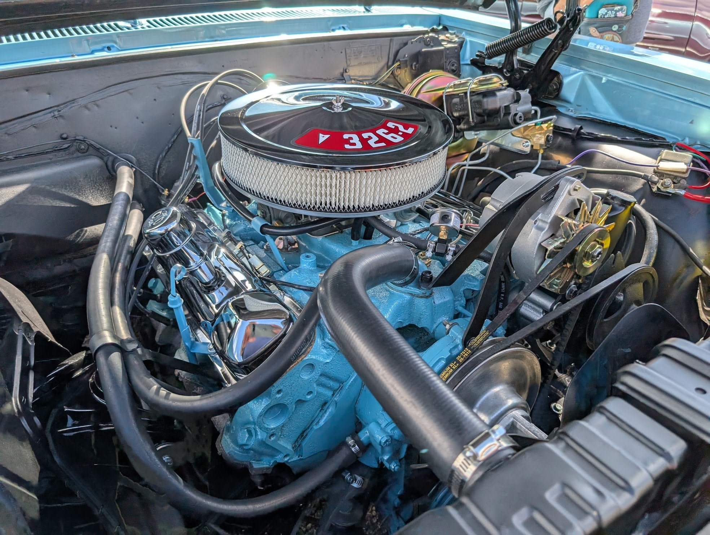

**@Jared** (reply #47):
> kevnord said:
> I know you were joking. 

I put one on my car cause I like how they look. I also think it's kinda funny/ironic cause mine is a 326/2bbl which is nothing to brag about. 

Unless you're going for concours, why not have a little color and fun. 

    View attachment 197114
    

        
        Click to expand...
Nice engine bay!  Nothing at all to be embarrassed by on that one.  Mine still wears an incorrect sticker, but year and engine incorrect.

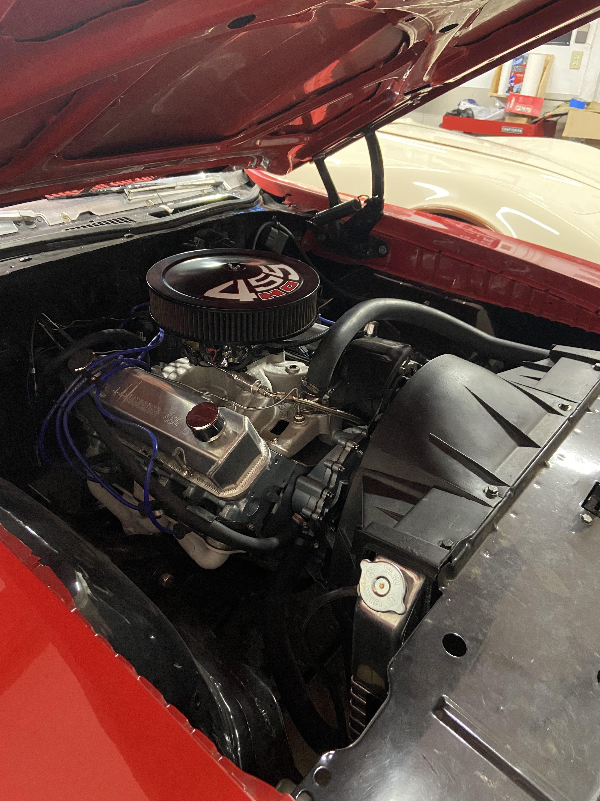

**@kevnord** (reply #48):
> Jared said:
> Nice engine bay!  Nothing at all to be embarrassed by on that one.  Mine still wears an incorrect sticker, but year and engine incorrect.

    View attachment 197121
    

        
        Click to expand...
Maybe I should put a 455 sticker on mine and see what happens at the next show.

**@Jared** (reply #49):
> kevnord said:
> Maybe I should put a 455 sticker on mine and see what happens at the next show. 
        
        Click to expand...
Honestly, no one would know.  The outside dimensions of the 326 are the same as the 455.  My engine is actually a 1971 400 block that has been stroked to 461.  I'd have to have a custom 461 sticker made and then it wouldn't match the 455 that's laser etched onto the valve covers.

**@Jared** (reply #50):
Shirt just arrived.  Nice work Kevin!  I know what I'll be wearing at the next Pontiac club show.

**@kevnord** (reply #51):
Awesome! Glad you like it. :-D 
You know where to send club show people of they want one too. ;-) MyRestoMod.com

## Images

