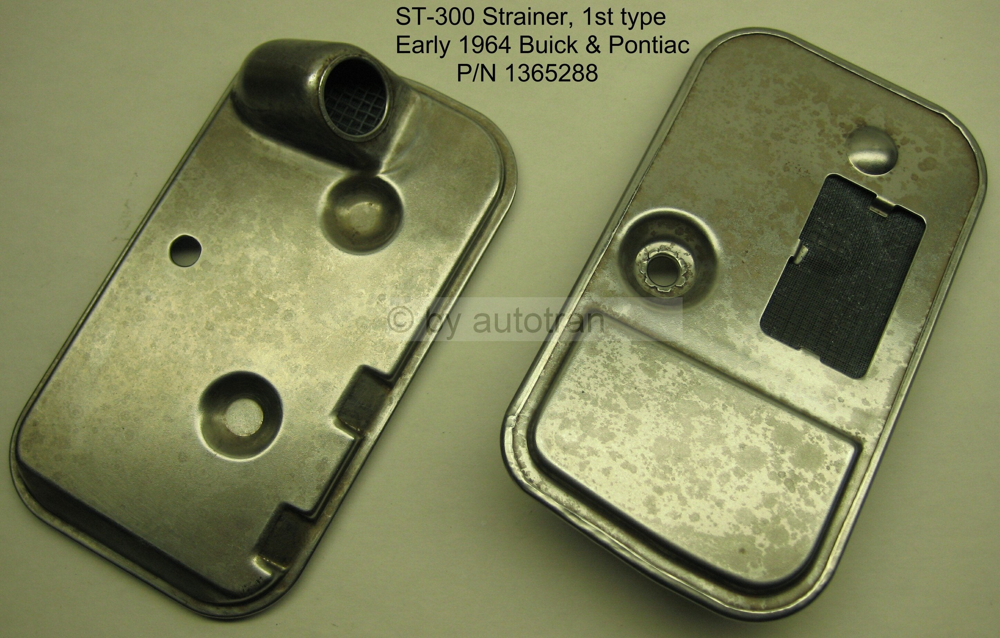
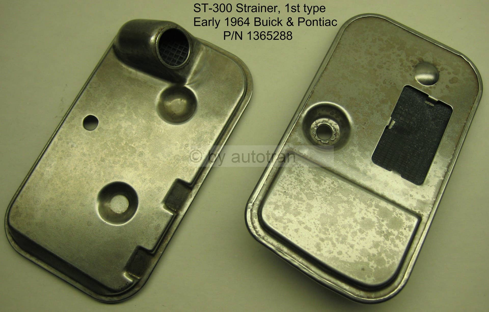
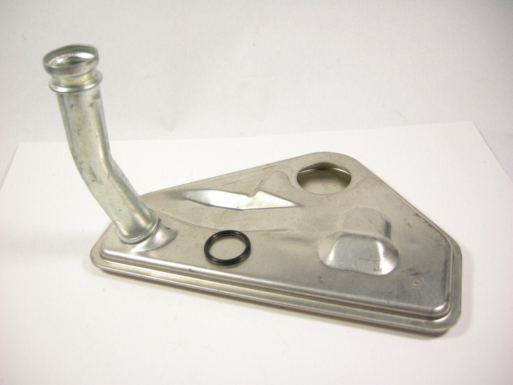

# PSA: 1964 ST-300 Transmission Filter (Early vs. Late Production)
**Forum:** GTO Forum | **Started:** October 28, 2025 | **Replies:** 5
**Thread URL:** https://www.gtoforum.com/threads/psa-1964-st-300-transmission-filter-early-vs-late-production.150742/post-1058401

## The Issue
Just putting this out there for anyone dropping the pan on their 1964 Pontiac Tempest/LeMans/GTO with the original ST-300 (Jetaway) 2-speed automatic. The internet and parts catalogs are often vague on the '64 model year, and it can cause headaches when you go to service the transmission.  The critical takeaway for 1964 is that there were TWO different filter styles.  If you have an early production 1964 ST-300, your filter is likely the one that’s causing confusion:  Early 1964 ST-300 Filter (T...

## Solution / Outcome
I'm sure you're right. It looks just like a filter in front of a tube.

## Key Advice
- **@armyadarkness**: Thanks for posting. Are they interchangeable?

## Helpers
- **@armyadarkness** — 3 post(s)

## Thread Summary

### Kevin's Original Post
Just putting this out there for anyone dropping the pan on their 1964 Pontiac Tempest/LeMans/GTO with the original ST-300 (Jetaway) 2-speed automatic. The internet and parts catalogs are often vague on the '64 model year, and it can cause headaches when you go to service the transmission.

The critical takeaway for 1964 is that there were TWO different filter styles.

If you have an early production 1964 ST-300, your filter is likely the one that’s causing confusion:

Early 1964 ST-300 Filter (The Reusable One)

Type: Metal Mesh Screen in a metal housing.
Service: This filter is designed to be cleaned and reused, not replaced. You remove the entire assembly, flush it thoroughly with solvent (like non-chlorinated brake cleaner), and reinstall it. Do not try to disassemble it!
Original GM Part No. Ref: Commonly referenced as #1365288.

    
        
            
        
        
            
                
                
            
        
    
    

Late 1964 to 1969 ST-300 Filter (The Common Disposable One)

Type: Disposable Paper/Fiber Element filter.
Service: This is the standard filter included in most ST-300 service kits and is replaced at every fluid change.
Common Part No. Ref: Commonly referenced as GM #1374649 (or modern aftermarket equivalents).

### Replies

**@armyadarkness** (reply #1):
Thanks for posting. Are they interchangeable?

**@kevnord** (reply #2):
Unfortunately, they are not.

I was able to grab a NOS one off eBay to use, keeping mine as backup. Though they're reusable, it's hard to tell how well you're able to clean it

**@armyadarkness** (reply #3):
While it's true that you (typically) cant do it better than the factory engineers, they were bound by the almighty dollar, as well as the materials that were available at the time. It would be easy to retro a modern filter system.

But... theres a strong argument for not messing with the filter on an auto trans, which made it to be 60 years old.

**@kevnord** (reply #4):
I'm sure you're right. It looks just like a filter in front of a tube.

**@armyadarkness** (reply #5):
> kevnord said:
> I'm sure you're right. It looks just like a filter in front of a tube. 
        
        Click to expand...
On my old GMC, I put a remote oil filter mount on the radiator support, and then I ran the trans cooler lines in and out of it before they went into the radiator. 

Then I hollowed out the internal trans filter so that it was just a pickup tube... and so I was able to change filters very easily. I even plumbed tees into the system so that I could easily swap fluid and clean out the torque converter too.

## Images

