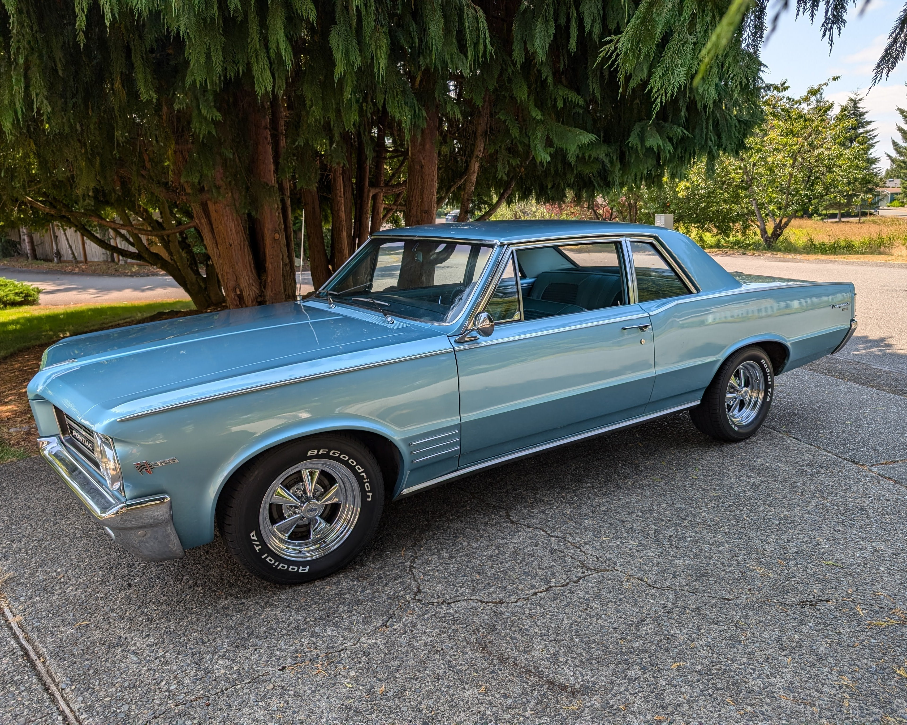

# Shocks, Springs, Coil-overs... oh my!
**Forum:** GTO Forum | **Started:** March 21, 2026 | **Replies:** 30
**Thread URL:** https://www.gtoforum.com/threads/shocks-springs-coil-overs-oh-my.147916/post-1019898

## The Issue
Hey guys. I'm planning for the off-season and having trouble deciding between:   1. New Springs and Gas Shocks (KYB) $  2. New Springs and Hydraulic Shocks (QA1) $$$  3. New Coil-overs (QA1) $$$$ *   1964 Pontiac Tempest Custom. 99% stock. Car has original springs and 30yr/old shocks.  It's going to be a weekly driver. I'd like to lower the front maybe an inch from stock I'd like to raise the back maybe an inch from stock Prefer a nice vs harsh ride  I like the idea of coil-overs for height adju...

## Solution / Outcome
That's good advice. Where were you when I put air shocks on it back in '91 when I was in highschool?!  it still has them... that's what I'm replacing.   Wasn't planning to put a rear sway bar on but maybe I should.

## Key Advice
- **@ponchonlefty**: it is nice to be able to adjust the height. but after its set your done. getting a stock style set up is my preference. get springs to give the height and go. coil overs look cool though but i believe
- **@armyadarkness**: > kevnord said: > Hey guys. I'm planning for the off-season and having trouble deciding between:  1. New Springs and Gas Shocks (KYB) $ 2. New Springs and Hydraulic Shocks (QA1) $$$ 3. New Coil-overs 
- **@toddb**: putting a Hemi in a Dodge Neon,,,
- **@Verdoro 68**: I'm not a corner carver and have been pretty frugal with my suspension upgrades. Considering what you're using it for, I'd go with a fresh set of springs and some good gas shocks. Stick with rubber bu
- **@Sick467**: Stock rear springs typically set lower than most people like, especially if they want level or a slight forward rake.  If you drop the front springs an inch (or so)...new rear stock height springs mig
- **@Miko66**: Hey, I am selling 1 inch lowering shocks and springs, on Criagslist and if you are interested and they fit your car, I can work out a deal. Pay for shipping and you can have them for $0.00. They are b
- **@Ebartone**: Zero dollars seems reasonable, but I‘d try to negotiate for less than that!
- **@BobCat_428**: > kevnord said: > Hey guys. I'm planning for the off-season and having trouble deciding between:  1. New Springs and Gas Shocks (KYB) $ 2. New Springs and Hydraulic Shocks (QA1) $$$ 3. New Coil-overs 
- **@kurzhar**: Hey kevnord, slightly off topic but I love the stance of your Tempest ! What size wheels and tires do you have ? Also love the color, is it Yorktown Blue ?

## Helpers
- **@ponchonlefty** — 3 post(s)
- **@armyadarkness** — 9 post(s)
- **@toddb** — 3 post(s)
- **@Verdoro 68** — 1 post(s)
- **@Sick467** — 2 post(s)
- **@Miko66** — 2 post(s)
- **@Ebartone** — 1 post(s)
- **@BobCat_428** — 1 post(s)
- **@kurzhar** — 1 post(s)

## Thread Summary

### Kevin's Original Post
Hey guys. I'm planning for the off-season and having trouble deciding between:
 
1. New Springs and Gas Shocks (KYB) $ 
2. New Springs and Hydraulic Shocks (QA1) $$$ 
3. New Coil-overs (QA1) $$$$ * 

1964 Pontiac Tempest Custom. 99% stock.
Car has original springs and 30yr/old shocks.

It's going to be a weekly driver.
I'd like to lower the front maybe an inch from stock
I'd like to raise the back maybe an inch from stock
Prefer a nice vs harsh ride

I like the idea of coil-overs for height adjustability and it seems like they'd be easier to install (than a divorced spring) but I worry about stiffness and of course cost (ouch!) I'v heard good things about KYB shocks but have also heard that it's best to go with a hydraulic shock which is what the cars originally had. 

Anyone happy or not happy with one of the above setups? 
Maybe I'm overthinking this. Likely! :-D

### Replies

**@ponchonlefty** (reply #1):
it is nice to be able to adjust the height. but after its set your done. getting a stock style set up is my preference. get springs to give the height and go. coil overs look cool though but i believe the stock style will outlast the coil over. unless you want to auto cross.

**@kevnord** (reply #2):
I was leaning toward coil over for ease of installation and adjustability, but boy are they pricey. Like you said, once you get the height right you're done.
Do you have any thoughts on gas vs non-gas shocks?

**@ponchonlefty** (reply #3):
i like gas shocks. i found that getting the best you can afford is a good direction to go. either will give a nice ride. some last longer than others. the only shock that really impressed me was an ias type shock. im sure everybody has a preference.

**@armyadarkness** (reply #4):
> kevnord said:
> Hey guys. I'm planning for the off-season and having trouble deciding between:

1. New Springs and Gas Shocks (KYB) $
2. New Springs and Hydraulic Shocks (QA1) $$$
3. New Coil-overs (QA1) $$$$ *

1964 Pontiac Tempest Custom. 99% stock.
Car has original springs and 30yr/old shocks.

It's going to be a weekly driver.
I'd like to lower the front maybe an inch from stock
I'd like to raise the back maybe an inch from stock
Prefer a nice vs harsh ride

I like the idea of coil-overs for height adjustability and it seems like they'd be easier to install (than a divorced spring) but I worry about stiffness and of course cost (ouch!) I'v heard good things about KYB shocks but have also heard that it's best to go with a hydraulic shock which is what the cars originally had.

Anyone happy or not happy with one of the above setups?
Maybe I'm overthinking this. Likely! :-D
        
        Click to expand...
I advise against coil-overs, unless you're improving a lot of other stuff on the suspension. Yes, they're awesome, but it's like putting a Hemi in a Dodge Neon... a Hell of lot of money, for an upgrade on an unworthy platform.

There are guys here who have them and love them, but they did pay dearly for them, and IMO, the money should first be spent on control arms or bushings, and then the rest of the parts.

Tubular arms or at the least, new bushings, will yield a noticeable improvement right away, and then you can upgrade the shocks and springs as you go.

I drive my car a lot, very aggressively, and it responds like a modern vehicle.

**@kevnord** (reply #5):
I'm planning to do a full rebuild/bushings but not planning to replace arms (unless I discover an issue). Might add a beefier sway bar.
Do you have any thoughts on gas vs non-gas shocks?

**@armyadarkness** (reply #6):
I would seriously consider reading the thread that I posted a link to.

Your end-use is what will dictate what you need to/ should do. Some things improve traction, some stop wheel hop, some prevent frame cracks, some improve braking, steering, cornering.

Some do nothing more than make everyone else envious.

In my vast experience, the guys who drive the wheels off their cars don't do anything to them, and the guys who never drive their "closet queen" cars have $20,000 worth of upgrades.

**@kevnord** (reply #7):
> armyadarkness said:
> I would seriously consider reading the thread that I posted a link to.

Your end-use is what will dictate what you need to/ should do. Some things improve traction, some stop wheel hop, some prevent frame cracks, some improve braking, steering, cornering.

Some do nothing more than make everyone else envious.

In my vast experience, the guys who drive the wheels off their cars don't do anything to them, and the guys who never drive their "closet queen" cars have $20,000 worth of upgrades.

    
        
    

        
        Click to expand...
I looked at the link yesterday, great info! Thank you. I am not going to be driving it hard. I just want to drive it into town for errands and fun with the occasional local car show. I just want a nice ride. I'm sure I'm overthinking some things, it's fun to learn about all the cool stuff you can do nowadays.

**@toddb** (reply #8):
putting a Hemi in a Dodge Neon,,,

**@armyadarkness** (reply #9):
FAQ - Chassis/Suspension/Steering: GTO SUSPENSION...
                    
                

                GM A Bodies/ Pontiac GTO's have a ton of room for improvement in their suspensions. Putting aside personal preferences for ride height and quality, if you want a car that:  Handles better Brakes better Steers better Has no wheel hop Has increased traction Recovers quickly from burnouts and loss...

                
                    
                        
                            
                        
                    
                    www.gtoforum.com

**@armyadarkness** (reply #10):
https://www.gtoforum.com/threads/amys-magical-thread-on-rear-coil-springs-and-spacers.143935/?post_id=965625#post-965625

**@armyadarkness** (reply #11):
FYI, The FAQ pages are loaded with useful tips and instructions on many upgrades and tasks

**@armyadarkness** (reply #12):
PS, post some pictures of your car. It looks like a very cool, rare ride, and we dont usually get to see much of that stuff...

**@kevnord** (reply #13):
Here ya go...

**@armyadarkness** (reply #14):
> kevnord said:
> Here ya go... 

    View attachment 183601
    

        
        Click to expand...
SUPER COOL!!!!!

**@kevnord** (reply #15):
> armyadarkness said:
> SUPER COOL!!!!!
        
        Click to expand...
Thanks! My grandma bought it new in 64, I got it and drove it in high school, then it sat in storage until a year ago when I was in a spot to get it back and work on it. Been a lot of fun!

**@Verdoro 68** (reply #16):
I'm not a corner carver and have been pretty frugal with my suspension upgrades. Considering what you're using it for, I'd go with a fresh set of springs and some good gas shocks. Stick with rubber bushings over polyurethane if you're rebuilding the suspension. I had KYB shocks for a while and switched to Bilstein a couple years ago which I like better. A bigger front sway bar made a huge difference on my car. It's a great combo with the Jeep steering box.

**@kevnord** (reply #17):
That's what I'm thinking/planning ... rubber bushings, bigger sway bar, and new steering box. I think my main hesitation on gas shocks is that they can add ride height and I'm trying to get the stance right w/o a lot of attempts

**@ponchonlefty** (reply #18):
look at some s10 type shocks or some a little shorter.  you can find a shock to fit. you might have to get your height then find the shock you need. an f body might be the right fit.

**@toddb** (reply #19):
I just put front shocks on my ride and went with Bilstein over KYB. I was told KYB were good back in the day, however they aren't as good now per multiple people. The cost was more as expected, however since it's not a daily driver, they could very well be the last pair I ever put in, I was ok with paying more. It's all about your budget.

Bilstein 24-029728 Bilstein B6 Performance Series Shocks and Struts | Summit Racing

**@toddb** (reply #20):
Thought the rear reinforcement braces to strengthen up the frame was a smart move for me, especially having a convertible. 
I also went with a thicker front sway bar and got this kit. My car didn't have a rear sway bar when I bought it.

After changing out the gear box with a tighter lock to lock, it handles and corners like a newer car. 

Next year when I have engine work done, I'm going to upgrade to new control arms to finish the suspension off.

1964-1967 REAR REINFORCEMENT BRACES (RE) (amesperf.com)

1965 PONTIAC GTO UMI Performance 403534-B UMI Performance Front and Rear Sway Bar Kits | Summit Racing

**@Sick467** (reply #21):
Stock rear springs typically set lower than most people like, especially if they want level or a slight forward rake.  If you drop the front springs an inch (or so)...new rear stock height springs might be just right for you.  If not, adding spacers to the rear springs is the way to go.  Blitsteins have a popular reputation around here.   Take the extra money you saved from the coil overs and replace the suspension bushings and box the lower trailing arms, and upgrade the front and rear sway bar.  Done!  (Unless you get the suspension itch...then go tubular front and back)...lol

Air shocks can add height...don't get those!  Otherwise, shocks should not carry any weight or add height unless something is really wrong.

**@kevnord** (reply #22):
That's good advice. Where were you when I put air shocks on it back in '91 when I was in highschool?!  it still has them... that's what I'm replacing. 

Wasn't planning to put a rear sway bar on but maybe I should.

**@Sick467** (reply #23):
> kevnord said:
> That's good advice. Where were you when I put air shocks on it back in '91 when I was in highschool?!  it still has them... that's what I'm replacing. 

Wasn't planning to put a rear sway bar on but maybe I should.
        
        Click to expand...
I was in college in '91 wishing I had air shocks to give the '67 a forward rake, but $ was tight and she was left to squat..I'm taking care of it now...34 years later.

Spirited driving calls for a bit larger front sway bar and the addition of a stockish rear bar.  Otherwise, adding a stock rear bar will firm up the corners on a daily driver, leaving the front bar as stock.  The stock rear bars are pretty easy to add.

**@Miko66** (reply #24):
Hey, I am selling 1 inch lowering shocks and springs, on Criagslist and if you are interested and they fit your car, I can work out a deal. Pay for shipping and you can have them for $0.00. They are brand new, never installed, still in boxes. I'm guessing shipping would be $100 - $150 depending where you are. I am in Pleasanton CA. Let me know if you're interested, PM me. (I hope I didn't violate any forum rules about selling stuff. Apologies in advance, if I did.)

BellTech Drop Kit for GM A-Body - auto parts - by owner - vehicle automotive sale - craigslist

**@Ebartone** (reply #25):
Zero dollars seems reasonable, but I‘d try to negotiate for less than that!

**@BobCat_428** (reply #26):
> kevnord said:
> Hey guys. I'm planning for the off-season and having trouble deciding between:

1. New Springs and Gas Shocks (KYB) $
2. New Springs and Hydraulic Shocks (QA1) $$$
3. New Coil-overs (QA1) $$$$ *

1964 Pontiac Tempest Custom. 99% stock.
Car has original springs and 30yr/old shocks.

It's going to be a weekly driver.
I'd like to lower the front maybe an inch from stock
I'd like to raise the back maybe an inch from stock
Prefer a nice vs harsh ride

I like the idea of coil-overs for height adjustability and it seems like they'd be easier to install (than a divorced spring) but I worry about stiffness and of course cost (ouch!) I'v heard good things about KYB shocks but have also heard that it's best to go with a hydraulic shock which is what the cars originally had.

Anyone happy or not happy with one of the above setups?
Maybe I'm overthinking this. Likely! :-D
        
        Click to expand...
I went with QA1 coilovers (rear) on my 69.  Did not like the ride quality (soft, spongy, bouncy).  I had the 150 springs per their recommendation.  I got rid of them because I could not re-route the exhaust (long story but they changed the design which moves bottom mount inward 4" on each side, blocks off area needed for exhaust). Had I been able to deal with the exhaust issue, I would have kept them but replace the 150s with 175s.  Good luck.

**@Miko66** (reply #27):
In case your wondering, they are NOT stolen and know the guy who brought them, before I brought them off of him.

**@armyadarkness** (reply #28):
Well that's a shame. I love stolen shit. It's soooo much cheaper than retail.

**@armyadarkness** (reply #29):
Well... of course, this is assuming that it's not my stolen shit.

**@kurzhar** (reply #30):
Hey kevnord, slightly off topic but I love the stance of your Tempest ! What size wheels and tires do you have ? Also love the color, is it Yorktown Blue ?

## Images

