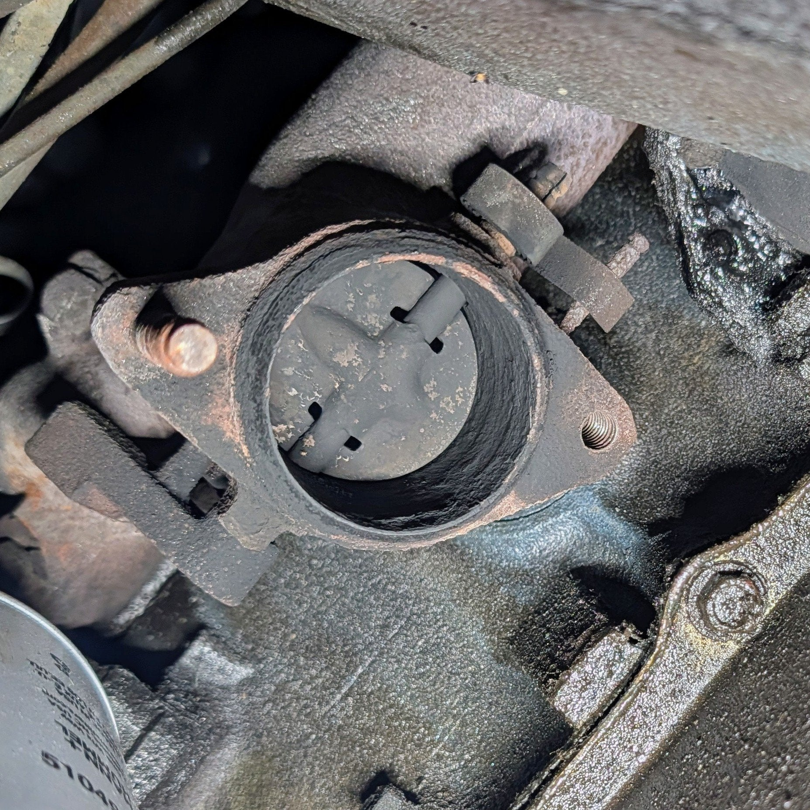
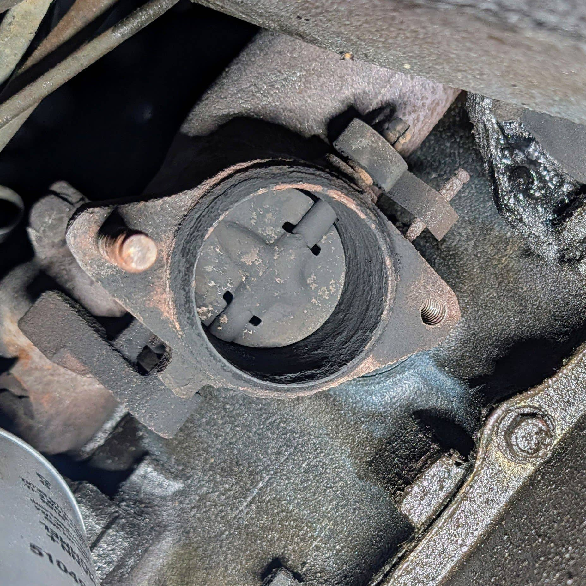
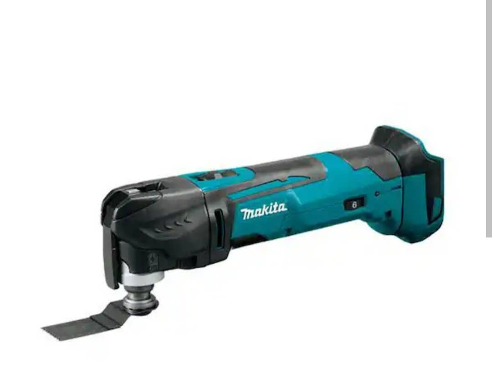
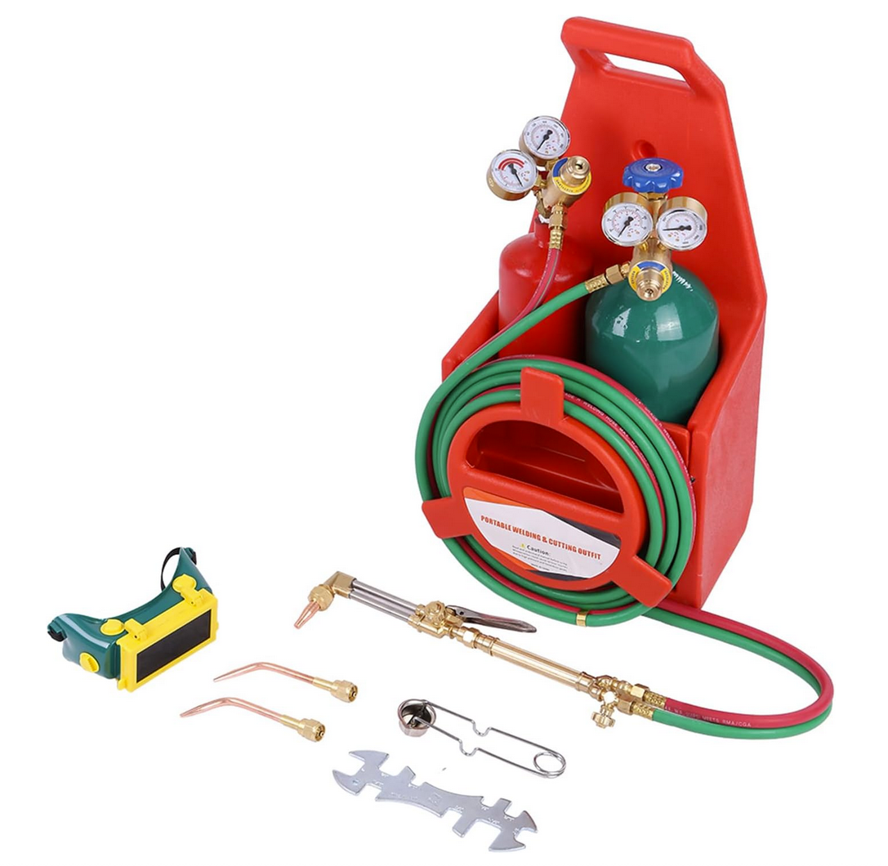
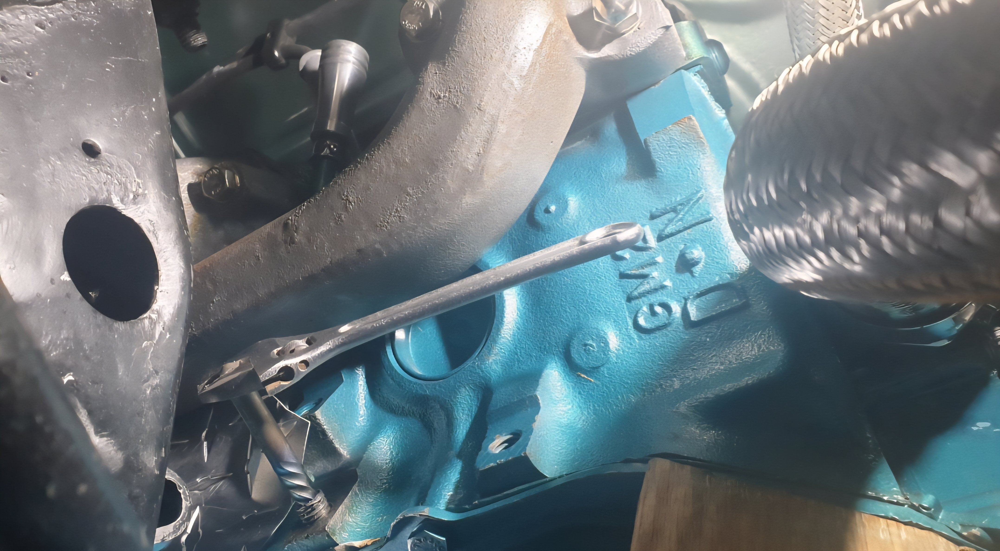
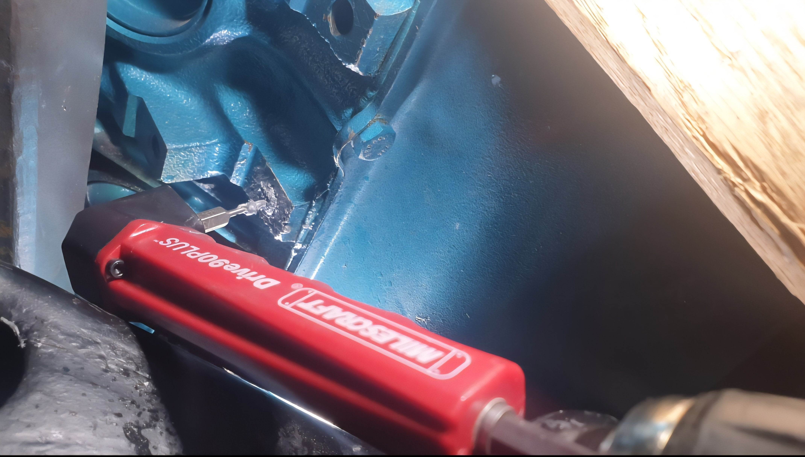

# Should I replace exhaust flange studs?
**Forum:** GTO Forum | **Started:** November 17, 2025 | **Replies:** 29
**Thread URL:** https://www.gtoforum.com/threads/should-i-replace-exhaust-flange-studs.150816/post-1059438

## The Issue
Got my downpipes off. One of the studs came out instead of the nut, which seems nice as it allows me to put a new stud in  Is it worth trying to get the other, intact stud out to replace it? Seems risky. Should I just use a thread chaser on it, anti-seize, and put a new nut on?

## Solution / Outcome
I definitely want to avoid removing the manifolds and have come to the same conclusion... Chase, brass nuts, high temp copper anti-seize, and move on. Let sleeping dogs lie.

## Key Advice
- **@Baaad65**: Do you have one of these, I use it all the time and love it....although no one around me likes the sound 😉
- **@armyadarkness**: I wouldnt  I wouldnt try to remove the old stud... especially if the nut came off easily!
- **@Scott06**: > kevnord said: > It came off fairly easy. I'll leave it alone.                   Click to expand... clean up the thread and leave the stud alone.  You may be able to drill out the broken on on other 
- **@ponchonlefty**: when drilling get it centered,use a center punch. get the surface as flat as possible. drill a pilot carefully and straight. let the drill do the work,don't put extra pressure on it.  welding a nut on
- **@TXStarfire**: Whatever you do dont break the drill bit off in the stud!
- **@geeteeohguy**: Didn't read all the posts but: leave the intact stud, clean the threads, and use BRASS nuts when you re-install and never worry about rust on the nut again.
- **@Lok**: First off, removing the studs , are you willing to remove the manifolds?  If so take em out and then proceed on the bench , or drop em at a machine shop/ fab shop . Heat is your friend,  but too much 
- **@Jetzster**: > kevnord said: > Lok said:                                                                            First off, removing the studs , are you willing to remove the manifolds?                  Click t

## Helpers
- **@Baaad65** — 3 post(s)
- **@armyadarkness** — 8 post(s)
- **@Scott06** — 1 post(s)
- **@ponchonlefty** — 3 post(s)
- **@TXStarfire** — 1 post(s)
- **@geeteeohguy** — 2 post(s)
- **@Lok** — 1 post(s)
- **@Jetzster** — 2 post(s)

## Thread Summary

### Kevin's Original Post
Got my downpipes off. One of the studs came out instead of the nut, which seems nice as it allows me to put a new stud in

Is it worth trying to get the other, intact stud out to replace it? Seems risky. Should I just use a thread chaser on it, anti-seize, and put a new nut on?

### Replies

**@Baaad65** (reply #1):
Do you have one of these, I use it all the time and love it....although no one around me likes the sound 😉

**@kevnord** (reply #2):
> Baaad65 said:
> Do you have one of these, I use it all the time and love it....although no one around me likes the sound 😉

    View attachment 199889
    

        
        Click to expand...
Yup,  I do. Love the tool but agree the sound is terrible.

What are you thinking? Cut it off?

**@kevnord** (reply #3):
P.S. on the drivers side I have a broken stud and an intact stud.

**@Baaad65** (reply #4):
> kevnord said:
> Got my downpipes off. One of the studs came out instead of the nut, which seems nice as it allows me to put a new stud in

Is it worth trying to get the other stud out to replace it? Seems risky. Should I just use a thread chaser on it, anti-seize, and put a new nut on?

    View attachment 199888
    

        
        Click to expand...
I would choose the latter and don't tempt fate as someone who has broken a motor mount bolt off in the block.

**@kevnord** (reply #5):
Thanks my gut feeling. Worst case it brakes later and I can replace it then.

**@armyadarkness** (reply #6):
I wouldnt

I wouldnt try to remove the old stud... especially if the nut came off easily!

**@kevnord** (reply #7):
It came off fairly easy. I'll leave it alone.

**@Scott06** (reply #8):
> kevnord said:
> It came off fairly easy. I'll leave it alone. 
        
        Click to expand...
clean up the thread and leave the stud alone.  You may be able to drill out the broken on on other side or maybe if there is enough hanging out weld a nut to it

**@kevnord** (reply #9):
> Scott06 said:
> clean up the thread and leave the stud alone.  You may be able to drill out the broken on on other side or maybe if there is enough hanging out weld a nut to it
        
        Click to expand...
There's quite a bit of thread sticking out, probably enough to let me mount the new downpipe, but that seems hacky. 

I bought a good (hopefully) stud remover tool and plan to do a couple rounds of heat+penetrating oil before trying to remove it. It's just the flange stud with nothing on the other side so worst case I think I can drill it out

**@armyadarkness** (reply #10):
> kevnord said:
> There's quite a bit of thread sticking out, probably enough to let me mount the new downpipe, but that seems hacky.

I bought a good (hopefully) stud remover tool and plan to do a couple rounds of heat+penetrating oil before trying to remove it. It's just the flange stud with nothing on the other side so worst case I think I can drill it out
        
        Click to expand...
Exhaust manifold work can only be done one of two ways:

An Oxy/ Acetylene torch (even a mini unit from home depot).
Prayers/ luck. Are you close with God, Jesus, or Santa? If so, try the stud remover.

**@ponchonlefty** (reply #11):
when drilling get it centered,use a center punch.
get the surface as flat as possible.
drill a pilot carefully and straight.
let the drill do the work,don't put extra pressure on it.

welding a nut on the stud is a good method when it works.
it will probably break again. hopefully flush though.

have you done this before?

**@armyadarkness** (reply #12):
> ponchonlefty said:
> when drilling get it centered,use a center punch.
get the surface as flat as possible.
drill a pilot carefully and straight.
let the drill do the work,don't put extra pressure on it.
        
        Click to expand...
What I like to do is to skip as many steps as possible. I either dont use a center punch at all, or I do whatever I can to make sure my hole isnt centered. Then when Im drilling, I try to get my eyes right under there so that the metal chips and shavings dont go all over the floor. I also like to really get behind that drill and put your shoulders into it. What you're trying to do is to signal if the British are coming by land or sea.

If I can see it from my house, we'll know to bolster up the shore.

**@ponchonlefty** (reply #13):
drilling is the way i would do it. many ways and methods to get it done.
being your a welder a torch is the weapon of choice.

most already have a drill.

**@armyadarkness** (reply #14):
> ponchonlefty said:
> drilling is the way i would do it. many ways and methods to get it done.
being your a welder a torch is the weapon of choice.

most already have a drill.
        
        Click to expand...
Let me tell you... I filled my VERY SMALL Oxy-Acetylene tanks in 2000 and I havent refilled them since. I call my torches my "Doomsday Device". If Im dragging them out, it means all hope is lost and it's in Gods hands now.

**@ponchonlefty** (reply #15):
> armyadarkness said:
> Let me tell you... I filled my VERY SMALL Oxy-Acetylene tanks in 2000 and I havent refilled them since. I call my torches my "Doomsday Device". If Im dragging them out, it means all hope is lost and it's in Gods hands now.
        
        Click to expand...
desperate times anything to get it done. agreed.

**@armyadarkness** (reply #16):
Also, this little baby is only $100!

**@kevnord** (reply #17):
I feel like I'm on the path to needing one of these. To be honest, I'm a bit nervous to use one... especially near the engine (oil/gas) underneath. Better to have that fear than not. ;-)

**@TXStarfire** (reply #18):
Whatever you do dont break the drill bit off in the stud!

**@kevnord** (reply #19):
Oof. Yeah, that would be no fun. I'm pretty nervous/cautious about it so I'll be taking my time.

**@armyadarkness** (reply #20):
Yes. I patented it, so if you do, you'll owe me royalties.

**@geeteeohguy** (reply #21):
Didn't read all the posts but: leave the intact stud, clean the threads, and use BRASS nuts when you re-install and never worry about rust on the nut again.

**@Lok** (reply #22):
First off, removing the studs , are you willing to remove the manifolds?  If so take em out and then proceed on the bench , or drop em at a machine shop/ fab shop . Heat is your friend,  but too much and you can bind it even worse. GTO guy said it right, brass nuts, I use them on alot of high heat stuff in industrial builds. I also use copper antiseize (aluminum stuff is not as good). If you are leaving the manifolds on the car, chase the threads and use brass nuts and move on. 
Lok

**@kevnord** (reply #23):
I definitely want to avoid removing the manifolds and have come to the same conclusion... Chase, brass nuts, high temp copper anti-seize, and move on. Let sleeping dogs lie.

**@Jetzster** (reply #24):
> kevnord said:
> Lok said: 
                
                
        
    
    
        
            First off, removing the studs , are you willing to remove the manifolds?
        
        Click to expand...
    
I definitely want to avoid removing the manifolds and have come to the same conclusion... Chase, brass nuts, high temp copper anti-seize, and move on. Let sleeping dogs lie.
        
        Click to expand...
yep , great idea, if it aint broke, dont fix it! theres better ways to spend the day😁

**@geeteeohguy** (reply #25):
You are a wise man. I agree 100%. 👍

**@Jetzster** (reply #26):
and if theres any questions on broken bolt or stud repair
Baaad has got the answers!😂

**@armyadarkness** (reply #27):
Yes as I recall he was quite crafty and he crazy-glued a bolt to his finger.

Of course 15 minutes later the finger was also glued to his crotch, so if you're using that method, make sure to clear your calendar for the rest of the day...

**@armyadarkness** (reply #28):
Like I said, when nothing else works, that's your savior. And... depending on what you get into or are doing, sometimes its mandatory.

My first 67 had a rusted bolt seized in the steering box, which of course wound up snapping off. A quick hit with the torch and that bolt went from "immovable object" to carefree, unscrewing with a screw driver.

On my 2000 Z71 Silverado, if you needed to change the front wheel bearings and didnt have an acetylene torch, you might as well sell the truck.

**@Baaad65** (reply #29):
The crazy glue was to hold a nut through the control arm when I installed the engine spacers with the motor in. The broken bolt was a motor mount bolt that I stupidly used red Loctite on and MAP gas did the trick but it wasn't a rusty bolt.

## Images

