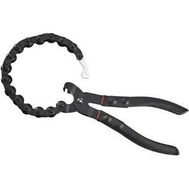
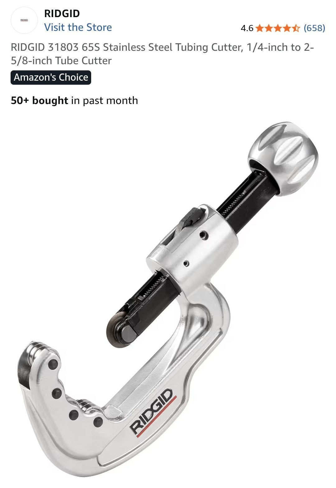
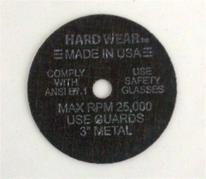
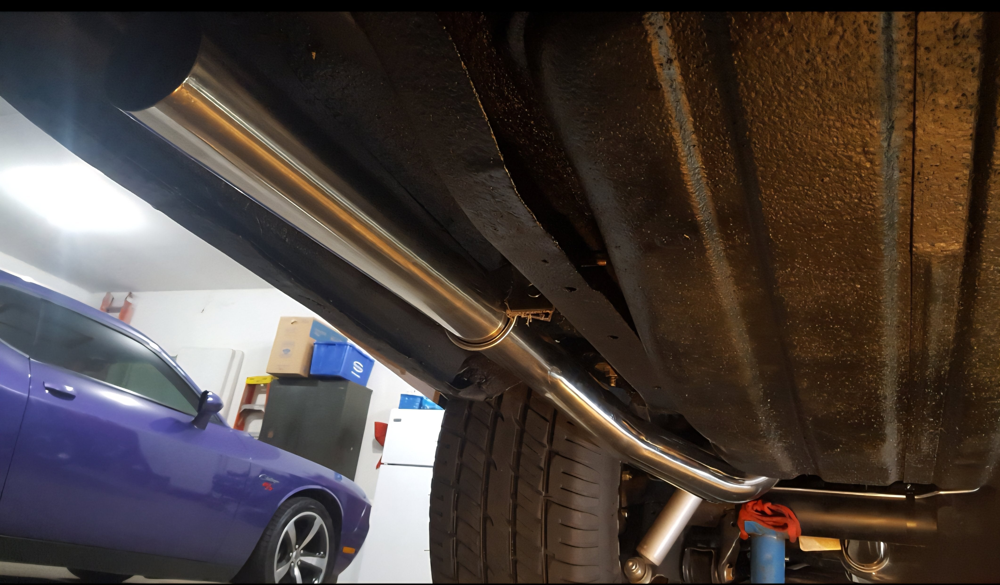
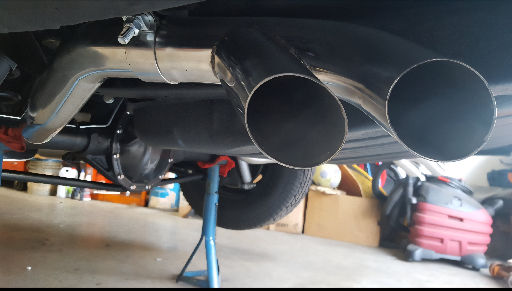

# SS exhaust pipe cutting tool?
**Forum:** GTO Forum | **Started:** November 25, 2025 | **Replies:** 36
**Thread URL:** https://www.gtoforum.com/threads/ss-exhaust-pipe-cutting-tool.150779/post-1058932

## The Issue
Hey guys, I'm going to be installing a Pypes stainless steel exhaust in two weeks and will need to make a few cuts.  I've heard that it can be tough to cut SS with standard exhaust pipe (chain) cutters. What has your experience been like? Recommend any tools? I don't have a bandsaw.

## Solution / Outcome
> Sick467 said: > Sounds like you have a reason to buy a TIG welder (and a cutoff tool)!   LOL   Good call on farming it out...you kinda get two for one there.                  Click to expand... Hah! Yeah, I thought about that... especially the cut off tool ... but figure I'll wait for now.

## Key Advice
- **@Sick467**: I did all mine with a side-grinder & 0.040"thick cut-off wheel.  Clamping the pipes in a bench-vise makes it a lot easier.  A piece of paper can be wrapped around the pipe to be marked with a marker f
- **@ponchonlefty**: chop saw may be an option. but only if you will be using it more than once. it will be easier to keep straight. look for a used one as it may get you a deal.  but sick has a good idea as well. just se
- **@Baaad65**: I just used a fine tooth sawzall, if a pipe is going over the cut peice so what if it's not perfectly straight.
- **@Jim K**: On those Rigid tubing cutters, make sure the wheel is big enough that it will cut all the way through the pipe. In some cases the cutting wheel is pretty shallow..
- **@Ctao9**: That tool that you attached with your post works wonders. Took me maybe 3 minutes to cut each pipe and it cuts nice and even. Of course you’ll need sufficient space to work this tool back and forth. H
- **@armyadarkness**: I cut stainless all day, every day for the last 35 years. It sucks.  Resist the urge to use any saw, because unless it's a brand new blade and you're using oil and going slow, it'll wipe the blade out
- **@66COUPE**: 4.5” angle grinder kick back attack on one of my daughters good friend, 25+ stitches, gotta really be careful with them like Amy mentions !
- **@chrisethomas69**: > ponchonlefty said: > i have not machined 409 but i have 304. 304 is pretty rough on tools. my search showed 409 to be harder but machinable. those cutting tools may not last as long cutting stainles
- **@roger1**: Hard Wear Cut Off Wheels                                                        In Stock 3' Cut Off Wheels All Sizes & Arbors!                                                                          
- **@oldog97**: I used my 4 1/2" Milwaukee cordless angle grinder with a cut off wheel. Worked like a champ! Fast and clean cuts every time!
- **@kurzhar**: A heavy zip tie makes for a nice clean guide for the cuts.
- **@hdbob5454**: I worked in a shipyard when they had to cut pipe they would put a hose clamp where they were to cut to keep it straight and use a hand held grinder
- **@twotone '64**: I did the hose clamp trick with the angle grinder when I did mine. Way easier when it's off the car, but doable either way.
- **@Ricks68**: With the Pypes product I didn’t need to make any cuts. 🤷🏼‍♂️ they fit perfectly. I used my Harbor Freight MiG welder and SS wire with gas then ground and polished the welds and they look great. Why 
- **@fishwater**: On my Pypes system I had to cut the down pipes to the X pipe and then cut the tailpipes since I used aftermarket 1972 only tips. I used a sawzall and they are incredibly uneven but hidden under the sl

## Helpers
- **@Sick467** — 3 post(s)
- **@ponchonlefty** — 5 post(s)
- **@Baaad65** — 2 post(s)
- **@Jim K** — 1 post(s)
- **@Ctao9** — 3 post(s)
- **@armyadarkness** — 2 post(s)
- **@66COUPE** — 1 post(s)
- **@chrisethomas69** — 1 post(s)
- **@roger1** — 1 post(s)
- **@oldog97** — 1 post(s)
- **@kurzhar** — 1 post(s)
- **@hdbob5454** — 1 post(s)
- **@twotone '64** — 1 post(s)
- **@Ricks68** — 1 post(s)
- **@fishwater** — 1 post(s)

## Thread Summary

### Kevin's Original Post
Hey guys, I'm going to be installing a Pypes stainless steel exhaust in two weeks and will need to make a few cuts.

I've heard that it can be tough to cut SS with standard exhaust pipe (chain) cutters. What has your experience been like? Recommend any tools? I don't have a bandsaw.

### Replies

**@Sick467** (reply #1):
I did all mine with a side-grinder & 0.040"thick cut-off wheel.  Clamping the pipes in a bench-vise makes it a lot easier.  A piece of paper can be wrapped around the pipe to be marked with a marker for clean straight cuts.

**@ponchonlefty** (reply #2):
chop saw may be an option. but only if you will be using it
more than once. it will be easier to keep straight.
look for a used one as it may get you a deal.

but sick has a good idea as well. just secure the pipe
in case the grinder grabs.

**@kevnord** (reply #3):
This tool looks promising... but... $$$

**@Baaad65** (reply #4):
I just used a fine tooth sawzall, if a pipe is going over the cut peice so what if it's not perfectly straight.

**@kevnord** (reply #5):
I saw (no pun intended) someone put a hose clamp around the pipe which provided a nice way to guide the saw and get a relatively straight cut. Like you said, it doesn't have to be perfect

**@Jim K** (reply #6):
On those Rigid tubing cutters, make sure the wheel is big enough that it will cut all the way through the pipe. In some cases the cutting wheel is pretty shallow..

**@Ctao9** (reply #7):
That tool that you attached with your post works wonders. Took me maybe 3 minutes to cut each pipe and it cuts nice and even. Of course you’ll need sufficient space to work this tool back and forth. Highly recommend this tool.

**@kevnord** (reply #8):
The Rigid one? 
Good to know!!!

**@Ctao9** (reply #9):
GEARWRENCH Exhaust and Tailpipe Cutter | 2031DD - Tailpipe Repair Tools - Amazon.com

I bought this one from Amazon, but I’m sure they’re all relatively the same

**@kevnord** (reply #10):
> Ctao9 said:
> GEARWRENCH Exhaust and Tailpipe Cutter | 2031DD - Tailpipe Repair Tools - Amazon.com

I bought this one from Amazon, but I’m sure they’re all relatively the same
        
        Click to expand...
Were your pipes stainless steel?

**@Ctao9** (reply #11):
> kevnord said:
> Were your pipes stainless steel?
        
        Click to expand...
Yes they were stainless steel

**@armyadarkness** (reply #12):
I cut stainless all day, every day for the last 35 years. It sucks.

Resist the urge to use any saw, because unless it's a brand new blade and you're using oil and going slow, it'll wipe the blade out before you finish your cut. And even if Jesus blesses you, you'll be lucky to get 1.5 cuts with brand new blade.

And... this is all assuming that it's a good, name brand blade with the appropriate tooth configuration.

PIPE CUTTERS like the Ridgid are great, but as was mentioned, clearance is an issue. If you have to cut a pipe on the car, forget it... and will you ever use it again?

The cheapest, fastest way is with a 4" or 4.5" angle grinder with cutoff wheels. As an added bonus, it will eternally serve your sanding, cutting, grinding, and wire wheel needs. That being said, it's also the dirtiest and most dangerous of the bunch, so make sure you wear protection.

**@66COUPE** (reply #13):
4.5” angle grinder kick back attack on one of my daughters good friend, 25+ stitches, gotta really be careful with them like Amy mentions !

**@ponchonlefty** (reply #14):
that's why its also called the death wheel. i've been lucky.
be careful guys.

**@ponchonlefty** (reply #15):
there are different series of stainless. one of the toughest is 304 series.
303 cuts like mild steel. so many to name. look at the series of stainless
before buying.

**@kevnord** (reply #16):
Looks like it's 409 (Pypes)

**@ponchonlefty** (reply #17):
i have not machined 409 but i have 304. 304 is pretty rough on tools.
my search showed 409 to be harder but machinable. those cutting
tools may not last as long cutting stainless but im sure it will
do the job.

**@chrisethomas69** (reply #18):
> ponchonlefty said:
> i have not machined 409 but i have 304. 304 is pretty rough on tools.
my search showed 409 to be harder but machinable. those cutting
tools may not last as long cutting stainless but im sure it will
do the job.

        
        Click to expand...
304 and 316 are more pure stainless than almost any on the market. The hardest I've seen is 440.It has a lot of carbon(hence) hardness. 304 and 316 are soft but destroy tooling and blades fast. I used millions of dollars

 worth fixing procter and gamble food equipment. It sticks to tooling and saws destroying them.

**@ponchonlefty** (reply #19):
> chrisethomas69 said:
> 304 and 316 are more pure stainless than almost any on the market. The hardest I've seen is 440.It has a lot of carbon(hence) hardness. 304 and 316 are soft but destroy tooling and blades fast. I used millions of dollars

worth fixing procter and gamble food equipment. It sticks to tooling and saws destroying them.
        
        Click to expand...
its been a long time but i think i machined 316 before. 304 was the main
material we used. chips like razors.

**@armyadarkness** (reply #20):
> chrisethomas69 said:
> 304 and 316 are soft but destroy tooling and blades fast.
        
        Click to expand...
YES!!!!! This is such a big misconception. People think that because stainless is soft, it's going to be easier to deal with. But its exactly the opposite.

**@Sick467** (reply #21):
304 is a bit harder than 409 SS.

**@roger1** (reply #22):
Hard Wear Cut Off Wheels
                    
                

                In Stock 3' Cut Off Wheels All Sizes & Arbors!

                
                    
                        
                    
                    www.roarksupply.com

**@oldog97** (reply #23):
I used my 4 1/2" Milwaukee cordless angle grinder with a cut off wheel. Worked like a champ! Fast and clean cuts every time!

**@kurzhar** (reply #24):
A heavy zip tie makes for a nice clean guide for the cuts.

**@hdbob5454** (reply #25):
I worked in a shipyard when they had to cut pipe they would put a hose clamp where they were to cut to keep it straight and use a hand held grinder

**@twotone '64** (reply #26):
I did the hose clamp trick with the angle grinder when I did mine. Way easier when it's off the car, but doable either way.

**@Ricks68** (reply #27):
With the Pypes product I didn’t need to make any cuts. 🤷🏼‍♂️ they fit perfectly. I used my Harbor Freight MiG welder and SS wire with gas then ground and polished the welds and they look great. Why will you need to cut your custom fit exhaust?

**@kevnord** (reply #28):
I just assumed I'd have to cut them where the (Pypes) down pipe meet the (Pypes) exhaust and/or for the exhaust tips. But maybe not? 

I watched the official Pypes videos and other on YouTube and it looked like there were always some cuts. I'd be thrilled if not.

**@kevnord** (reply #29):
What year and model did you put Pypes on?

**@Baaad65** (reply #30):
On my '65 with down pipes and an X pipe the only thing I had to cut off was the end of the tails to position the splitters where I wanted them.

**@kevnord** (reply #31):
looks fantastic! Can't wait to get mine on!

Was trying to pull off my old, 35yo exhaust last night and discovered the knucklehead that put it on way back spot welded a large tailpipe hanger screw so that it stays in... instead of using a nut/bolt. The screw goes through and there's a little bit of welding material on the other side to keep it from being pulled out. The screw is loose, just won't back out of the hole.Shouldn't be that hard to deal with but it was driving me bonkers until I saw what had been done.

**@fishwater** (reply #32):
On my Pypes system I had to cut the down pipes to the X pipe and then cut the tailpipes since I used aftermarket 1972 only tips. I used a sawzall and they are incredibly uneven but hidden under the slip fit of the joint.

**@kevnord** (reply #33):
I finally have the exhaust loosely hung and can tell I'm going to have to cut the downpipes a good foot or so.

**@kevnord** (reply #34):
Given the cost of buying a tool to make a nice cut AND the fact that I was planning to use a clamp-on O2 sensor adapter, I decided to forgo both and have my local welder/muffler-shop weld the bung on and make the cuts for me. I'll save a couple bucks and it'll be done well.

**@Sick467** (reply #35):
Sounds like you have a reason to buy a TIG welder (and a cutoff tool)!   LOL  

Good call on farming it out...you kinda get two for one there.

**@kevnord** (reply #36):
> Sick467 said:
> Sounds like you have a reason to buy a TIG welder (and a cutoff tool)!   LOL 

Good call on farming it out...you kinda get two for one there.
        
        Click to expand...
Hah! Yeah, I thought about that... especially the cut off tool ... but figure I'll wait for now.

## Images

