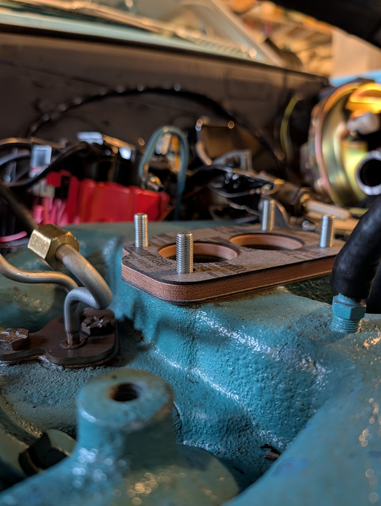
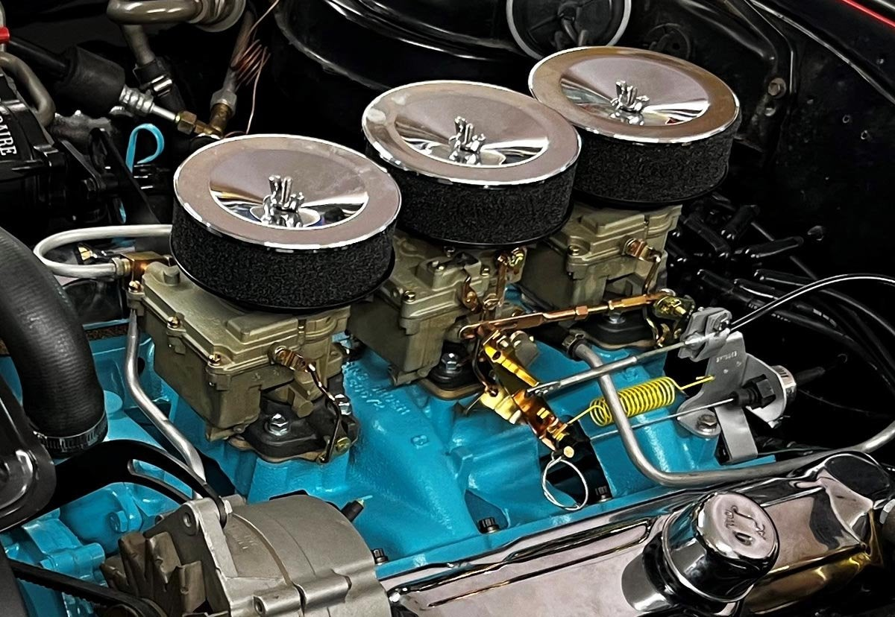
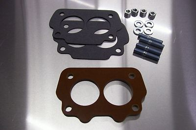
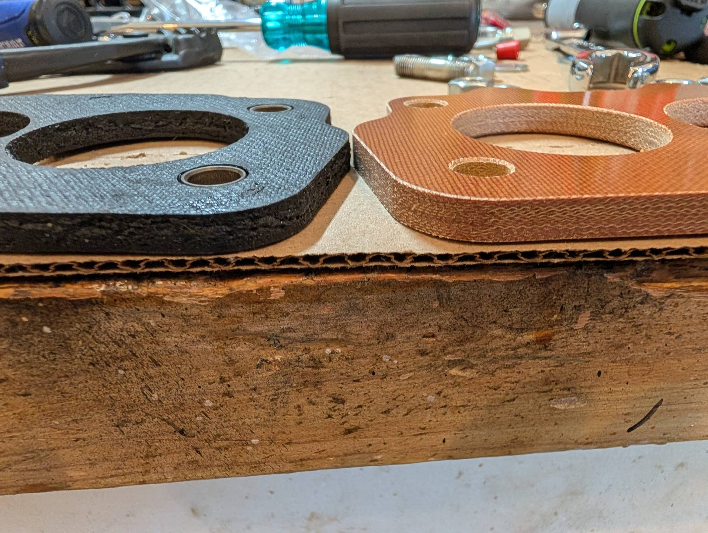
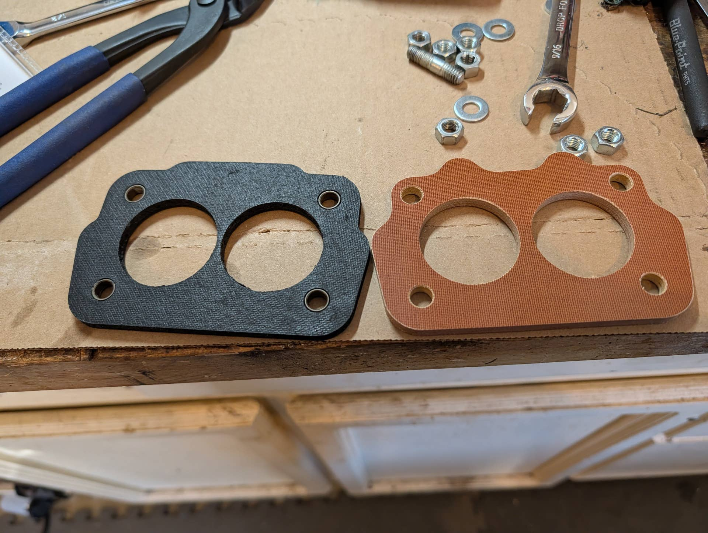
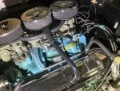

# The need for a phenolic riser insulator?
**Forum:** GTO Forum | **Started:** March 29, 2026 | **Replies:** 8
**Thread URL:** https://www.gtoforum.com/threads/the-need-for-a-phenolic-riser-insulator.151622/post-1069325

## The Issue
1964 Tempest w/326 2bbl Rochester. I was having some hot-start issues throughout the summer last year. I don't really remember dealing with that many, many years ago when the car was my daily driver (90s!). I was a kid, so maybe i just shrugged it off.  At the end of the summer, I discovered that my new fuel-pump was pumping at WELL above what the product info said. I was getting 12-14psi so I added a regulator to bring down the PSI into the needed range. It seemed liked that helped of fixed the...

## Solution / Outcome
FYI I just picked up this gasket at O'Reilly's. Available lots of places. ~$12 Fel-Pro Performance Carburetor Mounting Gaskets 60279  It's the one in the left. It's not phenolic but heat resistant

## Key Advice
- **@lust4speed**: We just installed spacers on a TriPower at the owner's request.  He also demanded the crossover ports in the #77 heads be filled so I did that also.  To me it was overkill but the SoCal carb shop he u
- **@Greek64GTO**: I found them on 2 sites.  I bought them from Pontiac Tripower  Tripower dot com  Dashmans on Ebay  Ames also has a few choices
- **@ponchonlefty**: its a good upgrade. cool fuel is power. on a hot day in Texas it may be just the thing.
- **@Ranchogto**: The rubber carb insulator in your picture is what my 66 GTO tri-Power has installed. The $12 cost vs the phenolic cost is a good trade off. I recently changed my fuel pump to a Carter pusher type and 
- **@GTOTIGR**: > kevnord said: > 1964 Tempest w/326 2bbl Rochester. I was having some hot-start issues throughout the summer last year. I don't really remember dealing with that many, many years ago when the car was

## Helpers
- **@lust4speed** — 2 post(s)
- **@Greek64GTO** — 1 post(s)
- **@ponchonlefty** — 1 post(s)
- **@Ranchogto** — 1 post(s)
- **@GTOTIGR** — 1 post(s)

## Thread Summary

### Kevin's Original Post
1964 Tempest w/326 2bbl Rochester.
I was having some hot-start issues throughout the summer last year. I don't really remember dealing with that many, many years ago when the car was my daily driver (90s!). I was a kid, so maybe i just shrugged it off.

At the end of the summer, I discovered that my new fuel-pump was pumping at WELL above what the product info said. I was getting 12-14psi so I added a regulator to bring down the PSI into the needed range. It seemed liked that helped of fixed the hard start issue, but I haven't stopped/started enough times since then to check it off.

I thought it would be wise to add a phenolic riser to help with heat if there was still an issue. I finally got one and started to put it in, but noticed the 1/4" insulator makes it hard to attache the heat stove pipe to the choke. I think it's going to change the alignment of the vacuum tubes on the back as well.

I think I'm going to just use a single gasket as the car has always had and see if I run into any heat issues once I tune everything. I run ethanol-free gas, so that should help.

Thoughts? Am I destined to add it?

### Replies

**@lust4speed** (reply #1):
We just installed spacers on a TriPower at the owner's request.  He also demanded the crossover ports in the #77 heads be filled so I did that also.  To me it was overkill but the SoCal carb shop he used for the rebuild talked him into it.  Wasn't much of a problem putting a different bend in the tubes and they stretched out fine to work with the spacers.  Since the crossover was blocked the tubes were just there for looks on this setup, and an electric choke was installed.  I looked through the photos and don't have a shot of the passenger side.

Can you tell us where you purchased the spacers?  They were not listed separately on the carb shop's invoice and the shop was extremely pricy on everything so really don't want to purchase from them if this comes up again.

**@Greek64GTO** (reply #2):
I found them on 2 sites.  I bought them from Pontiac Tripower

Tripower dot com

Dashmans on Ebay

Ames also has a few choices

**@kevnord** (reply #3):
I bought this one. i'm happy with it.

    

    
        
            
                
                    
                        
                        
                
            
            
                
                    
                        For Rochester 2GC 2GV Big Carburetor Phenolic Riser Insulator GM GTO Spacer 1/4" | eBay
                    
                

                This 1/4" thick phenolic riser kit for the big Rochester 500 CFM carb and will fit other models as well. Add a little performance to your machine the cheap way, and keep the heat away from the carburetor to solve the heat soak or carburetor boiling issues.

                
                    
                        
                    
                    www.ebay.com
                
            
        
    

My main question though is are ya'll using them or have you found them unnecessary when using ethanol-free gas?

**@ponchonlefty** (reply #4):
its a good upgrade. cool fuel is power. on a hot day in Texas
it may be just the thing.

**@lust4speed** (reply #5):
> kevnord said:
> My main question though is are ya'll using them or have you found them unnecessary when using ethanol-free gas?
        
        Click to expand...
Actually I did say above that I thought the spacers were overkill - but on the other hand they won't do any harm and might do some good.  I also agree with you that most of the vapor lock problems are caused by the fuel line between tank and mechanical fuel pump.  The mechanical fuel pump lowers the pressure in the line by sucking the fuel to it.  Stands to reason that lowering the vaporization pressure and increasing the heat there is definitely going to be more of a chance of having the fuel flash to vapor (especially where the fuel line runs closest to the exhaust).  A pusher pump makes it harder for the fuel to flash, and only problem is an electric pump back at the tank will add pressure to the mechanical pump and can overpower the needle valve in the carburator(s).  I always end up hiding a small Holley regulator after the mechanical pump on the line up to the carb.

**@kevnord** (reply #6):
FYI I just picked up this gasket at O'Reilly's. Available lots of places. ~$12
Fel-Pro Performance Carburetor Mounting Gaskets 60279

It's the one in the left. It's not phenolic but heat resistant

**@Ranchogto** (reply #7):
The rubber carb insulator in your picture is what my 66 GTO tri-Power has installed. The $12 cost vs the phenolic cost is a good trade off. I recently changed my fuel pump to a Carter pusher type and went with a Holley 1-6 adjusted regulator. It’s set to 3 1/2 psi for the Tripower. I’m not experiencing any hot start issues. Be sure to route your fuel lines at least a 1” gap from the cylinder heads.

cheers

**@GTOTIGR** (reply #8):
> kevnord said:
> 1964 Tempest w/326 2bbl Rochester.
I was having some hot-start issues throughout the summer last year. I don't really remember dealing with that many, many years ago when the car was my daily driver (90s!). I was a kid, so maybe i just shrugged it off.

At the end of the summer, I discovered that my new fuel-pump was pumping at WELL above what the product info said. I was getting 12-14psi so I added a regulator to bring down the PSI into the needed range. It seemed liked that helped of fixed the hard start issue, but I haven't stopped/started enough times since then to check it off.

I thought it would be wise to add a phenolic riser to help with heat if there was still an issue. I finally got one and started to put it in, but noticed the 1/4" insulator makes it hard to attache the heat stove pipe to the choke. I think it's going to change the alignment of the vacuum tubes on the back as well.

I think I'm going to just use a single gasket as the car has always had and see if I run into any heat issues once I tune everything. I run ethanol-free gas, so that should help.

Thoughts? Am I destined to add it?

    View attachment 204674
    

        
        Click to expand...
In terms of your recall regarding fuel related issues back in the day, they likely did not occur due to the cars being built to run on the fuel quality available at the time. Today’s fuel has ethanol mixed with it and in states like CA where we are special, we also get to enjoy summer blend oxygenated fuels reportedly to reduce bad stuff from being expelled in the environment by our nonelectric vehicles.

I use the 1/4“ phenolic spacers from the Pontiac TriPower team, with zero modification from stock and they work great. Before installing them I painted them to match the carb base so they were discrete.

I also run the correct OEM AC Delco 6550 fuel pump that runs in the 3-5 psi range with no issues except occasionally fuel seepage from the carb top to base gasket (see “CA special gas”). As a related side, my 68 runs an OEM R.A. system with R.A. jetted Quadrajet with no modifications, phenolic spacer or otherwise, with no issues. - no vapor lock or fuel boil-over. 

My opinion, if you run at factory specs, regardless if you use OEM equipment or aftermarket and everything is verified as functioning correctly - carbs set up correctly, fuel system clean, timing set properly, etc. you should be fine. I went through everything to finally get the car with the TriPower to run as it should - without issues, even with the fine CA fuels.

## Images

