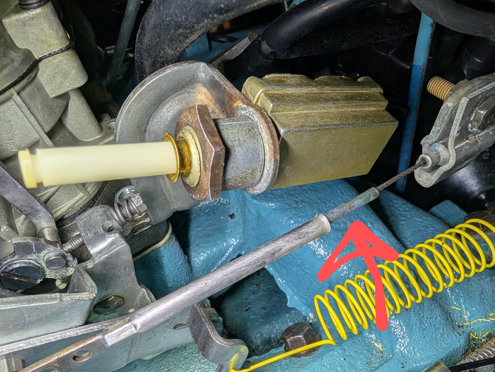

# Throttle linkage tube
**Forum:** GTO Forum | **Started:** August 20, 2025 | **Replies:** 2
**Thread URL:** https://www.gtoforum.com/threads/throttle-linkage-tube.150239/post-1052846

## The Issue
'64 Tempest w/326 2BBL  Hey guys, noticed this little tube that's sliding on the throttle cable. Should it be sliding around? Or should it be attached to something?                                                                                                                              A

## Key Advice
- **@O52**: Should be attached to the cable ferrule inside the clamp
- **@lust4speed**: The plastic sleeve in mine broke 20+ years ago and hasn't caused any problems.  I did buy a replacement a few years ago and the quality of the cable wasn't that great and I ended up keeping the old on

## Helpers
- **@O52** — 1 post(s)
- **@lust4speed** — 1 post(s)

## Thread Summary

### Kevin's Original Post
'64 Tempest w/326 2BBL

Hey guys, noticed this little tube that's sliding on the throttle cable. Should it be sliding around? Or should it be attached to something?

    
        
            
        
        
            
                
                
            
        
    
    
A

### Replies

**@O52** (reply #1):
Should be attached to the cable ferrule inside the clamp

**@lust4speed** (reply #2):
The plastic sleeve in mine broke 20+ years ago and hasn't caused any problems.  I did buy a replacement a few years ago and the quality of the cable wasn't that great and I ended up keeping the old one and the new replacement is on the shelf.

## Images

