# Timing chain and water pump replacement
**Forum:** GTO Forum | **Started:** August 12, 2025 | **Replies:** 17
**Thread URL:** https://www.gtoforum.com/threads/timing-chain-and-water-pump-replacement.150123/post-1051649

## The Issue
Hey guys, My 64 Tempest has the original timing chain with 97k miles on it. Probably a good idea to replace it and the water pump (which I replaced 35yr ago).  Any tips on where I should get em and good brands? Should I plan to replace the timing chain cover or wait to see what it looks like removed?  Thanks -k

## Solution / Outcome
> Scott06 said: > Get the date off the block by the distributor and you can tell more or less by matching build date off cowl tag.i would be surprised if the engine was replaced with a same year engine. The 960 matches 964/326/2 bbl/ auto…  had the same set up in my first car which was a 65 lemans coupe that I bought in 1987, had 66 k on it one owner,paid $2100. 326/2 bbl/ 2 spd auto. Vary straight car I should have kept.… but it put the hook in me on ponchos                  Click to expand......

## Key Advice
- **@lust4speed**: Butler Performance carries the new early timing cover with the correct pointer.  Definitely a pricy item at $398.95 so lets hope yours is still good.  Just look for pitting inside the water pump housi
- **@Scott06**: Butler, Ames, and Paul Spotts are my go to places for engine parts for Ponchos
- **@Sick467**: Make sure it has these 8 bolts or it would be a later model cover and pump...                                                                                                                           
- **@willslow76**: The Melling 3350S is a great stock replacement timing chain for not a lot of money.
- **@O52**: Looks like you may have an original block. 446952 is the EUN (Engine Unit Number / Serial Number)  64 engines had a number code 960 is a 64 326 2 bbl. 250 HP automatic  1964​326​250 HP​96-0​A​8.6​441​

## Helpers
- **@lust4speed** — 3 post(s)
- **@Scott06** — 4 post(s)
- **@Sick467** — 1 post(s)
- **@willslow76** — 1 post(s)
- **@O52** — 1 post(s)

## Thread Summary

### Kevin's Original Post
Hey guys,
My 64 Tempest has the original timing chain with 97k miles on it. Probably a good idea to replace it and the water pump (which I replaced 35yr ago).

Any tips on where I should get em and good brands? Should I plan to replace the timing chain cover or wait to see what it looks like removed?

Thanks
-k

### Replies

**@lust4speed** (reply #1):
Butler Performance carries the new early timing cover with the correct pointer.  Definitely a pricy item at $398.95 so lets hope yours is still good.  Just look for pitting inside the water pump housing and on the rear of the timing cover where the coolant passages align with the block holes.

Also the 66-68 8-bolt timing cover is functionally the same as the 64, but has a timing tab instead of the arrow pointer.  You can save some money if you don't mind being a little incorrect in looks.

Make sure the two plates behind the pump are in good shape and do some reading on clearancing the back plate to the pump impeller because it makes a massive difference in cooling.

I usually also recommend Ames Performance but I don't see the timing cover with the pointer.  They do have a better selection of 8-bolt water pumps than Butler at the moment.  Butler and Ames both carry Flow-Kooler water pumps, and they cool just as good as a stock pump .  Personally I use standard cast iron pumps but no harm in spending more money for the Flow-Kooler.

**@kevnord** (reply #2):
> lust4speed said:
> Butler Performance carries the new early timing cover with the correct with the pointer.  Definitely a pricy item at $398.95 so lets hope yours is still good.  Just look for pitting inside the water pump housing and on the rear of the timing cover where the coolant passages align with the block holes.

Also the 65-68 8-bolt timing cover is functionally the same as the 64, but has a timing tab instead of the arrow pointer.  You can save some money if you don't mind being a little incorrect in looks.

Make sure the two plates behind the pump are in good shape and do some reading on clearancing the back plate to the pump impeller because it makes a massive difference in cooling.

I usually also recommend Ames Performance but I don't see the timing cover with the pointer.  They do have a better selection of 8-bolt water pumps than Butler at the moment.  Butler and Ames both carry Flow-Kooler water pumps, and they cool just as good as a stock pump .  Personally I use standard cast iron pumps but no harm in spending more money for the Flow-Kooler.
        
        Click to expand...
Thanks for the great info! I've never purchased from Butler but they look to have some nice stuff.

**@Scott06** (reply #3):
Butler, Ames, and Paul Spotts are my go to places for engine parts for Ponchos

**@kevnord** (reply #4):
> lust4speed said:
> Butler Performance carries the new early timing cover with the correct with the pointer.  Definitely a pricy item at $398.95 so lets hope yours is still good.  Just look for pitting inside the water pump housing and on the rear of the timing cover where the coolant passages align with the block holes.

Also the 65-68 8-bolt timing cover is functionally the same as the 64, but has a timing tab instead of the arrow pointer.  You can save some money if you don't mind being a little incorrect in looks.

Make sure the two plates behind the pump are in good shape and do some reading on clearancing the back plate to the pump impeller because it makes a massive difference in cooling.

I usually also recommend Ames Performance but I don't see the timing cover with the pointer.  They do have a better selection of 8-bolt water pumps than Butler at the moment.  Butler and Ames both carry Flow-Kooler water pumps, and they cool just as good as a stock pump .  Personally I use standard cast iron pumps but no harm in spending more money for the Flow-Kooler.
        
        Click to expand...
Hey @lust4speed , which one of these would be correct for my 64 326 Tempest...
I would guess the first one based on "stock" and 1964-1965 but my current one looks more like the second one in terms of the timing mark.

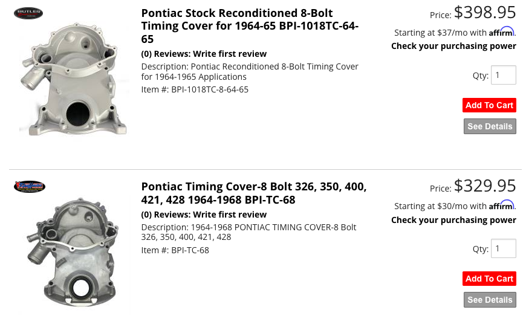

**@Scott06** (reply #5):
I would wait and see what the cover looks like in terms of pitting before deciding to replace.

**@lust4speed** (reply #6):
All fit, but the expensive one is correct.  Only difference is the timing pointer for the 64-65, while the 66-68 used a timing tab.

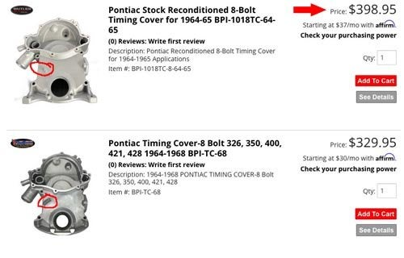

**@kevnord** (reply #7):
It looks like I have a 66-68 on mine right now...
I don't know when this would have been done. My grandma bought the car new in 64 and I got it in '90 and drove it for a few years and then is sat at my folks house until recently. I replaced the water pump back in the 90s but not the timing chain n/cover. It probably has 80k miles on it when I got it. Hmmm

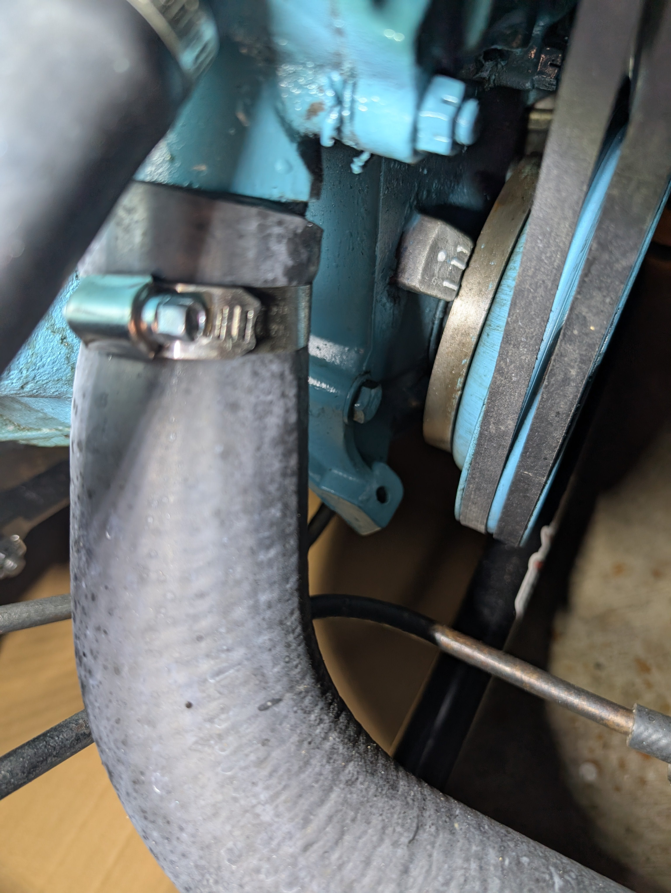
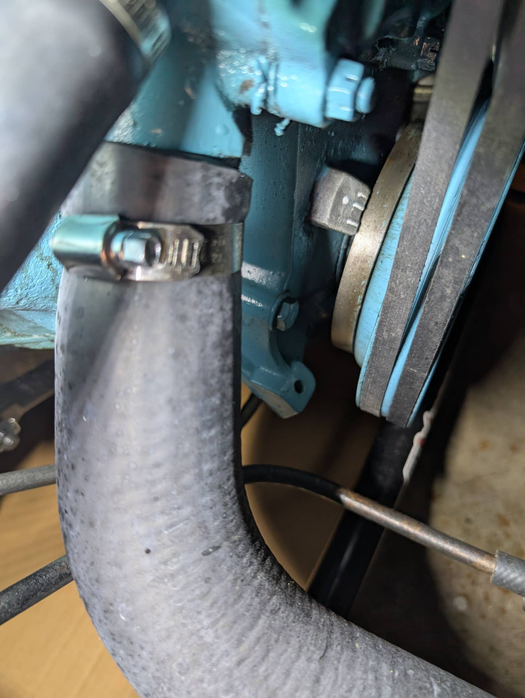

**@Sick467** (reply #8):
Make sure it has these 8 bolts or it would be a later model cover and pump...

    
        
            
        
        
            
                
                
            
        
    
    

Pretty sure the later covers are 11-bolt units.

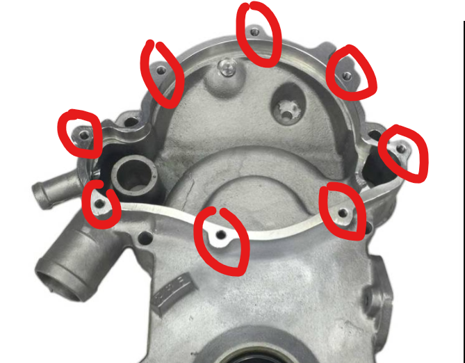

**@lust4speed** (reply #9):
Looking at the photo, I can pretty much say that the timing cover is probably a 66 cover.  The '67 cover went up to 12° on the timing tab  I can see the crank hub which fits the early years through '67 and the water pump stud is directly in line with the outlet hose which indicates an 8-bolt water pump.  The 11 bolt would have the later balancer and the stud would be off to the side of the outlet hose, and the '68 would have the later balancer with the early 8-bolt pump, and it is definitely an early hub.

Good possibility that the current timing cover can be re-used which would be good.  If it does need to be replaced you can go with the early pointer or later tab since that is already there.  It also wouldn't hurt to list the casting date that is adjacent to the distributor on the rear pad, and the numbers (or number letter mix) on the right front of the block.

**@kevnord** (reply #10):
This is from the right front. I haven't been able to locate the back numbers yet .. too much grease down there.

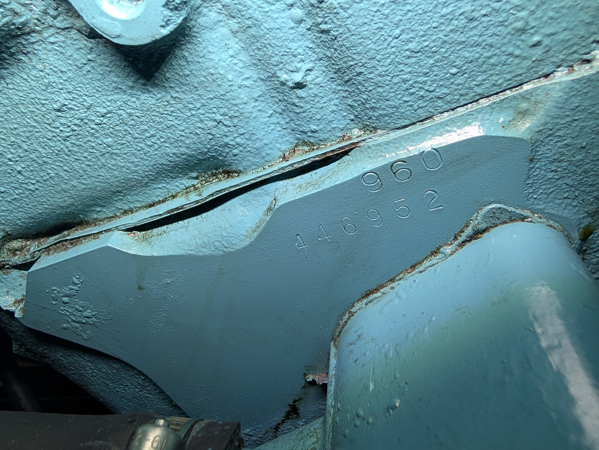
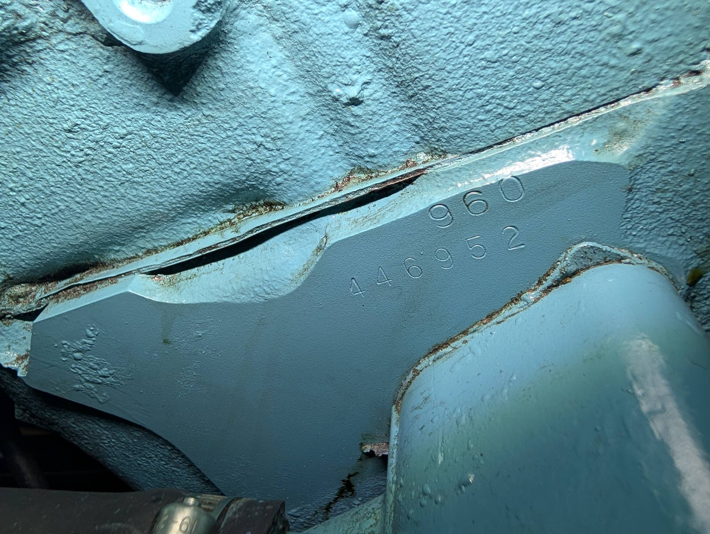

**@willslow76** (reply #11):
The Melling 3350S is a great stock replacement timing chain for not a lot of money.

**@O52** (reply #12):
Looks like you may have an original block.
446952 is the EUN (Engine Unit Number / Serial Number)

64 engines had a number code
960 is a 64 326 2 bbl. 250 HP automatic

1964​326​250 HP​96-0​A​8.6​441​9773345​1-2​7023062​

**@kevnord** (reply #13):
I believe it's the original since I'm the second owner after my grandma who bought it new. I was once told that the engine was replaced at 40k for some reason but I'm not buying it. That seems drastic unless grandma didn't maintain it. Guess that's possible. I'm away from home for a few days but will continue looking for more numbers on the block when back

**@Scott06** (reply #14):
Get the date off the block by the distributor and you can tell more or less by matching build date off cowl tag.i would be surprised if the engine was replaced with a same year engine. The 960 matches 964/326/2 bbl/ auto…

had the same set up in my first car which was a 65 lemans coupe that I bought in 1987, had 66 k on it one owner,paid $2100. 326/2 bbl/ 2 spd auto. Vary straight car I should have kept.… but it put the hook in me on ponchos

**@kevnord** (reply #15):
> Scott06 said:
> Get the date off the block by the distributor and you can tell more or less by matching build date off cowl tag.i would be surprised if the engine was replaced with a same year engine. The 960 matches 964/326/2 bbl/ auto…

had the same set up in my first car which was a 65 lemans coupe that I bought in 1987, had 66 k on it one owner,paid $2100. 326/2 bbl/ 2 spd auto. Vary straight car I should have kept.… but it put the hook in me on ponchos
        
        Click to expand...
Since the engine has a non-stock timing cover on it and I don't know when that was replaced, I suspect "the engine was replaced" rumor maybe meant the timing chain was replaced, though I would think they would have just reused the old cover. Its a mystery.

**@kevnord** (reply #16):
> Scott06 said:
> Get the date off the block by the distributor and you can tell more or less by matching build date off cowl tag.i would be surprised if the engine was replaced with a same year engine. The 960 matches 964/326/2 bbl/ auto…

had the same set up in my first car which was a 65 lemans coupe that I bought in 1987, had 66 k on it one owner,paid $2100. 326/2 bbl/ 2 spd auto. Vary straight car I should have kept.… but it put the hook in me on ponchos
        
        Click to expand...

    
        
            
        
        
            
                
                
            
        
    
    

Finally back home and cleaned off the grime covering the codes by the distributor. I believe they are...
9773153
D204

So it appears to be the original engine as the production date for the car is in May.

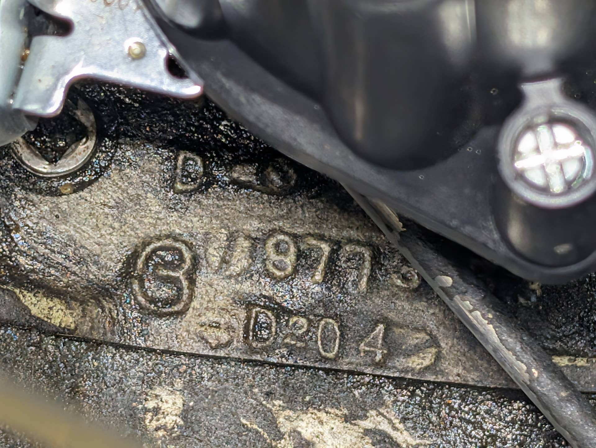
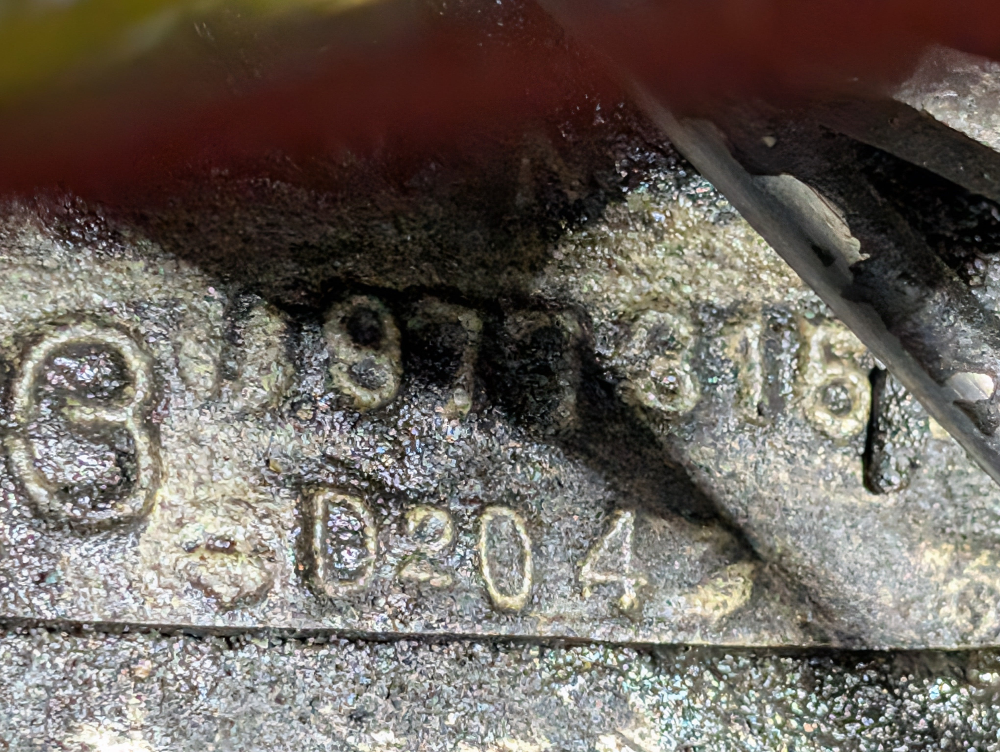

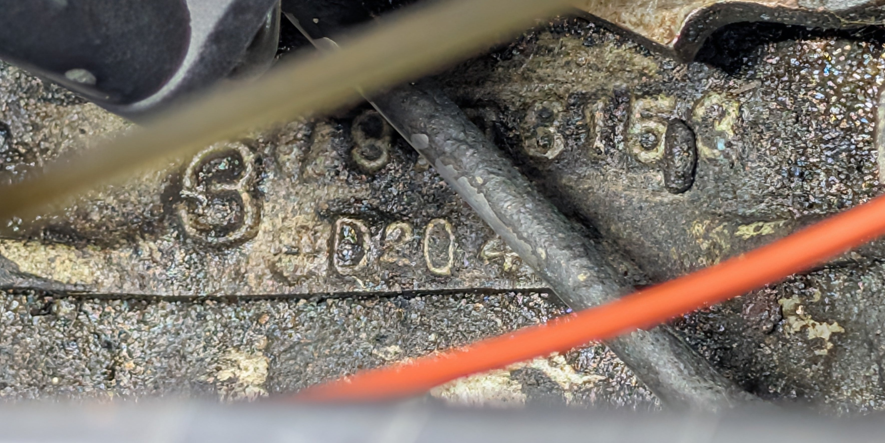

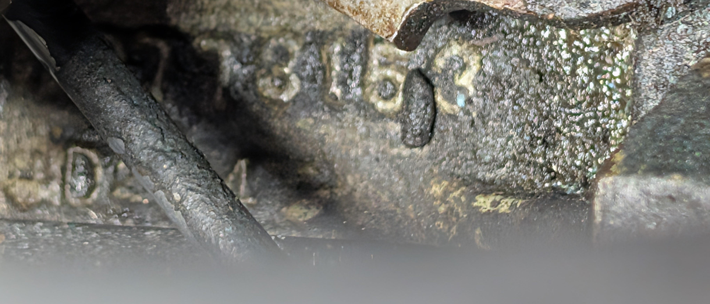

**@Scott06** (reply #17):
Would agree looks to be original.

## Images

