# Tips for removing interior door handle '64
**Forum:** GTO Forum | **Started:** October 26, 2025 | **Replies:** 25
**Thread URL:** https://www.gtoforum.com/threads/tips-for-removing-interior-door-handle-64.150723/post-1058098

## The Issue
Hey there. I'm not having any luck getting the door handle off. Probably hasn't been removed in 30yrs. I've tried all angles with different tools without success. I used to use a modified paint can opener but this one is really stuck in there. Not 100% sure the horseshoe clip is on the right direction. Cant see it

## Solution / Outcome
One thing I didn't notice/realize until today is that the tool needs to slide into the grooves to go far enough to push the pins. Seems obvious now, but those frontal points get bent easily.  Someone mentioned bending the tool but I was wasn't thinking specifically about the pointa.

## Key Advice
- **@ponchonlefty**: the old shoe string trick. slip it between the handle and panel. it will grab the clip. pull one side while holding pressure on the other. a rag might work. try it and report back.
- **@Baaad65**: Maybe someone put the clip on from the other direction.
- **@Sick467**: If the clip and/or handle has worn at the clip, it may be seated...so to speak.   Try your tool while pushing in on the handle or working it in and out.  No real force, just enough to get it to shift 
- **@66COUPE**: > kevnord said: > Thanks man, appreciate it! I located another handle I can use. I pulled off a junkyard 64 Lemans 35 years ago. Saved it for a rainy day. Funny enough it's literally raining today... 
- **@Jared**: Funny coincidence here.  You fought for two days to get your handle off.  I brought mien out yesterday and the first time I went to get out of the car, the inside doorhandle was gone.  The handle had 

## Helpers
- **@ponchonlefty** — 5 post(s)
- **@Baaad65** — 3 post(s)
- **@Sick467** — 3 post(s)
- **@66COUPE** — 1 post(s)
- **@Jared** — 1 post(s)

## Thread Summary

### Kevin's Original Post
Hey there. I'm not having any luck getting the door handle off. Probably hasn't been removed in 30yrs. I've tried all angles with different tools without success. I used to use a modified paint can opener but this one is really stuck in there. Not 100% sure the horseshoe clip is on the right direction. Cant see it

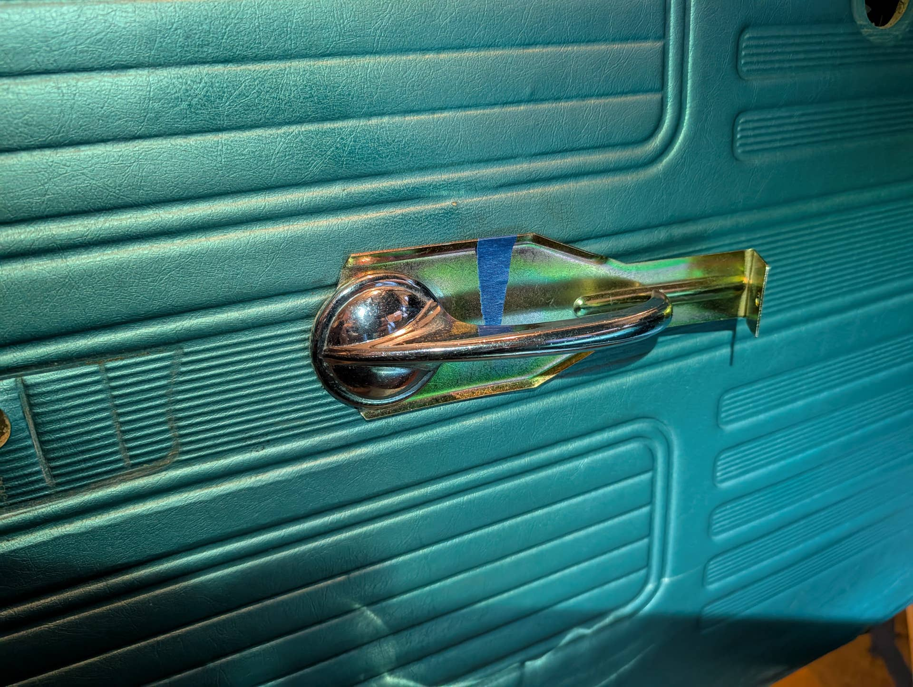

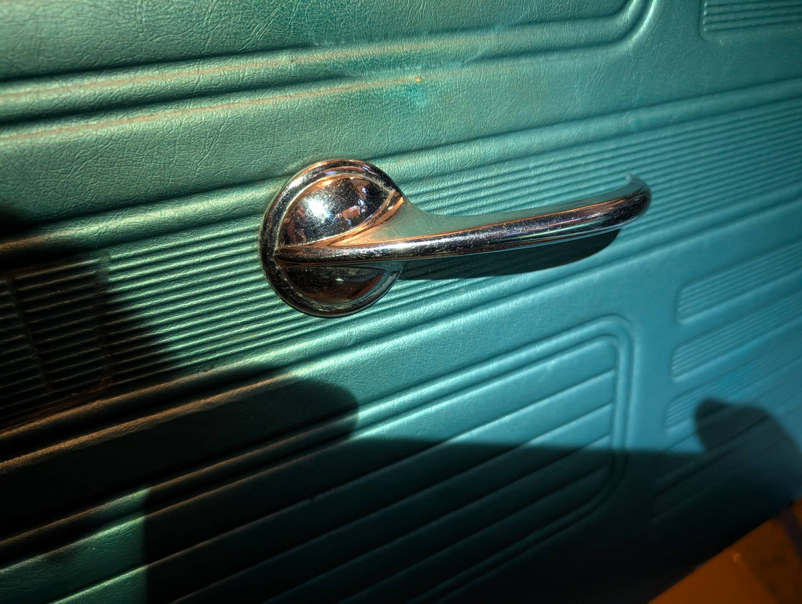

### Replies

**@ponchonlefty** (reply #1):
the old shoe string trick. slip it between the handle and panel.
it will grab the clip. pull one side while holding pressure on the other.
a rag might work.
try it and report back.

**@kevnord** (reply #2):
Hmm.. it didn't grab anything. I tried all directions... very smooth no snags. Tried on both sides of that plastic piece that sits between the handle and door panel. 

I'm wondering if the ends somehow got bent so far that they're inside the handle and you can't snag them any way

**@ponchonlefty** (reply #3):
> kevnord said:
> Hmm.. it didn't grab anything. I tried all directions... very smooth no snags. Tried on both sides of that plastic piece that sits between the handle and door panel.

I'm wondering if the ends somehow got bent so far that they're inside the handle and you can't snag them any way
        
        Click to expand...
hmmm. yeah its probably pushed in the handle or broken? do you have a dental
pick? you might catch the loop of the clip and pull it out. some fishing will
be needed to find it.

**@kevnord** (reply #4):
> ponchonlefty said:
> hmmm. yeah its probably pushed in the handle or broken? do you have a dental
pick? you might catch the loop of the clip and pull it out. some fishing will
be needed to find it.
        
        Click to expand...
I can flick the loop and move it, haven't been able to get behind it yet to pull it out. Just need to find/make a better tool

**@ponchonlefty** (reply #5):
> kevnord said:
> I can flick the loop and move it, haven't been able to get behind it yet to pull it out. Just need to find/make a better tool
        
        Click to expand...
these clips can be tedious sometimes. i have used small flat head 
screw drivers in the past. most times the shoe string or rag worked.
just feel around and keep at it. those flat tools do work. 

be ready for the clip to fly out and get lost. cup your hand at the handle to catch it. 
carefully not to stab yourself.

**@kevnord** (reply #6):
> ponchonlefty said:
> these clips can be tedious sometimes. i have used small flat head
screw drivers in the past. most times the shoe string or rag worked.
just feel around and keep at it. those flat tools do work.

be ready for the clip to fly out and get lost. cup your hand at the handle to catch it.
carefully not to stab yourself.
        
        Click to expand...
I tried the shoelace but I'll try the rag and just keep trying things until I get it 

The tool I bought came with a bunch of clips.

**@kevnord** (reply #7):
Will do!

**@Baaad65** (reply #8):
Maybe someone put the clip on from the other direction.

**@kevnord** (reply #9):
I think that's the top of the clip you can see. If I could get something thin with a hook to grab it.

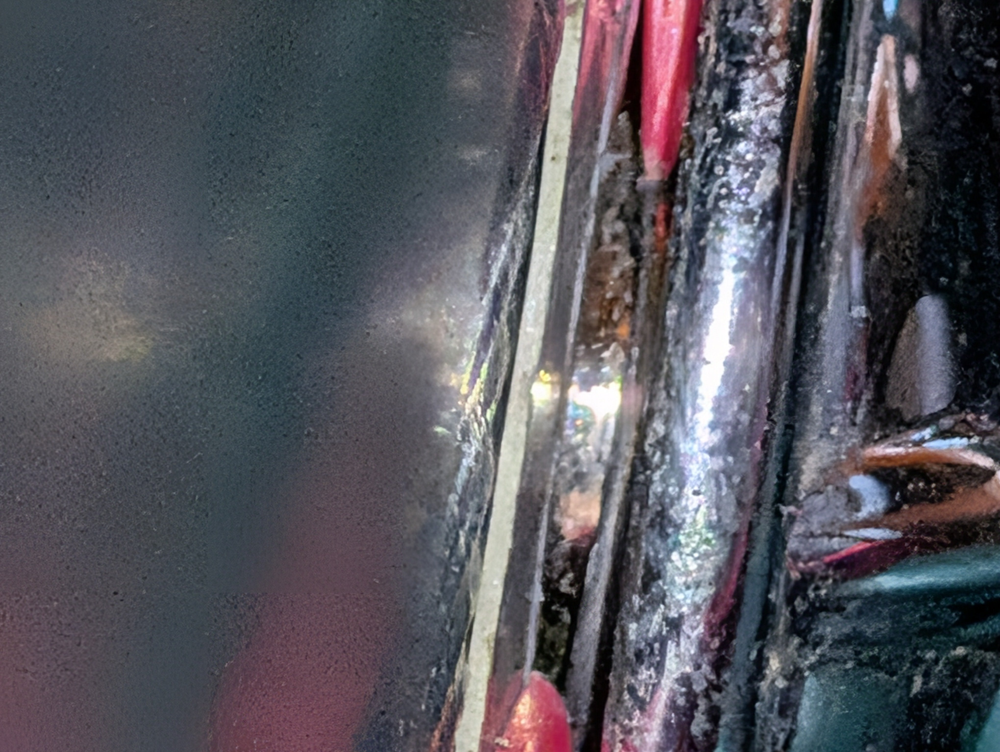
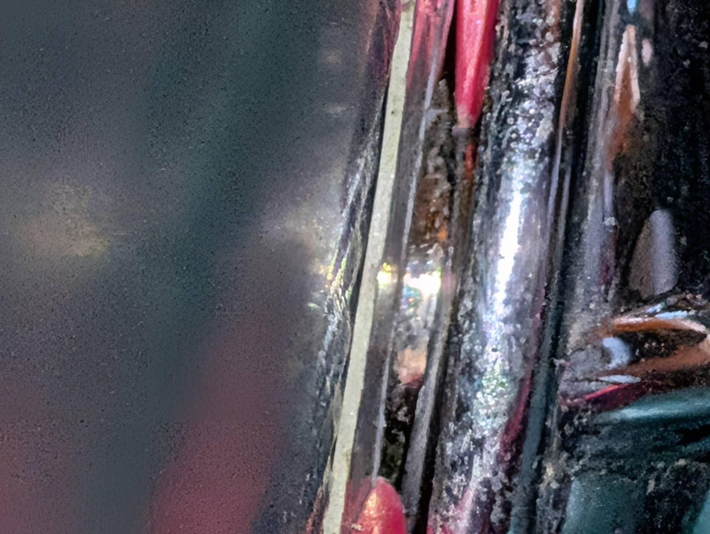

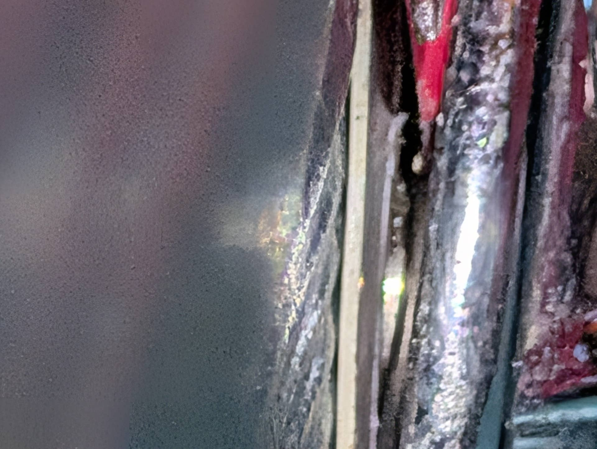
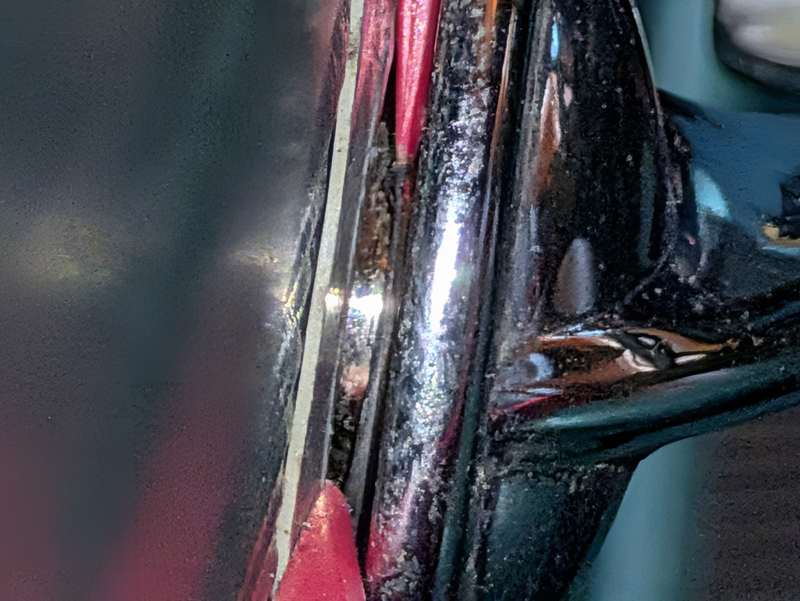

**@Baaad65** (reply #10):
I have the same tool and it's taken me some time and finesse a few times. I've pushed the panel in as far as I can and pulled on the handle to get a look at the clip, it's a reel feely thing. You could be in front or behind the clip and I've had to bend the tool sometimes.

**@Sick467** (reply #11):
If the clip and/or handle has worn at the clip, it may be seated...so to speak.   Try your tool while pushing in on the handle or working it in and out.  No real force, just enough to get it to shift around.

This is a long shot,  but make sure someone did not add a set screw hidden behind the handle.

**@kevnord** (reply #12):
The plot thickens. I was able to good the clip and pull one side out ... But the other side won't budge. I wonder if it is somehow wedged in the gear or rusted in there. Car is quite rust free and i would think I could break the rusts hold. 

What a PITA.

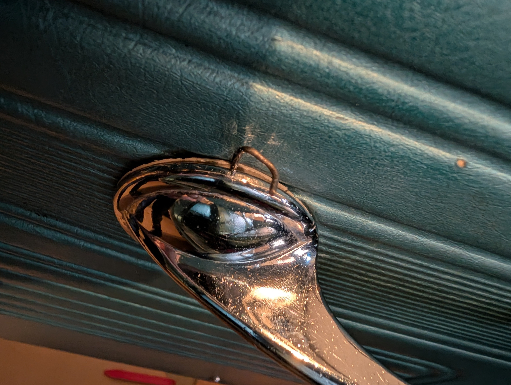

**@ponchonlefty** (reply #13):
> kevnord said:
> The plot thickens. I was able to good the clip and pull one side out ... But the other side won't budge. I wonder if it is somehow wedged in the gear or rusted in there. Car is quite rust free and i would think I could break the rusts hold.

What a PITA.

    View attachment 199315
    

        
        Click to expand...
some can be a pain. wiggle the handle and the clip. it may break
before it lets go. your getting there.

**@Sick467** (reply #14):
You've got yourself in a pickle, but you can get out of it.   I have been in the exact same situation.  This is what the clip is supposed to look like (you probably know this)...

    
        
            
        
        
            
                
                
            
        
    
    

Here is a pic of the back of the handle with the clip installed...

    
        
            
        
        
            
                
                
            
        
    
    

You can see the tips of the clip at the big red arrows and the rounded part inside the hole has the little arrow.

    
        
            
        
        
            
                
                
            
        
    
    

Those rounded parts snap into the grove in the door handle mechanism at the red line below.

    
        
            
        
        
            
                
                
            
        
    
    

You have probably popped a clip tip into the grove past the handle casing and it's giving you fits.  Straighten out the curvy piece you have showing but leave a bit of twist to it so you can get a hold of it with pliers (it may come out just straightening it out).  If not, this is where the wiggling comes in again...wiggle the clip wire (with some force, but a little at a time) back and forth, in and out, in circles, any pattern really...at the same time you are pushing/pulling the handle in and out (it may not move much at all, ut in an out may give you a feel if the clip's resistance changes).   If it does not cooperate, increase the force and decrease the frequency of the wiggles.  This may help straighten out the clip that is bent up inside the handle hole and allow it to fish out.

Think of it as you are trying to pick a lock...there is a combination of force, position, tension, & interference that will "un-lock" it.

Just don't poke a hole in the door panel.  Some dense hard thin carboard (think soda or cereal carton) taped to the panel around the handle might make working on it less risky.  Don't ask how I know...LOL!  God Speed Kevin.

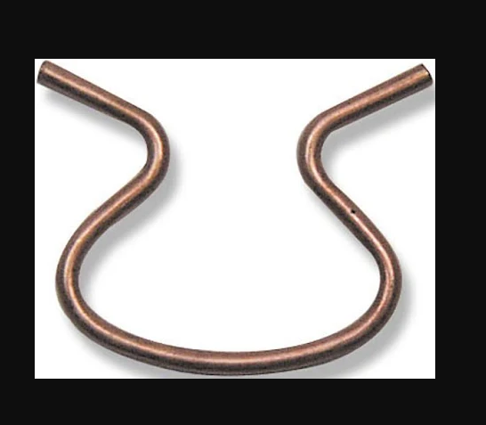
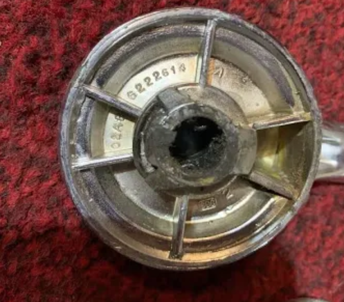

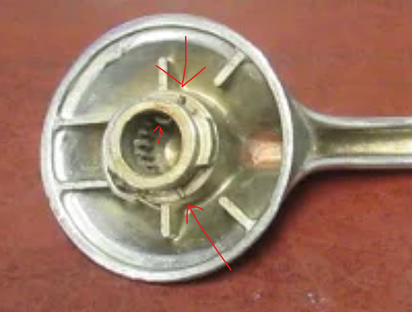

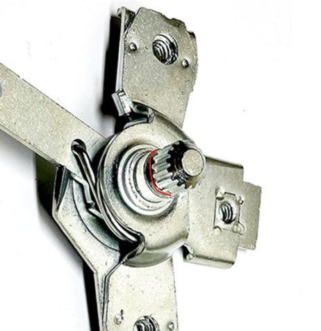

**@kevnord** (reply #15):
Great pics and info.
The good news is that I haven't poked a hole in my door panel thanks to cardboard. The clip was easy to straighten. I pulled and wiggled and put muscle into it. Eventually the clip snapped and left me with about half an inch above the handle to work with. Sigh.

I'm going to let it sit and think about it more. 

Really appreciate the help

**@kevnord** (reply #16):
Victory!
Got the handle off using brute force to pry it off. 
The handle got a little beat up during the multi-day effort and I'm still evaluating the teeth on the  door mechanism. I think a tooth or two got damaged but it still works.  I believe both are replaceable so I'm fine with that.

The most important thing was to NOT damage the door panel which would be $$$. There is only one place (sms auto interiors) to get them for a 64 Tempest Custom which has a unique design.

Thanks to everyone that helped a long the way!

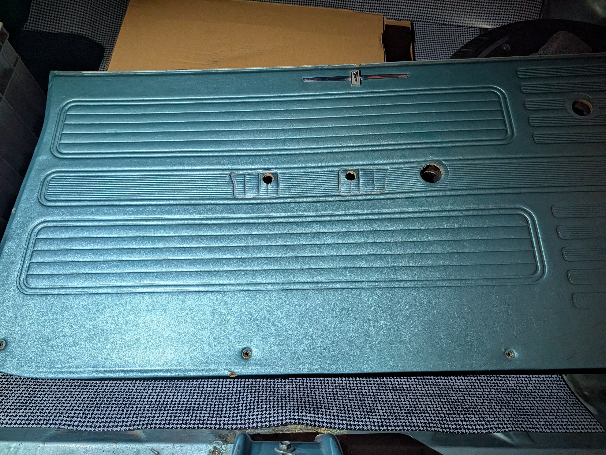

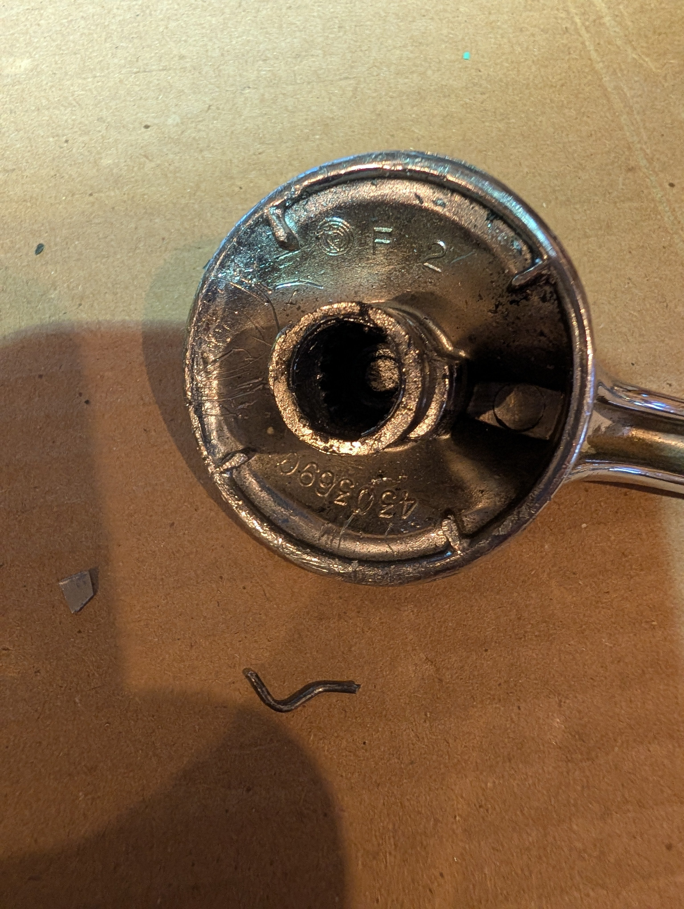
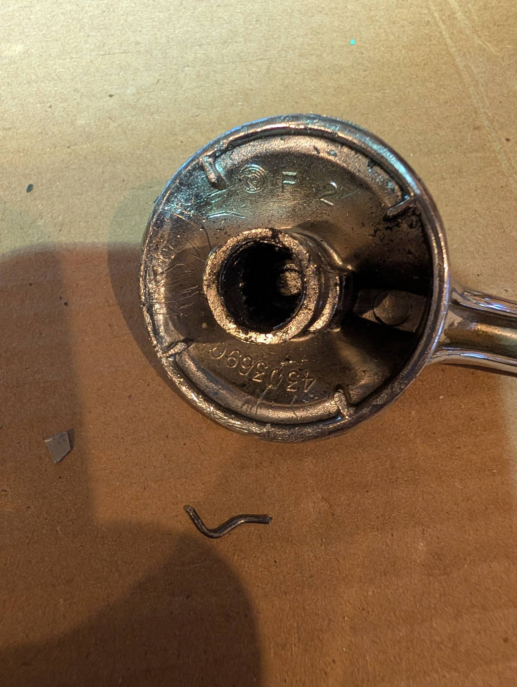

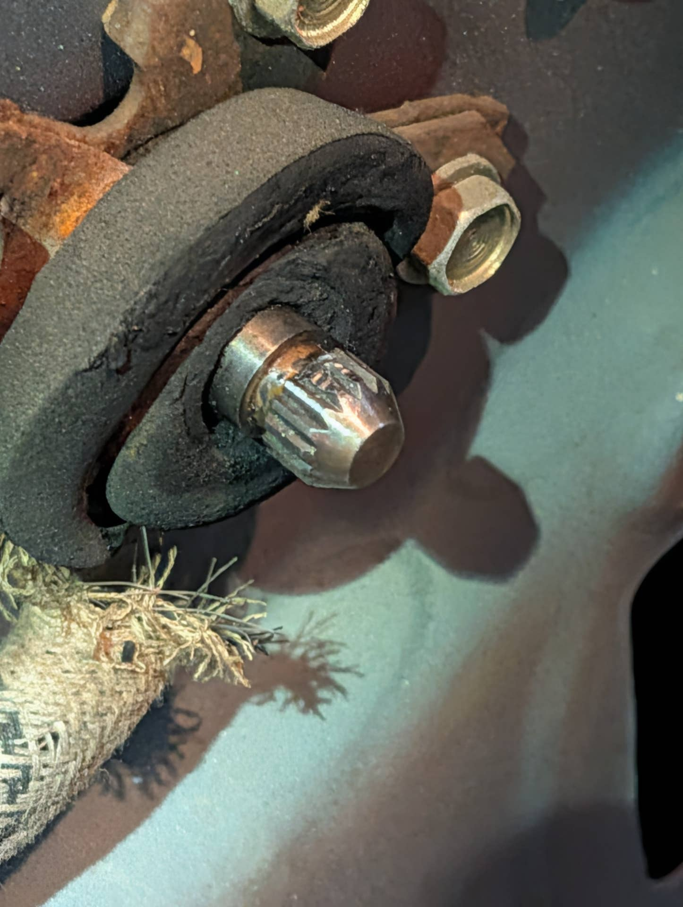

**@Sick467** (reply #17):
I was rooting for you.  I'd say the shaft is more than ready for another 50 years.  One tooth won't make any noticeable difference.  Glad you got it!

**@kevnord** (reply #18):
Thanks man, appreciate it!
I located another handle I can use. I pulled off a junkyard 64 Lemans 35 years ago. Saved it for a rainy day. Funny enough it's literally raining today... But I'm near Seattle and it's fall so that's not unusual.

**@66COUPE** (reply #19):
> kevnord said:
> Thanks man, appreciate it!
I located another handle I can use. I pulled off a junkyard 64 Lemans 35 years ago. Saved it for a rainy day. Funny enough it's literally raining today... But I'm near Seattle and it's fall so that's not unusual. 
        
        Click to expand...
60+ years can do that to a door handle, glad you got it figured out and didn’t damage the panel.

**@Baaad65** (reply #20):
So what do you think was the problem, any evidence?

**@kevnord** (reply #21):
I'm not 100% sure but the end of the wire must have gotten into the groove and wedged or got bent to the point where it wouldn't easily come out by pulling... at least at the angles I could achieve. You can see in the pic the wire has a sharp angle

**@Jared** (reply #22):
Funny coincidence here.  You fought for two days to get your handle off.  I brought mien out yesterday and the first time I went to get out of the car, the inside doorhandle was gone.  The handle had been removed a few times over the years. I guess the clip was fatigued or not installed correctly and it popped off.

**@kevnord** (reply #23):
Haha! 
If it's not one thing it's another. I have a pack of clips of ya need a couple. ;-)

**@kevnord** (reply #24):
One thing I didn't notice/realize until today is that the tool needs to slide into the grooves to go far enough to push the pins. Seems obvious now, but those frontal points get bent easily.  Someone mentioned bending the tool but I was wasn't thinking specifically about the pointa.

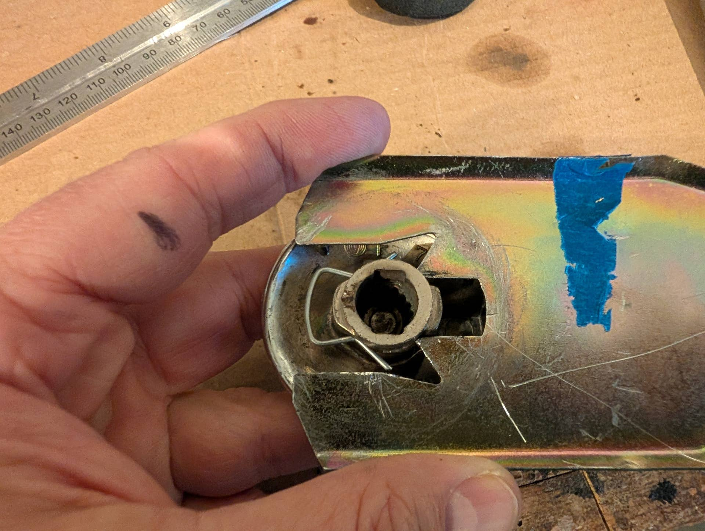
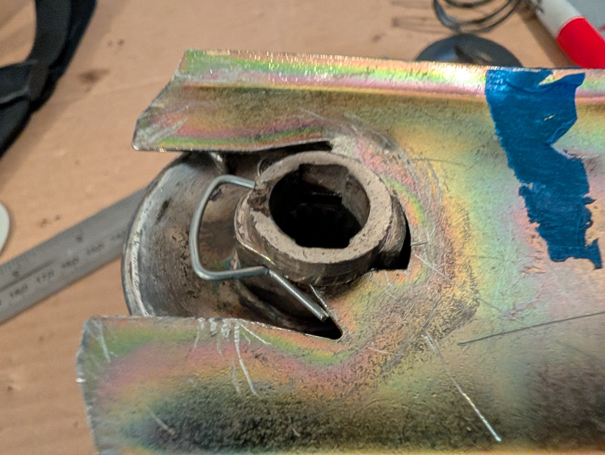
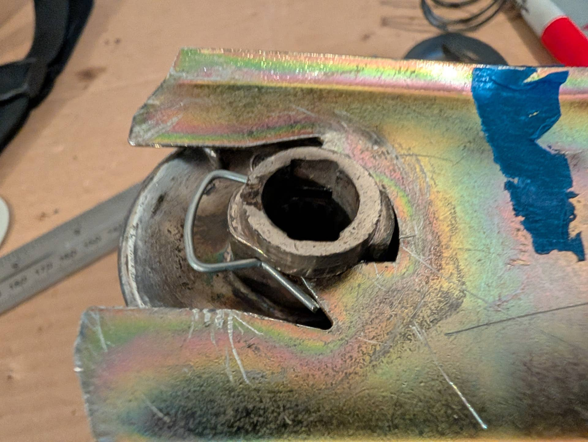
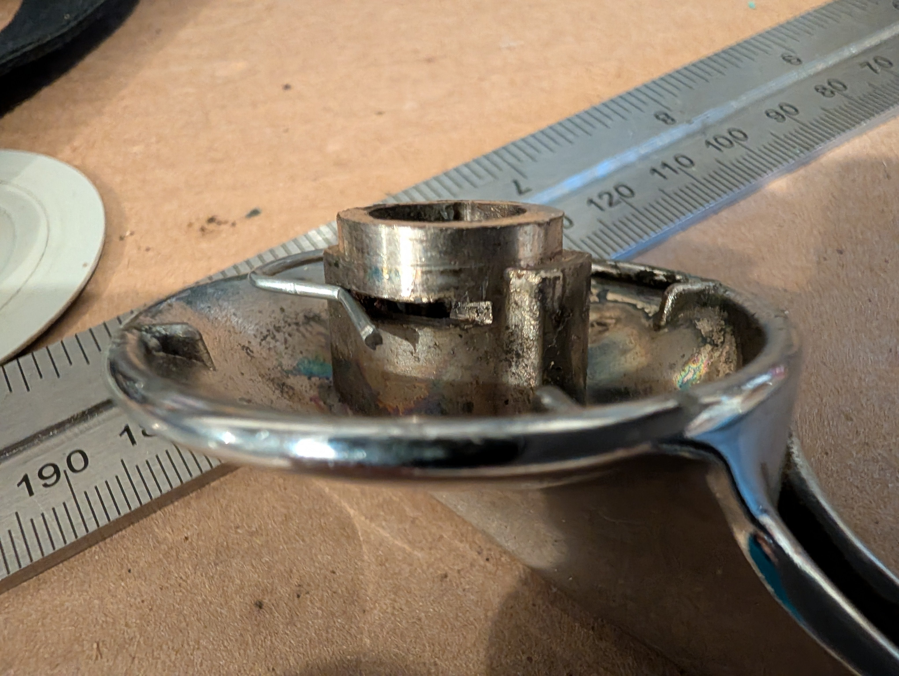

**@ponchonlefty** (reply #25):
im thinking the clip was installed wrong.  maybe jammed in the slot.
the tool couldn't grab it. these pics will help others.

## Images

