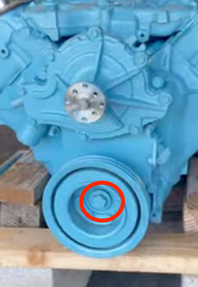
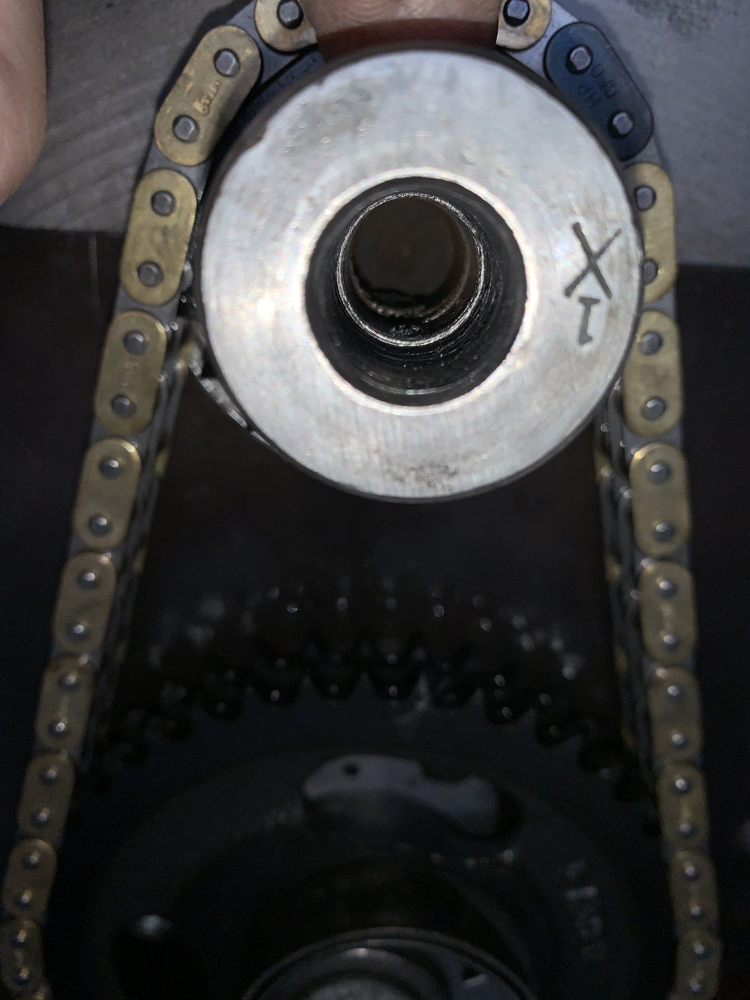
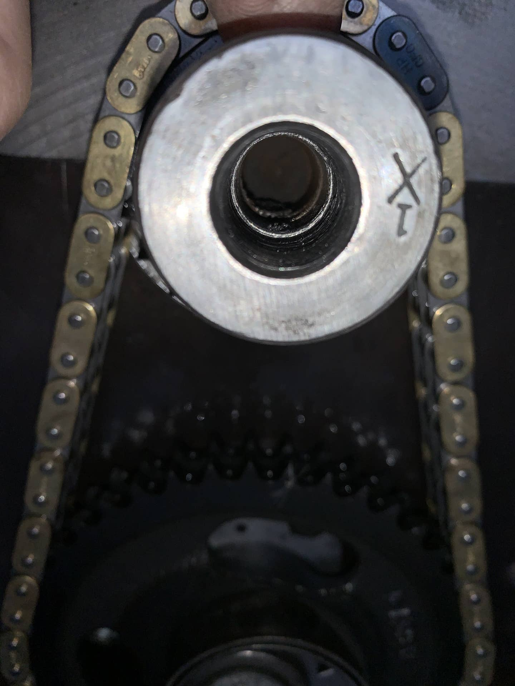
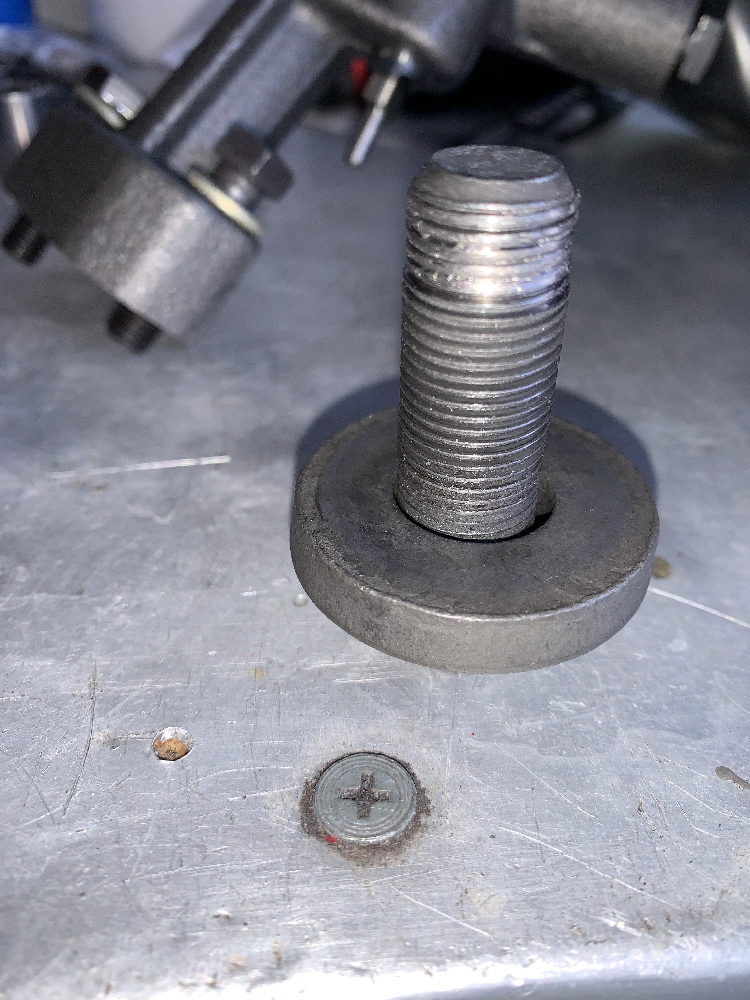
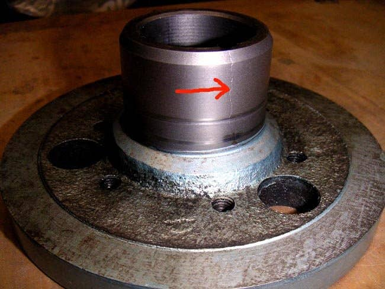
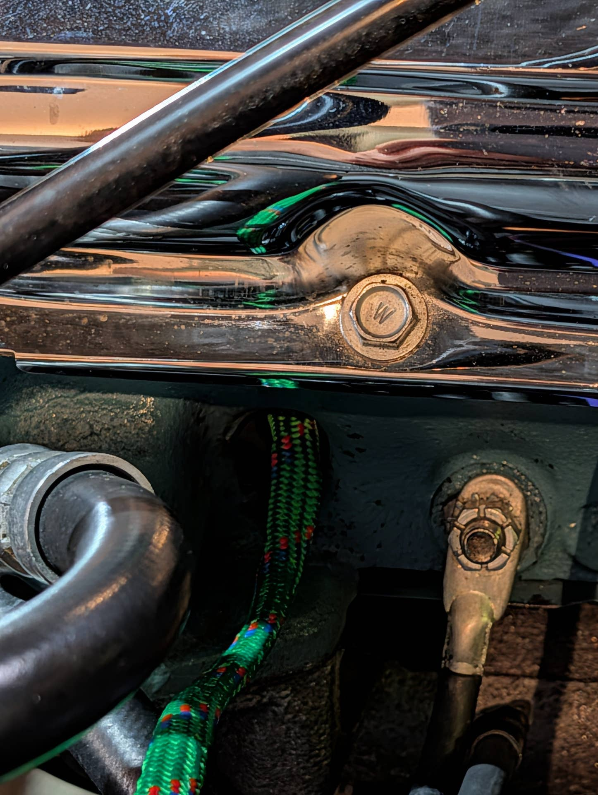

# Ugh... crankshaft pulley bolt?!
**Forum:** GTO Forum | **Started:** September 11, 2025 | **Replies:** 55
**Thread URL:** https://www.gtoforum.com/threads/ugh-crankshaft-pulley-bolt.150385/post-1054572

## The Issue
So... I'm installing an HEI Distributor and as part of that I was manually cracking the engine over to get the oil pump rod to seat. I cracked it over a couple times, struggling to find it. Unfortunately, all of a sudden the bolt I was turning (circled in red, that's not my engine btw) seems to have stripped. Uuuuuggghhhhh. Though it's only 7am here, some colorful words emerged from my mouth.  What type of work am I in for to fix this? I do need to replace the timing chain, so I'm hoping that (g...

## Solution / Outcome
> Scott06 said: > y  yes it is a mental hurdle to get over when you are shoving a couple feet of rope in there.   I assume someone was SOL in BFE when they developed that one. Certainly other ways to do it but this is easy if you can get tot he plug hole. On the old school RWD Volvos it saved you from buying a locking tool                  Click to expand... I was just going to buy a locking tool that fits where the starter goes, but couldn't find one that I was confident would fit. Ordered one...

## Key Advice
- **@O52**: Had the same thing happen to me shortly after I had the engine rebuilt due to me not paying attention to what I was doing.  .  Took it back to the builder and he heli-coiled the crankshaft.  It has he
- **@armyadarkness**: My thoughts are, whatever amount of force was required to strip it, came from the engine... not the tools or you!  If the engine spun freely, then even a 40" breaker bar wouldnt hurt a 3/8 bolt... let
- **@Scott06**: > armyadarkness said: > My thoughts are, whatever amount of force was required to strip it, came from the engine... not the tools or you!  If the engine spun freely, then even a 40" breaker bar wouldn
- **@ratfink1**: a simple fix would be to tap it to the next size up and use a larger bolt of similar length. Always remove the plugs and loosen belts before using the crank bolt to turn it .
- **@ponchonlefty**: > kevnord said: > Belts were off, but plugs were in except #1 since I was trying to find TDC again. Is the tapping something a machine shop/other could do? I've tapped other threads before, but this o
- **@TXStarfire**: Its probably good that this happened now.  You did not strip that bolt, it was probably bad from some other person/situation.  That bolt is torqued to 160 lb/ft and there is no way you put more torque
- **@Baaad65**: > kevnord said: > GUYS! GUYS! GUYS! Christmas has been saved!  I. am. an. idiot. I am simultaneously embarrassed and relieved. If you need to take away my wrenches, I'll understand.  sooooooooo.... th
- **@vette599**: The picture in this thread of the stripped bolt is not the OP's ,it is O52
- **@GtoFM**: Happy to hear all is well, but you were able to loosen the crank bolt (160 ft/lb torque spec) without a breaker bar! Yes, the plugs were in, but still...
- **@68 Teapot**: I use a strap wrench around the balancer, 2 inch wide strap w/ 2 foot handle.  If it is a manual trans, put it in gear and set the brakes.
- **@FROGENGINE**: Not the balancer, it has the rubber that can spin.
- **@lust4speed**: I'll add to the above comments that if you unscrewed the bolt going backwards then someone didn't torque it to the required 160 foot pounds.  Just as well that it came loose because a loose bolt will 
- **@rockdoc**: Kevnord, I had the same thoughts, you should not have been able to remove the bolt easily. I would purchase a new crank bolt, to original specs, and see if it goes in freely (I believe Ames has them).
- **@Sick467**: You can take a length of cord (I prefer quality clothesline that does not have frays or fuzzies) and feed it into a sparkplug hole until enough of it has been put in to stop the piston from reaching T
- **@Gipper**: I think most of us have been there at least once. Mine was when I had a broken bolt in my alternator/power steering bracket on my '67 GTO. My fan shroud was in the way so I unbolted it and just slid i

## Helpers
- **@O52** — 6 post(s)
- **@armyadarkness** — 13 post(s)
- **@Scott06** — 5 post(s)
- **@ratfink1** — 2 post(s)
- **@ponchonlefty** — 5 post(s)
- **@TXStarfire** — 2 post(s)
- **@Baaad65** — 1 post(s)
- **@vette599** — 1 post(s)
- **@GtoFM** — 1 post(s)
- **@68 Teapot** — 1 post(s)
- **@FROGENGINE** — 1 post(s)
- **@lust4speed** — 1 post(s)
- **@rockdoc** — 1 post(s)
- **@Sick467** — 1 post(s)
- **@Gipper** — 1 post(s)

## Thread Summary

### Kevin's Original Post
So... I'm installing an HEI Distributor and as part of that I was manually cracking the engine over to get the oil pump rod to seat. I cracked it over a couple times, struggling to find it. Unfortunately, all of a sudden the bolt I was turning (circled in red, that's not my engine btw) seems to have stripped. Uuuuuggghhhhh. Though it's only 7am here, some colorful words emerged from my mouth.

What type of work am I in for to fix this? I do need to replace the timing chain, so I'm hoping that (glass-half-full) I can use this as an excuse to do that. Ugh. Ugh. Ugh.

:-(

### Replies

**@O52** (reply #1):
Had the same thing happen to me shortly after I had the engine rebuilt due to me not paying attention to what I was doing.  . 
Took it back to the builder and he heli-coiled the crankshaft.  It has held up just fine, although the first time I was torquing the bolt it was a bit nerve racking wondering if it was going to hold or not.

**@kevnord** (reply #2):
> O52 said:
> Had the same thing happen to me shortly after I had the engine rebuilt due to me not paying attention to what I was doing.  .
Took it back to the builder and he heli-coiled the crankshaft.  It has held up just fine, although the first time I was torquing the bolt it was a bit nerve racking wondering if it was going to hold or not.

    View attachment 197732
    

    View attachment 197733
    

        
        Click to expand...
Thanks Ed, that makes me feel a bit better.
Quick research after I posted this thread haven't been encouraging. I did see heli-coiled as a potential option and was wondering how that would work. Engine has never been rebuilt, it's pretty much stock/original. I didn't put that much force on that bolt, just a socket I was cranking, no breaker-bar even. :-(

I've been fixing everything myself but am going to need pro help on this one. Sigh.

Appreciate the comment

**@armyadarkness** (reply #3):
My thoughts are, whatever amount of force was required to strip it, came from the engine... not the tools or you!

If the engine spun freely, then even a 40" breaker bar wouldnt hurt a 3/8 bolt... let alone a crank bolt. So... what would make the engine hard to spin? High compression or worn bearings would be my guesses.

But this is just me thinking out loud.

Regardless, if the engine ran fine before, I'd heli-coil it in a minute!

**@kevnord** (reply #4):
> armyadarkness said:
> My thoughts are, whatever amount of force was required to strip it, came from the engine... not the tools or you!

If the engine spun freely, then even a 40" breaker bar wouldnt hurt a 3/8 bolt... let alone a crank bolt. So... what would make the engine hard to spin? High compression or worn bearings would be my guesses.

But this is just me thinking out loud.

Regardless, if the engine ran fine before, I'd heli-coil it in a minute!
        
        Click to expand...
It didn't even cross my mind that I could strip it since it was turning. It didn't turn easy, did require some force, but it wasn't to the point where I was concerned.

Does the engine need to be pulled in order to have enough access to heli-coil it? I'm 99% sure I'm not going to tackle it myself either way. There's a local guy/shop who is the go-to place for muscle car owners. 

I'm really discouraged, but such things go with the territory... so I'm trying to brush it off.

**@armyadarkness** (reply #5):
> kevnord said:
> It didn't even cross my mind that I could strip it since it was turning. It didn't turn easy, did require some force, but it wasn't to the point where I was concerned.

Does the engine need to be pulled in order to have enough access to heli-coil it? I'm 99% sure I'm not going to tackle it myself either way. There's a local guy/shop who is the go-to place for muscle car owners.

I'm really discouraged, but such things go with the territory... so I'm trying to brush it off.
        
        Click to expand...
I wouldnt be discouraged. A machine shop could do it while you wait, without pulling the engine.

**@kevnord** (reply #6):
> armyadarkness said:
> I wouldnt be discouraged. A machine shop could do it while you wait, without pulling the engine.
        
        Click to expand...
Thanks @armyadarkness 
To be honest, I've never been to or used a machine shop. I only know the basics of what they do. There are a couple nearby, sounds like I should pay them a visit. I don't mind asking stupid questions if things are out of my realm of knowledge.

**@armyadarkness** (reply #7):
> kevnord said:
> Thanks @armyadarkness 
To be honest, I've never been to or used a machine shop. I only know the basics of what they do. There are a couple nearby, sounds like I should pay them a visit. I don't mind asking stupid questions if things are out of my realm of knowledge. 
        
        Click to expand...
Most people think of machinists as just a machine shop... running mills and lathes, but most machinists are tool and die experts. 

They would likely have the tools required for that job on hand, and since they're portable and dont require electric, it could be done in the parking lot.

Having spent my life in that field, IME: machinists got into it because they were passionate about it, but they quickly found that repairing a meat slicer is what paid the bills. So I wouldnt be surprised if you found them VERY EAGER for the chance to work on a GTO.

**@armyadarkness** (reply #8):
> armyadarkness said:
> Most people think of machinists as just a machine shop... running mills and lathes, but most machinists are tool and die experts.

They would likely have the tools required for that job on hand, and since they're portable and dont require electric, it could be done in the parking lot.

Having spent my life in that field, IME: machinists got into it because they were passionate about it, but they quickly found that repairing a meat slicer is what paid the bills. So I wouldnt be surprised if you found them VERY EAGER for the chance to work on a GTO.
        
        Click to expand...
It's a shame you cant drive the car there... that would likely broaden your chances.

**@kevnord** (reply #9):
> armyadarkness said:
> Most people think of machinists as just a machine shop... running mills and lathes, but most machinists are tool and die experts. 

They would likely have the tools required for that job on hand, and since they're portable and dont require electric, it could be done in the parking lot.

Having spent my life in that field, IME: machinists got into it because they were passionate about it, but they quickly found that repairing a meat slicer is what paid the bills. So I wouldnt be surprised if you found them VERY EAGER for the chance to work on a GTO.
        
        Click to expand...
So it's settled, I'll fly you out to help! :-D

kidding. I do appreciate the help you're already providing from afar. It's encouraging.

**@armyadarkness** (reply #10):
> kevnord said:
> So it's settled, I'll fly you out to help! :-D
        
        Click to expand...
That's not out of the question... however I just looked at your specs and it says you live in Snohomish Wa. Im not sure I want to see a hooker from Snohomish.

**@Scott06** (reply #11):
> armyadarkness said:
> My thoughts are, whatever amount of force was required to strip it, came from the engine... not the tools or you!

If the engine spun freely, then even a 40" breaker bar wouldnt hurt a 3/8 bolt... let alone a crank bolt. So... what would make the engine hard to spin? High compression or worn bearings would be my guesses.

But this is just me thinking out loud.

Regardless, if the engine ran fine before, I'd heli-coil it in a minute!
        
        Click to expand...
agreed its one thing if its locked up another if the engine is free with plugs. Might have been screwed up in the past. Might try running a tap in there and see if you get lucky and get enough bite to torque it down

**@ratfink1** (reply #12):
a simple fix would be to tap it to the next size up and use a larger bolt of similar length. Always remove the plugs and loosen belts before using the crank bolt to turn it .

**@armyadarkness** (reply #13):
That sounds feasible

**@kevnord** (reply #14):
Belts were off, but plugs were in except #1 since I was trying to find TDC again. 
Is the tapping something a machine shop/other could do? I've tapped other threads before, but this one makes me nervous as the stakes feel high.

**@ponchonlefty** (reply #15):
> kevnord said:
> Belts were off, but plugs were in except #1 since I was trying to find TDC again.
Is the tapping something a machine shop/other could do? I've tapped other threads before, but this one makes me nervous as the stakes feel high.
        
        Click to expand...
cast steel taps easy and nice if the tap is sharp or new. my concern would be
drilling. if it grabs things can get hairy. 
if you or a shop does it give it as much room as possible. 

i wonder if the bolt was about to strip anyway. maybe an impact caused it?
or was the engine stuck at sometime in its life?

**@O52** (reply #16):
I think the only 'Hook'ers you're going to see in Snohomish are attached to a Salmon's lip.

**@armyadarkness** (reply #17):
Ah so there are lips involved? You shouldve led with that... Ill tell you where to mail my travel requirements

**@ratfink1** (reply #18):
it is not difficult, just a little intimidating. The key is making sure the tap is straight going in. It will cut relatively easily. Use a little oil on the tap. Remove the crank pulley and harmonic balancer so you have room. I've done it before on 327 Chevy that had the same issue. That same crank and bolt are currently running in a friend 68 Z28 years later. A machine shop will likely want the entire crank out of the engine to work on it. Any good auto mechanic should be able to do this for you.

**@TXStarfire** (reply #19):
Its probably good that this happened now.  You did not strip that bolt, it was probably bad from some other person/situation.  That bolt is torqued to 160 lb/ft and there is no way you put more torque than that on it just turning the engine over.  The only way you could have done it is if the bolt was not correct (too short) or something (balancer hub or timing sprocket) was out of place so that there was only a short amount of thread engagement.  In my opinion.

**@armyadarkness** (reply #20):
That's what I wouldve thought too... but then Ed said he also stripped one... So who knows

**@kevnord** (reply #21):
GUYS! GUYS! GUYS!
Christmas has been saved!

I. am. an. idiot. 
I am simultaneously embarrassed and relieved. 
If you need to take away my wrenches, I'll understand.

sooooooooo.... the bolt thread is not stripped. I simply unscrewed it. I was turning it the wrong way, counter-clockwise. You know, lefty-loosy/righty-tighty. My god I'm an idiot. I had it in my monkey brain that it was supposed to turn counter-clockwise for whatever reason. And at 6:30am, trying to sneak in some work before the fam work up, I didn't question that.

I did a couple rotations in the wrong direction, surprised it didn't loosen sooner. Guess going counter-clockwise can lead to other issues, but I'll cross my fingers that I didn't do any damage or at least any I can't repair.

I'm sorry to waste ya'lls time. At least we got to talk about salmon lips?! 
sigh. 

I'll take embarrassment over having to deal with a stripped bolt.
I can't believe I did that. shaking my head

**@ponchonlefty** (reply #22):
> kevnord said:
> GUYS! GUYS! GUYS!
Christmas has been saved!

I. am. an. idiot.
I am simultaneously embarrassed and relieved.
If you need to take away my wrenches, I'll understand.

sooooooooo.... the bolt thread is not stripped. I simply unscrewed it. I was turning it the wrong way, counter-clockwise. You know, lefty-loosy/righty-tighty. My god I'm an idiot. I had it in my monkey brain that it was supposed to turn counter-clockwise for whatever reason. And at 6:30am, trying to sneak in some work before the fam work up, I didn't question that.

I did a couple rotations in the wrong direction, surprised it didn't loosen sooner. Guess going counter-clockwise can lead to other issues, but I'll cross my fingers that I didn't do any damage or at least any I can't repair.

I'm sorry to waste ya'lls time. At least we got to talk about salmon lips?!
sigh.

I'll take embarrassment over having to deal with a stripped bolt.
I can't believe I did that. shaking my head
        
        Click to expand...
i see i have some competition. i bought a pole saw and put the chain on backwards.
that first limb was exhausting to cut.😁

**@armyadarkness** (reply #23):
> ponchonlefty said:
> i see i have some competition.
        
        Click to expand...
Someone's trying to build a GTO out of chicken wire and paper mache?

**@ponchonlefty** (reply #24):
> armyadarkness said:
> Someone's trying to build a GTO out of chicken wire and paper mache?
        
        Click to expand...
very light weight. don't tell everybody.

**@Baaad65** (reply #25):
> kevnord said:
> GUYS! GUYS! GUYS!
Christmas has been saved!

I. am. an. idiot.
I am simultaneously embarrassed and relieved.
If you need to take away my wrenches, I'll understand.

sooooooooo.... the bolt thread is not stripped. I simply unscrewed it. I was turning it the wrong way, counter-clockwise. You know, lefty-loosy/righty-tighty. My god I'm an idiot. I had it in my monkey brain that it was supposed to turn counter-clockwise for whatever reason. And at 6:30am, trying to sneak in some work before the fam work up, I didn't question that.

I did a couple rotations in the wrong direction, surprised it didn't loosen sooner. Guess going counter-clockwise can lead to other issues, but I'll cross my fingers that I didn't do any damage or at least any I can't repair.

I'm sorry to waste ya'lls time. At least we got to talk about salmon lips?!
sigh.

I'll take embarrassment over having to deal with a stripped bolt.
I can't believe I did that. shaking my head
        
        Click to expand...
D'oh 🤦‍♂️ Maybe you were thinking about the distributor turning counter clockwise, and I thought I read you shouldn't turn the motor backwards anyhow.  I'll take those no harm no foul mistakes any day and by the looks of the bolt I would get a new one. Glad it worked out for you 👍

**@kevnord** (reply #26):
I was thinking the same thing (about the distributor direction) and also realized I had seen a YouTube of a guy with a 68 Firebird that literally said and showed counterclockwise. Oof.

**@Scott06** (reply #27):
> kevnord said:
> GUYS! GUYS! GUYS!
Christmas has been saved!

I. am. an. idiot.
I am simultaneously embarrassed and relieved.
If you need to take away my wrenches, I'll understand.

sooooooooo.... the bolt thread is not stripped. I simply unscrewed it. I was turning it the wrong way, counter-clockwise. You know, lefty-loosy/righty-tighty. My god I'm an idiot. I had it in my monkey brain that it was supposed to turn counter-clockwise for whatever reason. And at 6:30am, trying to sneak in some work before the fam work up, I didn't question that.

I did a couple rotations in the wrong direction, surprised it didn't loosen sooner. Guess going counter-clockwise can lead to other issues, but I'll cross my fingers that I didn't do any damage or at least any I can't repair.

I'm sorry to waste ya'lls time. At least we got to talk about salmon lips?!
sigh.

I'll take embarrassment over having to deal with a stripped bolt.
I can't believe I did that. shaking my head
        
        Click to expand...
but the threads on end of bolt are stripped...I would inspect the crank threads maybe they stripped due to the bolt being backed out at end of thread?

**@vette599** (reply #28):
The picture in this thread of the stripped bolt is not the OP's ,it is O52

**@TXStarfire** (reply #29):
With a loose crank bolt you are 1 step closer to that timing chain replacement!

**@kevnord** (reply #30):
haha. You're right!!!

**@O52** (reply #31):
Now look whacha done to Amy.  He already had his tickets for some hot Salmon action.

**@kevnord** (reply #32):
Hah! Well, chances are good I'll do something dumb or something else will break and I'll need him to fly out to help.

**@armyadarkness** (reply #33):
I know it sounds odd, but trust me, a salmon probably looks and smells better than plenty of Jersey girls. 

Springsteens song isnt a very accurate depiction of a Jersey Girl. It mentions nothing about the quart of Aquanet hairspray or the huge dent in your finances.

**@GtoFM** (reply #34):
Happy to hear all is well, but you were able to loosen the crank bolt (160 ft/lb torque spec) without a breaker bar! Yes, the plugs were in, but still...

**@kevnord** (reply #35):
Good point. I don't know if/when it would have last been removed. :-/

How would I go about torquing it without just spinning. Any tricks? I just read something about a rope trick, seems iffy.

**@ponchonlefty** (reply #36):
holding the flywheel.

**@68 Teapot** (reply #37):
I use a strap wrench around the balancer, 2 inch wide strap w/ 2 foot handle.  If it is a manual trans, put it in gear and set the brakes.

**@FROGENGINE** (reply #38):
Not the balancer, it has the rubber that can spin.

**@lust4speed** (reply #39):
I'll add to the above comments that if you unscrewed the bolt going backwards then someone didn't torque it to the required 160 foot pounds.  Just as well that it came loose because a loose bolt will crack the balancer.  While many makes use a heavy press fit on their balancers to keep them secure, Pontiac solely relies on proper bolt torque.

Here's an early hub cracked from a loose crank bolt.  The crack is usually at the keyway from the hammering, and it doesn't do the crank keyway any good either.  When the balancer is loose it doesn't do any dampening and you have the possibility of harmonics breaking the crank.

**@rockdoc** (reply #40):
Kevnord, I had the same thoughts, you should not have been able to remove the bolt easily. I would purchase a new crank bolt, to original specs, and see if it goes in freely (I believe Ames has them). And definitely time to replace the timing chain. One of my high-school cars was a '65 Tempest with a 2 bbl 326. One evening, while "enjoying" the car, I overrevved it....oops, I broke the timing chain. No biggie, Dad wasn't even po'd, and my buddies and I had a nice adventure that Friday evening.

One of the first things I did after purchasing my '67 was replace the timing chain. On the way, I discovered that the hub on my balancer was cracked, just like Mick's pic above. Then I found the key in the keyway on the crank to be buggered up and stuck. There's always something!

BTW, there are several methods for holding the engine/crank while installing the bolt to 160 ft-lbs. I used vise grips on the flywheel, protecting it with a rag. I found it pretty difficult to get 160 ft-lbs at my age!

**@Sick467** (reply #41):
You can take a length of cord (I prefer quality clothesline that does not have frays or fuzzies) and feed it into a sparkplug hole until enough of it has been put in to stop the piston from reaching TDC (tie a big knot on one end so you don't accidently push all the cord in - dooh!).  This will put the brakes on the engine turning while being torqued down once the piston moves upwards as far as the cord will allow.  Make sure the valves are closed for that piston hole!

You can also use compressed air, but you need a fitting with sparkplug threads on one end and a compressed air line fitting on the other.   Valves need to be closed for this approach too. This works really nice with about 90 psi put to the piston hole.   If the piston is upward in the hole, the air will push it back down and hold it there.  It's best to start with the piston downward so that it does not move on you unexpectedly.  If the piston is at TDC, it may not move once air is applied and surprise you later as you start to wrench on it.   This can be bad when the engine turns over unexpectedly under the compressed air and the rachet handle is headed towards your bean at light-bean-speed.

**@Scott06** (reply #42):
> Sick467 said:
> You can take a length of cord (I prefer quality clothesline that does not have frays or fuzzies) and feed it into a sparkplug hole until enough of it has been put in to stop the piston from reaching TDC (tie a big knot on one end so you don't accidently push all the cord in - dooh!).  This will put the brakes on the engine turning while being torqued down once the piston moves upwards as far as the cord will allow.  Make sure the valves are closed for that piston hole!
        
        Click to expand...
this works excellent on any engine- rope trick. Used it on my volvo 940 to change timing belt , once at tdc move the crank a few degrees (45 or 60) before or after depending on whether you are loosening or tighten the crank bolt so you can get the rope in easy. Seems crazy to do but works great

**@kevnord** (reply #43):
I'm going to try this. If I'm tightening the bold am I correct that I should start 45-60° before TDC?
Thanks for this info, btw

**@Scott06** (reply #44):
> kevnord said:
> I'm going to try this. If I'm tightening the bold am I correct that I should start 45-60° before TDC?
Thanks for this info, btw
        
        Click to expand...
yes so When you tighten it piston come up and locks the engine

**@kevnord** (reply #45):
> Scott06 said:
> yes so When you tighten it piston come up and locks the engine
        
        Click to expand...
Done and done!
That was quite easy... though I had a moment of panic when pulling out the rope and thought it had broken and left rope inside. It hadnt.

Thanks for the help! I'm sure that truck will come in handy in the future. Much easier than the other options.

**@armyadarkness** (reply #46):
> kevnord said:
> Done and done!
That was quite easy... though I had a moment of panic when pulling out the rope and thought it had broken and left rope inside. It hadnt.

Thanks for the help! I'm sure that truck will come in handy in the future. Much easier than the other options.
        
        Click to expand...
That's the SERIOUS downside of "internet forums".

When you come to one asking for advice, even if you're lucky enough to get it from responsive, educated, and trusted members... at best, you're still getting a diagnosis from someone who isnt there, hasnt seen the car, has no idea what you know, and has no idea what you did.

Four years ago, on my way to a distant car show, my GTO started billowing white smoke to the extent that it stopped traffic in two directions.

During 4 hours of being stranded, I searched this forum, messaged and contacted its members, texted and called all of the experts, as well as every hot rodder I knew!! The general consensus was that the motor blew, a head gasket blew, or the block or heads cracked. 

A tow truck finally arrived and we made it home after midnight. The next day, I messed with it in my driveway for another few hours, and finally arranged for a friend to come help pull the engine.

After 2 hours of staring at it, I focused on a vacuum hose to the intake runner of the no. 2 cylinder... pulled it off, and as I suspected it was filled with trans fluid. 

The day prior, I had replaced the OEM TH400 vacuum modulator, because its oring was worn and leaking... and since the new modulator was only $11, it was a no brainer. As it turned out, the new modulator was Chinese shit, so the diaphragm blew when I downshifted. And when that happened, the no. 2 cylinder "vacuumed" the trans fluid out of the TH400!

The fix was to take a 3/8 socket, reach under the car, pull the new modulator out, take the oring off it and put it on the old modulator, and then reinstall it. It took 4 minutes.

There are some serious lessons to learn here, and the No. 1 lesson (AFAIC) is to learn the power of diagnostics. There's a big difference between being a mechanically-inclined-parts-swapper and an auto tech. It took me 35 years to learn that lesson.

**@O52** (reply #47):
Thank you vette599.  I was just about to mention that!

**@O52** (reply #48):
Ed did something stupid when he stripped his bolt.  

I was turning the engine over to get it on TDC and forgot that I had left a screwdriver holding the rear crankshaft flange from rotating when torquing down the balancer earlier.  Second mistake was that I had the plugs in so it had momentary spots when it was hard to turn.  When the crank turned to a point when the screwdriver caught an immovable object, I just gave it an extra omph followed by an Aw-sheet

**@ponchonlefty** (reply #49):
> O52 said:
> Ed did something stupid when he stripped his bolt. 

I was turning the engine over to get it on TDC and forgot that I had left a screwdriver holding the rear crankshaft flange from rotating when torquing down the balancer earlier.  Second mistake was that I had the plugs in so it had momentary spots when it was hard to turn.  When the crank turned to a point when the screwdriver caught an immovable object, I just gave it an extra omph followed by an Aw-sheet
        
        Click to expand...
happens to the best.

**@armyadarkness** (reply #50):
> O52 said:
> Ed did something stupid when he stripped his bolt. 

I was turning the engine over to get it on TDC and forgot that I had left a screwdriver holding the rear crankshaft flange from rotating when torquing down the balancer earlier.  Second mistake was that I had the plugs in so it had momentary spots when it was hard to turn.  When the crank turned to a point when the screwdriver caught an immovable object, I just gave it an extra omph followed by an Aw-sheet
        
        Click to expand...
On my Vette, I spent weeks messing with the timing... and at one point when I was working on it, I found my breaker bar under the hood. Pro Tip: when turning the engine over to get TDC, always remove the breaker bar before staring the car.

**@Gipper** (reply #51):
I think most of us have been there at least once. Mine was when I had a broken bolt in my alternator/power steering bracket on my '67 GTO. My fan shroud was in the way so I unbolted it and just slid it to the passenger side out of my way. After completing repairs (hours) I buttoned everything up and reached through the drivers door and hit the key. Heard something unfamiliar and quickly noticed that I forgot to reattach the shroud! Luckily, I didn't destroy anything but it was for sure a lesson learned.

**@O52** (reply #52):
I went to school, when 'Beehive' hairdos was the current fad. Lots of hairspray.  Lust4speed knows what I'm talking about.

**@armyadarkness** (reply #53):
You guys mustve been so excited when the inflatable tire came out.

**@Scott06** (reply #54):
> kevnord said:
> I'm going to try this. If I'm tightening the bold am I correct that I should start 45-60° before TDC?
Thanks for this info, btw
        
        Click to expand...
y

> kevnord said:
> Done and done!
That was quite easy... though I had a moment of panic when pulling out the rope and thought it had broken and left rope inside. It hadnt.

Thanks for the help! I'm sure that truck will come in handy in the future. Much easier than the other options.
        
        Click to expand...
yes it is a mental hurdle to get over when you are shoving a couple feet of rope in there. 

I assume someone was SOL in BFE when they developed that one. Certainly other ways to do it but this is easy if you can get tot he plug hole. On the old school RWD Volvos it saved you from buying a locking tool

**@kevnord** (reply #55):
> Scott06 said:
> y

yes it is a mental hurdle to get over when you are shoving a couple feet of rope in there. 

I assume someone was SOL in BFE when they developed that one. Certainly other ways to do it but this is easy if you can get tot he plug hole. On the old school RWD Volvos it saved you from buying a locking tool
        
        Click to expand...
I was just going to buy a locking tool that fits where the starter goes, but couldn't find one that I was confident would fit. Ordered one but the bolt spacing and size was wrong. Returned it. Rope trick worked nicely. Just weird.

## Images

