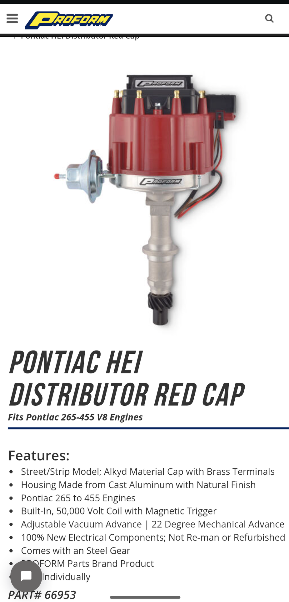
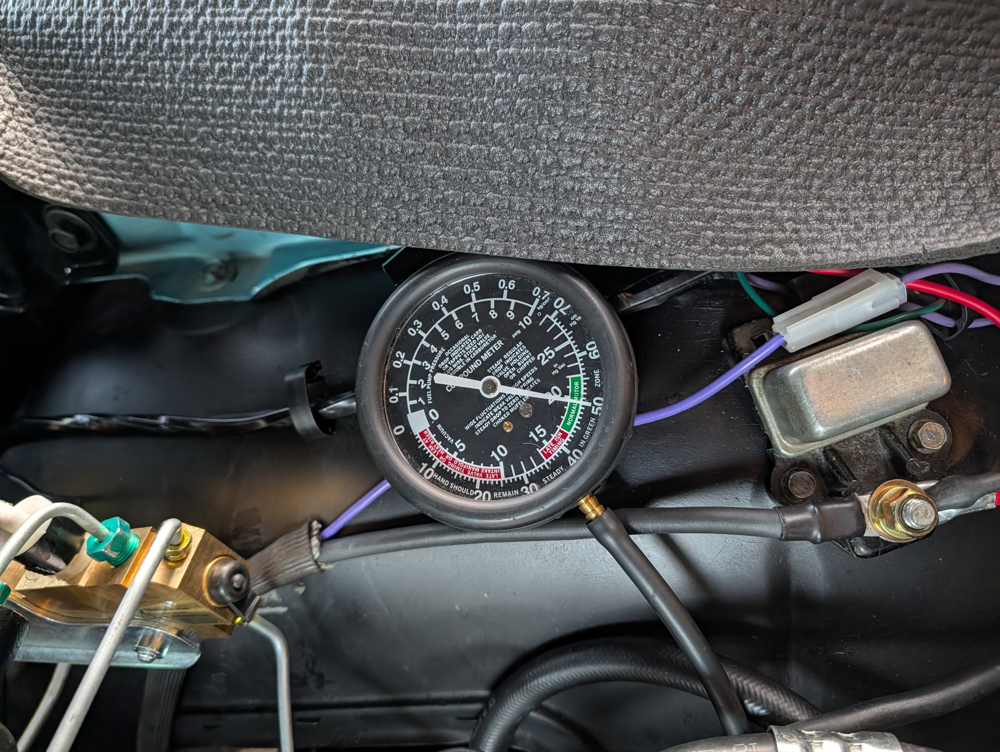
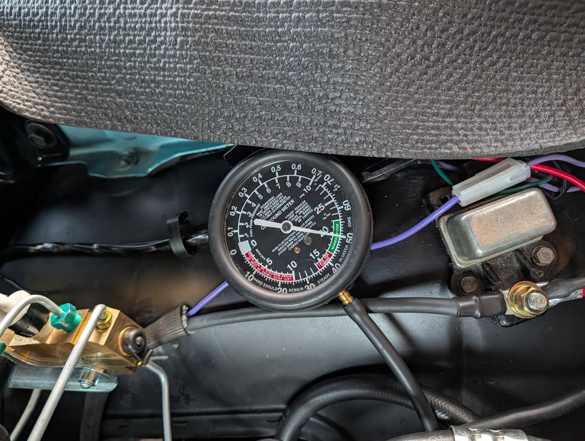

# Vacuum advance for 326 with HEI
**Forum:** GTO Forum | **Started:** September 26, 2025 | **Replies:** 18
**Thread URL:** https://www.gtoforum.com/threads/vacuum-advance-for-326-with-hei.150524/post-1055971

## The Issue
Hey guys, swapped the an HEI (pictured below) on my 64 Tempest w/326 2bbl. I have the base timing w/o vac adv at 10°. When I plug in the vac adv (manifold like factory set it) the timing jumps to 30°. The only info I've found on the vac adv is that it's adjustable and posts mention it adds up to 13°. I sent Proform a message.   My question for y'all is, how many degrees do you suggest adjusting it to? The engine seems happy the way it is, though it's a little sleepy on acceleration.

## Solution / Outcome
It's all good, hi-jack away. I'll learn something.   Single-canister still? (I was too until about 9 months ago). You probably need this shirt that I designed... there's a mug too.

## Key Advice
- **@integrity6987**: Sounds like it's misadjusted from the factory.  That style can usually allow you to loosen/tighen spring tension with a long allen key (supplied??)  I'd shoot for 12 degrees and feel it out.  You coul
- **@armyadarkness**: As Ive mentioned in other posts... this is where the term "TUNING" really, REALLY comes into play! The ability to master all of these little settings is what made our Pontiac heros famous.  Advanced t
- **@Scott06**: > kevnord said: > I have a couple vac cans headed my way I'll be able to test/compare tomorrow.                  Click to expand... seems to be a common thing you hear that the aftermarket adjustable 
- **@lust4speed**: The more vacuum, the more advance and these distributor vacuum pots do not have a mechanical stop built in.  For someone running a larger cam with say 15" or less of vacuum their initial setting would
- **@md2420**: Don’t want to hijack this thread, but I couldn’t help but key in on what you said Army about light/mid throttle and pinging.  I am experiencing that with my 389 right now and didn’t realize I may get 

## Helpers
- **@integrity6987** — 1 post(s)
- **@armyadarkness** — 7 post(s)
- **@Scott06** — 1 post(s)
- **@lust4speed** — 1 post(s)
- **@md2420** — 2 post(s)

## Thread Summary

### Kevin's Original Post
Hey guys, swapped the an HEI (pictured below) on my 64 Tempest w/326 2bbl. I have the base timing w/o vac adv at 10°. When I plug in the vac adv (manifold like factory set it) the timing jumps to 30°. The only info I've found on the vac adv is that it's adjustable and posts mention it adds up to 13°. I sent Proform a message. 

My question for y'all is, how many degrees do you suggest adjusting it to? The engine seems happy the way it is, though it's a little sleepy on acceleration.

### Replies

**@integrity6987** (reply #1):
Sounds like it's misadjusted from the factory.  That style can usually allow you to loosen/tighen spring tension with a long allen key (supplied??)  I'd shoot for 12 degrees and feel it out.  You could also experiment using ported vacuum instead of manifold.  If the carb is adjusted correctly, you will not get a vacuum signal from a ported source at idle.  22 mechanical seems good.  Do you have a vacuum gauge?

**@kevnord** (reply #2):
I don't think my Rochester 2GC has a ported vacuum port, only a single manifold one. Maybe I'm missing something.

Yep, I do have a vacuum gauge. Running at 19-20 at idle with vacuum advance disconnected at idle.

I can't remember if I got an allen wrench with it but I have a bunch. The vacuum advance is in a tough spot to access but I'll give it a try

**@armyadarkness** (reply #3):
As Ive mentioned in other posts... this is where the term "TUNING" really, REALLY comes into play! The ability to master all of these little settings is what made our Pontiac heros famous.

Advanced timing's going to raise your idle too, and this is why it's so important to set these things properly. 

I love Proform and that dizzy is good! You may need to experiment with other vacuum cans or adjustments to that one... but if it runs good at light cruise (when the vacuum is even higher... this is where having an onboard vacuum gauge in the cabin helps), you're good!

If you do get any pinging at light cruise, simply turn down the vacuum on the can and then turn your base timing up to compensate!

**@kevnord** (reply #4):
> armyadarkness said:
> As Ive mentioned in other posts... this is where the term "TUNING" really, REALLY comes into play! The ability to master all of these little settings is what made our Pontiac heros famous.

Advanced timing's going to raise your idle too, and this is why it's so important to set these things properly. 

I love Proform and that dizzy is good! You may need to experiment with other vacuum cans or adjustments to that one... but if it runs good at light cruise (when the vacuum is even higher... this is where having an onboard vacuum gauge in the cabin helps), you're good!

If you do get any pinging at light cruise, simply turn down the vacuum on the can and then turn your base timing up to compensate!
        
        Click to expand...
Groovy.
I'm not hearing any pinging at light cruise or acceleration. I'm going to try turning it down a bit. I have the can off right now so I could better see how to adjust it or possibly replace it. Thanks for mentioning that the vacuum is higher when at light cruise as I wasn't aware of that. Good info!

**@armyadarkness** (reply #5):
> kevnord said:
> Thanks for mentioning that the vacuum is higher when at light cruise as I wasn't aware of that.
        
        Click to expand...
Much HIGHER!! I normally have 15hg of vacuum, but I can hit 25hg at light cruise... This is why Vac advance cans are so important, but they're not all created equal!

For example:  Imagine your car idles at 15hg of vacuum and your can is capable of pulling 20 degrees of additional timing, BUT it only pulls those 20 degrees at 25hg of vacuum!

Since you only have 15hg of vacuum, you're not going to get those additional 20 degrees at idle... but at light cruise you will! So you need to be mindful of all phases of timing... and most Dizzys arent able to be adjusted for each phase!

To master it all, you need to know "How Much" timing you want, "When" you want it, and "How" you'll be able to get it with the engines conditions.

**@kevnord** (reply #6):
> armyadarkness said:
> Much HIGHER!! I normally have 15hg of vacuum, but I can hit 25hg at light cruise... This is why Vac advance cans are so important, but they're not all created equal!

For example:  Imagine your car idles at 15hg of vacuum and your can is capable of pulling 20 degrees of additional timing, BUT it only pulls those 20 degrees at 25hg of vacuum!

Since you only have 15hg of vacuum, you're not going to get those additional 20 degrees at idle... but at light cruise you will! So you need to be mindful of all phases of timing... and most Dizzys arent able to be adjusted for each phase!

To master it all, you need to know "How Much" timing you want, "When" you want it, and "How" you'll be able to get it with the engines conditions.
        
        Click to expand...
Good stuff! Now I feel like I need a vacuum gauge in my car! 
Do you have a preferred brand of vac can or does that depend on how much timing and when?

My main goal is to have a reliable, responsive, cruiser that runs well. I've been 90-95% there and should probably be happy with that, but enjoy the tweaking and learning. It's two steps forward, one back, for sure.

**@kevnord** (reply #7):
I think my vac can is trash. I've adjusted it, loosen/tighten, and it didn't have any affect on how much vacuum it took to move the rod or how far the rod travelled. It pretty much pulled in the rod fully with 5-10 vacuum supplied by a hand vac pump. 

Note: when loosening and tightening I never hit a stopping point though when I tightened it I could hear the spring start pinging a bit at a certain point, as if it was going beyond a stop. Hope that makes sense.

I have a couple vac cans headed my way I'll be able to test/compare tomorrow.

**@Scott06** (reply #8):
> kevnord said:
> I have a couple vac cans headed my way I'll be able to test/compare tomorrow.
        
        Click to expand...
seems to be a common thing you hear that the aftermarket adjustable vac cans are junk, including ones like Accel.

**@kevnord** (reply #9):
I put in a new vacuum advance can that actually adjusts. Dialed it into adding 14°.  Can go lower .
The adjustable can that came from proform doesn't adjust at all, just adds 20.

I'll roll with this replacement and see how it goes.

**@lust4speed** (reply #10):
The more vacuum, the more advance and these distributor vacuum pots do not have a mechanical stop built in.  For someone running a larger cam with say 15" or less of vacuum their initial setting would probably be very close.

Engines love a lot of advance at idle and nothing wrong with the 30° you are seeing, but where things go wrong is it will be pumping that much advance at light cruise and you could get in trouble with detonation when rolling into the throttle.  So to fix the midrange possible problem by dialing back the vacuum advance, your idle advance will be reduced when fixing the cruise range problem.

GM manufactured a range of different vacuum pots and the pot supplied with a six cylinder was much different than supplied with the Chevy L88 Vette or RAIV Pontiac engine.  Now it's one size fits all when you walk into the auto parts store, and it is nice the distributor has an adjustable pot.

**@armyadarkness** (reply #11):
> lust4speed said:
> Engines love a lot of advance at idle and nothing wrong with the 30° you are seeing,
        
        Click to expand...
 Yep. That's where mine is.

**@md2420** (reply #12):
Don’t want to hijack this thread, but I couldn’t help but key in on what you said Army about light/mid throttle and pinging.  I am experiencing that with my 389 right now and didn’t realize I may get pinging in part throttle, but not with more throttle.  I’ve been backing my foot off the pedal when it starts pinging, but on a couple of occasions have gone “through” that stage and with much more throttle it doesn’t ping.   Hmmmm….I will have to investigate more.   Btw - I’m still running points, no HEI.  Consider me Geeteeohguy Jr. All period correct, even down to the single canister brake reservoir      😂

**@kevnord** (reply #13):
It's all good, hi-jack away. I'll learn something. 

Single-canister still? (I was too until about 9 months ago). You probably need this shirt that I designed... there's a mug too.

**@md2420** (reply #14):
> kevnord said:
> It's all good, hi-jack away. I'll learn something. 

Single-canister still? (I was too until about 9 months ago). You probably need this shirt that I designed... there's a mug too. 

    View attachment 198394
    

        
        Click to expand...
Yes, I need that shirt. Lol

back on topic, have you checked out Thunderhead289 on YT and his CarbCheater?  Might be worth looking into. I have no personal experience, but he is smart and I enjoy his vids.

**@armyadarkness** (reply #15):
> md2420 said:
> I’ve been backing my foot off the pedal when it starts pinging,
        
        Click to expand...
In many/ most circumstances, that would aggravate the condition.

If you're cruising down the freeway at 75mph and your car starts to ping... it's because you have too much advance, which is being caused by the "high vacuum" condition of light-cruise. And, if you take your foot off the gas at that moment, your vacuum could SPIKE to three times what it is at idle!

Conversely, if you punch-it at that moment, your vacuum will drop to ZERO, thereby completely removing the vacuum advance can from your timing.

**@armyadarkness** (reply #16):
> md2420 said:
> Btw - I’m still running points, no HEI.
        
        Click to expand...
Some pertinent Dizzy facts:

The reason why GTO guy advocates for points, is because there's no performance drawback to them. 
The reason I advocate for MSD is because they're fully adjustable for how much timing you get, and when you get it, throughout idle, midrange, and WOT. And I need that.
An HEI Dizzy is nothing more than a points Dizzy, without points. Think of it like this: a points dizzy is a clock that you wind, an HEI is a computer clock. Both tell time, one requires you to set it.
If you're using a stock dizzy and youre getting too much advance at light cruise, then either the engine is modified, your base timing is too high, or someone changed the vac advance can.

**@armyadarkness** (reply #17):
The fix? That depends on your dizzy and can.

What you have determines what you need to do.

**@armyadarkness** (reply #18):
> kevnord said:
> Good stuff! Now I feel like I need a vacuum gauge in my car!
        
        Click to expand...
Yes. You should. Thats why Pontiac made the option. It's a critical diagnostic and performance tool... which will contribute toward the goals you named.

> kevnord said:
> Do you have a preferred brand of vac can or does that depend on how much timing and when?
        
        Click to expand...
Yes and Yes. Brand is any reputable company... but, this is not so easy anymore. You have to just hope for the best... 

As you guessed, what model can you get is based on How Much and When. I just base it off my idle needs. For example:

Lets say your car:

Can only handle 36 degrees of total timing before it starts to ping.
Your Dizzy has 20 degrees of mechanical advance.
Your engine likes 22 degrees of advanced timing at idle.
You have 15hg of vacuum.
Your Vac Adv Can pulls 18 degrees of additional timing at 15hg.
You cant set your base timing at 22 degrees, because once you ad your 20 degrees of mechanical advance to that, you'll have 44 degrees of advance, and your car can only handle 36! 

You cant set your base timing at 4 degrees and rely on the additional 18 degrees from your can to bring you up to 22, because when the can drops out of the equation, with your 20 degrees of mechanical, you'll only have 24 degrees of timing... but you need 36. So what do you do?

You set your base timing to 16 degrees, so that you'll have a total of 36 degrees when your mechanical kicks in.
You get a vacuum advance can that pulls 6 degrees of timing at 15hg, so that you get the 22 degrees of timing your engine wants at idle.
And if you can only get a can that pulls 10 degrees at 15hg, you put a limiter on it.
And then if you ping at light cruise, put heavier springs on the mechanical advance to hold the weights in longer.
This is why I always bitch whenever people quote the now famous "Lars timing papers". Those numbers are based on stock engines, in generic conditions, with varying states of tune. Lars says to set your base timing at 12, well my cam hates that and it wouldnt idle for shit if I did that.

> kevnord said:
> My main goal is to have a reliable, responsive, cruiser that runs well. I've been 90-95% there and should probably be happy with that, but enjoy the tweaking and learning. It's two steps forward, one back, for sure.
        
        Click to expand...
Thats my car to the T! Its exactly how I built it. Nothing exotic, nothing ridiculous, just solid and healthy.

## Images

