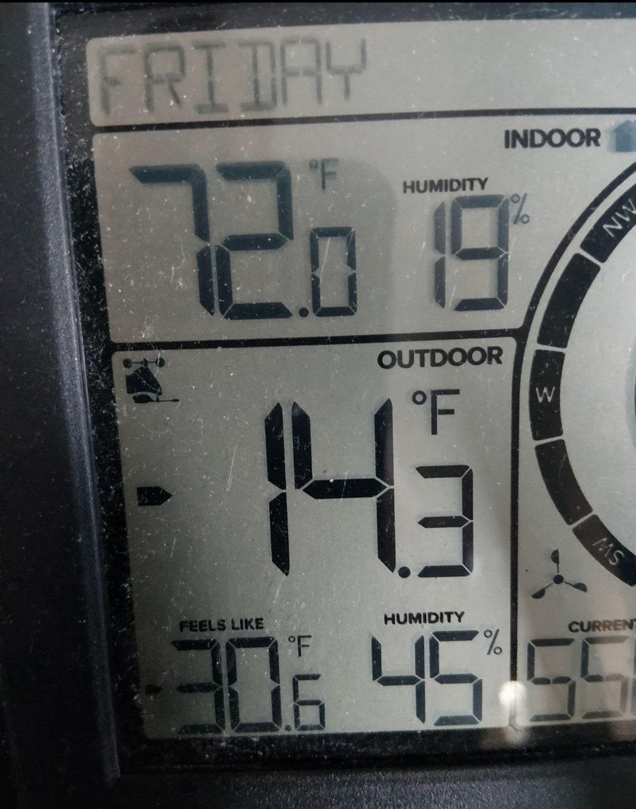
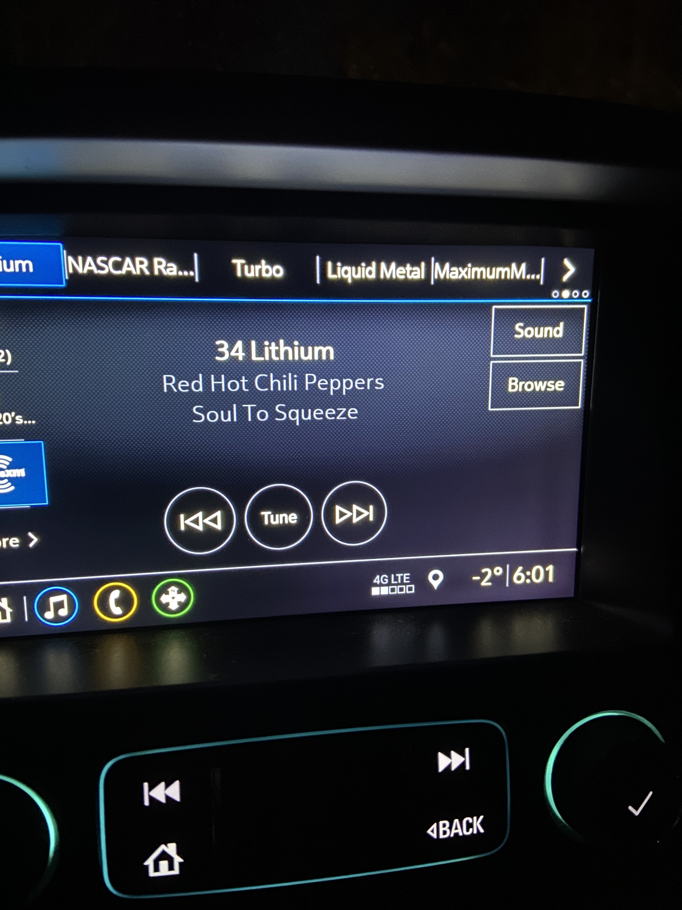

# Winter in Washington?!
**Forum:** GTO Forum | **Started:** January 30, 2026 | **Replies:** 23
**Thread URL:** https://www.gtoforum.com/threads/winter-in-washington.151230/post-1064175

## The Issue
50°f here just north of Seattle. Time to fire up the newly installed Pypes exhaust. Sounds mean when I accelerate (not shown)                             https://photos.app.goo.gl/m8msarxA3ib3A9GT7                     Can't wait for spring!

## Solution / Outcome
> gtojoe68 said: > I wish my trailer was not blocking in my GTO - the last week has been cold but brilliant sunshine!  (I'm in Lake Forest Park, WA)                  Click to expand... Ahhh...bummer. Bring it to the Maltby car show in June. It's great/big.

## Key Advice
- **@rockdoc**: You're a lucky man with winter temps like that! Fortunately, my garage is heated, but I haven't been on the road for a couple of months.
- **@gtojoe68**: I wish my trailer was not blocking in my GTO - the last week has been cold but brilliant sunshine!  (I'm in Lake Forest Park, WA)
- **@Baaad65**: Same, it's  -3° here and snowed Saturday and Sunday 🫩
- **@Verdoro 68**: 56 and sunny here in Northern California today. It dipped into the 30s here and there overnight over the last few weeks, but I can't complain considering what's going on back East. The car is still a 
- **@Lemans64**: Couple hours North of you Close to Victoria BC, yes it has been pretty mild this winter. But, We will probably get one blast of winter before spring. usually snows in early Feb. Hoping for an early st
- **@O52**: The storm thats rapidly approaching most of you is just now passing to the south of San Diego.  We received  .05" of rain last night.  Current temperature is 56*,   Sun breaking through the clouds.  E
- **@Jared**: We look to get between 12 and 18 inches of snow this weekend.  Last weekend, I drove both my cars.  Crazy New England weather.
- **@Sick467**: I'm down to 9°F in West Central MO and expecting snow all day tomorrow...won't be above freezing according to all of the 10-day forecast.  But I can't complain - we had a couple 60° days in January.  
- **@GTO44**: central florida here, it was 80 today and all i did was sweat walking around disney with the fam. I am hoping some of you guys up north will send some of that cold down here!

## Helpers
- **@rockdoc** — 1 post(s)
- **@gtojoe68** — 1 post(s)
- **@Baaad65** — 5 post(s)
- **@Verdoro 68** — 1 post(s)
- **@Lemans64** — 3 post(s)
- **@O52** — 4 post(s)
- **@Jared** — 4 post(s)
- **@Sick467** — 1 post(s)
- **@GTO44** — 1 post(s)

## Thread Summary

### Kevin's Original Post
50°f here just north of Seattle. Time to fire up the newly installed Pypes exhaust. Sounds mean when I accelerate (not shown) 

    
        
            https://photos.app.goo.gl/m8msarxA3ib3A9GT7
        
    
    

Can't wait for spring!

### Replies

**@rockdoc** (reply #1):
You're a lucky man with winter temps like that! Fortunately, my garage is heated, but I haven't been on the road for a couple of months.

**@kevnord** (reply #2):
It's been a weird winter. Last week we got into the 50s but usually it's significantly closer with possible snow. I've had the car up on jack stands the last couple months doing stuff. Didn't drive it but got it out for a nice warmup yesterday

**@gtojoe68** (reply #3):
I wish my trailer was not blocking in my GTO - the last week has been cold but brilliant sunshine!  (I'm in Lake Forest Park, WA)

**@kevnord** (reply #4):
> gtojoe68 said:
> I wish my trailer was not blocking in my GTO - the last week has been cold but brilliant sunshine!  (I'm in Lake Forest Park, WA)
        
        Click to expand...
Ahhh...bummer. Bring it to the Maltby car show in June. It's great/big.

**@Baaad65** (reply #5):
Same, it's  -3° here and snowed Saturday and Sunday 🫩

**@Verdoro 68** (reply #6):
56 and sunny here in Northern California today. It dipped into the 30s here and there overnight over the last few weeks, but I can't complain considering what's going on back East. The car is still a little angry when you wake it up from a nap.

**@Lemans64** (reply #7):
Couple hours North of you Close to Victoria BC, yes it has been pretty mild this winter. But, We will probably get one blast of winter before spring. usually snows in early Feb. Hoping for an early start to the Cruisin season.

**@Baaad65** (reply #8):
Guess I should keep the heater active in the goat 😬

**@O52** (reply #9):
The storm thats rapidly approaching most of you is just now passing to the south of San Diego.  We received  .05" of rain last night.  Current temperature is 56*,   Sun breaking through the clouds.  Expected high to be in the mid 60s. 

Be safe everyone.

**@Jared** (reply #10):
We look to get between 12 and 18 inches of snow this weekend.  Last weekend, I drove both my cars.  Crazy New England weather.

**@Sick467** (reply #11):
I'm down to 9°F in West Central MO and expecting snow all day tomorrow...won't be above freezing according to all of the 10-day forecast.  But I can't complain - we had a couple 60° days in January.  That's not normal!  My old beater 09 CIvic almost left me needing a jump today after work...but it fired on the 3rd try.  Everybody stay warm (except you Cali's...just enjoy your jacket weather ).

**@O52** (reply #12):
I'm still waiting for it to get cold enough to wear long pants.

**@GTO44** (reply #13):
central florida here, it was 80 today and all i did was sweat walking around disney with the fam. I am hoping some of you guys up north will send some of that cold down here!

**@Baaad65** (reply #14):
Well it's holding at  -11°, take all you want 😉

**@Jared** (reply #15):
We were at a balmy 6 when I went into work this morning.  Basically beach weather compared to what's going on in Canada.  I doubt I'll make it in on Monday so I wanted to pick up a few things that I could do from home.

**@Lemans64** (reply #16):
Guy is Mid Canada say it's -43*C not sure what that converts to in F. Ahh Google -49*F 
Brrr, I think I will stay out west.  LOL, Stay safe and warm out there.

**@Jared** (reply #17):
Looks like the storm has already hit a bunch of folks on here and is slowly making it's way to the northeast.  It's supposed to start snowing here at around lunch time today and go until tomorrow morning.  Stay safe everyone.

**@Baaad65** (reply #18):
Well I get to work on another Sunday, 3 inches here overnight...so much for garage time 🫤

**@Lemans64** (reply #19):
50* here today, looks like an early spring this year, BUT ya never know what Mother nature has in store. Usually we get snow in early Feb, nothing on the long range forecast. Hope your staying warm back East.

**@Jared** (reply #20):
Coldest temperature I've ever seen my truck display was at 6 am this morning on my way into work. 

That's in degrees F

**@O52** (reply #21):
83* predicted high today.  85 tomorrow.  Not a cloud in the sky...

**@Baaad65** (reply #22):
Ya ya

**@O52** (reply #23):
We're not normally this warm.  Usual January temps are in the mid 60s but I've noticed over the years its been getting warmer during the winter months.

## Images

